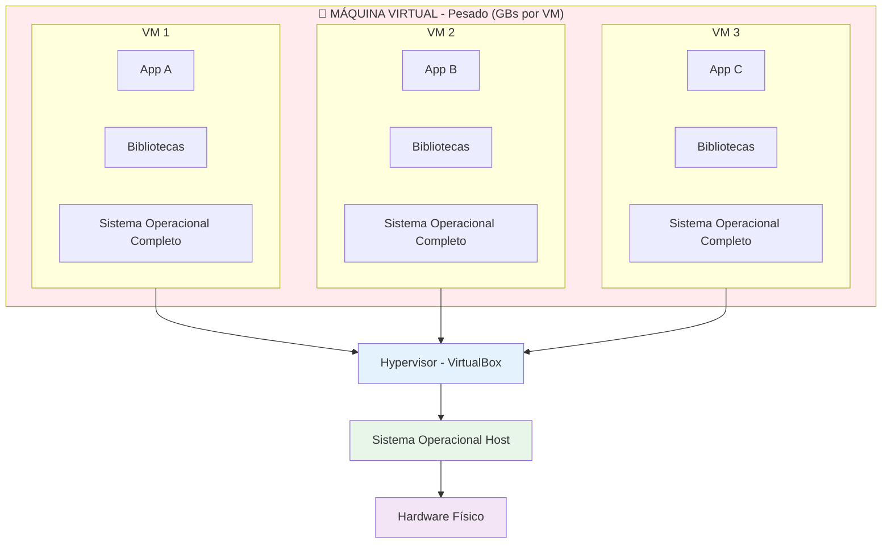
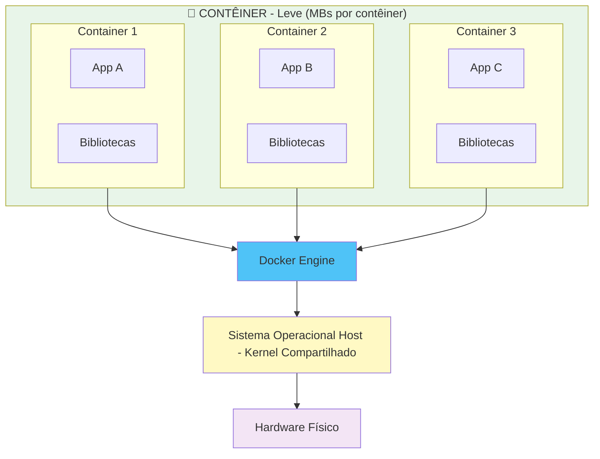
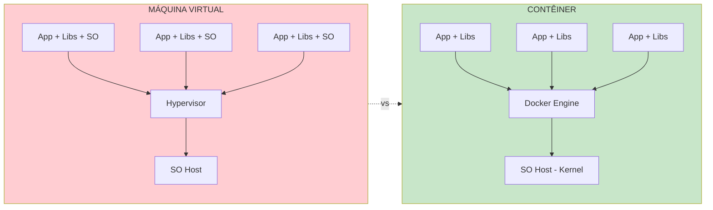

# 🐳 Guia de Docker para Iniciantes

## 📌 O que são Máquinas Virtuais e Contêineres?

### Máquina Virtual (VirtualBox)
Uma VM simula um computador completo dentro do seu computador. Precisa de um sistema operacional completo para cada VM.

### Contêiner (Docker)
Um contêiner é mais leve! Compartilha o kernel do sistema operacional host e isola apenas a aplicação.

## 🎨 Diferença Visual

### Arquitetura de Máquina Virtual



### Arquitetura de Contêiner



### Comparação Lado a Lado



**Principais Diferenças:**

| Característica | Máquina Virtual | Contêiner |
|----------------|-----------------|-----------|
| **Tamanho** | GBs (1-10 GB) | MBs (10-100 MB) |
| **Inicialização** | Minutos | Segundos |
| **Isolamento** | SO completo | Processo isolado |
| **Performance** | Overhead maior | Quase nativo |
| **Portabilidade** | Menos portável | Altamente portável |

## 🐋 O que é Docker?

Docker é uma plataforma que permite criar, executar e gerenciar **contêineres**. Pense nele como uma caixa que empacota sua aplicação com tudo que ela precisa para funcionar.

### Vantagens do Docker:
- ⚡ **Rápido**: Inicia em segundos
- 💾 **Leve**: Usa menos recursos que VMs
- 📦 **Portável**: Funciona igual em qualquer lugar
- 🔄 **Consistente**: "Na minha máquina funciona" vira coisa do passado

---

## �️ Instalação do Docker no Windows

### Pré-requisitos

Antes de instalar o Docker Desktop no Windows, verifique se o seu sistema atende aos seguintes requisitos:

| Requisito | Detalhe |
|-----------|---------|
| **Sistema Operacional** | Windows 10 (64-bit) versão 1903 ou superior, ou Windows 11 |
| **Processador** | 64-bit com suporte a virtualização (VT-x/AMD-V) |
| **RAM** | Mínimo de 4 GB |
| **WSL 2** | Windows Subsystem for Linux versão 2 habilitado |

### Passo 1: Habilitar o WSL 2

O Docker Desktop utiliza o **WSL 2** (Windows Subsystem for Linux) como backend. Abra o **PowerShell como Administrador** e execute:

```powershell
# Habilitar o recurso WSL
wsl --install
```

> 💡 Esse comando já habilita o WSL e instala a distribuição Ubuntu por padrão. **Reinicie o computador** após a execução.

Após reiniciar, verifique se o WSL 2 está ativo:

```powershell
# Verificar a versão do WSL
wsl --version

# Definir o WSL 2 como versão padrão
wsl --set-default-version 2
```

### Passo 2: Baixar o Docker Desktop

1. Acesse o site oficial: [https://www.docker.com/products/docker-desktop/](https://www.docker.com/products/docker-desktop/)
2. Clique no botão **"Download for Windows"**
3. O arquivo `Docker Desktop Installer.exe` será baixado

Ou, se preferir, baixe diretamente pelo PowerShell:

```powershell
# Baixar o instalador via PowerShell
Invoke-WebRequest -Uri "https://desktop.docker.com/win/main/amd64/Docker%20Desktop%20Installer.exe" -OutFile "$HOME\Downloads\DockerDesktopInstaller.exe"
```
Ou, Central de programas do Windows na interface grafica **<-- USEM ESSA OPÇÃO**
    - **Reinicie o computador após instalação**
    - **Vefifique se a instalação funcionou no powershell com o comando** -> docker info

### Passo 3: Instalar o Docker Desktop

1. Execute o arquivo **Docker Desktop Installer.exe**
2. Na tela de configuração, marque as opções:
   - ✅ **Use WSL 2 instead of Hyper-V** (recomendado)
   - ✅ **Add shortcut to desktop**
3. Clique em **Ok** e aguarde a instalação
4. Ao finalizar, clique em **Close and restart** para reiniciar o computador

### Passo 4: Configuração Inicial

1. Após o reinício, o **Docker Desktop** será iniciado automaticamente
2. Aceite os termos de serviço
3. Aguarde o Docker Engine iniciar (o ícone da baleia 🐳 na bandeja do sistema ficará estável)

### Passo 5: Verificar a Instalação

Abra o **PowerShell** ou **Terminal** e execute os seguintes comandos:

```powershell
# Verificar a versão do Docker
docker --version

# Verificar a versão do Docker Compose
docker compose version

# Testar executando o contêiner hello-world
docker run hello-world
```

Se tudo estiver correto, você verá uma mensagem como:

```
Hello from Docker!
This message shows that your installation appears to be working correctly.
```

### 🔧 Configurações Recomendadas

Após a instalação, abra o Docker Desktop e ajuste as configurações em **⚙️ Settings**:

| Configuração | Onde encontrar | Recomendação |
|--------------|----------------|--------------|
| **WSL Integration** | Resources > WSL Integration | Habilitar para a distribuição Ubuntu |
| **Memória** | Resources > Advanced | Alocar pelo menos 2 GB |
| **CPUs** | Resources > Advanced | Alocar pelo menos 2 CPUs |
| **Start on login** | General | Desmarcar se não quiser iniciar automaticamente |

### ⚠️ Solução de Problemas Comuns

#### Docker Desktop não inicia
```powershell
# Reiniciar o serviço do Docker
net stop com.docker.service
net start com.docker.service
```

#### WSL 2 não encontrado
```powershell
# Atualizar o kernel do WSL
wsl --update

# Reiniciar o WSL
wsl --shutdown
```

#### Erro de virtualização
1. Reinicie o computador e acesse a **BIOS/UEFI**
2. Habilite **Intel VT-x** ou **AMD-V** nas configurações do processador
3. Salve e reinicie

#### Verificar se o Docker está rodando corretamente
```powershell
# Exibir informações detalhadas do Docker
docker info

# Verificar contêineres, imagens e volumes
docker system df
```

---

## �📄 Dockerfile

O **Dockerfile** é uma receita que ensina o Docker a construir uma imagem da sua aplicação.

### Exemplo de Dockerfile para Java:

```dockerfile
# Imagem base (Java 17)
FROM openjdk:17-jdk-slim

# Diretório de trabalho dentro do contêiner
WORKDIR /app

# Copiar o arquivo JAR da aplicação
COPY target/minha-app.jar app.jar

# Expor a porta que a aplicação usa
EXPOSE 8080

# Comando para executar a aplicação
CMD ["java", "-jar", "app.jar"]
```

### Principais Comandos do Dockerfile:

| Comando | Descrição |
|---------|-----------|
| `FROM` | Define a imagem base |
| `WORKDIR` | Define o diretório de trabalho |
| `COPY` | Copia arquivos para o contêiner |
| `RUN` | Executa comandos durante a construção |
| `EXPOSE` | Documenta qual porta a app usa |
| `CMD` | Comando executado ao iniciar o contêiner |
| `ENV` | Define variáveis de ambiente |

---

## 🐳 Comandos Básicos do Docker

### 1. Construir uma Imagem
```bash
# Construir a partir do Dockerfile no diretório atual
docker build -t minha-app:1.0 .

# -t = tag (nome da imagem)
# . = contexto (diretório atual)
```

### 2. Listar Imagens
```bash
docker images
```

### 3. Executar um Contêiner
```bash
# Executar em modo destacado (background)
docker run -d -p 8080:8080 --name meu-container minha-app:1.0

# -d = detached (background)
# -p = mapear porta (host:container)
# --name = nome do contêiner
```

### 4. Listar Contêineres
```bash
# Contêineres em execução
docker ps

# Todos os contêineres (inclusive parados)
docker ps -a
```

### 5. Ver Logs do Contêiner
```bash
docker logs meu-container

# Seguir os logs em tempo real
docker logs -f meu-container
```

### 6. Parar e Remover Contêiner
```bash
# Parar
docker stop meu-container

# Remover
docker rm meu-container
```

### 7. Remover Imagem
```bash
docker rmi minha-app:1.0
```

### 8. Entrar no Contêiner
```bash
# Abrir um terminal dentro do contêiner
docker exec -it meu-container /bin/bash
```

### 9. Limpar Recursos Não Utilizados
```bash
# Remove contêineres parados, redes e imagens não utilizadas
docker system prune -a
```

---

## 🎼 Docker Compose

O **Docker Compose** permite gerenciar múltiplos contêineres de uma vez usando um arquivo YAML.

### Quando usar?
- Sua aplicação precisa de banco de dados
- Você tem microserviços que conversam entre si
- Quer subir todo o ambiente com um único comando

### Exemplo de docker-compose.yml:

```yaml
version: '3.8'

services:
  # Aplicação Java
  app:
    build: .                          # Constrói a partir do Dockerfile local
    ports:
      - "8080:8080"                   # Mapeia porta
    environment:
      - SPRING_DATASOURCE_URL=jdbc:postgresql://db:5432/meudb
      - SPRING_DATASOURCE_USERNAME=postgres
      - SPRING_DATASOURCE_PASSWORD=senha123
    depends_on:
      - db                            # Espera o banco subir primeiro
    networks:
      - minha-rede

  # Banco de Dados PostgreSQL
  db:
    image: postgres:15-alpine         # Usa imagem pronta do PostgreSQL
    environment:
      - POSTGRES_DB=meudb
      - POSTGRES_USER=postgres
      - POSTGRES_PASSWORD=senha123
    ports:
      - "5432:5432"
    volumes:
      - db-data:/var/lib/postgresql/data  # Persiste os dados
    networks:
      - minha-rede

# Definição de volumes (armazenamento persistente)
volumes:
  db-data:

# Definição de redes (comunicação entre contêineres)
networks:
  minha-rede:
    driver: bridge
```

### Comandos do Docker Compose:

```bash
# Subir todos os serviços
docker-compose up

# Subir em background
docker-compose up -d

# Ver logs de todos os serviços
docker-compose logs

# Ver logs de um serviço específico
docker-compose logs app

# Parar todos os serviços
docker-compose stop

# Parar e remover contêineres, redes e volumes
docker-compose down

# Parar e remover TUDO (inclusive volumes)
docker-compose down -v

# Reconstruir as imagens
docker-compose build

# Subir reconstruindo as imagens
docker-compose up --build
```

---

## 🎯 Fluxo de Trabalho Típico

### 1. Desenvolvimento com Docker:

```bash
# 1. Criar o Dockerfile
# 2. Criar o docker-compose.yml (se necessário)

# 3. Construir e subir
docker-compose up --build

# 4. Fazer alterações no código

# 5. Reconstruir e reiniciar
docker-compose up --build

# 6. Parar tudo
docker-compose down
```

### 2. Exemplo Prático - Spring Boot + PostgreSQL:

**Estrutura do Projeto:**
```
meu-projeto/
├── src/
├── pom.xml
├── Dockerfile
└── docker-compose.yml
```

**Dockerfile:**
```dockerfile
FROM maven:3.8-openjdk-17 AS build
WORKDIR /app
COPY pom.xml .
COPY src ./src
RUN mvn clean package -DskipTests

FROM openjdk:17-jdk-slim
WORKDIR /app
COPY --from=build /app/target/*.jar app.jar
EXPOSE 8080
CMD ["java", "-jar", "app.jar"]
```

**Comandos:**
```bash
# Subir aplicação + banco
docker-compose up -d

# Ver se está rodando
docker-compose ps

# Ver logs da aplicação
docker-compose logs -f app

# Acessar o banco direto
docker-compose exec db psql -U postgres -d meudb
```

---

## 💡 Dicas Importantes

### ✅ Boas Práticas:

1. **Use imagens oficiais** do Docker Hub
2. **Minimize camadas** no Dockerfile
3. **Use .dockerignore** para não copiar arquivos desnecessários
4. **Nunca coloque senhas** no Dockerfile (use variáveis de ambiente)
5. **Use multi-stage builds** para imagens menores
6. **Nomeie suas imagens e contêineres** claramente

### 📝 Arquivo .dockerignore:

```
target/
.git
.gitignore
*.md
.env
node_modules/
```

### 🔍 Comandos Úteis para Debug:

```bash
# Ver uso de recursos
docker stats

# Inspecionar contêiner
docker inspect meu-container

# Ver processos dentro do contêiner
docker top meu-container

# Copiar arquivo do contêiner para host
docker cp meu-container:/app/logs/app.log ./local.log
```

---

## 🎓 Resumo

| Conceito | O que é | Arquivo |
|----------|---------|---------|
| **Docker** | Plataforma de contêineres | - |
| **Dockerfile** | Receita para criar uma imagem | `Dockerfile` |
| **Docker Compose** | Orquestrador de múltiplos contêineres | `docker-compose.yml` |
| **Imagem** | Template da aplicação (como uma classe) | - |
| **Contêiner** | Instância rodando (como um objeto) | - |

### Analogia para Entender:

- **Imagem Docker** = Receita de bolo 📋
- **Contêiner** = Bolo pronto 🎂
- **Dockerfile** = Como escrever a receita 📝
- **Docker Compose** = Como fazer vários bolos diferentes de uma vez 🎂🍰🧁

---

## 🚀 Próximos Passos

1. Instale o Docker Desktop no seu computador
2. Crie um Dockerfile simples para sua aplicação Java
3. Execute `docker build` e `docker run`
4. Experimente o Docker Compose com um banco de dados
5. Pratique os comandos básicos

**Lembre-se**: Docker é uma ferramenta essencial no desenvolvimento moderno. Quanto mais você praticar, mais natural se torna! 🎯
