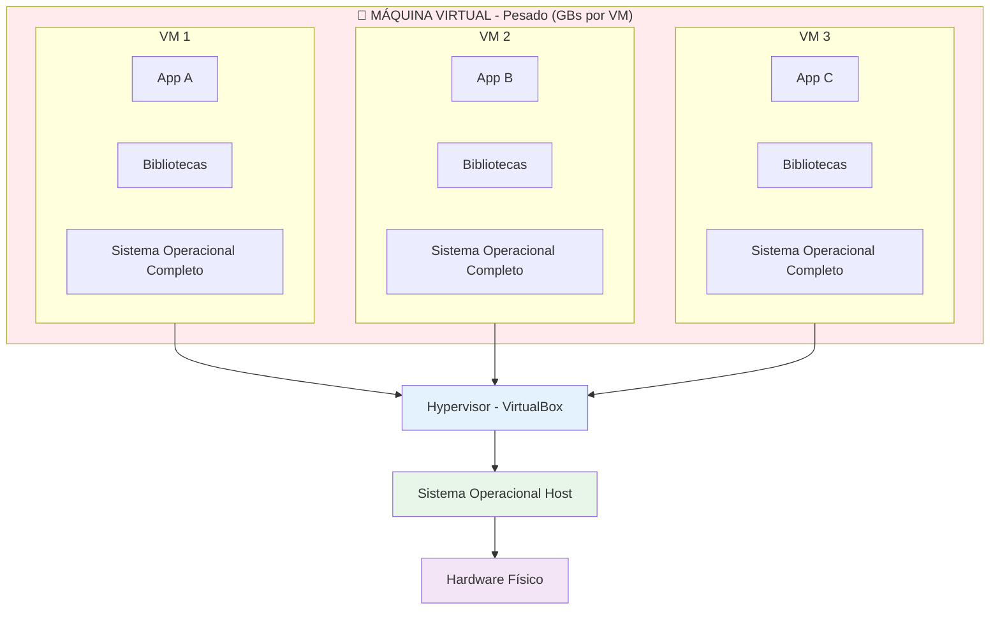
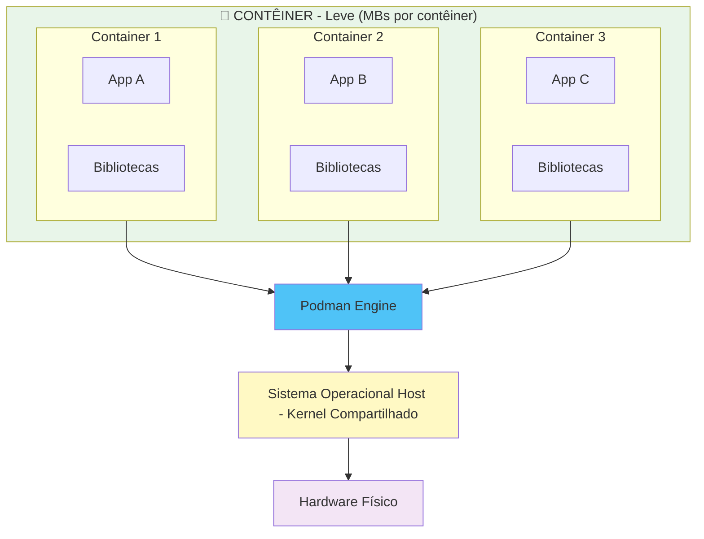
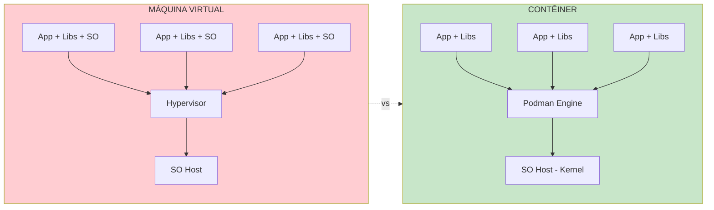

# 🐳 Guia de Podman para Iniciantes

## 📌 O que são Máquinas Virtuais e Contêineres?

### Máquina Virtual (VirtualBox)
Uma VM simula um computador completo dentro do seu computador. Precisa de um sistema operacional completo para cada VM.

### Contêiner (Podman)
Um contêiner é mais leve! Compartilha o kernel do sistema operacional host e isola apenas a aplicação.

## 🎨 Diferença Visual

### Arquitetura de Máquina Virtual



### Arquitetura de Contêiner



### Comparação Lado a Lado



**Principais Diferenças:**

| Característica | Máquina Virtual | Contêiner |
|----------------|-----------------|-----------|
| **Tamanho** | GBs (1-10 GB) | MBs (10-100 MB) |
| **Inicialização** | Minutos | Segundos |
| **Isolamento** | SO completo | Processo isolado |
| **Performance** | Overhead maior | Quase nativo |
| **Portabilidade** | Menos portável | Altamente portável |

## 🐋 O que é Podman?

Podman é uma plataforma que permite criar, executar e gerenciar **contêineres**. Pense nele como uma caixa que empacota sua aplicação com tudo que ela precisa para funcionar.

### Vantagens do Podman:
- ⚡ **Rápido**: Inicia em segundos
- 💾 **Leve**: Usa menos recursos que VMs
- 📦 **Portável**: Funciona igual em qualquer lugar
- 🔄 **Consistente**: "Na minha máquina funciona" vira coisa do passado

<div style="background-color: #fff3cd; color: #856404; border-left: 6px solid #ff9800; border-radius: 6px; padding: 16px 20px; margin: 20px 0;">

### ⚠️ IMPORTANTE SOBRE LICENCIAMENTO

Desde 2022, o **Podman Desktop** exige **licença paga** para empresas com mais de **250 funcionários** ou receita anual superior a **US$ 10 milhões**.

**Muitas empresas bloqueiam o uso do Podman Desktop por esse motivo.**

Se esse for o seu caso, o **[Podman](https://podman.io/)** é uma alternativa **100% GRATUITA, open-source e compatível** com os mesmos comandos do Podman.

👉 Veja a seção [🦭 Podman — Alternativa ao Podman](#-podman--alternativa-ao-podman) mais adiante neste guia.

</div>

---

## �️ Instalação do Podman no Windows

### Pré-requisitos

Antes de instalar o Podman Desktop no Windows, verifique se o seu sistema atende aos seguintes requisitos:

| Requisito | Detalhe |
|-----------|---------|
| **Sistema Operacional** | Windows 10 (64-bit) versão 1903 ou superior, ou Windows 11 |
| **Processador** | 64-bit com suporte a virtualização (VT-x/AMD-V) |
| **RAM** | Mínimo de 4 GB |
| **WSL 2** | Windows Subsystem for Linux versão 2 habilitado |

### Passo 1: Habilitar o WSL 2

O Podman Desktop utiliza o **WSL 2** (Windows Subsystem for Linux) como backend. Abra o **PowerShell como Administrador** e execute:

```powershell
# Habilitar o recurso WSL
wsl --install
```

> 💡 Esse comando já habilita o WSL e instala a distribuição Ubuntu por padrão. **Reinicie o computador** após a execução.

Após reiniciar, verifique se o WSL 2 está ativo:

```powershell
# Verificar a versão do WSL
wsl --version

# Definir o WSL 2 como versão padrão
wsl --set-default-version 2
```

### Passo 2: Baixar o Podman Desktop

1. Acesse o site oficial: [https://www.podman.com/products/podman-desktop/](https://www.podman.com/products/podman-desktop/)
2. Clique no botão **"Download for Windows"**
3. O arquivo `Podman Desktop Installer.exe` será baixado

Ou, se preferir, baixe diretamente pelo PowerShell:

```powershell
# Baixar o instalador via PowerShell
Invoke-WebRequest -Uri "https://desktop.podman.com/win/main/amd64/Podman%20Desktop%20Installer.exe" -OutFile "$HOME\Downloads\PodmanDesktopInstaller.exe"
```
Ou, Central de programas do Windows na interface grafica 
    - **Reinicie o computador após instalação**
    - **Vefifique se a instalação funcionou no powershell com o comando** -> podman info

### Passo 3: Instalar o Podman Desktop

1. Execute o arquivo **Podman Desktop Installer.exe**
2. Na tela de configuração, marque as opções:
   - ✅ **Use WSL 2 instead of Hyper-V** (recomendado)
   - ✅ **Add shortcut to desktop**
3. Clique em **Ok** e aguarde a instalação
4. Ao finalizar, clique em **Close and restart** para reiniciar o computador

### Passo 4: Configuração Inicial

1. Após o reinício, o **Podman Desktop** será iniciado automaticamente
2. Aceite os termos de serviço
3. Aguarde o Podman Engine iniciar (o ícone da baleia 🐳 na bandeja do sistema ficará estável)

> ⚠️ **IMPORTANTE: Configurar a Podman Machine após a instalação**
>
> Após instalar o Podman Desktop, é **obrigatório** inicializar e iniciar a **Podman Machine** para que os contêineres possam ser executados. No Windows, o Podman utiliza uma máquina virtual leve (via WSL 2) para rodar os contêineres Linux.
>
> Abra o **PowerShell** e execute:
>
> ```powershell
> # Inicializar a máquina do Podman (só precisa fazer uma vez)
> podman machine init
>
> # Iniciar a máquina do Podman
> podman machine start
> ```
>
> Você também pode fazer isso pela interface do **Podman Desktop**:
> 1. Abra o Podman Desktop
> 2. Vá em **Settings > Resources**
> 3. Clique em **"Create new Podman machine"** (se ainda não existir)
> 4. Aguarde a inicialização e clique em **Start**
>
> Para verificar se a máquina está rodando:
> ```powershell
> podman machine list
> ```
>
> A saída deve mostrar a máquina com status **Running**. Sem essa configuração, comandos como `podman run` e `podman compose` **não funcionarão**.

### Passo 5: Verificar a Instalação

Abra o **PowerShell** ou **Terminal** e execute os seguintes comandos:

```powershell
# Verificar a versão do Podman
podman --version

# Verificar a versão do Podman Compose
podman compose version

# Testar executando o contêiner hello-world
podman run docker.io/library/hello-world
```

Se tudo estiver correto, você verá uma mensagem como:

```
Hello from Podman!
This message shows that your installation appears to be working correctly.
```

### 🔧 Configurações Recomendadas

Após a instalação, abra o Podman Desktop e ajuste as configurações em **⚙️ Settings**:

| Configuração | Onde encontrar | Recomendação |
|--------------|----------------|--------------|
| **WSL Integration** | Resources > WSL Integration | Habilitar para a distribuição Ubuntu |
| **Memória** | Resources > Advanced | Alocar pelo menos 2 GB |
| **CPUs** | Resources > Advanced | Alocar pelo menos 2 CPUs |
| **Start on login** | General | Desmarcar se não quiser iniciar automaticamente |

### ⚠️ Solução de Problemas Comuns

#### Podman Desktop não inicia
```powershell
# Reiniciar o serviço do Podman
net stop com.podman.service
net start com.podman.service
```

#### WSL 2 não encontrado
```powershell
# Atualizar o kernel do WSL
wsl --update

# Reiniciar o WSL
wsl --shutdown
```

#### Erro de virtualização
1. Reinicie o computador e acesse a **BIOS/UEFI**
2. Habilite **Intel VT-x** ou **AMD-V** nas configurações do processador
3. Salve e reinicie

#### Verificar se o Podman está rodando corretamente
```powershell
# Exibir informações detalhadas do Podman
podman info

# Verificar contêineres, imagens e volumes
podman system df
```

---

## �📄 Containerfile

O **Containerfile** é uma receita que ensina o Podman a construir uma imagem da sua aplicação.

### Exemplo de Containerfile para Java:

```podmanfile
# Imagem base (Java 17)
FROM openjdk:17-jdk-slim

# Diretório de trabalho dentro do contêiner
WORKDIR /app

# Copiar o arquivo JAR da aplicação
COPY target/minha-app.jar app.jar

# Expor a porta que a aplicação usa
EXPOSE 8080

# Comando para executar a aplicação
CMD ["java", "-jar", "app.jar"]
```

### Principais Comandos do Containerfile:

| Comando | Descrição |
|---------|-----------|
| `FROM` | Define a imagem base |
| `WORKDIR` | Define o diretório de trabalho |
| `COPY` | Copia arquivos para o contêiner |
| `RUN` | Executa comandos durante a construção |
| `EXPOSE` | Documenta qual porta a app usa |
| `CMD` | Comando executado ao iniciar o contêiner |
| `ENV` | Define variáveis de ambiente |

---

## 🐳 Comandos Básicos do Podman

### 1. Construir uma Imagem
```bash
# Construir a partir do Containerfile no diretório atual
podman build -t minha-app:1.0 .

# -t = tag (nome da imagem)
# . = contexto (diretório atual)
```

### 2. Listar Imagens
```bash
podman images
```

### 3. Executar um Contêiner
```bash
# Executar em modo destacado (background)
podman run -d -p 8080:8080 --name meu-container minha-app:1.0

# -d = detached (background)
# -p = mapear porta (host:container)
# --name = nome do contêiner
```

### 4. Listar Contêineres
```bash
# Contêineres em execução
podman ps

# Todos os contêineres (inclusive parados)
podman ps -a
```

### 5. Ver Logs do Contêiner
```bash
podman logs meu-container

# Seguir os logs em tempo real
podman logs -f meu-container
```

### 6. Parar e Remover Contêiner
```bash
# Parar
podman stop meu-container

# Remover
podman rm meu-container
```

### 7. Remover Imagem
```bash
podman rmi minha-app:1.0
```

### 8. Entrar no Contêiner
```bash
# Abrir um terminal dentro do contêiner
podman exec -it meu-container /bin/bash
```

### 9. Limpar Recursos Não Utilizados
```bash
# Remove contêineres parados, redes e imagens não utilizadas
podman system prune -a
```

---

## 🎼 Podman Compose

O **Podman Compose** permite gerenciar múltiplos contêineres de uma vez usando um arquivo YAML.

### Quando usar?
- Sua aplicação precisa de banco de dados
- Você tem microserviços que conversam entre si
- Quer subir todo o ambiente com um único comando

### Exemplo de podman-compose.yml:

```yaml
version: '3.8'

services:
  # Aplicação Java
  app:
    build: .                          # Constrói a partir do Containerfile local
    ports:
      - "8080:8080"                   # Mapeia porta
    environment:
      - SPRING_DATASOURCE_URL=jdbc:postgresql://db:5432/meudb
      - SPRING_DATASOURCE_USERNAME=postgres
      - SPRING_DATASOURCE_PASSWORD=senha123
    depends_on:
      - db                            # Espera o banco subir primeiro
    networks:
      - minha-rede

  # Banco de Dados PostgreSQL
  db:
    image: postgres:15-alpine         # Usa imagem pronta do PostgreSQL
    environment:
      - POSTGRES_DB=meudb
      - POSTGRES_USER=postgres
      - POSTGRES_PASSWORD=senha123
    ports:
      - "5432:5432"
    volumes:
      - db-data:/var/lib/postgresql/data  # Persiste os dados
    networks:
      - minha-rede

# Definição de volumes (armazenamento persistente)
volumes:
  db-data:

# Definição de redes (comunicação entre contêineres)
networks:
  minha-rede:
    driver: bridge
```

### Comandos do Podman Compose:

```bash
# Subir todos os serviços
podman-compose up

# Subir em background
podman-compose up -d

# Ver logs de todos os serviços
podman-compose logs

# Ver logs de um serviço específico
podman-compose logs app

# Parar todos os serviços
podman-compose stop

# Parar e remover contêineres, redes e volumes
podman-compose down

# Parar e remover TUDO (inclusive volumes)
podman-compose down -v

# Reconstruir as imagens
podman-compose build

# Subir reconstruindo as imagens
podman-compose up --build
```

---

## 🎯 Fluxo de Trabalho Típico

### 1. Desenvolvimento com Podman:

```bash
# 1. Criar o Containerfile
# 2. Criar o podman-compose.yml (se necessário)

# 3. Construir e subir
podman-compose up --build

# 4. Fazer alterações no código

# 5. Reconstruir e reiniciar
podman-compose up --build

# 6. Parar tudo
podman-compose down
```

### 2. Exemplo Prático - Spring Boot + PostgreSQL:

**Estrutura do Projeto:**
```
meu-projeto/
├── src/
├── pom.xml
├── Containerfile
└── podman-compose.yml
```

**Containerfile:**
```podmanfile
FROM maven:3.8-openjdk-17 AS build
WORKDIR /app
COPY pom.xml .
COPY src ./src
RUN mvn clean package -DskipTests

FROM openjdk:17-jdk-slim
WORKDIR /app
COPY --from=build /app/target/*.jar app.jar
EXPOSE 8080
CMD ["java", "-jar", "app.jar"]
```

**Comandos:**
```bash
# Subir aplicação + banco
podman-compose up -d

# Ver se está rodando
podman-compose ps

# Ver logs da aplicação
podman-compose logs -f app

# Acessar o banco direto
podman-compose exec db psql -U postgres -d meudb
```

---

## 💡 Dicas Importantes

### ✅ Boas Práticas:

1. **Use imagens oficiais** do Podman Hub
2. **Minimize camadas** no Containerfile
3. **Use .containerignore** para não copiar arquivos desnecessários
4. **Nunca coloque senhas** no Containerfile (use variáveis de ambiente)
5. **Use multi-stage builds** para imagens menores
6. **Nomeie suas imagens e contêineres** claramente

### 📝 Arquivo .containerignore:

```
target/
.git
.gitignore
*.md
.env
node_modules/
```

### 🔍 Comandos Úteis para Debug:

```bash
# Ver uso de recursos
podman stats

# Inspecionar contêiner
podman inspect meu-container

# Ver processos dentro do contêiner
podman top meu-container

# Copiar arquivo do contêiner para host
podman cp meu-container:/app/logs/app.log ./local.log
```

---

## 🎓 Resumo

| Conceito | O que é | Arquivo |
|----------|---------|---------|
| **Podman** | Plataforma de contêineres | - |
| **Containerfile** | Receita para criar uma imagem | `Containerfile` |
| **Podman Compose** | Orquestrador de múltiplos contêineres | `podman-compose.yml` |
| **Imagem** | Template da aplicação (como uma classe) | - |
| **Contêiner** | Instância rodando (como um objeto) | - |

### Analogia para Entender:

- **Imagem Podman** = Receita de bolo 📋
- **Contêiner** = Bolo pronto 🎂
- **Containerfile** = Como escrever a receita 📝
- **Podman Compose** = Como fazer vários bolos diferentes de uma vez 🎂🍰🧁

---

---

## 🦭 Podman — Alternativa ao Podman

### Por que Podman?

O **[Podman](https://podman.io/)** é uma engine de contêineres desenvolvida pela Red Hat que funciona como uma alternativa **drop-in** ao Podman. Isso significa que os mesmos comandos que você usa no Podman funcionam no Podman, basta trocar `podman` por `podman`.

| Característica | Podman Desktop | Podman |
|----------------|----------------|--------|
| **Licença** | Gratuito para uso pessoal; **pago para empresas** (>250 funcionários ou >US$10M/ano) | **Totalmente gratuito** e open-source (Apache 2.0) |
| **Daemon** | Requer daemon rodando em background (`podmand`) | **Daemonless** — não precisa de processo em background |
| **Root** | Roda como root por padrão | Pode rodar **sem privilégios root** (rootless) |
| **Compatibilidade** | Padrão de mercado | Compatível com comandos Podman e imagens OCI |
| **Compose** | `podman compose` nativo | Suporta `podman-compose` ou `podman-compose` via emulação |
| **Pods** | Não possui conceito de pods | Suporta **pods** (similar ao Kubernetes) |

### 🖥️ Instalação do Podman no Windows

#### Pré-requisitos

Os mesmos do Podman Desktop:
- Windows 10 (64-bit) versão 1903+ ou Windows 11
- WSL 2 habilitado
- Virtualização habilitada na BIOS

#### Passo 1: Instalar via Winget (recomendado)

Abra o **PowerShell** e execute:

```powershell
# Instalar o Podman via winget
winget install RedHat.Podman
```

Ou baixe o instalador diretamente em: [https://podman.io/getting-started/installation](https://podman.io/getting-started/installation)

#### Passo 2: Instalar o Podman Desktop (interface gráfica)

O **Podman Desktop** é a interface gráfica equivalente ao Podman Desktop:

```powershell
# Instalar o Podman Desktop
winget install RedHat.Podman-Desktop
```

Ou baixe em: [https://podman-desktop.io/](https://podman-desktop.io/)

#### Passo 3: Inicializar a máquina Podman

Diferente do Podman, o Podman no Windows usa uma máquina virtual leve que precisa ser inicializada:

```powershell
# Criar e inicializar a máquina Podman
podman machine init

# Iniciar a máquina
podman machine start
```

#### Passo 4: Verificar a instalação

```powershell
# Verificar a versão
podman --version

# Verificar informações do sistema
podman info

# Testar com hello-world
podman run docker.io/library/hello-world
```

#### (Opcional) Criar alias para usar comandos `podman` com Podman

Se você quer usar `podman` como comando mas executar com Podman, adicione um alias no seu perfil do PowerShell:

```powershell
# Abrir o perfil do PowerShell
notepad $PROFILE

# Adicionar a seguinte linha:
Set-Alias -Name podman -Value podman

# Salvar e recarregar
. $PROFILE
```

Agora, todos os comandos `podman` serão redirecionados automaticamente para o `podman`.

---

### 🔄 De-Para: Podman → Podman

A tabela abaixo mostra a equivalência de comandos. Na prática, basta **trocar `podman` por `podman`**:

| Ação | Podman | Podman |
|------|--------|--------|
| **Verificar versão** | `podman --version` | `podman --version` |
| **Informações do sistema** | `podman info` | `podman info` |
| **Construir imagem** | `podman build -t app:1.0 .` | `podman build -t app:1.0 .` |
| **Listar imagens** | `podman images` | `podman images` |
| **Executar contêiner** | `podman run -d -p 8080:8080 app` | `podman run -d -p 8080:8080 app` |
| **Listar contêineres** | `podman ps` | `podman ps` |
| **Ver logs** | `podman logs meu-container` | `podman logs meu-container` |
| **Parar contêiner** | `podman stop meu-container` | `podman stop meu-container` |
| **Remover contêiner** | `podman rm meu-container` | `podman rm meu-container` |
| **Remover imagem** | `podman rmi app:1.0` | `podman rmi app:1.0` |
| **Entrar no contêiner** | `podman exec -it meu-container bash` | `podman exec -it meu-container bash` |
| **Compose up** | `podman compose up -d` | `podman-compose up -d` |
| **Compose down** | `podman compose down` | `podman-compose down` |
| **Limpar recursos** | `podman system prune -a` | `podman system prune -a` |
| **Iniciar/parar máquina** | (automático pelo Desktop) | `podman machine start` / `podman machine stop` |

### 📦 Podman Compose

Para usar arquivos `podman-compose.yml` com o Podman, instale o `podman-compose`:

```powershell
# Instalar via pip (requer Python)
pip install podman-compose
```

Depois, basta usar os mesmos arquivos `podman-compose.yml`:

```bash
# Subir todos os serviços
podman-compose up -d

# Ver logs
podman-compose logs

# Parar tudo
podman-compose down
```

> 💡 **Dica**: O `podman-compose` lê os mesmos arquivos `podman-compose.yml` e `Containerfile`. Você **não precisa alterar** nenhum arquivo de configuração para migrar do Podman para o Podman.

### ⚠️ Diferenças Importantes

1. **Máquina virtual**: No Windows, o Podman precisa de `podman machine start` antes de usar. O Podman Desktop faz isso automaticamente.
2. **Daemon**: O Podman não roda um daemon em background. Cada comando é executado diretamente.
3. **Pods**: O Podman suporta o conceito de pods (agrupar contêineres), similar ao Kubernetes:
   ```bash
   # Criar um pod
   podman pod create --name meu-pod -p 8080:8080
   
   # Rodar contêiner dentro do pod
   podman run -d --pod meu-pod minha-app:1.0
   ```
4. **Geração de YAML Kubernetes**: O Podman pode gerar manifestos Kubernetes diretamente:
   ```bash
   # Gerar YAML a partir de um pod rodando
   podman generate kube meu-pod > deployment.yaml
   ```

---

## 🚀 Próximos Passos

1. Instale o **Podman Desktop** ou **Podman Desktop** no seu computador
2. Crie um Containerfile simples para sua aplicação Java
3. Execute `podman build` e `podman run` (ou `podman build` e `podman run`)
4. Experimente o Podman Compose (ou `podman-compose`) com um banco de dados
5. Pratique os comandos básicos

**Lembre-se**: Podman e Podman são ferramentas essenciais no desenvolvimento moderno. Se sua empresa bloqueia o Podman Desktop, use o Podman sem medo — os comandos são praticamente idênticos! 🎯
