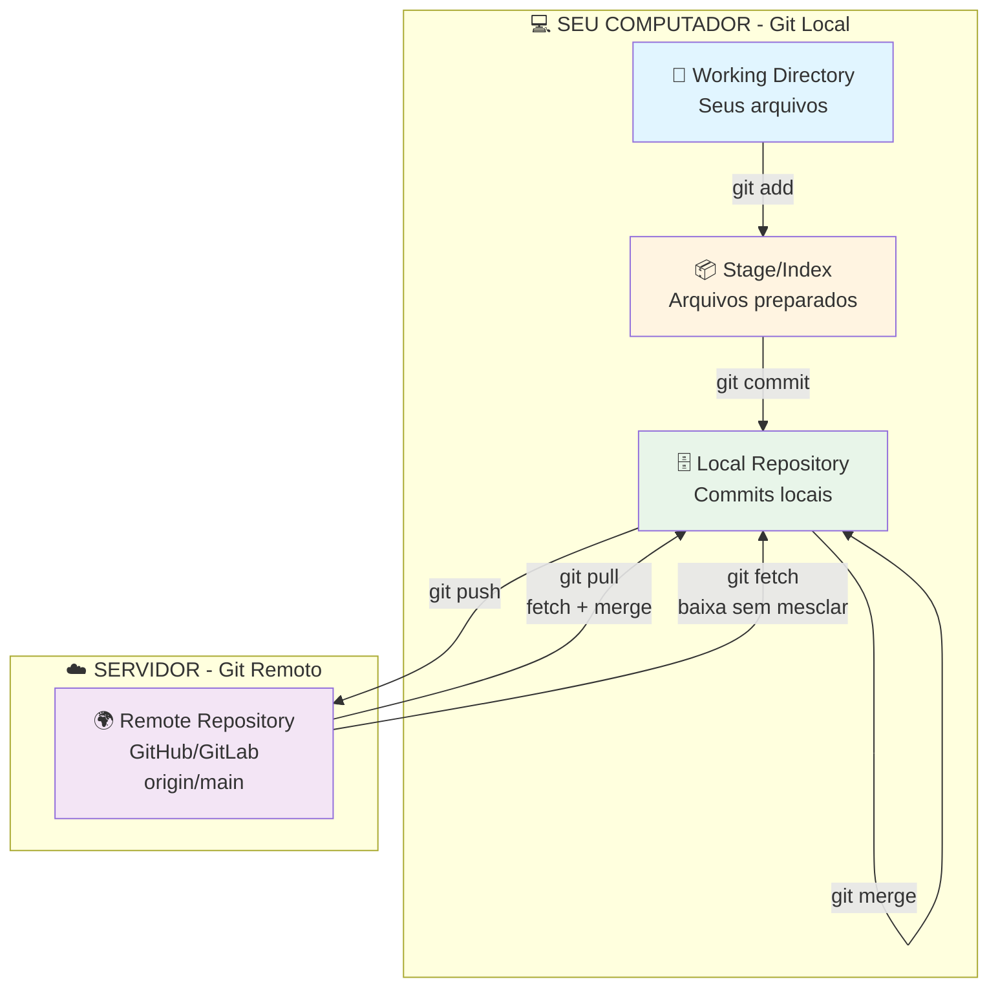
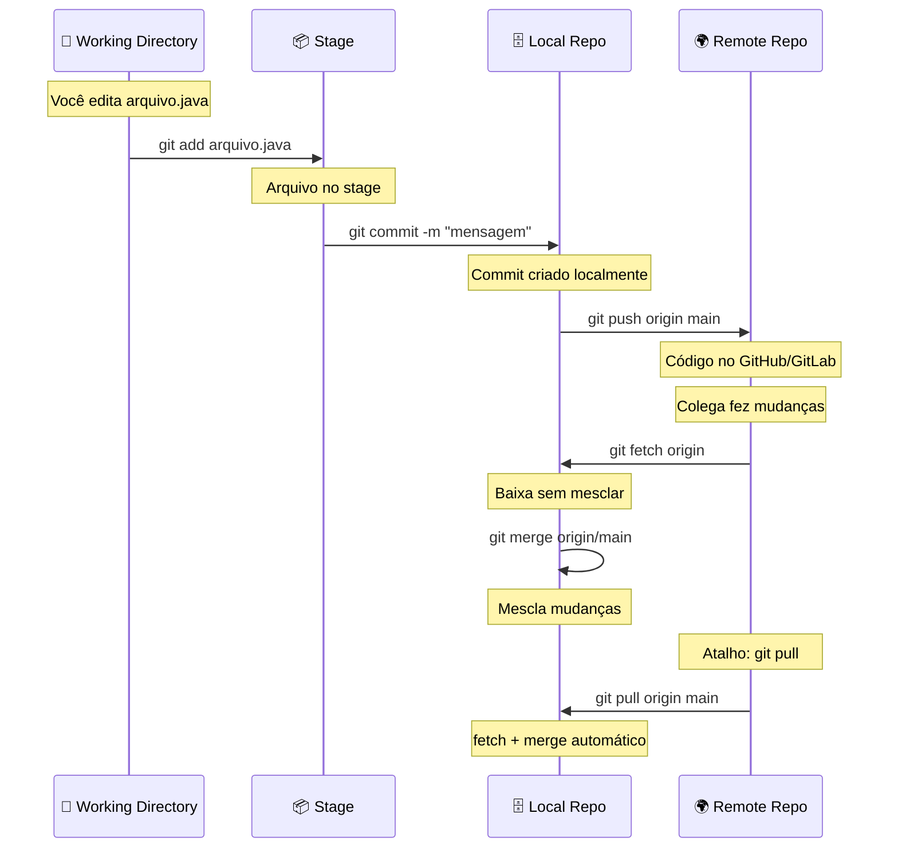

# Guia Básico de Git - Usando Git do Jeito Certo

## 📚 Introdução

Git é uma ferramenta essencial para qualquer desenvolvedor. Este guia vai te ensinar as boas práticas básicas para manter seu repositório limpo e organizado.

> **Importante**: Um repositório limpo = código profissional. Isso mostra seu respeito com a equipe!

---

## 🎯 Por que se importar com Git?

- **Histórico limpo**: Facilita encontrar bugs e entender mudanças
- **Colaboração**: Seus colegas vão entender seu trabalho
- **Profissionalismo**: Demonstra cuidado e atenção aos detalhes
- **Debugging**: Commits organizados facilitam reverter problemas

---

## 🌐 Como o Git Funciona: Local vs Remoto

O Git trabalha em dois ambientes: **local** (sua máquina) e **remoto** (servidor como GitHub, GitLab).



### Entendendo as Operações

| Comando | O que faz | Direção |
|---------|-----------|---------|
| `git add` | Move arquivos para o stage | Working → Stage |
| `git commit` | Salva mudanças no repositório local | Stage → Local Repo |
| `git push` | Envia commits para o servidor | Local → Remoto |
| `git fetch` | Baixa commits do servidor (sem mesclar) | Remoto → Local |
| `git pull` | Baixa e mescla commits do servidor | Remoto → Local |
| `git merge` | Junta branches ou mudanças | Local → Local |

### Fluxo Completo de Trabalho



### 🔄 Diferença entre Pull, Fetch e Merge

```bash
# FETCH: Apenas baixa (seguro, não modifica seu código)
git fetch origin
# Baixa atualizações mas não mescla automaticamente

# MERGE: Junta as mudanças baixadas
git merge origin/main
# Agora sim mescla com seu código local

# PULL: Faz fetch + merge de uma vez
git pull origin main
# Equivalente a: git fetch + git merge
```

---

## ✏️ 1. Mensagens de Commit Decentes

### ❌ Errado
```bash
git commit -m "correção"
git commit -m "fixing"
git commit -m "hotfix"
git commit -m "atualizando"
```

### ✅ Certo
```bash
git commit -m "Adiciona validação de email no formulário de cadastro"
git commit -m "Corrige erro de null pointer no método calcularTotal"
git commit -m "Atualiza dependência do Spring Boot para versão 3.2.0"
```

### 💡 Dica: Como escrever uma boa mensagem?

1. Use verbo no presente: "Adiciona", "Corrige", "Remove"
2. Seja específico sobre o que mudou
3. Explique o "o quê", não o "como"
4. Mantenha a primeira linha com menos de 50 caracteres

---

## 🔧 2. Corrigindo Mensagens de Commit

### Situação: Você acabou de fazer um commit com mensagem errada

```bash
# Você fez:
git add arquivo.java
git commit -m "corrgindo bug"  # ops, erro de digitação!

# Corrija imediatamente:
git commit --amend -m "Corrige validação de CPF no formulário"
```

### 📝 Exercício 1
1. Crie um arquivo chamado `teste.txt`
2. Faça um commit com uma mensagem errada
3. Corrija a mensagem usando `git commit --amend`

---

## 🧹 3. Limpando Commits Bagunçados

### Situação: Você fez vários commits "fixing" seguidos

```bash
# Você está aqui:
git log
# - fixing
# - fixing
# - fixing  
# - Adiciona feature de login (este era bom!)

# Vamos limpar! Opção 1: Reset Soft
git reset --soft HEAD~3  # volta 3 commits mas mantém as mudanças
git commit -m "Implementa sistema de autenticação completo"
```

### Opção 2: Rebase Interativo (mais profissional)

```bash
git rebase -i HEAD~3

# O editor vai abrir:
pick abc1234 Adiciona feature de login
squash def5678 fixing
squash ghi9012 fixing

# Mude "pick" para "squash" nos commits que quer juntar
# Salve e feche o editor
# Escreva uma mensagem decente para o commit final
```

### 📝 Exercício 2
1. Crie 3 arquivos: `a.txt`, `b.txt`, `c.txt`
2. Faça um commit para cada um com mensagens ruins ("fixing", "correção", etc)
3. Use `git reset --soft HEAD~3` para juntar tudo
4. Faça um novo commit com mensagem decente

---

## 📦 4. Organizando Arquivos no Stage

### ❌ Problema Comum: Commitar tudo junto

```bash
# ERRADO - mistura coisas não relacionadas
git add .
git commit -m "mudanças"
```

### ✅ Solução: Adicione arquivos por funcionalidade

```bash
# Correto - commits separados por contexto
git add style.css header.css
git commit -m "Atualiza estilos do cabeçalho"

git add README.md
git commit -m "Adiciona instruções de instalação no README"
```

### 🎛️ Usando git add interativo

```bash
# Se você já deu "git add ." por engano
git add -i  # modo interativo

# Menu aparece:
# 1: status
# 2: update (adicionar)
# 3: revert (remover do stage)
# Digite 3 e escolha os números dos arquivos para remover
```

### 📝 Exercício 3
1. Crie 5 arquivos diferentes: `user.java`, `product.java`, `style.css`, `README.md`, `config.properties`
2. Adicione todos com `git add .`
3. Use `git add -i` e opção `3 (revert)` para tirar alguns do stage
4. Faça commits separados por contexto (Java juntos, CSS separado, etc)

---

## 🎨 5. Dividindo Mudanças no Mesmo Arquivo

### Situação: Você mexeu em várias partes de um arquivo

```bash
# Use git add -p (p = patch)
git add -p arquivo.java

# O Git vai mostrar cada "pedaço" (hunk) de mudança
# Opções:
# y = sim, adicionar este pedaço
# n = não, pular este pedaço
# s = split, dividir em pedaços menores
# q = quit, sair
```

### Exemplo Prático

```bash
# Arquivo README.md teve 3 mudanças:
# 1. Atualização de versão (linha 5)
# 2. Correção de typo (linha 20)
# 3. Nova seção de instalação (linha 50)

git add -p README.md

# Hunk #1/3
# (mudança da linha 5)
# Stage this hunk [y,n,s,q,?]? y  ← adiciona

# Hunk #2/3
# (mudança da linha 20)  
# Stage this hunk [y,n,s,q,?]? n  ← pula

# Hunk #3/3
# (mudança da linha 50)
# Stage this hunk [y,n,s,q,?]? y  ← adiciona

git commit -m "Atualiza versão e adiciona seção de instalação"

# Agora adicione o que sobrou:
git add README.md
git commit -m "Corrige erro de ortografia"
```

### 📝 Exercício 4
1. Crie um arquivo `exemplo.txt` com 10 linhas
2. Commite ele: `git commit -m "Versão inicial"`
3. Modifique 3 linhas diferentes (linha 2, 5 e 8)
4. Use `git add -p` para adicionar apenas as linhas 2 e 8
5. Faça um commit
6. Adicione a linha 5 restante em outro commit

---

## 🔄 6. Os 3 Estágios do Git

```
Working Directory → Stage/Index → Repository
    (arquivos)      (git add)    (git commit)
```

### Comandos Principais

```bash
# Ver status dos arquivos
git status

# Adicionar ao stage
git add arquivo.txt          # arquivo específico
git add .                    # todos os arquivos
git add -p                   # adicionar por pedaços

# Remover do stage (antes do commit)
git reset -- arquivo.txt     # remove arquivo do stage
git reset --                 # remove tudo do stage

# Ver diferenças
git diff                     # mudanças não adicionadas (working → stage)
git diff --staged            # mudanças adicionadas (stage → repository)

# Fazer commit
git commit -m "mensagem"
git commit --amend           # corrigir último commit
```

### 📝 Exercício 5
1. Crie 2 arquivos: `teste1.txt` e `teste2.txt`
2. Use `git status` para ver os arquivos não rastreados
3. Adicione apenas `teste1.txt` ao stage
4. Use `git status` novamente
5. Use `git diff --staged` para ver o que vai no commit
6. Faça o commit

---

## 💡 7. Salvando Trabalho Temporariamente (Stash)

### Quando usar?
- Precisa mudar de branch mas tem mudanças não commitadas
- Quer puxar código do servidor (git pull) mas tem conflitos locais
- Precisa pausar o trabalho para fazer algo urgente

```bash
# Salvar mudanças temporariamente
git stash

# Ou com mensagem descritiva
git stash save "WIP: implementando login"

# Ver lista de stashes
git stash list

# Recuperar último stash
git stash pop

# Recuperar stash específico
git stash pop stash@{0}

# Ver o que tem em um stash
git stash show -p stash@{0}

# Limpar stashes
git stash clear
```

### 📝 Exercício 6
1. Faça mudanças em um arquivo
2. Use `git stash` para guardar temporariamente
3. Verifique que o arquivo voltou ao estado original
4. Use `git stash pop` para recuperar as mudanças

---

## 🚨 8. Revertendo Mudanças

### Ainda não fez commit

```bash
# Descartar mudanças de um arquivo
git checkout -- arquivo.txt

# Descartar todas as mudanças
git reset --hard
```

### Já fez commit (mas não fez push)

```bash
# Voltar 1 commit mantendo as mudanças
git reset --soft HEAD~1

# Voltar 1 commit descartando tudo
git reset --hard HEAD~1
```

### ⚠️ Cuidado: Já fez push?

Se você já deu `git push`, **não use reset**! Use `git revert`:

```bash
# Criar um novo commit que desfaz o anterior
git revert HEAD

# Reverter um commit específico
git revert abc1234
```

### 📝 Exercício 7
1. Crie um arquivo e commite
2. Modifique o arquivo mas NÃO commite
3. Use `git checkout -- arquivo` para descartar as mudanças
4. Faça uma nova modificação e commite
5. Use `git reset --soft HEAD~1` para desfazer o commit (mas manter mudanças)

---

## 🔍 9. Visualizando o Histórico

```bash
# Ver histórico completo
git log

# Ver histórico resumido (uma linha por commit)
git log --oneline

# Ver histórico com gráfico de branches
git log --oneline --graph --all

# Ver últimos 5 commits
git log -5

# Ver histórico de um arquivo específico
git log -- arquivo.txt

# Ver o que mudou em cada commit
git log -p

# Ver commits de um autor específico
git log --author="João"
```

### 📝 Exercício 8
1. Faça 5 commits diferentes em arquivos diferentes
2. Use `git log --oneline` para ver o histórico
3. Use `git log -p -2` para ver detalhes dos últimos 2 commits
4. Use `git log --graph --all --oneline`

---

## 🌿 10. Trabalhando com Branches

```bash
# Criar branch
git branch feature-login

# Mudar para branch
git checkout feature-login

# Criar e mudar em um comando
git checkout -b feature-login

# Ver todas as branches
git branch

# Voltar para main/master
git checkout main

# Deletar branch
git branch -d feature-login

# Deletar branch forçadamente
git branch -D feature-login
```

### Fluxo de Trabalho Recomendado

```bash
# 1. Sempre trabalhe em branches separados
git checkout -b feature-nova-funcionalidade

# 2. Faça seus commits
git add .
git commit -m "Implementa funcionalidade X"

# 3. Volte para main e atualize
git checkout main
git pull origin main

# 4. Merge sua branch
git merge feature-nova-funcionalidade

# 5. Push para o servidor
git push origin main

# 6. Delete a branch local
git branch -d feature-nova-funcionalidade
```

### 📝 Exercício 9
1. Crie uma branch chamada `feature-teste`
2. Mude para essa branch
3. Crie 2 arquivos e commite
4. Volte para a branch `main`
5. Note que os arquivos não aparecem mais
6. Volte para `feature-teste` e veja os arquivos de novo
7. Faça merge na main

---

## 📋 11. Comandos do Dia a Dia

### Rotina Básica

```bash
# 1. Começar o dia - atualizar código
git pull origin main

# 2. Criar branch para sua tarefa
git checkout -b feature-MEU-NOME

# 3. Trabalhar e fazer commits
git add arquivo.java
git commit -m "Adiciona validação de email"

# 4. Atualizar sua branch com a main
git checkout main
git pull origin main
git checkout feature-MEU-NOME
git rebase main  # ou git merge main

# 5. Enviar para o servidor
git push origin feature-MEU-NOME

# 6. Criar Pull Request no GitHub/GitLab
```

### Comandos de Emergência

```bash
# Ver o que mudou
git status
git diff

# Recuperar arquivo deletado (antes do commit)
git checkout -- arquivo.txt

# Ver o que tem no último commit
git show

# Ver histórico de comandos git
git reflog

# Procurar no código
git grep "texto para buscar"
```

---

## 📝 12. Checklist de Boas Práticas

Antes de cada commit, pergunte:

- [ ] Minha mensagem de commit é clara e descritiva?
- [ ] Estou commitando apenas arquivos relacionados?
- [ ] Removi comentários de debug e código desnecessário?
- [ ] O código compila e funciona?
- [ ] Removi senhas ou dados sensíveis?
- [ ] Li as mudanças com `git diff` antes de commitar?

---

## 🎯 Exercício Final: Projeto Completo

Crie um mini projeto seguindo todas as boas práticas:

```bash
# 1. Criar repositório
mkdir meu-projeto
cd meu-projeto
git init

# 2. Criar estrutura básica
echo "# Meu Projeto" > README.md
git add README.md
git commit -m "Inicializa projeto com README"

# 3. Criar branch de feature
git checkout -b feature-estrutura

# 4. Criar arquivos do projeto
mkdir src
echo "public class Main {}" > src/Main.java
git add src/Main.java
git commit -m "Adiciona classe Main"

mkdir test
echo "public class MainTest {}" > test/MainTest.java
git add test/MainTest.java
git commit -m "Adiciona testes da classe Main"

# 5. Voltar para main e fazer merge
git checkout main
git merge feature-estrutura

# 6. Ver o histórico limpo
git log --oneline --graph

# 7. Criar .gitignore
echo "*.class" > .gitignore
echo "target/" >> .gitignore
git add .gitignore
git commit -m "Adiciona .gitignore para arquivos Java"
```

---

## 🚫 Erros Comuns de Iniciantes

### 1. Commitar arquivos compilados
```bash
# NUNCA commite:
# - *.class (Java)
# - node_modules/ (JavaScript)
# - target/ (Maven)
# - bin/ (binários)
# - .env (variáveis de ambiente)

# Use .gitignore para evitar isso!
```

### 2. Mensagens genéricas
```bash
# ❌ RUIM
git commit -m "mudanças"
git commit -m "fix"
git commit -m "atualização"

# ✅ BOM
git commit -m "Corrige validação de CPF no formulário de cadastro"
git commit -m "Adiciona teste unitário para classe Usuario"
git commit -m "Atualiza Spring Boot de 2.7 para 3.2"
```

### 3. Commits gigantes
```bash
# ❌ RUIM - Mudar 20 arquivos em 1 commit
git add .
git commit -m "várias mudanças"

# ✅ BOM - Vários commits pequenos
git add Usuario.java
git commit -m "Adiciona validação de email em Usuario"

git add Produto.java
git commit -m "Implementa cálculo de desconto em Produto"
```

### 4. Não testar antes de commitar
```bash
# ✅ SEMPRE faça isso antes de commitar:
# 1. Compile o código
mvn clean compile

# 2. Rode os testes
mvn test

# 3. Se tudo passou, AI SIM commite
git commit -m "Implementa feature X"
```

---

## 🎓 Próximos Passos

Depois de dominar o básico:

1. **Aprenda Git Flow**: modelo de branches para projetos maiores
2. **Estude Pull Requests**: como contribuir em projetos open source
3. **Explore Git Hooks**: automatize verificações antes de commits
4. **Pratique Rebase**: mantenha histórico ainda mais limpo
5. **Entenda Git Bisect**: encontre bugs com busca binária no histórico

---

## 📚 Recursos Adicionais

- [Documentação Oficial do Git](https://git-scm.com/doc)
- [Git Cheat Sheet](https://education.github.com/git-cheat-sheet-education.pdf)
- [Learn Git Branching (interativo)](https://learngitbranching.js.org/)
- [Oh My Git! (jogo para aprender Git)](https://ohmygit.org/)

---

## 💬 Dicas Finais

> "Código limpo não é sobre código perfeito, é sobre código que outras pessoas conseguem entender e manter."

- **Commite cedo e frequentemente** (mas com lógica!)
- **Escreva pensando em quem vai ler** (incluindo você daqui 6 meses)
- **Não tenha medo de experimentar** - Git tem Ctrl+Z para quase tudo
- **Peça revisão de código** - aprenda com desenvolvedores mais experientes

---

**Créditos**: https://akitaonrails.com/2020/02/12/akitando-71-usando-git-direito-limpando-seus-commits/

**Lembre-se**: Ninguém nasce sabendo Git. Quanto mais você praticar, mais natural vai ficar! 🚀
