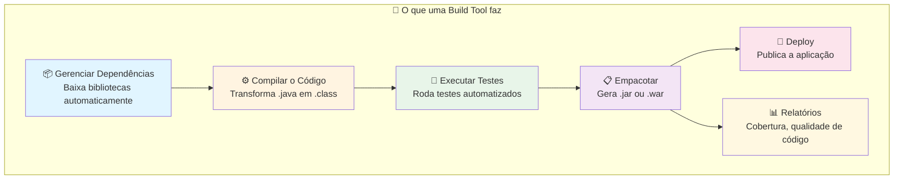
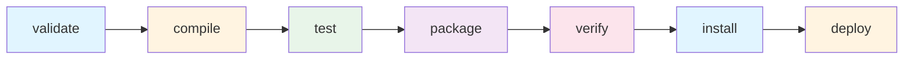
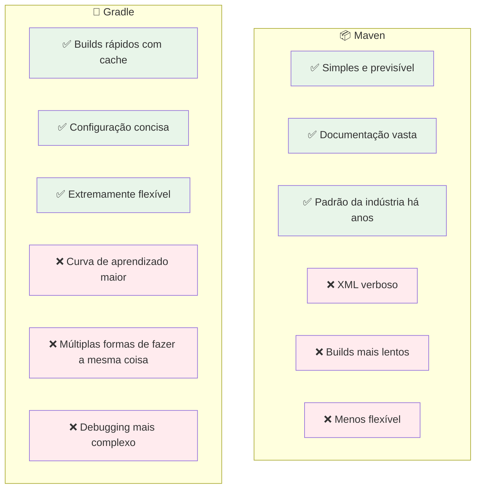
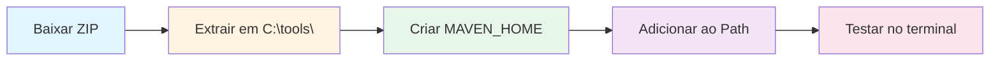
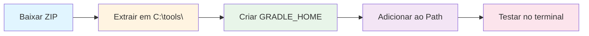
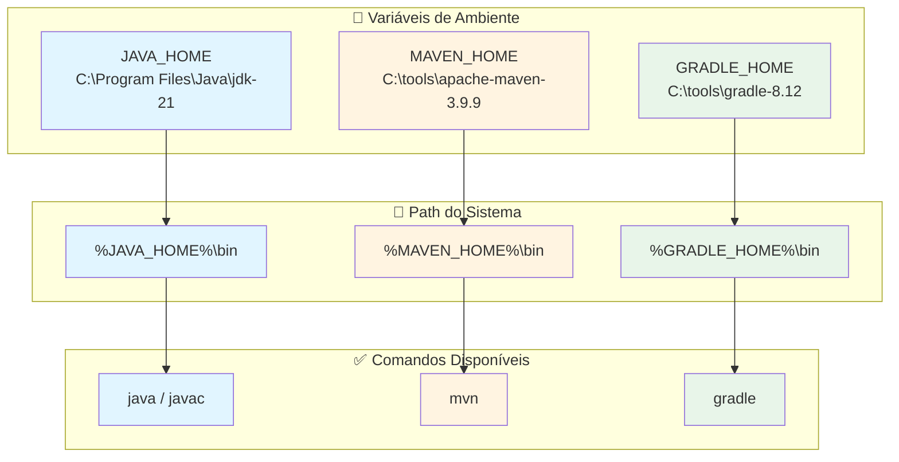

# 🏗️ Guia de Maven e Gradle - Build Tools para Java

## 📌 O que são Build Tools?

Build Tools (ferramentas de build) são programas que **automatizam** o processo de construção de um projeto de software. Em vez de você compilar, testar, empacotar e gerenciar dependências manualmente, a build tool faz tudo isso com um único comando.

> **Analogia**: Imagine construir uma casa. Você poderia carregar cada tijolo sozinho, misturar o cimento na mão e cortar cada madeira manualmente. Ou poderia usar máquinas que fazem tudo isso automaticamente seguindo uma planta. A build tool é essa "máquina" para o seu código!

---

## 🎯 Para que servem?



### Problemas que elas resolvem

| Sem Build Tool ❌ | Com Build Tool ✅ |
|---|---|
| Baixar JARs manualmente e colocar na pasta `lib/` | Declara a dependência e ela é baixada automaticamente |
| Compilar com `javac` passando cada arquivo | Um comando compila tudo |
| Gerenciar versões de bibliotecas na mão | Versões definidas em um arquivo central |
| Conflitos de dependências difíceis de resolver | Resolução automática de conflitos |
| Configurar classpath manualmente | Classpath configurado automaticamente |

---

## 📦 Maven

### O que é?

O **Apache Maven** é a build tool mais tradicional e amplamente utilizada no ecossistema Java. Criado em 2004, utiliza o conceito de **"Convention over Configuration"** (Convenção sobre Configuração) — ou seja, se você seguir a estrutura padrão, quase não precisa configurar nada.

### Como funciona?

O Maven usa um arquivo chamado **`pom.xml`** (Project Object Model) para definir todas as configurações do projeto.

```xml
<?xml version="1.0" encoding="UTF-8"?>
<project xmlns="http://maven.apache.org/POM/4.0.0"
         xmlns:xsi="http://www.w3.org/2001/XMLSchema-instance"
         xsi:schemaLocation="http://maven.apache.org/POM/4.0.0
         http://maven.apache.org/xsd/maven-4.0.0.xsd">
    
    <modelVersion>4.0.0</modelVersion>

    <!-- Identificação do projeto -->
    <groupId>com.exemplo</groupId>
    <artifactId>meu-projeto</artifactId>
    <version>1.0.0</version>
    <packaging>jar</packaging>

    <!-- Propriedades -->
    <properties>
        <java.version>21</java.version>
        <maven.compiler.source>${java.version}</maven.compiler.source>
        <maven.compiler.target>${java.version}</maven.compiler.target>
    </properties>

    <!-- Dependências -->
    <dependencies>
        <dependency>
            <groupId>org.springframework.boot</groupId>
            <artifactId>spring-boot-starter-web</artifactId>
            <version>3.2.0</version>
        </dependency>
    </dependencies>
</project>
```

### Estrutura padrão de um projeto Maven

```
meu-projeto/
├── pom.xml                    ← Arquivo de configuração
├── src/
│   ├── main/
│   │   ├── java/              ← Código fonte
│   │   │   └── com/exemplo/
│   │   │       └── App.java
│   │   └── resources/         ← Arquivos de configuração
│   │       └── application.properties
│   └── test/
│       ├── java/              ← Testes
│       │   └── com/exemplo/
│       │       └── AppTest.java
│       └── resources/         ← Recursos de teste
└── target/                    ← Saída da compilação (gerado)
```

### Ciclo de vida do Maven



| Fase | O que faz |
|------|-----------|
| `validate` | Valida se o projeto está correto |
| `compile` | Compila o código fonte |
| `test` | Executa os testes unitários |
| `package` | Empacota em JAR/WAR |
| `verify` | Verifica se o pacote é válido |
| `install` | Instala no repositório local (~/.m2) |
| `deploy` | Publica no repositório remoto |

### Comandos principais

```bash
# Compilar o projeto
mvn compile

# Executar testes
mvn test

# Empacotar (gera o .jar)
mvn package

# Limpar arquivos gerados + empacotar
mvn clean package

# Instalar no repositório local
mvn install

# Pular testes ao empacotar
mvn package -DskipTests

# Executar aplicação Spring Boot
mvn spring-boot:run
```

---

## 🐘 Gradle

### O que é?

O **Gradle** é uma build tool moderna e flexível, criada em 2012. Usa uma linguagem de script (**Groovy** ou **Kotlin DSL**) em vez de XML, o que torna os arquivos de configuração mais legíveis e poderosos.

### Como funciona?

O Gradle usa arquivos chamados **`build.gradle`** (Groovy) ou **`build.gradle.kts`** (Kotlin DSL).

**Exemplo com Groovy (`build.gradle`):**

```groovy
plugins {
    id 'java'
    id 'org.springframework.boot' version '3.2.0'
    id 'io.spring.dependency-management' version '1.1.4'
}

group = 'com.exemplo'
version = '1.0.0'

java {
    sourceCompatibility = '21'
}

repositories {
    mavenCentral()
}

dependencies {
    implementation 'org.springframework.boot:spring-boot-starter-web'
    testImplementation 'org.springframework.boot:spring-boot-starter-test'
}

tasks.named('test') {
    useJUnitPlatform()
}
```

**Exemplo com Kotlin DSL (`build.gradle.kts`):**

```kotlin
plugins {
    java
    id("org.springframework.boot") version "3.2.0"
    id("io.spring.dependency-management") version "1.1.4"
}

group = "com.exemplo"
version = "1.0.0"

java {
    sourceCompatibility = JavaVersion.VERSION_21
}

repositories {
    mavenCentral()
}

dependencies {
    implementation("org.springframework.boot:spring-boot-starter-web")
    testImplementation("org.springframework.boot:spring-boot-starter-test")
}

tasks.withType<Test> {
    useJUnitPlatform()
}
```

### Estrutura padrão de um projeto Gradle

```
meu-projeto/
├── build.gradle               ← Arquivo de configuração
├── settings.gradle            ← Configuração de módulos
├── gradle/
│   └── wrapper/
│       ├── gradle-wrapper.jar
│       └── gradle-wrapper.properties
├── gradlew                    ← Script wrapper Linux/Mac
├── gradlew.bat                ← Script wrapper Windows
├── src/
│   ├── main/
│   │   ├── java/
│   │   │   └── com/exemplo/
│   │   │       └── App.java
│   │   └── resources/
│   │       └── application.properties
│   └── test/
│       ├── java/
│       │   └── com/exemplo/
│       │       └── AppTest.java
│       └── resources/
└── build/                     ← Saída da compilação (gerado)
```

### Comandos principais

```bash
# Compilar o projeto
gradle build

# Usando o wrapper (recomendado!)
./gradlew build          # Linux/Mac
gradlew.bat build        # Windows

# Executar testes
./gradlew test

# Limpar + construir
./gradlew clean build

# Pular testes
./gradlew build -x test

# Executar aplicação Spring Boot
./gradlew bootRun

# Ver dependências
./gradlew dependencies
```

> **💡 Dica**: Sempre prefira usar o **Gradle Wrapper** (`gradlew` / `gradlew.bat`) em vez do `gradle` global. Isso garante que todos usem a mesma versão do Gradle no projeto.

---

## ⚖️ Maven vs Gradle - Comparação

### Tabela Comparativa

| Aspecto | Maven | Gradle |
|---------|-------|--------|
| **Ano de criação** | 2004 | 2012 |
| **Arquivo de config** | `pom.xml` (XML) | `build.gradle` (Groovy/Kotlin) |
| **Linguagem de config** | XML (verboso) | Groovy ou Kotlin (conciso) |
| **Performance** | Mais lento | Mais rápido (cache incremental) |
| **Curva de aprendizado** | Mais simples para iniciar | Mais complexo, porém mais flexível |
| **Flexibilidade** | Rígido (convenção) | Muito flexível (programável) |
| **Ecossistema** | Maior base de projetos legados | Preferido em projetos modernos |
| **Cache** | Repositório local (~/.m2) | Build cache inteligente |
| **Spring Boot** | Suporte completo | Suporte completo |
| **Android** | ❌ Não recomendado | ✅ Padrão oficial |
| **IDE Support** | Excelente | Excelente |

### Comparação Visual



### Comparação prática: mesma dependência

**Maven (pom.xml)** — 5 linhas:
```xml
<dependency>
    <groupId>org.springframework.boot</groupId>
    <artifactId>spring-boot-starter-web</artifactId>
    <version>3.2.0</version>
</dependency>
```

**Gradle (build.gradle)** — 1 linha:
```groovy
implementation 'org.springframework.boot:spring-boot-starter-web:3.2.0'
```

### Quando usar qual?

| Cenário | Recomendação |
|---------|-------------|
| Projeto corporativo tradicional | **Maven** — mais previsível e padronizado |
| Novo projeto Spring Boot | **Ambos** — Spring suporta os dois igualmente |
| Desenvolvimento Android | **Gradle** — é o padrão oficial |
| Projeto com builds customizados | **Gradle** — mais flexível e programável |
| Equipe com pouca experiência | **Maven** — curva de aprendizado menor |
| Performance de build é prioridade | **Gradle** — cache incremental é superior |
| Projetos multi-módulo grandes | **Gradle** — melhor gerenciamento |

---

## 🔧 Instalação do Maven (via ZIP)

### Passo 1 — Baixar o Maven

1. Acesse o site oficial: [https://maven.apache.org/download.cgi](https://maven.apache.org/download.cgi)
2. Na seção **"Files"**, baixe o arquivo **Binary zip archive**:
   - Exemplo: `apache-maven-3.9.9-bin.zip`

### Passo 2 — Extrair o arquivo

1. Extraia o ZIP em um local de sua preferência. Recomendação:
   ```
   C:\tools\apache-maven-3.9.9
   ```
2. Após extrair, você verá a seguinte estrutura:
   ```
   C:\tools\apache-maven-3.9.9\
   ├── bin/          ← Executáveis (mvn, mvn.cmd)
   ├── boot/
   ├── conf/         ← Configurações
   ├── lib/          ← Bibliotecas do Maven
   └── README.txt
   ```

### Passo 3 — Configurar variável de ambiente

#### No Windows:

1. Abra o **Menu Iniciar** e pesquise: **"Variáveis de ambiente"**
2. Clique em **"Editar as variáveis de ambiente do sistema"**
3. Clique no botão **"Variáveis de Ambiente..."**

**Criar a variável `MAVEN_HOME`:**

4. Em **"Variáveis do sistema"**, clique em **"Novo..."**
   - **Nome da variável**: `MAVEN_HOME`
   - **Valor da variável**: `C:\tools\apache-maven-3.9.9`
5. Clique **OK**

**Adicionar ao `Path`:**

6. Selecione a variável **`Path`** na lista de variáveis do sistema e clique em **"Editar..."**
7. Clique em **"Novo"** e adicione:
   ```
   %MAVEN_HOME%\bin
   ```
8. Clique **OK** em todas as janelas



### Passo 4 — Verificar a instalação

Abra um **novo terminal** (PowerShell ou CMD) e digite:

```bash
mvn -version
```

Saída esperada:

```
Apache Maven 3.9.9
Maven home: C:\tools\apache-maven-3.9.9
Java version: 21.0.x, vendor: Oracle Corporation
```

> ⚠️ **Importante**: É necessário ter o **JDK instalado** e a variável `JAVA_HOME` configurada para o Maven funcionar.

---

## 🔧 Instalação do Gradle (via ZIP)

### Passo 1 — Baixar o Gradle

1. Acesse o site oficial: [https://gradle.org/releases/](https://gradle.org/releases/)
2. Clique em **"binary-only"** na versão desejada para baixar o ZIP:
   - Exemplo: `gradle-8.12-bin.zip`

### Passo 2 — Extrair o arquivo

1. Extraia o ZIP em um local de sua preferência. Recomendação:
   ```
   C:\tools\gradle-8.12
   ```
2. Após extrair, você verá a seguinte estrutura:
   ```
   C:\tools\gradle-8.12\
   ├── bin/          ← Executáveis (gradle, gradle.bat)
   ├── init.d/
   ├── lib/          ← Bibliotecas do Gradle
   └── LICENSE
   ```

### Passo 3 — Configurar variável de ambiente

#### No Windows:

1. Abra o **Menu Iniciar** e pesquise: **"Variáveis de ambiente"**
2. Clique em **"Editar as variáveis de ambiente do sistema"**
3. Clique no botão **"Variáveis de Ambiente..."**

**Criar a variável `GRADLE_HOME`:**

4. Em **"Variáveis do sistema"**, clique em **"Novo..."**
   - **Nome da variável**: `GRADLE_HOME`
   - **Valor da variável**: `C:\tools\gradle-8.12`
5. Clique **OK**

**Adicionar ao `Path`:**

6. Selecione a variável **`Path`** na lista de variáveis do sistema e clique em **"Editar..."**
7. Clique em **"Novo"** e adicione:
   ```
   %GRADLE_HOME%\bin
   ```
8. Clique **OK** em todas as janelas



### Passo 4 — Verificar a instalação

Abra um **novo terminal** (PowerShell ou CMD) e digite:

```bash
gradle -version
```

Saída esperada:

```
------------------------------------------------------------
Gradle 8.12
------------------------------------------------------------
Build time:    2024-xx-xx
Revision:      xxxxxxxxxx
Kotlin:        1.9.x
Groovy:        3.0.x
JVM:           21.0.x (Oracle Corporation)
OS:            Windows 11
```

> ⚠️ **Importante**: É necessário ter o **JDK instalado** e a variável `JAVA_HOME` configurada para o Gradle funcionar.

---

## ⚙️ Configurando o JAVA_HOME (Pré-requisito)

Tanto o Maven quanto o Gradle precisam da variável `JAVA_HOME` configurada.

### No Windows:

1. Descubra onde o JDK está instalado. Geralmente:
   ```
   C:\Program Files\Java\jdk-21
   ```
   ou
   ```
   C:\Users\SeuUsuario\.jdks\jdk-21
   ```

2. Crie a variável de ambiente:
   - **Nome**: `JAVA_HOME`
   - **Valor**: `C:\Program Files\Java\jdk-21` (caminho do seu JDK)

3. Verifique no terminal:
   ```bash
   echo %JAVA_HOME%
   java -version
   ```

---

## 📋 Resumo das Variáveis de Ambiente

| Variável | Valor (exemplo) | Obrigatório |
|----------|-----------------|-------------|
| `JAVA_HOME` | `C:\Program Files\Java\jdk-21` | ✅ Sim |
| `MAVEN_HOME` | `C:\tools\apache-maven-3.9.9` | ✅ Para usar Maven |
| `GRADLE_HOME` | `C:\tools\gradle-8.12` | ✅ Para usar Gradle |
| `Path` (adicionar) | `%JAVA_HOME%\bin` | ✅ Sim |
| `Path` (adicionar) | `%MAVEN_HOME%\bin` | ✅ Para usar Maven |
| `Path` (adicionar) | `%GRADLE_HOME%\bin` | ✅ Para usar Gradle |

### Diagrama completo das variáveis



---

## 🎓 Dicas Finais

1. **No treinamento usaremos Maven**, pois é o mais comum em projetos Java corporativos e o padrão do Spring Initializr
2. **Gradle Wrapper (`gradlew`)** é a forma recomendada de usar Gradle — cada projeto carrega sua própria versão
3. **Maven Wrapper (`mvnw`)** também existe e funciona da mesma forma — projetos Spring Boot modernos já vêm com ele
4. **Não misture** Maven e Gradle no mesmo projeto — escolha um e mantenha
5. **Repositório central**: Ambos baixam dependências do [Maven Central](https://search.maven.org/) por padrão
6. **IDE**: IntelliJ IDEA e VS Code reconhecem ambos automaticamente — basta abrir o projeto

> **🚀 Próximo passo**: Ao criar um projeto com [Spring Initializr](https://start.spring.io/), você escolhe se quer Maven ou Gradle. Nos projetos do treinamento, usaremos Maven!
