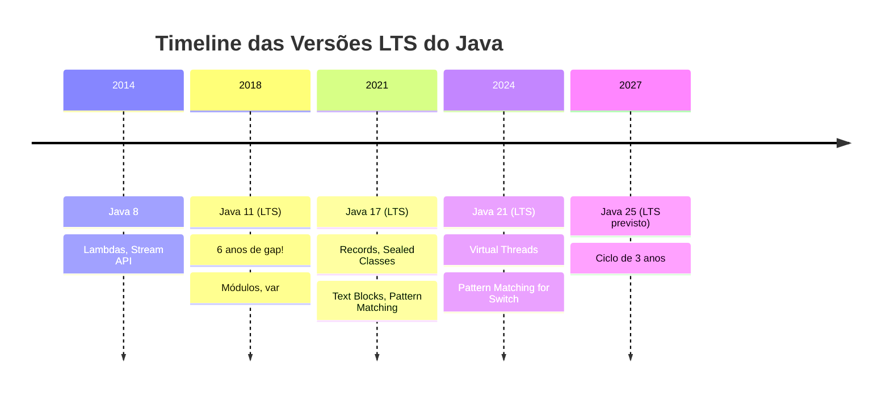

# Slide 2: Por que Java Moderno?

**Horário:** 09:15 - 09:20

---

## Evolução do Java

---

## Por que atualizar?

✅ Menos código boilerplate (Records, Pattern Matching)  
✅ Melhor performance (GC improvements)  
✅ Recursos de produtividade (Text Blocks, Switch Expressions)  
✅ Segurança e suporte  
✅ Mercado de trabalho exige

---

## 🎯 Pergunta para a turma

Quem já trabalhou com Java 8? E com Java 17+?
