# Slide 2: Por que Java Moderno?

**Horário:** 09:15 - 09:20

---

## Evolução do Java

```mermaid
timeline
    title Timeline das Versões LTS do Java
    2014 : Java 8
         : Lambdas, Stream API
    2018 : Java 11 (LTS)
         : 6 anos de gap!
         : Módulos, var
    2021 : Java 17 (LTS)
         : Records, Sealed Classes
         : Text Blocks, Pattern Matching
    2024 : Java 21 (LTS)
         : Virtual Threads
         : Pattern Matching for Switch
    2027 : Java 25 (LTS previsto)
         : Ciclo de 3 anos
```

---

## Por que atualizar?

✅ Menos código boilerplate (Records, Pattern Matching)  
✅ Melhor performance (GC improvements)  
✅ Recursos de produtividade (Text Blocks, Switch Expressions)  
✅ Segurança e suporte  
✅ Mercado de trabalho exige

---

## 🎯 Pergunta para a turma

Quem já trabalhou com Java 8? E com Java 17+?
