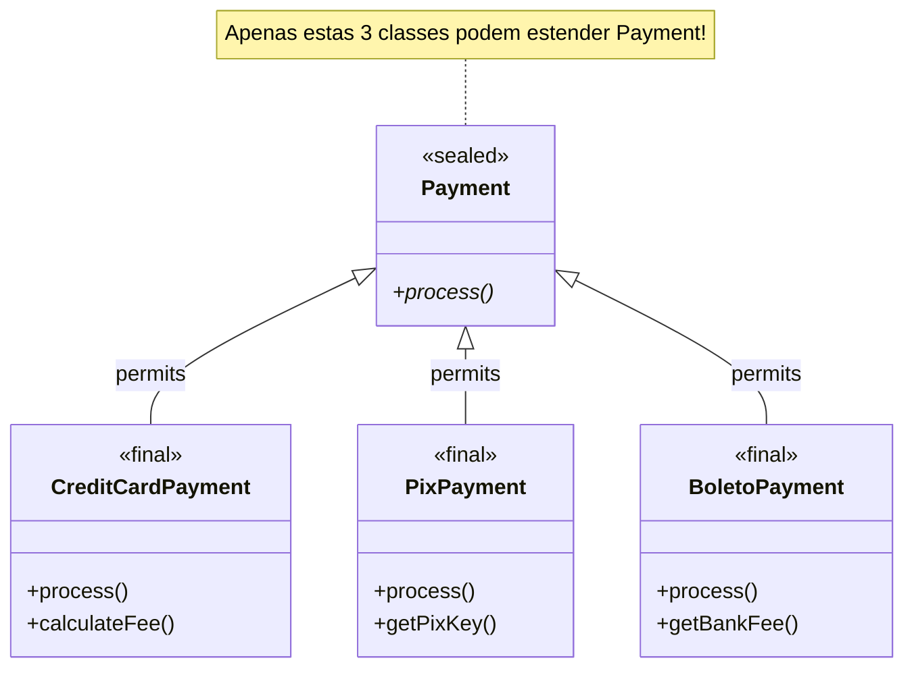

# Slide 4: Sealed Classes

**Horário:** 09:50 - 10:10

---

## O Problema

```java
// ❌ Hierarquia aberta - qualquer um pode estender!
public abstract class Payment {
    abstract void process();
}

// Em outro arquivo, alguém pode fazer:
public class BitcoinPayment extends Payment { ... } // 😱
```

---

## ✅ Solução: Sealed Classes

### Hierarquia Controlada



### Código

```java
// Controle total sobre a hierarquia
public sealed class Payment 
    permits CreditCardPayment, PixPayment, BoletoPayment {
    
    abstract void process();
}

public final class CreditCardPayment extends Payment {
    @Override
    void process() {
        System.out.println("Processing credit card...");
    }
}

public final class PixPayment extends Payment {
    @Override
    void process() {
        System.out.println("Processing PIX...");
    }
}

public final class BoletoPayment extends Payment {
    @Override
    void process() {
        System.out.println("Processing boleto...");
    }
}
```

---

## 🎬 DEMO: Pattern Matching com Sealed Classes

```java
public class PaymentProcessor {
    
    public static String getProcessingFee(Payment payment) {
        // ✨ Pattern matching for instanceof (Java 16+)
        if (payment instanceof CreditCardPayment cc) {
            return "Fee: " + cc.calculateFee();
        } else if (payment instanceof PixPayment pix) {
            return "Fee: 0 (PIX is free!)";
        } else if (payment instanceof BoletoPayment boleto) {
            return "Fee: " + boleto.getBankFee();
        }
        
        throw new IllegalArgumentException("Unknown payment type");
    }
    
    // ✨ Pattern matching for switch (Java 21+)
    public static String getProcessingFeeModern(Payment payment) {
        return switch (payment) {
            case CreditCardPayment cc -> "Fee: " + cc.calculateFee();
            case PixPayment pix -> "Fee: 0 (PIX is free!)";
            case BoletoPayment boleto -> "Fee: " + boleto.getBankFee();
            // Não precisa default! Compiler sabe que cobriu todos os casos
        };
    }
}
```

---

## 💡 Casos de uso

- Modelagem de domínio com tipos fixos
- State machines
- Command patterns
- Payment methods, Order statuses, etc.
