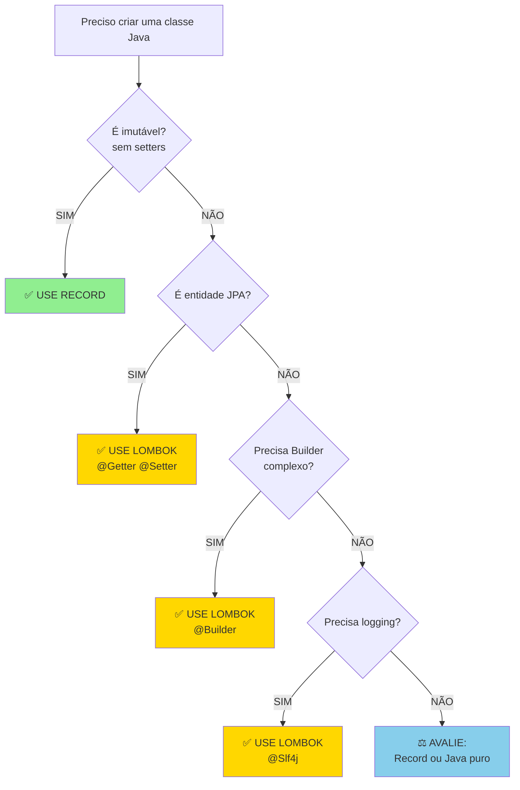

# Slide 8: Lombok vs Records - O Grande Debate

**Horário:** 11:30 - 12:00

---

## ⚠️ DISCLAIMER IMPORTANTE

```
╔═══════════════════════════════════════════════════════════╗
║  Com Java 17+, Records resolvem 80% dos casos de uso     ║
║  que antes exigiam Lombok!                                ║
║                                                           ║
║  Recomendação 2026: PREFIRA RECORDS                       ║
╚═══════════════════════════════════════════════════════════╝
```

---

## Comparação Visual

### CENÁRIO 1: DTO Simples

```java
// 🅰️ LOMBOK
@Data
@AllArgsConstructor
@NoArgsConstructor
public class ProductDTO {
    private Long id;
    private String name;
    private BigDecimal price;
}

// 🅱️ RECORD ✅ VENCEDOR!
public record ProductDTO(Long id, String name, BigDecimal price) {}
```

---

### CENÁRIO 2: Entidade JPA

```java
// 🅰️ LOMBOK ✅ VENCEDOR!
@Entity
@Table(name = "products")
@Getter
@Setter
@NoArgsConstructor
@AllArgsConstructor
public class ProductEntity {
    @Id
    @GeneratedValue(strategy = GenerationType.IDENTITY)
    private Long id;
    
    private String name;
    private BigDecimal price;
    
    @ManyToOne(fetch = FetchType.LAZY)
    @JoinColumn(name = "category_id")
    private Category category;
}

// 🅱️ RECORD ❌ NÃO FUNCIONA!
// Records são imutáveis, JPA precisa de setters
```

---

### CENÁRIO 3: Builder Pattern

```java
// 🅰️ LOMBOK ✅ VENCEDOR!
@Builder
@Data
public class CreateOrderRequest {
    private Long customerId;
    private List<OrderItem> items;
    private Address shippingAddress;
    private PaymentMethod paymentMethod;
}

// Uso:
CreateOrderRequest request = CreateOrderRequest.builder()
    .customerId(123L)
    .items(items)
    .shippingAddress(address)
    .paymentMethod(PaymentMethod.CREDIT_CARD)
    .build();
```

---

### CENÁRIO 4: Logging

```java
// 🅰️ LOMBOK ✅ VENCEDOR!
@Slf4j
@Service
public class ProductService {
    public void doSomething() {
        log.info("Processing...");
        log.error("Error!", exception);
    }
}

// 🅱️ RECORD/JAVA PURO - Verboso
import org.slf4j.Logger;
import org.slf4j.LoggerFactory;

@Service
public class ProductService {
    private static final Logger log = LoggerFactory.getLogger(ProductService.class);
    
    public void doSomething() {
        log.info("Processing...");
    }
}
```

---

## 📊 Tabela de Decisão

| Caso de Uso | Lombok | Record | Vencedor | Por quê? |
|-------------|:------:|:------:|:--------:|----------|
| DTO Request/Response | ⭐⭐⭐ | ⭐⭐⭐⭐⭐ | **RECORD** | Mais simples, padrão Java |
| Entidade JPA | ⭐⭐⭐⭐⭐ | ❌ | **LOMBOK** | JPA precisa mutabilidade |
| Value Object | ⭐⭐⭐ | ⭐⭐⭐⭐⭐ | **RECORD** | Imutabilidade é desejada |
| Builder Pattern | ⭐⭐⭐⭐⭐ | ⭐⭐ | **LOMBOK** | @Builder é muito conveniente |
| Logging | ⭐⭐⭐⭐⭐ | ⭐ | **LOMBOK** | @Slf4j economiza linha |
| Classes Simples | ⭐⭐⭐ | ⭐⭐⭐⭐ | **RECORD** | Menos dependências |

---

## 🎯 Guia de Decisão



---

## ⚠️ Problemas do Lombok

```java
// 1️⃣ "MÁGICA" - não é óbvio o que está sendo gerado
@Data  // O que isso gera exatamente? 🤔
public class User {
    private String password;  // Ops! toString vai expor a senha!
}

// 2️⃣ DEPENDÊNCIA DA IDE
// Colegas sem plugin Lombok instalado veem erros em todo lugar

// 3️⃣ DEBUGGING DIFÍCIL
// Breakpoints em getters/setters gerados não funcionam direito

// 4️⃣ CONFLITOS
@Data
@Entity
public class Product {  // @Data com JPA pode causar problemas
    @OneToMany
    private List<Review> reviews;  // toString infinito! 💥
}
```

---

## ✅ Recomendação Final 2026

```java
// ✅ FAÇA ISSO
// DTOs e Responses
public record CreateProductRequest(String name, BigDecimal price) {}
public record ProductResponse(Long id, String name, BigDecimal price) {}

// Entidades JPA
@Entity
@Getter @Setter
@NoArgsConstructor
public class ProductEntity { ... }

// Services com logging
@Slf4j
@Service
public class ProductService { ... }

// ❌ EVITE ISSO
@Data  // Muito genérico! Seja específico
@AllArgsConstructor  // Record faz isso melhor
@ToString  // Record faz isso melhor
@EqualsAndHashCode  // Record faz isso melhor
```
