# Slide 9: Fundamentos Web & Servlets

**Horário:** 13:00 - 13:30

---

## 🖥️ Tipos de Aplicações Java — Comparativo

Antes de falar de Web, é importante entender **onde as aplicações Web se encaixam** no ecossistema Java:

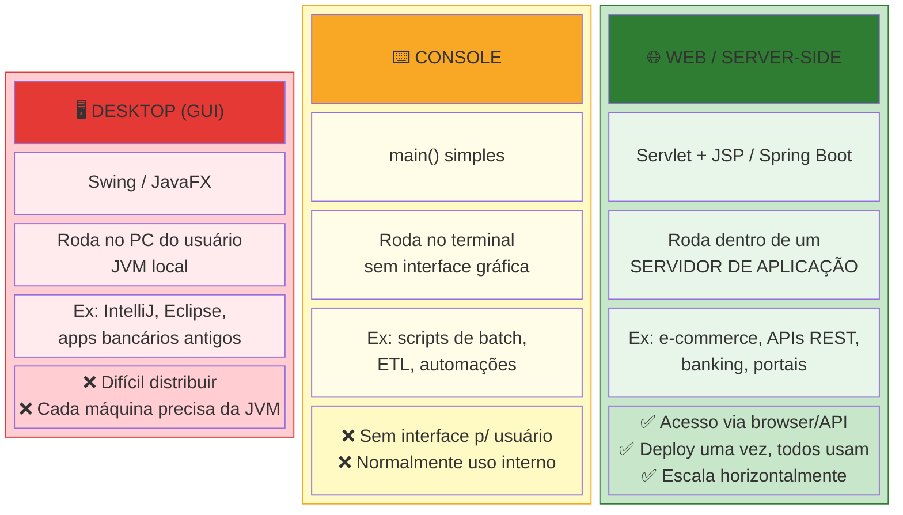

> **Hoje, 90%+ dos projetos Java no mercado são aplicações Web / APIs.**

---

## 📡 Tipos de Aplicações Web — REST, SOAP e GraphQL

Dentro do mundo Web, existem **diferentes estilos de comunicação** entre cliente e servidor:

### 🟢 REST API — O padrão do mercado

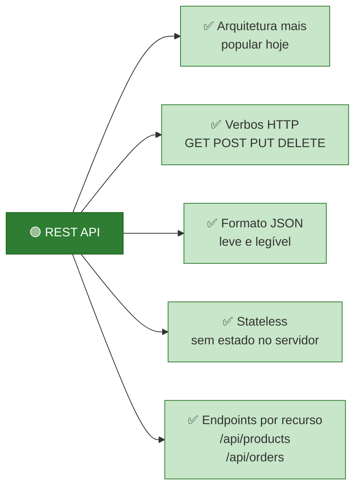

### 🔵 SOAP — O protocolo corporativo

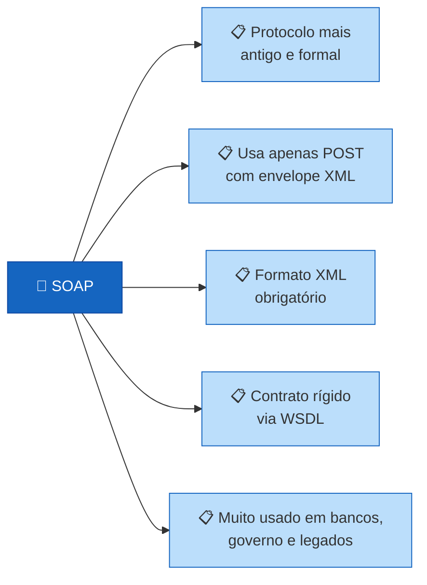

### 🟣 GraphQL — O flexível

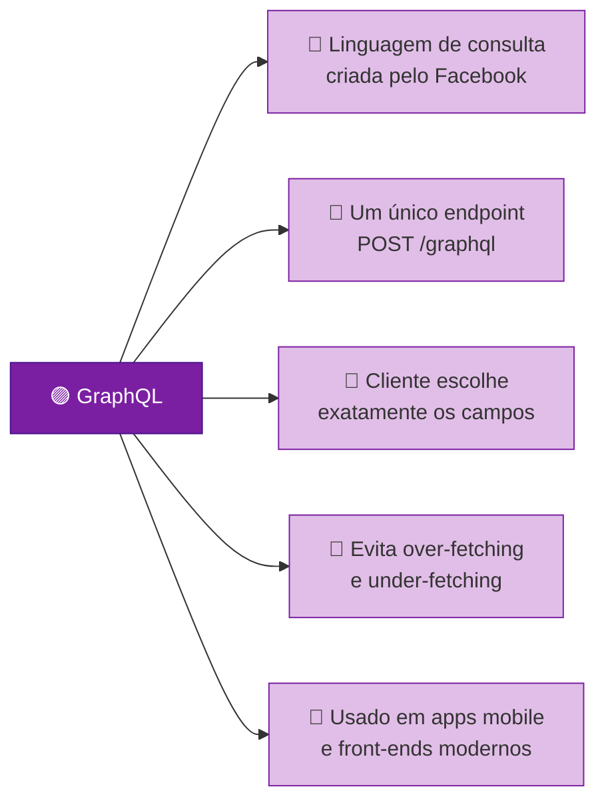

### Comparação na prática — Buscar produto por ID

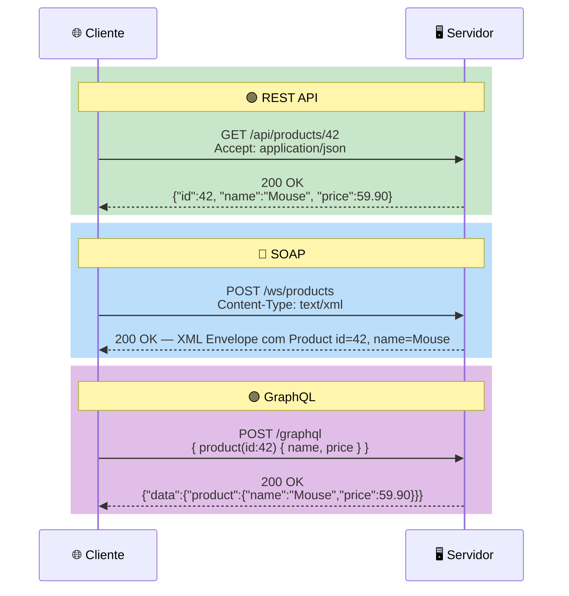

### Quando usar cada um?

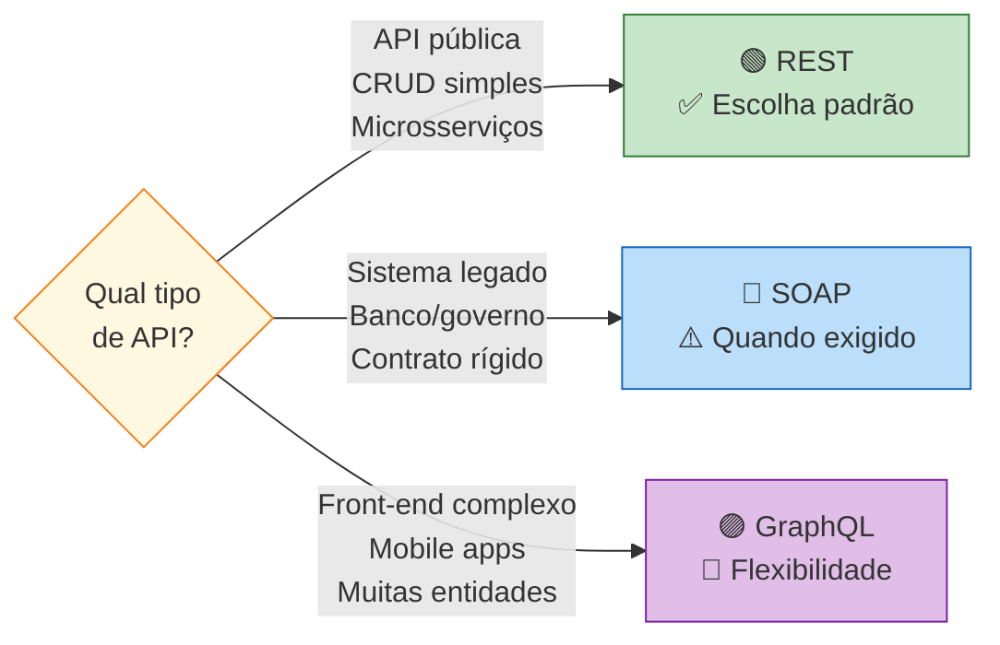

> **Neste treinamento vamos focar em REST API** — o padrão dominante no mercado Java com Spring Boot.

---

## ☕ Java EE (Jakarta EE) — O Padrão Corporativo

Java EE (renomeado para **Jakarta EE** desde 2019) é a **especificação oficial** para construir aplicações corporativas em Java.

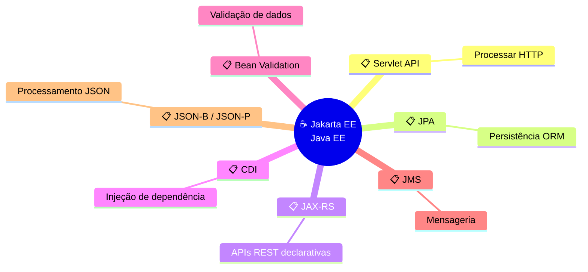

> ⚠️ **Java EE define O QUE fazer, não COMO.** Quem implementa são os **Servidores de Aplicação**.

### Servidores de Aplicação

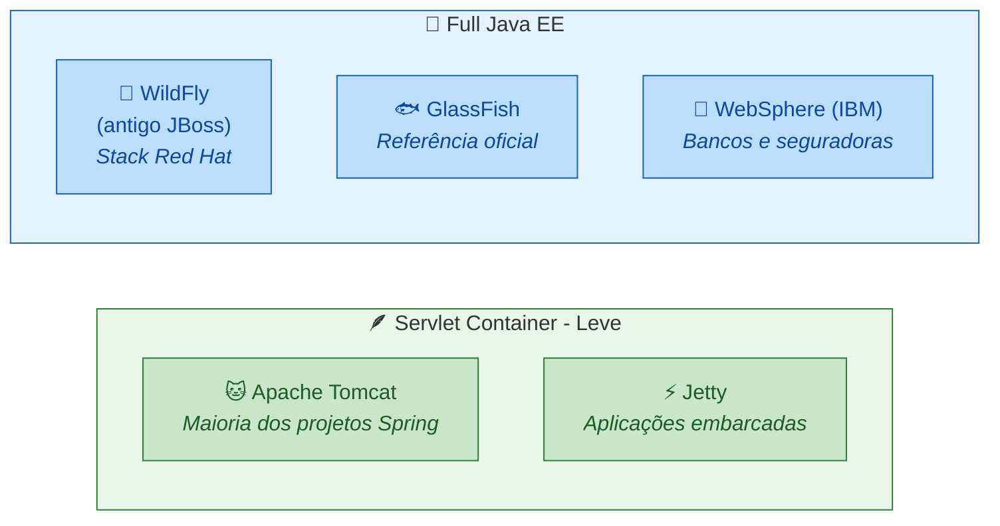

---

## 🐱 Apache Tomcat — O Mais Popular

O **Tomcat** é o servidor mais utilizado no ecossistema Java. Ele implementa a **Servlet API** e é a base de execução do Spring Boot.

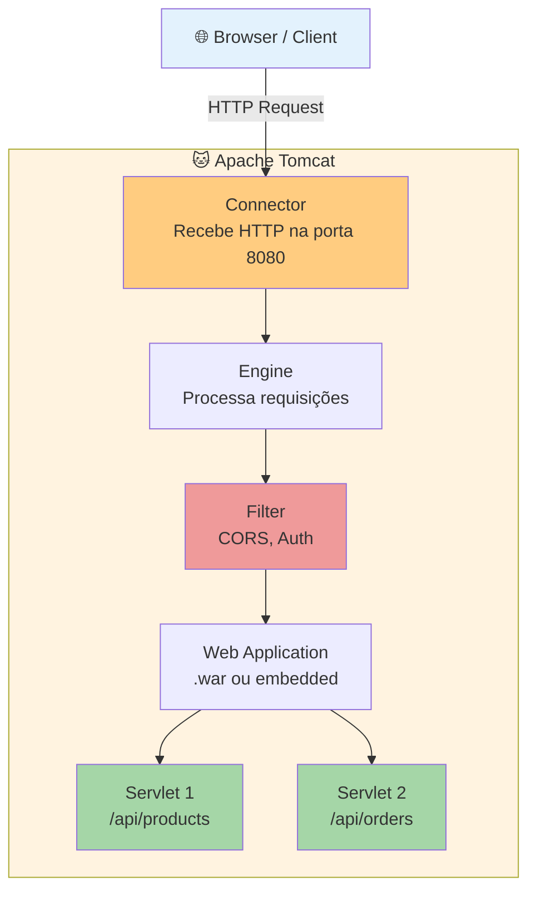

### Duas formas de usar o Tomcat

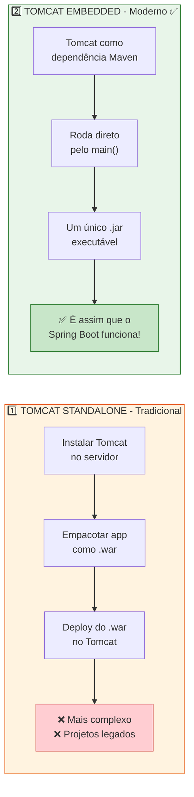

```java
// Exemplo: Tomcat Embedded em 10 linhas
public class App {
    public static void main(String[] args) throws Exception {
        Tomcat tomcat = new Tomcat();
        tomcat.setPort(8080);

        // Registrar servlet
        Context ctx = tomcat.addContext("", null);
        Tomcat.addServlet(ctx, "product", new ProductServlet());
        ctx.addServletMappingDecoded("/api/products/*", "product");

        tomcat.start();
        tomcat.getServer().await(); // Fica ouvindo requisições
    }
}
```

---

## 🔄 Evolução: Servlet → Spring Boot

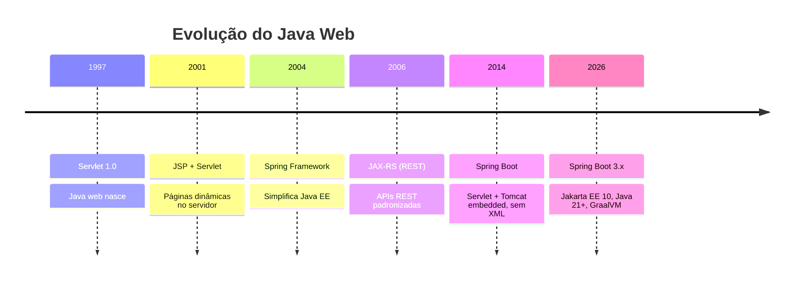

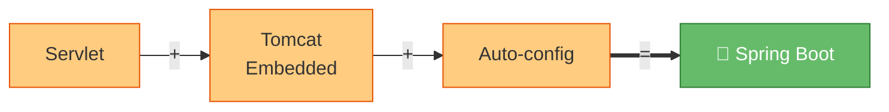

> **Tudo que o Spring faz, passa por Servlets por baixo!**

---

## 🌐 Como funciona uma aplicação Web?

### Cliente-Servidor

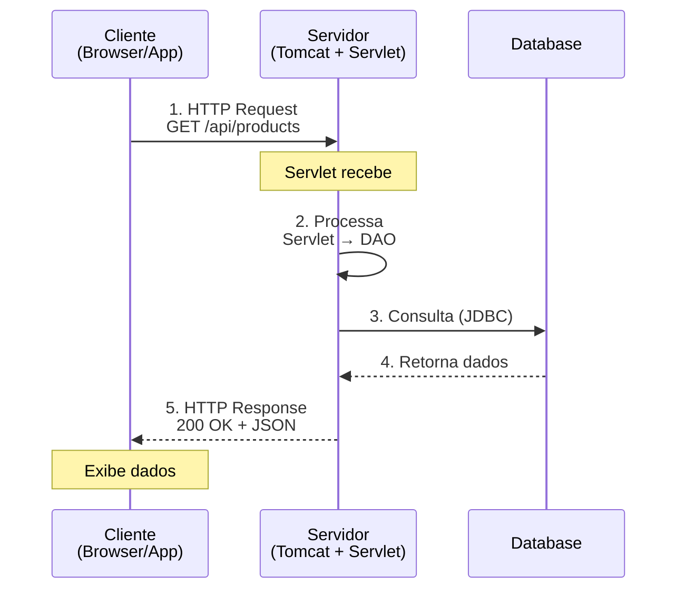

---

## 🔧 O que é um Servlet?

Classe Java que processa requisições HTTP no servidor. É a base de **toda** aplicação web Java.

### Ciclo de vida

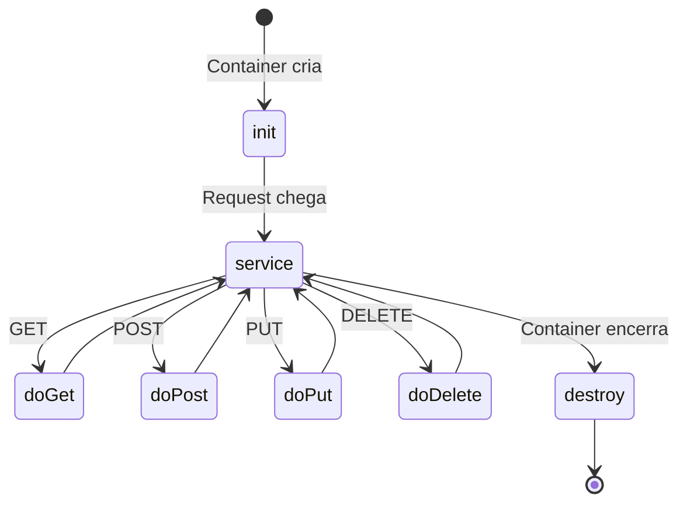

---

## 📡 REST com Servlets

### Mapeamento HTTP → Servlet

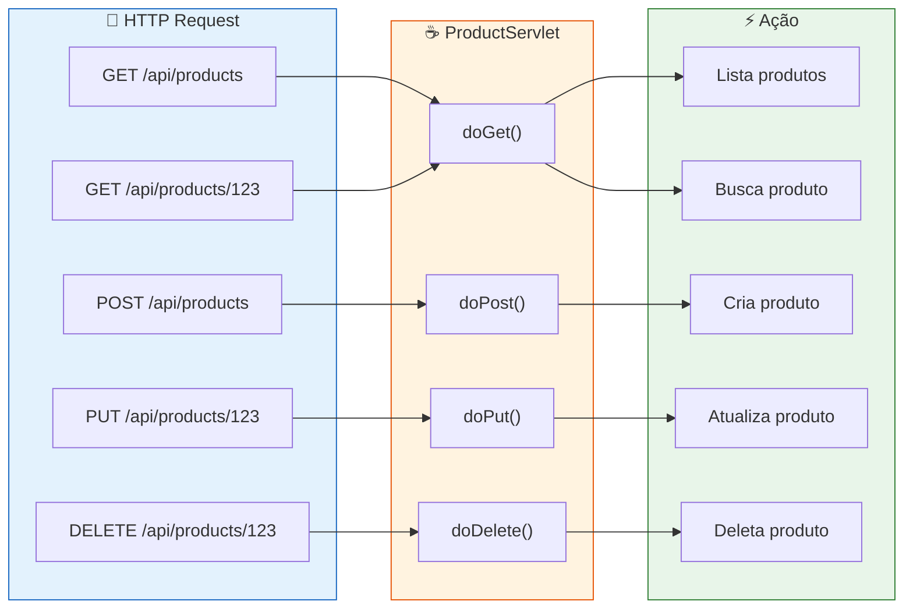

### Servlet Básico

```java
@WebServlet("/api/products/*")
public class ProductServlet extends HttpServlet {

    @Override
    protected void doGet(HttpServletRequest request,
                         HttpServletResponse response)
            throws ServletException, IOException {

        // 1. Ler path para detectar se é lista ou busca por ID
        String pathInfo = request.getPathInfo(); // null ou "/123"

        // 2. Configurar JSON na resposta
        response.setContentType("application/json");
        response.setCharacterEncoding("UTF-8");

        // 3. Processar e retornar
        if (pathInfo == null || pathInfo.equals("/")) {
            // Listar todos
            List<Product> products = productDAO.findAll();
            String json = gson.toJson(products);
            response.getWriter().write(json);
        } else {
            // Buscar por ID
            Long id = Long.parseLong(pathInfo.substring(1));
            Product product = productDAO.findById(id);
            if (product != null) {
                response.getWriter().write(gson.toJson(product));
            } else {
                response.setStatus(HttpServletResponse.SC_NOT_FOUND);
                response.getWriter().write("{\"error\":\"Product not found\"}");
            }
        }
    }
}
```

---

## 🔌 JDBC - Java Database Connectivity

### O que é?

API padrão Java para conectar com bancos de dados relacionais.

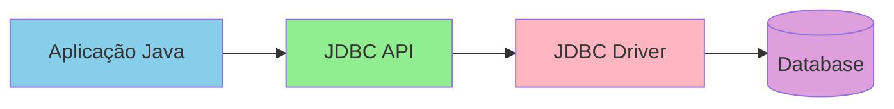

### Componentes principais

| Componente | Descrição |
|-----------|-----------|
| `DriverManager` | Gerencia drivers de banco |
| `Connection` | Conexão com o banco |
| `PreparedStatement` | SQL parametrizado (seguro!) |
| `ResultSet` | Resultado de uma query |
| `DataSource` | Pool de conexões |

---

## ⚠️ JDBC vs ORM (JPA/Hibernate)

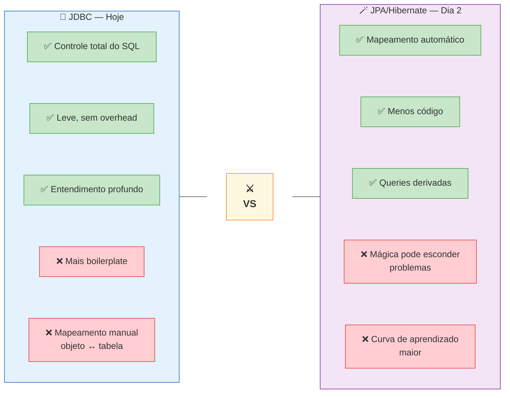

---

## 💡 Por que aprender Servlet + JDBC primeiro?

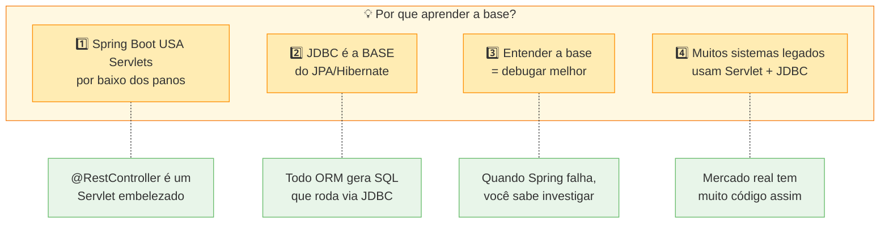

