# Slide 12: Criando o Servlet REST - Hands-on!

**Horário:** 14:15 - 15:00

---

## 🎯 Objetivo

Criar API REST completa para gerenciar produtos usando Servlet + JDBC (CRUD)

### Fluxo da Aplicação

```mermaid
flowchart TD
    A[HTTP Request] --> B[ProductServlet]
    B --> C{Método HTTP}
    C -->|GET| D[doGet - findAll / findById]
    C -->|POST| E[doPost - create]
    C -->|PUT| F[doPut - update]
    C -->|DELETE| G[doDelete - delete]
    
    D --> H[ProductDAO]
    E --> H
    F --> H
    G --> H
    
    H --> I[JDBC / PreparedStatement]
    I --> J[(H2 Database)]
    
    J -.-> I
    I -.-> H
    H -.-> B
    B -.-> K[HTTP Response + JSON]
    
    style A fill:#FFE4B5
    style B fill:#87CEEB
    style H fill:#90EE90
    style I fill:#FFB6C1
    style J fill:#DDA0DD
    style K fill:#F0E68C
```



---

## ProductServlet (completo)

```java
package com.example.products.servlet;

import com.example.products.dao.ProductDAO;
import com.example.products.dto.CreateProductRequest;
import com.example.products.dto.ProductResponse;
import com.example.products.model.Product;
import com.google.gson.Gson;
import com.google.gson.GsonBuilder;
import com.google.gson.JsonSyntaxException;
import jakarta.servlet.http.*;
import java.io.IOException;
import java.util.List;

public class ProductServlet extends HttpServlet {

    private final ProductDAO productDAO = new ProductDAO();
    private final Gson gson = new GsonBuilder()
            .setPrettyPrinting()
            .create();

    // ═══════════════════════════════════════
    //  GET /api/products       → Lista todos
    //  GET /api/products/{id}  → Busca por ID
    // ═══════════════════════════════════════
    @Override
    protected void doGet(HttpServletRequest req, HttpServletResponse resp)
            throws IOException {

        setJsonResponse(resp);
        String pathInfo = req.getPathInfo();

        if (pathInfo == null || pathInfo.equals("/")) {
            // Listar todos
            List<ProductResponse> products = productDAO.findAll()
                    .stream()
                    .map(ProductResponse::from)
                    .toList();
            resp.setStatus(200);
            resp.getWriter().write(gson.toJson(products));
        } else {
            // Buscar por ID
            Long id = extractId(pathInfo);
            productDAO.findById(id).ifPresentOrElse(
                product -> {
                    resp.setStatus(200);
                    writeJson(resp, ProductResponse.from(product));
                },
                () -> {
                    resp.setStatus(404);
                    writeJson(resp, new ErrorResponse("Product not found: " + id));
                }
            );
        }
    }

    // ═══════════════════════════════════════
    //  POST /api/products  → Criar
    // ═══════════════════════════════════════
    @Override
    protected void doPost(HttpServletRequest req, HttpServletResponse resp)
            throws IOException {

        setJsonResponse(resp);
        try {
            String body = new String(req.getInputStream().readAllBytes());
            CreateProductRequest request = gson.fromJson(body, CreateProductRequest.class);

            Product product = new Product(
                    request.name(),
                    request.description(),
                    request.price(),
                    request.category()
            );

            Product saved = productDAO.save(product);
            resp.setStatus(201);
            writeJson(resp, ProductResponse.from(saved));

        } catch (IllegalArgumentException e) {
            resp.setStatus(400);
            writeJson(resp, new ErrorResponse(e.getMessage()));
        } catch (JsonSyntaxException e) {
            resp.setStatus(400);
            writeJson(resp, new ErrorResponse("Invalid JSON format"));
        }
    }

    // ═══════════════════════════════════════
    //  PUT /api/products/{id}  → Atualizar
    // ═══════════════════════════════════════
    @Override
    protected void doPut(HttpServletRequest req, HttpServletResponse resp)
            throws IOException {

        setJsonResponse(resp);
        Long id = extractId(req.getPathInfo());

        try {
            String body = new String(req.getInputStream().readAllBytes());
            CreateProductRequest request = gson.fromJson(body, CreateProductRequest.class);

            Product product = new Product(
                    request.name(),
                    request.description(),
                    request.price(),
                    request.category()
            );

            productDAO.update(id, product).ifPresentOrElse(
                updated -> {
                    resp.setStatus(200);
                    writeJson(resp, ProductResponse.from(updated));
                },
                () -> {
                    resp.setStatus(404);
                    writeJson(resp, new ErrorResponse("Product not found: " + id));
                }
            );
        } catch (IllegalArgumentException e) {
            resp.setStatus(400);
            writeJson(resp, new ErrorResponse(e.getMessage()));
        }
    }

    // ═══════════════════════════════════════
    //  DELETE /api/products/{id}  → Deletar
    // ═══════════════════════════════════════
    @Override
    protected void doDelete(HttpServletRequest req, HttpServletResponse resp)
            throws IOException {

        setJsonResponse(resp);
        Long id = extractId(req.getPathInfo());

        if (productDAO.deleteById(id)) {
            resp.setStatus(204); // No Content
        } else {
            resp.setStatus(404);
            writeJson(resp, new ErrorResponse("Product not found: " + id));
        }
    }

    // ═══════════════════════════════════════
    //  HELPERS
    // ═══════════════════════════════════════
    private void setJsonResponse(HttpServletResponse resp) {
        resp.setContentType("application/json");
        resp.setCharacterEncoding("UTF-8");
    }

    private Long extractId(String pathInfo) {
        try {
            return Long.parseLong(pathInfo.substring(1));
        } catch (Exception e) {
            throw new IllegalArgumentException("Invalid ID in path: " + pathInfo);
        }
    }

    private void writeJson(HttpServletResponse resp, Object obj) {
        try {
            resp.getWriter().write(gson.toJson(obj));
        } catch (IOException e) {
            throw new RuntimeException(e);
        }
    }

    // DTO para erros
    record ErrorResponse(String error) {}
}
```

---

## 🔎 Comparação: Servlet vs Spring

| Aspecto | Servlet Puro | Spring Boot |
|---------|:------------|:------------|
| Routing | Manual (`pathInfo`) | `@GetMapping("/{id}")` |
| JSON | Gson manual | Jackson automático |
| Validação | Manual no construtor | `@Valid` + annotations |
| Status HTTP | `resp.setStatus(201)` | `ResponseEntity.status(CREATED)` |
| Injeção | `new ProductDAO()` | `@Autowired` / construtor |
| Config | Código Java | `application.yml` |
| Boilerplate | Muito | Pouco |

**Spring Boot abstrai tudo isso** — mas agora você sabe o que acontece por baixo! 🧠

