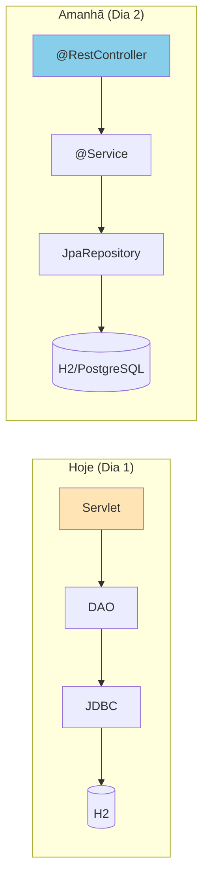

# Slide 14: Review e Q&A

**Horário:** 15:30 - 16:00

---

## ✅ O que aprendemos hoje

### Java Moderno (17/21)
- ✓ Records (DTOs imutáveis)
- ✓ Sealed Classes (hierarquias controladas)
- ✓ Text Blocks (strings multilinha)
- ✓ Pattern Matching (instanceof e switch)
- ✓ Stream API (programação funcional)
- ✓ Optional (lidar com null)

### Lombok vs Records
- ✓ Records são preferíveis para DTOs
- ✓ Lombok ainda útil para entidades JPA e logging
- ✓ Guia de decisão: quando usar cada um

### Fundamentos Web
- ✓ HTTP (Request/Response, métodos, status codes)
- ✓ Servlets (ciclo de vida, doGet, doPost, doPut, doDelete)
- ✓ REST com Servlets
- ✓ JSON com Gson

### REST e RESTful (Conteúdo Complementar)
- ✓ REST vs RESTful — os 6 princípios
- ✓ Richardson Maturity Model (Níveis 0-3)
- ✓ HATEOAS
- ✓ Boas práticas: versionamento, paginação, status codes

### Swagger / OpenAPI (Conteúdo Complementar)
- ✓ OpenAPI Specification vs Swagger (ferramentas)
- ✓ Anatomia de um arquivo openapi.yaml
- ✓ Swagger UI — documentação interativa
- ✓ SpringDoc no Spring Boot

### API First vs Code First (Conteúdo Complementar)
- ✓ Code First: código gera o contrato
- ✓ API First: contrato gera o código
- ✓ OpenAPI Generator (Maven Plugin)
- ✓ Trabalho paralelo entre times

### JDBC - Acesso a Dados
- ✓ Connection, PreparedStatement, ResultSet
- ✓ CRUD completo com SQL puro
- ✓ Padrão DAO (Data Access Object)
- ✓ try-with-resources para gerenciar conexões

### Primeira API REST (Servlet + JDBC)
- ✓ Tomcat embedded
- ✓ Servlet para endpoints REST
- ✓ DAO para acesso a dados
- ✓ DTOs com Records
- ✓ Validação manual

---

## 🔎 Servlet + JDBC vs Spring Boot



| O que você fez hoje | O que Spring Boot faz por você |
|---------------------|-------------------------------|
| `new Tomcat()` | Auto-configura servidor |
| `req.getPathInfo()` | `@GetMapping("/{id}")` |
| `gson.toJson(obj)` | Jackson automático |
| `PreparedStatement` | JPA/Hibernate |
| `mapRow(ResultSet)` | Mapeamento automático |
| `new ProductDAO()` | Injeção de dependências |
| Tratamento manual de erro | `@ControllerAdvice` |

---

## 🤔 Perguntas Comuns

**Q: Nunca mais vou usar Servlet/JDBC?**  
A: Na maioria dos projetos, Spring Boot resolve. Mas entender a base ajuda a debugar problemas e trabalhar com sistemas legados.

**Q: Quando usar JDBC direto?**  
A: Queries muito complexas, performance crítica, procedures, ou quando JPA adiciona overhead desnecessário.

**Q: Como funciona a validação no Spring Boot?**  
A: Usa Bean Validation API (`@NotBlank`, `@Size`, etc) — veremos amanhã!

**Q: O ProductDAO é o mesmo que Repository?**  
A: Sim! O padrão DAO é o antecessor do Repository. Spring Data JPA cria a implementação automaticamente.

---

## 📝 Checklist de Aprendizado

```
[ ] Sei criar Records com validação no construtor
[ ] Entendo o ciclo de vida de um Servlet
[ ] Sei montar uma API REST com Servlet
[ ] Consigo fazer CRUD com JDBC (PreparedStatement)
[ ] Entendo o padrão DAO
[ ] Sei usar try-with-resources com conexões
[ ] Consigo testar API com Postman/cURL
[ ] Entendo como Tomcat embedded funciona
[ ] Sei a diferença entre REST e RESTful
[ ] Conheço o Richardson Maturity Model
[ ] Entendo o que é OpenAPI/Swagger
[ ] Sei a diferença entre API First e Code First
```

---

## 🏠 Tarefa de Casa

### 1. Adicionar busca por nome (LIKE)
```java
// No DAO:
String sql = "SELECT * FROM products WHERE LOWER(name) LIKE ?";
ps.setString(1, "%" + name.toLowerCase() + "%");
```

### 2. Adicionar contador de produtos
```
GET /api/products/count → {"count": 5}
```

### 3. Preparação para Dia 2
- Estudar os conceitos de IoC (Inversão de Controle) e DI (Injeção de Dependência)
- Instalar PostgreSQL ou ter Docker pronto
- Acessar https://start.spring.io/ e explorar

---

## 📚 Leitura Recomendada

- [ ] [Jakarta Servlet Specification](https://jakarta.ee/specifications/servlet/)
- [ ] [JDBC Tutorial - Oracle](https://docs.oracle.com/javase/tutorial/jdbc/)
- [ ] [Java Records Tutorial](https://dev.java/learn/records/)
- [ ] [Effective Java - Item 16](https://www.oreilly.com/library/view/effective-java/9780134686097/)

---

## 🎉 Parabéns!

Você completou o Dia 1!

Amanhã: **Spring Boot, Spring Data JPA, APIs RESTful com framework**

