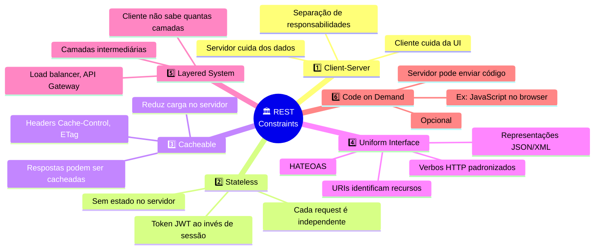
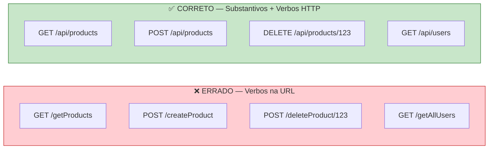
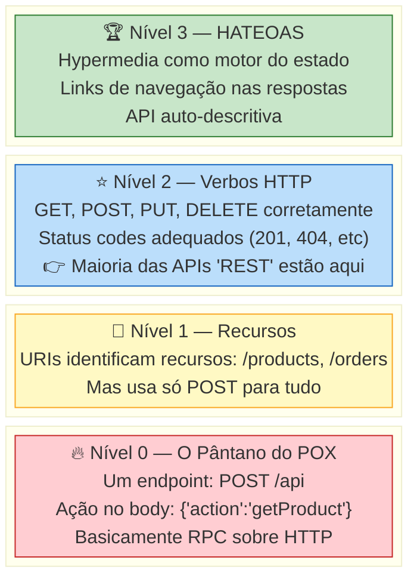
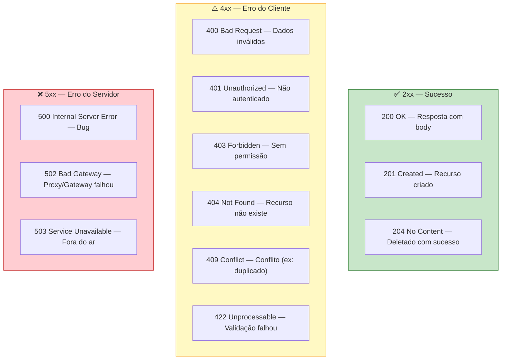
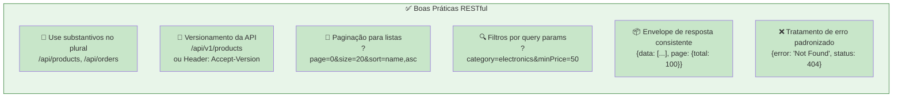

# Slide 15: REST vs RESTful — Princípios e Maturidade

**Tópico complementar**

---

## 🤔 REST é a mesma coisa que RESTful?

```
╔═══════════════════════════════════════════════════════════════╗
║  REST  = Estilo arquitetural (conceito teórico)               ║
║  RESTful = API que SEGUE os princípios REST corretamente      ║
║                                                               ║
║  Nem toda API que usa HTTP é RESTful!                         ║
╚═══════════════════════════════════════════════════════════════╝
```

---

## 📐 Os 6 Princípios REST (Roy Fielding, 2000)



---

## 🎯 Interface Uniforme — O Princípio Mais Importante

### Recursos bem nomeados (substantivos, não verbos!)



### Verbos HTTP e seus significados

| Verbo | Ação CRUD | Exemplo | Idempotente? |
|-------|-----------|---------|:------------:|
| `GET` | **Read** | `GET /api/products` | ✅ Sim |
| `POST` | **Create** | `POST /api/products` | ❌ Não |
| `PUT` | **Update** (completo) | `PUT /api/products/1` | ✅ Sim |
| `PATCH` | **Update** (parcial) | `PATCH /api/products/1` | ✅ Sim |
| `DELETE` | **Delete** | `DELETE /api/products/1` | ✅ Sim |

> **Idempotente** = chamar N vezes produz o mesmo resultado que chamar 1 vez.

---

## 📊 Richardson Maturity Model — Níveis de Maturidade REST



---

## 🔗 Nível 3: HATEOAS — O "REST de verdade"

**HATEOAS** = Hypermedia As The Engine Of Application State

```json
// GET /api/products/42
{
  "id": 42,
  "name": "Mouse Gamer",
  "price": 159.90,
  "category": "Electronics",
  "_links": {
    "self": { "href": "/api/products/42" },
    "update": { "href": "/api/products/42", "method": "PUT" },
    "delete": { "href": "/api/products/42", "method": "DELETE" },
    "category": { "href": "/api/categories/electronics" },
    "reviews": { "href": "/api/products/42/reviews" }
  }
}
```

> O cliente **não precisa conhecer as URLs** — a API **ensina** como navegar!

### Na prática com Spring Boot (veremos no Dia 2+)

```java
// Spring HATEOAS
@GetMapping("/{id}")
public EntityModel<Product> findById(@PathVariable Long id) {
    Product product = service.findById(id);
    
    return EntityModel.of(product,
        linkTo(methodOn(ProductController.class).findById(id)).withSelfRel(),
        linkTo(methodOn(ProductController.class).findAll()).withRel("products"),
        linkTo(methodOn(ReviewController.class).findByProduct(id)).withRel("reviews")
    );
}
```

---

## 📋 Status Codes HTTP — Use corretamente!



---

## ✅ Boas Práticas para APIs RESTful



### Exemplo: Paginação

```http
GET /api/products?page=0&size=10&sort=price,desc
```

```json
{
  "content": [
    { "id": 1, "name": "Laptop", "price": 5000.00 },
    { "id": 2, "name": "Mouse", "price": 150.00 }
  ],
  "page": {
    "number": 0,
    "size": 10,
    "totalElements": 42,
    "totalPages": 5
  }
}
```

---

## 💡 Dica do Instrutor

```
╔═══════════════════════════════════════════════════════════╗
║  A maioria das APIs do mercado está no Nível 2.           ║
║  HATEOAS (Nível 3) é bonito, mas pouco adotado.          ║
║                                                           ║
║  Foco: Verbos HTTP corretos + Status Codes + Recursos     ║
║  bem nomeados = Você já está à frente de 80% das APIs!    ║
╚═══════════════════════════════════════════════════════════╝
```
