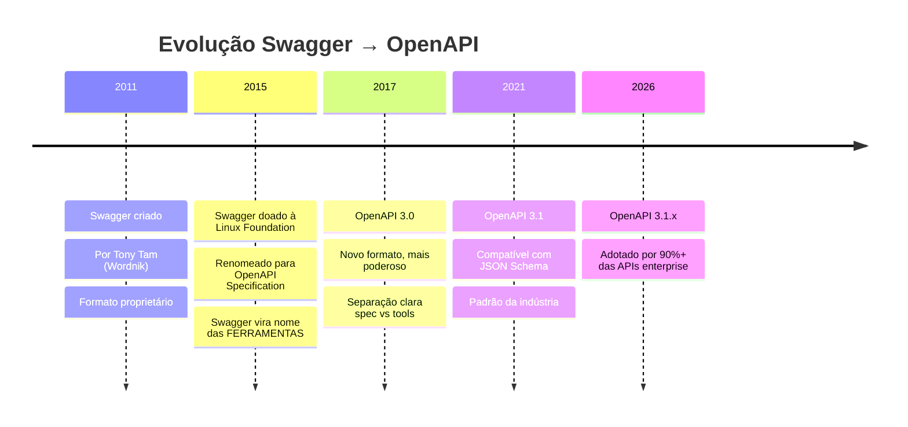
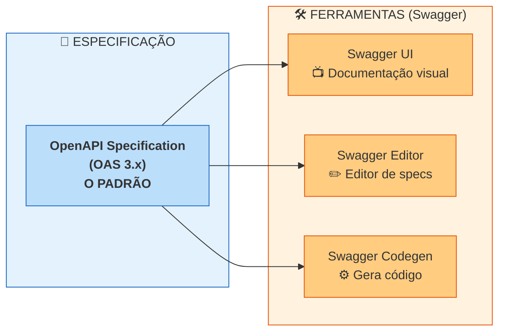
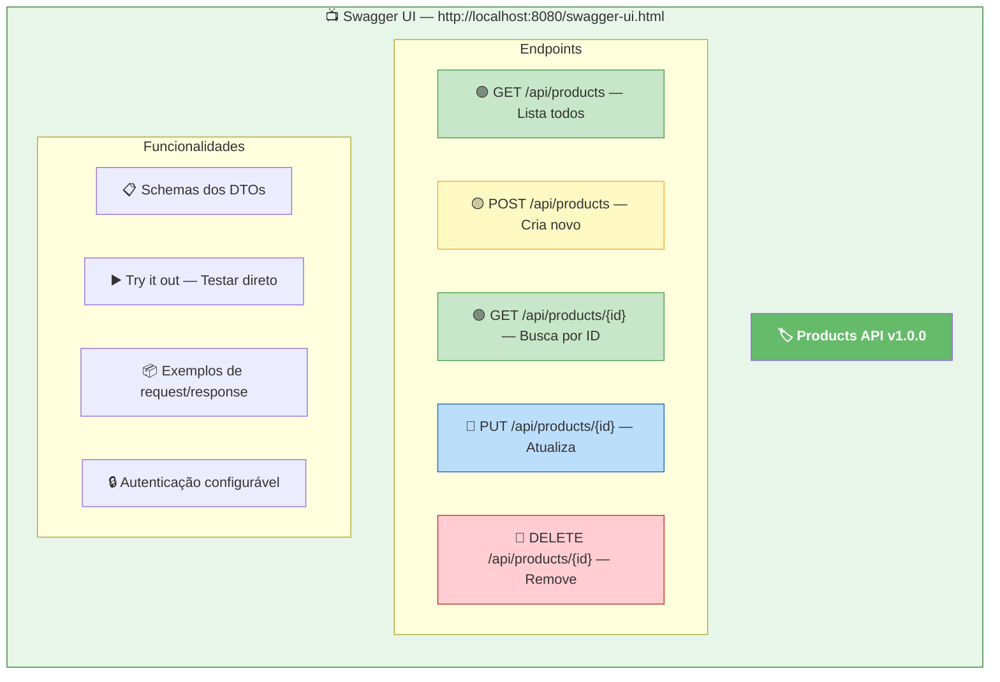
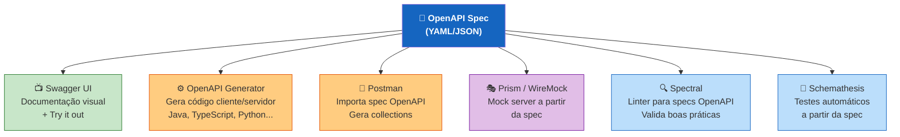

# Slide 16: Swagger / OpenAPI — Documentando APIs

**Tópico complementar**

---

## 📜 O que é OpenAPI (Swagger)?

```
╔═══════════════════════════════════════════════════════════════╗
║  OpenAPI Specification (OAS) é o padrão da indústria para     ║
║  descrever, documentar e consumir APIs REST.                  ║
║                                                               ║
║  Swagger é o ECOSSISTEMA de ferramentas que trabalha com OAS. ║
╚═══════════════════════════════════════════════════════════════╝
```

---

## 🔄 Swagger vs OpenAPI — Qual a diferença?





> **Resumo:** OpenAPI = a especificação (o contrato). Swagger = as ferramentas que usam essa especificação.

---

## 📄 Anatomia de um arquivo OpenAPI

```yaml
# openapi.yaml - Contrato da API de Produtos
openapi: 3.1.0
info:
  title: Products API
  description: API para gerenciamento de produtos
  version: 1.0.0
  contact:
    name: Equipe Backend
    email: backend@empresa.com

servers:
  - url: http://localhost:8080
    description: Ambiente local
  - url: https://api.empresa.com
    description: Produção

paths:
  /api/products:
    get:
      summary: Lista todos os produtos
      operationId: listProducts
      tags:
        - Products
      parameters:
        - name: page
          in: query
          schema:
            type: integer
            default: 0
        - name: size
          in: query
          schema:
            type: integer
            default: 20
      responses:
        '200':
          description: Lista de produtos
          content:
            application/json:
              schema:
                type: array
                items:
                  $ref: '#/components/schemas/ProductResponse'

    post:
      summary: Cria um novo produto
      operationId: createProduct
      tags:
        - Products
      requestBody:
        required: true
        content:
          application/json:
            schema:
              $ref: '#/components/schemas/CreateProductRequest'
      responses:
        '201':
          description: Produto criado com sucesso
          content:
            application/json:
              schema:
                $ref: '#/components/schemas/ProductResponse'
        '400':
          description: Dados inválidos
          content:
            application/json:
              schema:
                $ref: '#/components/schemas/ErrorResponse'

  /api/products/{id}:
    get:
      summary: Busca produto por ID
      operationId: getProductById
      tags:
        - Products
      parameters:
        - name: id
          in: path
          required: true
          schema:
            type: integer
            format: int64
      responses:
        '200':
          description: Produto encontrado
          content:
            application/json:
              schema:
                $ref: '#/components/schemas/ProductResponse'
        '404':
          description: Produto não encontrado

components:
  schemas:
    CreateProductRequest:
      type: object
      required:
        - name
        - price
      properties:
        name:
          type: string
          minLength: 1
          maxLength: 100
          example: "Mouse Gamer"
        description:
          type: string
          example: "Mouse com 16000 DPI"
        price:
          type: number
          format: double
          minimum: 0.01
          example: 159.90
        category:
          type: string
          example: "Electronics"

    ProductResponse:
      type: object
      properties:
        id:
          type: integer
          format: int64
        name:
          type: string
        description:
          type: string
        price:
          type: number
          format: double
        category:
          type: string
        createdAt:
          type: string
          format: date-time

    ErrorResponse:
      type: object
      properties:
        error:
          type: string
        status:
          type: integer
        timestamp:
          type: string
          format: date-time
```

---

## 📺 Swagger UI — Documentação Interativa



---

## 🚀 Swagger no Spring Boot — Configuração Rápida

### 1. Dependência (SpringDoc OpenAPI)

```xml
<!-- pom.xml -->
<dependency>
    <groupId>org.springdoc</groupId>
    <artifactId>springdoc-openapi-starter-webmvc-ui</artifactId>
    <version>2.3.0</version>
</dependency>
```

### 2. Configuração básica

```yaml
# application.yml
springdoc:
  api-docs:
    path: /api-docs           # JSON do OpenAPI
  swagger-ui:
    path: /swagger-ui.html    # Interface visual
    operations-sorter: method
    tags-sorter: alpha
```

### 3. Anotações no Controller

```java
@RestController
@RequestMapping("/api/products")
@Tag(name = "Products", description = "Gerenciamento de produtos")
public class ProductController {

    @Operation(
        summary = "Lista todos os produtos",
        description = "Retorna uma lista paginada de produtos"
    )
    @ApiResponses({
        @ApiResponse(responseCode = "200", description = "Lista retornada com sucesso"),
        @ApiResponse(responseCode = "500", description = "Erro interno")
    })
    @GetMapping
    public List<ProductResponse> findAll(
        @Parameter(description = "Número da página") @RequestParam(defaultValue = "0") int page,
        @Parameter(description = "Tamanho da página") @RequestParam(defaultValue = "20") int size
    ) {
        return service.findAll(page, size);
    }

    @Operation(summary = "Cria um novo produto")
    @ApiResponses({
        @ApiResponse(responseCode = "201", description = "Produto criado"),
        @ApiResponse(responseCode = "400", description = "Dados inválidos")
    })
    @PostMapping
    @ResponseStatus(HttpStatus.CREATED)
    public ProductResponse create(
        @io.swagger.v3.oas.annotations.parameters.RequestBody(
            description = "Dados do produto",
            required = true
        )
        @Valid @RequestBody CreateProductRequest request
    ) {
        return service.create(request);
    }
}
```

### 4. Anotações nos DTOs (Schemas)

```java
@Schema(description = "Request para criação de produto")
public record CreateProductRequest(
    @Schema(description = "Nome do produto", example = "Mouse Gamer", 
            minLength = 1, maxLength = 100)
    @NotBlank String name,
    
    @Schema(description = "Descrição do produto", example = "Mouse com 16000 DPI")
    String description,
    
    @Schema(description = "Preço do produto", example = "159.90", minimum = "0.01")
    @Positive BigDecimal price,
    
    @Schema(description = "Categoria", example = "Electronics")
    String category
) {}
```

---

## 🛠️ Ecossistema de Ferramentas OpenAPI



---

## 💡 Dica do Instrutor

```
╔═══════════════════════════════════════════════════════════╗
║  No dia 2, ao criar APIs com Spring Boot, usaremos         ║
║  SpringDoc para gerar o Swagger UI automaticamente.        ║
║                                                            ║
║  Acesse: http://localhost:8080/swagger-ui.html             ║
║  JSON:   http://localhost:8080/api-docs                    ║
╚═══════════════════════════════════════════════════════════╝
```
