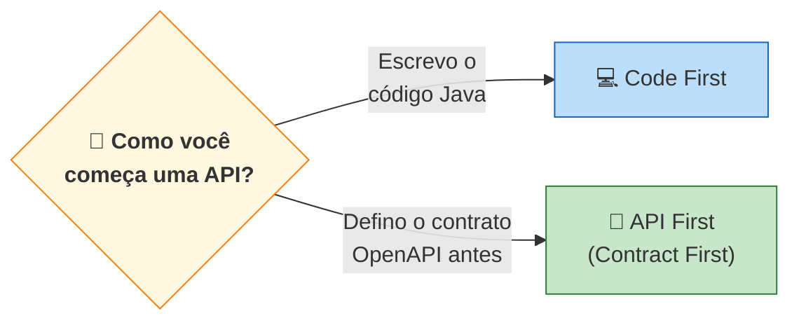
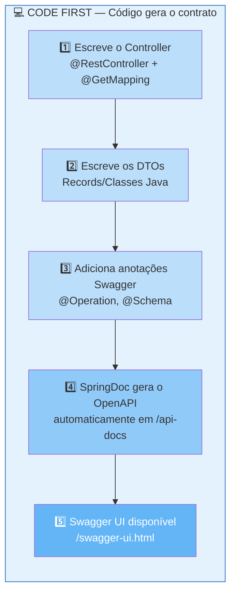
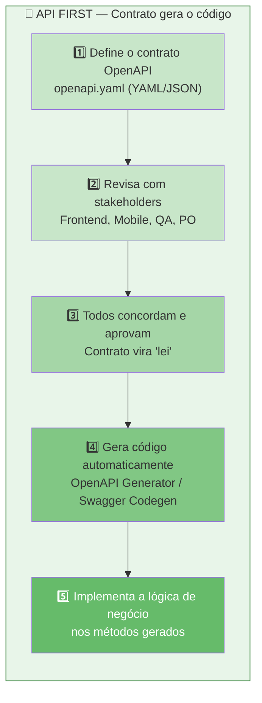
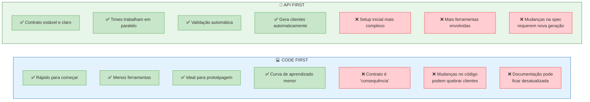
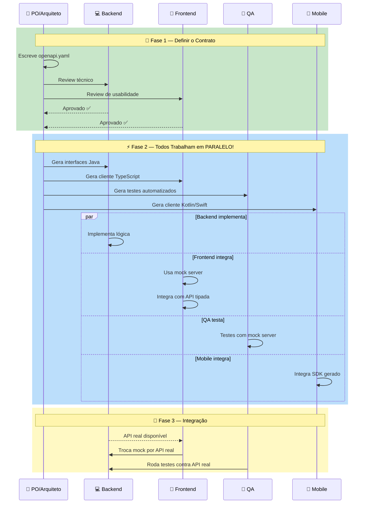
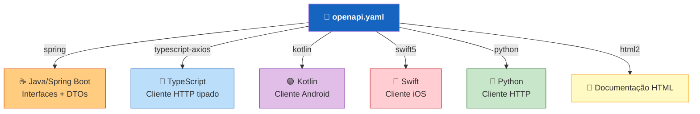
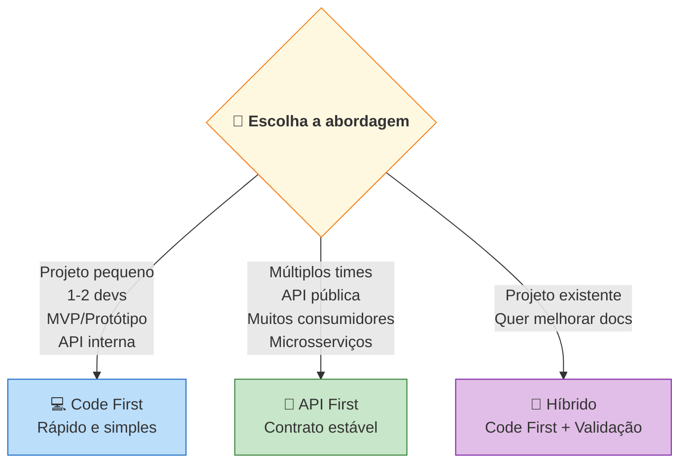
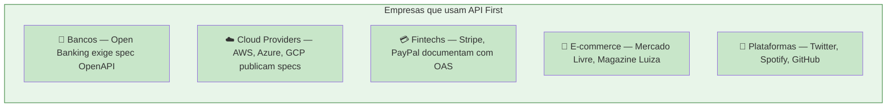

# Slide 17: API First (Contract First) vs Code First

**Tópico complementar**

---

## 🤔 O que vem primeiro: o código ou o contrato?



---

## 💻 Abordagem Code First



### Exemplo: Code First com Spring Boot

```java
// 1. Escreve o controller
@RestController
@RequestMapping("/api/products")
@Tag(name = "Products")
public class ProductController {

    @Operation(summary = "Lista produtos")
    @GetMapping
    public List<ProductResponse> findAll() {
        return service.findAll();
    }

    @Operation(summary = "Cria produto")
    @PostMapping
    @ResponseStatus(HttpStatus.CREATED)
    public ProductResponse create(@Valid @RequestBody CreateProductRequest request) {
        return service.create(request);
    }
}

// 2. SpringDoc gera o openapi.json AUTOMATICAMENTE
// 3. Swagger UI fica disponível em /swagger-ui.html
```

```
📦 Fluxo: Java Code → (SpringDoc) → OpenAPI Spec → Swagger UI
```

---

## 📝 Abordagem API First (Contract First)



### Exemplo: API First com OpenAPI Generator

```yaml
# 1. Escreve o contrato openapi.yaml PRIMEIRO
openapi: 3.1.0
info:
  title: Products API
  version: 1.0.0
paths:
  /api/products:
    get:
      operationId: listProducts
      responses:
        '200':
          description: OK
          content:
            application/json:
              schema:
                type: array
                items:
                  $ref: '#/components/schemas/ProductResponse'
    post:
      operationId: createProduct
      requestBody:
        content:
          application/json:
            schema:
              $ref: '#/components/schemas/CreateProductRequest'
      responses:
        '201':
          description: Criado
```

```xml
<!-- 2. Configura o Maven Plugin para gerar código -->
<plugin>
    <groupId>org.openapitools</groupId>
    <artifactId>openapi-generator-maven-plugin</artifactId>
    <version>7.2.0</version>
    <executions>
        <execution>
            <goals>
                <goal>generate</goal>
            </goals>
            <configuration>
                <inputSpec>${project.basedir}/src/main/resources/openapi.yaml</inputSpec>
                <generatorName>spring</generatorName>
                <apiPackage>com.example.api</apiPackage>
                <modelPackage>com.example.model</modelPackage>
                <configOptions>
                    <interfaceOnly>true</interfaceOnly>
                    <useSpringBoot3>true</useSpringBoot3>
                    <useTags>true</useTags>
                </configOptions>
            </configuration>
        </execution>
    </executions>
</plugin>
```

```java
// 3. Interface GERADA automaticamente pelo plugin
public interface ProductsApi {
    
    @GetMapping("/api/products")
    ResponseEntity<List<ProductResponse>> listProducts();
    
    @PostMapping("/api/products")
    ResponseEntity<ProductResponse> createProduct(@RequestBody CreateProductRequest request);
}

// 4. Você IMPLEMENTA a interface 
@RestController
public class ProductController implements ProductsApi {

    @Override
    public ResponseEntity<List<ProductResponse>> listProducts() {
        // Sua lógica de negócio aqui
        return ResponseEntity.ok(service.findAll());
    }

    @Override
    public ResponseEntity<ProductResponse> createProduct(CreateProductRequest request) {
        // Sua lógica de negócio aqui
        return ResponseEntity.status(201).body(service.create(request));
    }
}
```

```
📦 Fluxo: OpenAPI Spec → (Generator) → Interfaces Java → Implementação manual
```

---

## ⚔️ Comparação: API First vs Code First



---

## 🏢 API First — O Poder do Trabalho em Paralelo



> **Com API First, ninguém fica bloqueado esperando o backend terminar!**

---

## 🔧 Geração de Código — O que o Generator cria?



---

## 📊 Quando usar cada abordagem?



### Abordagem Híbrida (comum no mercado)

```
1. Começa com Code First (velocidade)
2. Exporta o OpenAPI gerado pelo SpringDoc
3. Adiciona validação CI/CD contra a spec
4. Trava mudanças breaking com ferramentas como oasdiff
```

---

## 🏢 Quem usa API First no mercado?



---

## 📋 Resumo Rápido

| Aspecto | Code First | API First |
|---------|:----------:|:---------:|
| **Velocidade inicial** | 🚀 Rápido | 🐢 Mais setup |
| **Estabilidade do contrato** | ⚠️ Pode mudar | ✅ Estável |
| **Trabalho paralelo** | ❌ Backend bloqueia | ✅ Todos em paralelo |
| **Documentação** | Auto-gerada do código | Definida previamente |
| **Validação** | Em runtime | Em design time |
| **Geração de clientes** | Após implementar | Antes de implementar |
| **Ideal para** | MVPs, APIs internas | APIs públicas, multi-time |

---

## 💡 Dica do Instrutor

```
╔═══════════════════════════════════════════════════════════╗
║  Neste treinamento vamos usar CODE FIRST com SpringDoc.   ║
║  É a forma mais rápida de aprender e produzir APIs.       ║
║                                                           ║
║  Mas saiba que em grandes empresas, API First é a         ║
║  abordagem preferida quando há múltiplos consumidores.    ║
║                                                           ║
║  O importante é: TODA API deve ter documentação OpenAPI!  ║
╚═══════════════════════════════════════════════════════════╝
```
