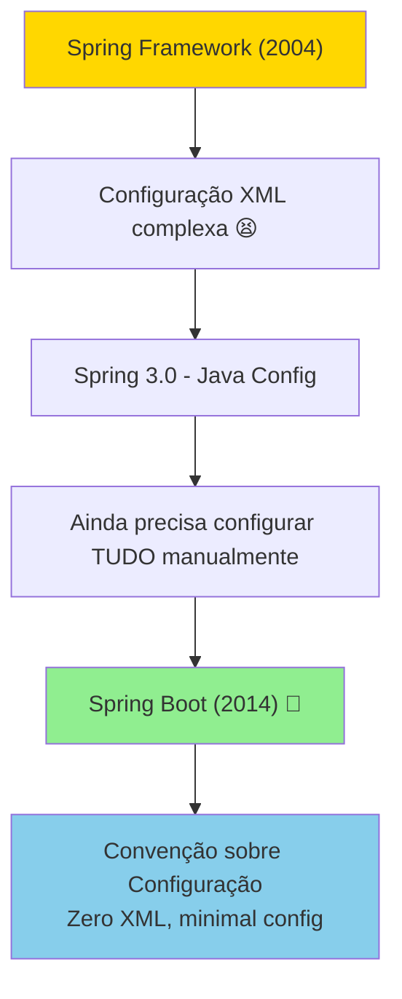
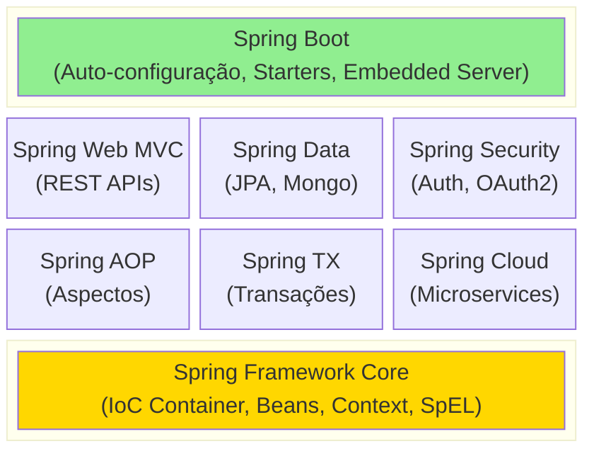

# Slide 1: O Ecossistema Spring & Fundamentos

**Horário:** 09:00 - 09:15

---

## 📝 Recapitulando o Dia 1

No Dia 1 aprendemos os **fundamentos** que o Spring Boot abstrai:

- ✓ **HTTP & Cliente-Servidor** — Request/Response, métodos HTTP, status codes
- ✓ **Servlets** — `HttpServlet`, `doGet()`, `doPost()`, ciclo de vida
- ✓ **REST, SOAP, GraphQL** — Tipos de APIs e quando usar cada uma
- ✓ **JDBC** — Connection, PreparedStatement, ResultSet
- ✓ **Padrão DAO** — Acesso a dados manual com SQL puro
- ✓ **Tomcat Embedded** — Servidor de aplicação como dependência Maven

> **Agora vamos ver como o Spring Boot simplifica tudo isso!** 🚀

---

## A Evolução do Java Web



---

## Comparação: Antes vs Depois

### SPRING FRAMEWORK (SEM BOOT) - ~50 linhas de config

```xml
<!-- web.xml -->
<servlet>
    <servlet-name>dispatcher</servlet-name>
    <servlet-class>org.springframework.web.servlet.DispatcherServlet</servlet-class>
</servlet>

<!-- applicationContext.xml -->
<beans>
    <context:component-scan base-package="com.example"/>
    <mvc:annotation-driven/>
    
    <bean id="dataSource" class="org.apache.commons.dbcp.BasicDataSource">
        <property name="driverClassName" value="com.mysql.jdbc.Driver"/>
        <property name="url" value="jdbc:mysql://localhost:3306/db"/>
        <property name="username" value="root"/>
        <property name="password" value="password"/>
    </bean>
    
    <!-- + muitas outras configurações... -->
</beans>
```

---

### SPRING BOOT - 0 linhas de XML! ✨

```java
@SpringBootApplication
public class Application {
    public static void main(String[] args) {
        SpringApplication.run(Application.class, args);
    }
}
```

```yaml
# application.yml
spring:
  datasource:
    url: jdbc:mysql://localhost:3306/db
    username: root
    password: password
  jpa:
    hibernate:
      ddl-auto: update
```

---

## 🎯 Conceitos Fundamentais

### 1. Inversão de Controle (IoC)

```java
// ❌ SEM IoC - Controle manual
public class OrderService {
    private ProductRepository repository = new ProductRepositoryImpl();
    private PaymentGateway gateway = new PaymentGatewayImpl();
    
    // Acoplamento forte! Difícil de testar!
}

// ✅ COM IoC - Spring gerencia as dependências
@Service
public class OrderService {
    private final ProductRepository repository;
    private final PaymentGateway gateway;
    
    // Spring injeta automaticamente
    public OrderService(ProductRepository repository, PaymentGateway gateway) {
        this.repository = repository;
        this.gateway = gateway;
    }
}
```

---

### 2. Injeção de Dependências (DI)

```java
// 1️⃣ CONSTRUCTOR INJECTION ✅ RECOMENDADO!
@Service
public class ProductService {
    private final ProductRepository repository;
    
    public ProductService(ProductRepository repository) {
        this.repository = repository;
    }
}

// 2️⃣ SETTER INJECTION (raramente usado)
@Service
public class ProductService {
    private ProductRepository repository;
    
    @Autowired
    public void setRepository(ProductRepository repository) {
        this.repository = repository;
    }
}

// 3️⃣ FIELD INJECTION ❌ EVITE! (dificulta testes)
@Service
public class ProductService {
    @Autowired
    private ProductRepository repository;
}
```

| Tipo | Anotação | Recomendação |
|------|----------|-------------|
| **Construtor** | Implícita (único construtor) | ✅ **Recomendado** — imutável, testável |
| **Setter** | `@Autowired` no setter | ⚠️ Dependências opcionais |
| **Field** | `@Autowired` no campo | ❌ Evitar — dificulta testes |

---

### 3. ApplicationContext e Ciclo de Vida dos Beans

```java
// O ApplicationContext é o container IoC do Spring
@SpringBootApplication
public class Application {
    public static void main(String[] args) {
        ApplicationContext ctx = SpringApplication.run(Application.class, args);
        // Todos os beans estão registrados e prontos
    }
}
```

**Escopos de Beans:**

| Escopo | Descrição | Uso Típico |
|--------|-----------|------------|
| `singleton` (padrão) | Uma única instância por container | Services, Repositories |
| `prototype` | Nova instância a cada injeção | Objetos com estado mutável |
| `request` | Uma instância por request HTTP | Dados de request |
| `session` | Uma instância por sessão HTTP | Dados de sessão |

---

### 4. Auto-configuração Mágica ✨

```java
// Apenas adicionando dependência no pom.xml:
<dependency>
    <groupId>org.springframework.boot</groupId>
    <artifactId>spring-boot-starter-data-jpa</artifactId>
</dependency>

// Spring Boot automaticamente configura:
// ✅ DataSource
// ✅ EntityManager
// ✅ TransactionManager
// ✅ JPA Repositories
// ✅ Hibernate

// Você só precisa usar!
@Repository
public interface ProductRepository extends JpaRepository<Product, Long> {}
```

---

## 🏗️ Spring Boot Starters

```xml
<!-- Starter Web: REST APIs -->
<dependency>
    <groupId>org.springframework.boot</groupId>
    <artifactId>spring-boot-starter-web</artifactId>
</dependency>
<!-- Inclui: Tomcat, Jackson, Spring MVC, validation -->

<!-- Starter Data JPA: Banco de dados -->
<dependency>
    <groupId>org.springframework.boot</groupId>
    <artifactId>spring-boot-starter-data-jpa</artifactId>
</dependency>
<!-- Inclui: Hibernate, JPA, JDBC, Transaction -->

<!-- Starter Validation -->
<dependency>
    <groupId>org.springframework.boot</groupId>
    <artifactId>spring-boot-starter-validation</artifactId>
</dependency>
<!-- Inclui: Bean Validation, Hibernate Validator -->
```

---

## 🏛️ Módulos Principais do Spring



---

## 🆚 Spring Boot vs Spring Framework

| Aspecto | Spring Framework | Spring Boot |
|---------|-----------------|-------------|
| Configuração | Manual (XML ou Java Config) | Auto-configuração |
| Servidor | Requer servidor externo (Tomcat WAR) | Servidor embutido (JAR) |
| Dependências | Gerenciamento manual de versões | Starters com versões compatíveis |
| Produtividade | Mais controle, mais trabalho | Rápido para começar |
| Monitoramento | Configuração manual | Actuator pronto |
