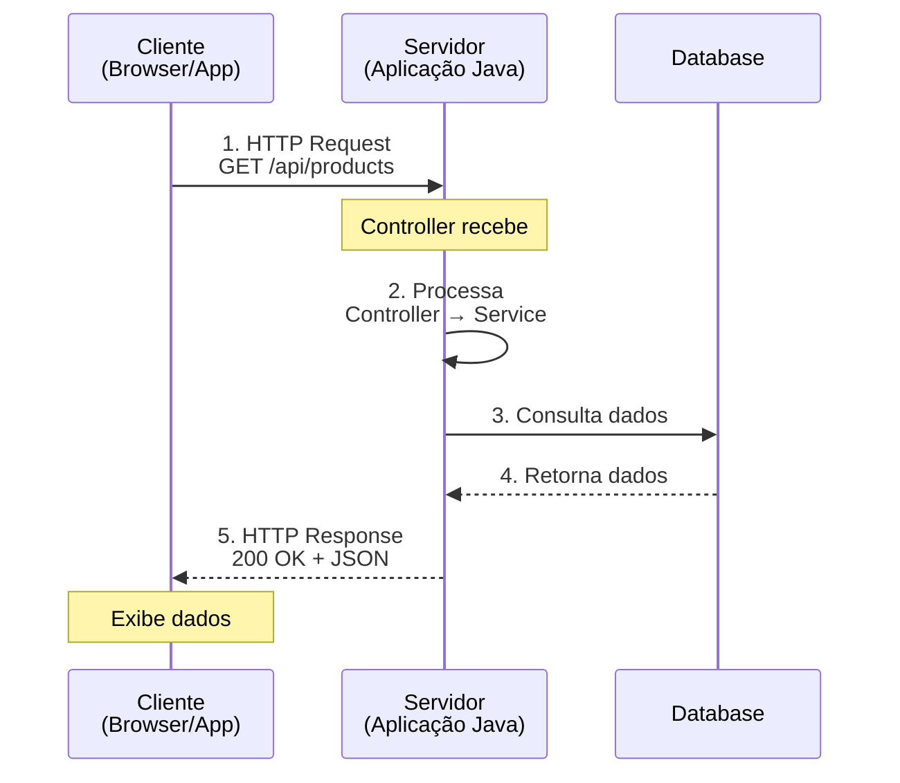

# Slide 1: Fundamentos Web & Spring Boot

**Horário:** 13:00 - 13:15

---

## 🌐 Conceitos Básicos: Como funciona uma aplicação Web?

### Cliente-Servidor



### Protocolo HTTP

```
Request:
━━━━━━━━━━━━━━━━━━━━━━━━━━━━━━━━
GET /api/products/123 HTTP/1.1
Host: localhost:8080
Accept: application/json
Authorization: Bearer token123

Response:
━━━━━━━━━━━━━━━━━━━━━━━━━━━━━━━━
HTTP/1.1 200 OK
Content-Type: application/json

{"id": 123, "name": "Laptop"}
```

---

## 🔧 A Base: Servlets (Java EE/Jakarta EE)

### O que é um Servlet?

Classe Java que processa requisições HTTP no servidor.

```java
// Servlet "na unha" (antes do Spring)
@WebServlet("/products")
public class ProductServlet extends HttpServlet {
    
    @Override
    protected void doGet(HttpServletRequest request, 
                         HttpServletResponse response) 
            throws ServletException, IOException {
        
        // 1. Ler parâmetros
        String id = request.getParameter("id");
        
        // 2. Processar (buscar no banco, etc)
        Product product = productService.findById(Long.parseLong(id));
        
        // 3. Converter para JSON manualmente
        String json = "{\"id\":" + product.getId() + 
                      ",\"name\":\"" + product.getName() + "\"}";
        
        // 4. Configurar response
        response.setContentType("application/json");
        response.setCharacterEncoding("UTF-8");
        response.getWriter().write(json);
    }
    
    @Override
    protected void doPost(HttpServletRequest request, 
                          HttpServletResponse response) 
            throws ServletException, IOException {
        
        // 1. Ler corpo da requisição
        BufferedReader reader = request.getReader();
        StringBuilder jsonBuilder = new StringBuilder();
        String line;
        while ((line = reader.readLine()) != null) {
            jsonBuilder.append(line);
        }
        
        // 2. Parsear JSON manualmente (ou usar biblioteca)
        String json = jsonBuilder.toString();
        // ... parse json, extrair campos, validar...
        
        // 3. Salvar no banco
        // 4. Retornar response
    }
}
```

**Problemas:**
- ❌ Muito código boilerplate
- ❌ Conversão JSON manual
- ❌ Gerenciamento de dependências manual
- ❌ Configuração complexa (web.xml)
- ❌ Difícil de testar

---

## 📡 Comunicação: REST vs Outras Opções

### Opção 1: REST (Representational State Transfer)

✅ **Escolha moderna e recomendada**

```
Características:
• Usa HTTP puro (GET, POST, PUT, DELETE)
• Recursos identificados por URLs
• Stateless (sem estado no servidor)
• Formato: JSON (leve e legível)
• Fácil de consumir (browser, mobile, etc)

Exemplo:
GET    /api/products          → Lista produtos
GET    /api/products/123      → Busca produto
POST   /api/products          → Cria produto
PUT    /api/products/123      → Atualiza produto
DELETE /api/products/123      → Deleta produto
```

---

### Opção 2: SOAP (Simple Object Access Protocol)

⚠️ **Legado - ainda usado em sistemas antigos**

```xml
<!-- Request SOAP (verboso!) -->
<soap:Envelope xmlns:soap="http://schemas.xmlsoap.org/soap/envelope/">
  <soap:Body>
    <getProduct xmlns="http://example.com/products">
      <productId>123</productId>
    </getProduct>
  </soap:Body>
</soap:Envelope>

<!-- Response SOAP -->
<soap:Envelope xmlns:soap="http://schemas.xmlsoap.org/soap/envelope/">
  <soap:Body>
    <getProductResponse xmlns="http://example.com/products">
      <product>
        <id>123</id>
        <name>Laptop</name>
      </product>
    </getProductResponse>
  </soap:Body>
</soap:Envelope>
```

**Características:**
- ❌ XML verboso
- ❌ Complexo (WSDL, XML Schema)
- ✅ Contratos rígidos
- ✅ Segurança robusta (WS-Security)
- 📌 Usado em: Bancos, governo, sistemas legados

---

### Opção 3: GraphQL

🆕 **Alternativa moderna (Facebook, 2015)**

```graphql
# Query (cliente define o que quer)
query {
  product(id: 123) {
    id
    name
    price
    category {
      name
    }
  }
}

# Response (exatamente o que foi pedido)
{
  "data": {
    "product": {
      "id": 123,
      "name": "Laptop",
      "price": 3500,
      "category": {
        "name": "Electronics"
      }
    }
  }
}
```

**Características:**
- ✅ Cliente pede exatamente o que precisa
- ✅ Evita over-fetching e under-fetching
- ✅ Single endpoint
- ❌ Mais complexo de implementar
- ❌ Cache mais difícil
- 📌 Usado em: Facebook, GitHub, Shopify

---

### Opção 4: gRPC

⚡ **Alta performance (Google)**

```protobuf
// Definição (.proto)
message Product {
  int64 id = 1;
  string name = 2;
  double price = 3;
}

service ProductService {
  rpc GetProduct(ProductRequest) returns (Product);
}
```

**Características:**
- ✅ Binário (Protocol Buffers) - muito rápido
- ✅ Streaming bidirecional
- ✅ Suporta múltiplas linguagens
- ❌ Não funciona direto no browser
- ❌ Menos legível (binário)
- 📌 Usado em: Microsserviços, sistemas distribuídos

---

### 📊 Comparação Rápida

| Aspecto | REST | SOAP | GraphQL | gRPC |
|---------|:----:|:----:|:-------:|:----:|
| Formato | JSON | XML | JSON | Binário |
| Performance | ⭐⭐⭐ | ⭐⭐ | ⭐⭐⭐ | ⭐⭐⭐⭐⭐ |
| Simplicidade | ⭐⭐⭐⭐⭐ | ⭐ | ⭐⭐⭐ | ⭐⭐ |
| Flexibilidade | ⭐⭐⭐ | ⭐⭐ | ⭐⭐⭐⭐⭐ | ⭐⭐⭐ |
| Browser | ✅ | ✅ | ✅ | ❌ |
| Curva aprendizado | Baixa | Alta | Média | Média |

**Recomendação 2026:**
- 🎯 **REST**: 80% dos casos (APIs públicas, CRUD, web/mobile)
- 📱 **GraphQL**: Apps complexos com muitas telas
- ⚡ **gRPC**: Comunicação entre microsserviços
- 🏛️ **SOAP**: Manutenção de sistemas legados

---

## A Evolução do Java Web

```
Spring Framework (2004)
   ↓
Configuração XML complexa 😫
   ↓
Spring 3.0 - Java Config
   ↓
Ainda precisa configurar TUDO manualmente
   ↓
Spring Boot (2014) 🎉
   ↓
"Convenção sobre Configuração"
Zero XML, minimal config
```

---

## Comparação: Antes vs Depois

### SPRING FRAMEWORK (SEM BOOT) - ~50 linhas de config

```xml
<!-- web.xml -->
<servlet>
    <servlet-name>dispatcher</servlet-name>
    <servlet-class>org.springframework.web.servlet.DispatcherServlet</servlet-class>
</servlet>

<!-- applicationContext.xml -->
<beans>
    <context:component-scan base-package="com.example"/>
    <mvc:annotation-driven/>
    
    <bean id="dataSource" class="org.apache.commons.dbcp.BasicDataSource">
        <property name="driverClassName" value="com.mysql.jdbc.Driver"/>
        <property name="url" value="jdbc:mysql://localhost:3306/db"/>
        <property name="username" value="root"/>
        <property name="password" value="password"/>
    </bean>
    
    <!-- + muitas outras configurações... -->
</beans>
```

---

### SPRING BOOT - 0 linhas de XML! ✨

```java
@SpringBootApplication
public class Application {
    public static void main(String[] args) {
        SpringApplication.run(Application.class, args);
    }
}
```

```yaml
# application.yml
spring:
  datasource:
    url: jdbc:mysql://localhost:3306/db
    username: root
    password: password
  jpa:
    hibernate:
      ddl-auto: update
```

---

## 🎯 Conceitos Fundamentais

### 1. Inversão de Controle (IoC)

```java
// ❌ SEM IoC - Controle manual
public class OrderService {
    private ProductRepository repository = new ProductRepositoryImpl();
    private PaymentGateway gateway = new PaymentGatewayImpl();
    
    // Acoplamento forte! Difícil de testar!
}

// ✅ COM IoC - Spring gerencia as dependências
@Service
public class OrderService {
    private final ProductRepository repository;
    private final PaymentGateway gateway;
    
    // Spring injeta automaticamente
    public OrderService(ProductRepository repository, PaymentGateway gateway) {
        this.repository = repository;
        this.gateway = gateway;
    }
}
```

---

### 2. Injeção de Dependências (DI)

```java
// 1️⃣ CONSTRUCTOR INJECTION ✅ RECOMENDADO!
@Service
public class ProductService {
    private final ProductRepository repository;
    
    public ProductService(ProductRepository repository) {
        this.repository = repository;
    }
}

// 2️⃣ SETTER INJECTION (raramente usado)
@Service
public class ProductService {
    private ProductRepository repository;
    
    @Autowired
    public void setRepository(ProductRepository repository) {
        this.repository = repository;
    }
}

// 3️⃣ FIELD INJECTION ❌ EVITE! (dificulta testes)
@Service
public class ProductService {
    @Autowired
    private ProductRepository repository;
}
```

---

### 3. Auto-configuração Mágica ✨

```java
// Apenas adicionando dependência no pom.xml:
<dependency>
    <groupId>org.springframework.boot</groupId>
    <artifactId>spring-boot-starter-data-jpa</artifactId>
</dependency>

// Spring Boot automaticamente configura:
// ✅ DataSource
// ✅ EntityManager
// ✅ TransactionManager
// ✅ JPA Repositories
// ✅ Hibernate

// Você só precisa usar!
@Repository
public interface ProductRepository extends JpaRepository<Product, Long> {}
```

---

## 🏗️ Spring Boot Starters

```xml
<!-- Starter Web: REST APIs -->
<dependency>
    <groupId>org.springframework.boot</groupId>
    <artifactId>spring-boot-starter-web</artifactId>
</dependency>
<!-- Inclui: Tomcat, Jackson, Spring MVC, validation -->

<!-- Starter Data JPA: Banco de dados -->
<dependency>
    <groupId>org.springframework.boot</groupId>
    <artifactId>spring-boot-starter-data-jpa</artifactId>
</dependency>
<!-- Inclui: Hibernate, JPA, JDBC, Transaction -->

<!-- Starter Validation -->
<dependency>
    <groupId>org.springframework.boot</groupId>
    <artifactId>spring-boot-starter-validation</artifactId>
</dependency>
<!-- Inclui: Bean Validation, Hibernate Validator -->
```
