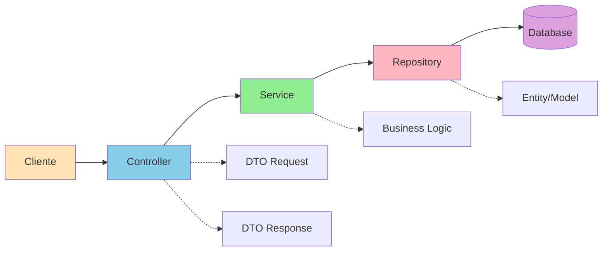

# Slide 3: Estrutura do Projeto Spring Boot

**Horário:** 13:30 - 13:45

---

## 📁 Organização Recomendada

### Estrutura de Pastas

```
src/main/java/com/example/products/
├── ProductsApiApplication.java
│
├── controller/          # REST Controllers
│   └── ProductController.java
│
├── service/            # Lógica de negócio
│   └── ProductService.java
│
├── repository/         # Acesso a dados
│   └── ProductRepository.java
│
├── model/              # Entidades JPA
│   └── Product.java
│
├── dto/                # Data Transfer Objects
│   ├── request/
│   │   └── CreateProductRequest.java
│   └── response/
│       └── ProductResponse.java
│
├── exception/          # Exceções customizadas
│   ├── ProductNotFoundException.java
│   └── GlobalExceptionHandler.java
│
└── config/             # Configurações
    └── AppConfig.java
```

### Fluxo de Requisição (Arquitetura em Camadas)



---

## Anotações Fundamentais

### COMPONENTES SPRING
```java
@Component          // Componente genérico
@Service            // Lógica de negócio
@Repository         // Acesso a dados
@Controller         // MVC Controller (retorna views)
@RestController     // REST Controller (retorna JSON)
@Configuration      // Classe de configuração
```

---

### REST ENDPOINTS
```java
@RequestMapping     // Base path
@GetMapping         // HTTP GET
@PostMapping        // HTTP POST
@PutMapping         // HTTP PUT
@DeleteMapping      // HTTP DELETE
@PatchMapping       // HTTP PATCH
```

---

### REQUEST HANDLING
```java
@PathVariable       // Captura variável da URL: /products/{id}
@RequestParam       // Query parameter: /products?name=laptop
@RequestBody        // Corpo da requisição (JSON)
@RequestHeader      // Header HTTP
```

---

### VALIDAÇÃO
```java
@Valid              // Valida objeto
@NotNull            // Campo não pode ser null
@NotBlank           // String não pode ser vazia/blank
@Size               // Tamanho min/max
@Min / @Max         // Valor mínimo/máximo
@Email              // Valida formato de email
@Pattern            // Regex pattern
```

---

### JPA
```java
@Entity             // Entidade JPA
@Table              // Nome da tabela
@Id                 // Primary key
@GeneratedValue     // Auto-increment
@Column             // Customiza coluna
@ManyToOne / @OneToMany / @ManyToMany  // Relacionamentos
```
