# Slide 4: Primeira API REST com Spring Boot - Hands-on!

**Horário:** 13:45 - 14:30

---

## 🎯 Objetivo

Criar API completa para gerenciar produtos (CRUD)

### Fluxo da Aplicação

```mermaid
flowchart TD
    A[HTTP Request] --> B[ProductController]
    B --> C{Método HTTP}
    C -->|GET| D[findAll / findById]
    C -->|POST| E[create]
    C -->|PUT| F[update]
    C -->|DELETE| G[delete]
    
    D --> H[ProductService]
    E --> H
    F --> H
    G --> H
    
    H --> I[ProductRepository]
    I --> J[(H2 Database)]
    
    J -.-> I
    I -.-> H
    H -.-> B
    B -.-> K[HTTP Response + JSON]
    
    style A fill:#FFE4B5
    style B fill:#87CEEB
    style H fill:#90EE90
    style I fill:#FFB6C1
    style J fill:#DDA0DD
    style K fill:#F0E68C
```



---

## Passo 1: Criar a Entidade

```java
// src/main/java/com/example/products/model/Product.java
package com.example.products.model;

import jakarta.persistence.*;
import java.math.BigDecimal;
import java.time.LocalDateTime;

@Entity
@Table(name = "products")
public class Product {
    
    @Id
    @GeneratedValue(strategy = GenerationType.IDENTITY)
    private Long id;
    
    @Column(nullable = false, length = 100)
    private String name;
    
    @Column(length = 500)
    private String description;
    
    @Column(nullable = false, precision = 10, scale = 2)
    private BigDecimal price;
    
    @Column(length = 50)
    private String category;
    
    @Column(name = "created_at", updatable = false)
    private LocalDateTime createdAt;
    
    @Column(name = "updated_at")
    private LocalDateTime updatedAt;
    
    // Construtores, getters, setters...
    
    @PrePersist
    protected void onCreate() {
        createdAt = LocalDateTime.now();
        updatedAt = LocalDateTime.now();
    }
    
    @PreUpdate
    protected void onUpdate() {
        updatedAt = LocalDateTime.now();
    }
}
```

---

## Passo 2: Criar o Repository

```java
// src/main/java/com/example/products/repository/ProductRepository.java
package com.example.products.repository;

import com.example.products.model.Product;
import org.springframework.data.jpa.repository.JpaRepository;
import org.springframework.stereotype.Repository;
import java.util.List;

@Repository
public interface ProductRepository extends JpaRepository<Product, Long> {
    
    // Spring Data JPA cria implementação automaticamente! 🎉
    
    // Métodos derivados do nome (query methods)
    List<Product> findByCategory(String category);
    
    List<Product> findByNameContainingIgnoreCase(String name);
    
    boolean existsByName(String name);
}
```

---

## Passo 3: Criar DTOs

```java
// CreateProductRequest.java
package com.example.products.dto.request;

import jakarta.validation.constraints.*;
import java.math.BigDecimal;

public record CreateProductRequest(
    
    @NotBlank(message = "Name is required")
    @Size(min = 3, max = 100, message = "Name must be between 3 and 100 characters")
    String name,
    
    @Size(max = 500, message = "Description must be less than 500 characters")
    String description,
    
    @NotNull(message = "Price is required")
    @DecimalMin(value = "0.01", message = "Price must be greater than 0")
    BigDecimal price,
    
    @Size(max = 50, message = "Category must be less than 50 characters")
    String category
    
) {}
```

```java
// ProductResponse.java
package com.example.products.dto.response;

import com.example.products.model.Product;
import java.math.BigDecimal;
import java.time.LocalDateTime;

public record ProductResponse(
    Long id,
    String name,
    String description,
    BigDecimal price,
    String category,
    LocalDateTime createdAt
) {
    public static ProductResponse from(Product product) {
        return new ProductResponse(
            product.getId(),
            product.getName(),
            product.getDescription(),
            product.getPrice(),
            product.getCategory(),
            product.getCreatedAt()
        );
    }
}
```

---

## Passo 4: Criar o Service

```java
// src/main/java/com/example/products/service/ProductService.java
@Service
public class ProductService {
    
    private final ProductRepository repository;
    
    public ProductService(ProductRepository repository) {
        this.repository = repository;
    }
    
    @Transactional(readOnly = true)
    public List<ProductResponse> findAll() {
        return repository.findAll()
            .stream()
            .map(ProductResponse::from)
            .toList();
    }
    
    @Transactional(readOnly = true)
    public ProductResponse findById(Long id) {
        Product product = repository.findById(id)
            .orElseThrow(() -> new RuntimeException("Product not found: " + id));
        return ProductResponse.from(product);
    }
    
    @Transactional
    public ProductResponse create(CreateProductRequest request) {
        Product product = new Product(
            request.name(),
            request.description(),
            request.price(),
            request.category()
        );
        Product saved = repository.save(product);
        return ProductResponse.from(saved);
    }
    
    @Transactional
    public void delete(Long id) {
        if (!repository.existsById(id)) {
            throw new RuntimeException("Product not found: " + id);
        }
        repository.deleteById(id);
    }
}
```

---

## Passo 5: Criar o Controller

```java
// src/main/java/com/example/products/controller/ProductController.java
@RestController
@RequestMapping("/api/products")
public class ProductController {
    
    private final ProductService service;
    
    public ProductController(ProductService service) {
        this.service = service;
    }
    
    @GetMapping
    public ResponseEntity<List<ProductResponse>> findAll() {
        return ResponseEntity.ok(service.findAll());
    }
    
    @GetMapping("/{id}")
    public ResponseEntity<ProductResponse> findById(@PathVariable Long id) {
        return ResponseEntity.ok(service.findById(id));
    }
    
    @PostMapping
    public ResponseEntity<ProductResponse> create(@Valid @RequestBody CreateProductRequest request) {
        ProductResponse created = service.create(request);
        return ResponseEntity.status(HttpStatus.CREATED).body(created);
    }
    
    @DeleteMapping("/{id}")
    public ResponseEntity<Void> delete(@PathVariable Long id) {
        service.delete(id);
        return ResponseEntity.noContent().build();
    }
}
```
