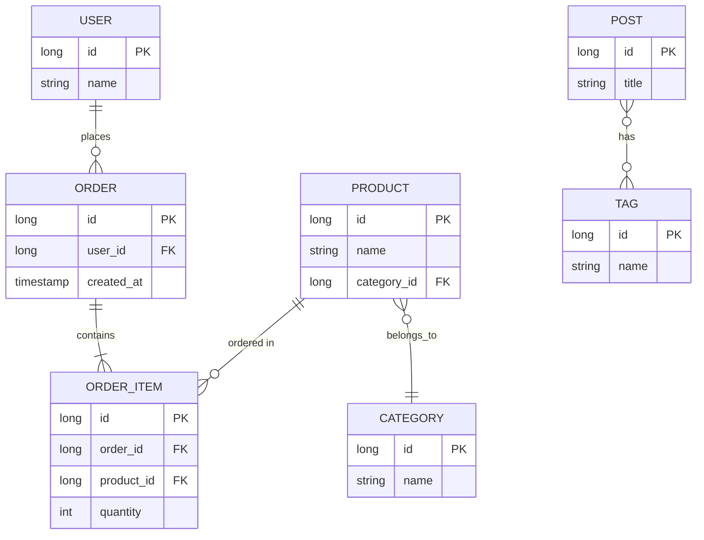

# Slide 6: Relacionamentos JPA

**Horário:** 10:50 - 11:30

---

## 🔗 Tipos de Relacionamentos



---

## 1️⃣ @OneToOne - Um para Um

### Exemplo: User ↔ UserProfile

```java
// User.java
@Entity
@Table(name = "users")
public class User {
    @Id
    @GeneratedValue(strategy = GenerationType.IDENTITY)
    private Long id;
    
    private String username;
    
    // Lado proprietário da relação
    @OneToOne(cascade = CascadeType.ALL, fetch = FetchType.LAZY)
    @JoinColumn(name = "profile_id", referencedColumnName = "id")
    private UserProfile profile;
    
    // Getters, Setters...
}

// UserProfile.java
@Entity
@Table(name = "user_profiles")
public class UserProfile {
    @Id
    @GeneratedValue(strategy = GenerationType.IDENTITY)
    private Long id;
    
    private String bio;
    private String avatarUrl;
    
    // Lado inverso (opcional - bidirecional)
    @OneToOne(mappedBy = "profile")
    private User user;
    
    // Getters, Setters...
}
```

**SQL Gerado:**
```sql
CREATE TABLE users (
    id BIGSERIAL PRIMARY KEY,
    username VARCHAR(255),
    profile_id BIGINT UNIQUE,  -- FK para user_profiles
    FOREIGN KEY (profile_id) REFERENCES user_profiles(id)
);

CREATE TABLE user_profiles (
    id BIGSERIAL PRIMARY KEY,
    bio TEXT,
    avatar_url VARCHAR(500)
);
```

---

## 2️⃣ @ManyToOne / @OneToMany - Muitos para Um

### Exemplo: Post ↔ Comments

```java
// Post.java
@Entity
@Table(name = "posts")
public class Post {
    @Id
    @GeneratedValue(strategy = GenerationType.IDENTITY)
    private Long id;
    
    private String title;
    private String content;
    
    // Um Post tem muitos Comments
    @OneToMany(mappedBy = "post", cascade = CascadeType.ALL, orphanRemoval = true)
    private List<Comment> comments = new ArrayList<>();
    
    // Helper methods
    public void addComment(Comment comment) {
        comments.add(comment);
        comment.setPost(this);  // Sincronizar ambos os lados
    }
    
    public void removeComment(Comment comment) {
        comments.remove(comment);
        comment.setPost(null);
    }
    
    // Getters, Setters...
}

// Comment.java
@Entity
@Table(name = "comments")
public class Comment {
    @Id
    @GeneratedValue(strategy = GenerationType.IDENTITY)
    private Long id;
    
    private String text;
    private String author;
    
    // Muitos Comments para um Post
    @ManyToOne(fetch = FetchType.LAZY)  // ← LAZY é padrão e recomendado
    @JoinColumn(name = "post_id", nullable = false)
    private Post post;
    
    // Getters, Setters...
}
```

**SQL Gerado:**
```sql
CREATE TABLE posts (
    id BIGSERIAL PRIMARY KEY,
    title VARCHAR(255),
    content TEXT
);

CREATE TABLE comments (
    id BIGSERIAL PRIMARY KEY,
    text TEXT,
    author VARCHAR(100),
    post_id BIGINT NOT NULL,  -- FK para posts
    FOREIGN KEY (post_id) REFERENCES posts(id)
);
```

---

## 3️⃣ @ManyToMany - Muitos para Muitos

### Exemplo: Post ↔ Tags

```java
// Post.java
@Entity
@Table(name = "posts")
public class Post {
    @Id
    @GeneratedValue(strategy = GenerationType.IDENTITY)
    private Long id;
    
    private String title;
    
    // Muitos Posts para muitas Tags
    @ManyToMany(cascade = {CascadeType.PERSIST, CascadeType.MERGE})
    @JoinTable(
        name = "post_tags",  // Nome da tabela de junção
        joinColumns = @JoinColumn(name = "post_id"),  // FK para Post
        inverseJoinColumns = @JoinColumn(name = "tag_id")  // FK para Tag
    )
    private Set<Tag> tags = new HashSet<>();
    
    // Helper methods
    public void addTag(Tag tag) {
        tags.add(tag);
        tag.getPosts().add(this);
    }
    
    public void removeTag(Tag tag) {
        tags.remove(tag);
        tag.getPosts().remove(this);
    }
    
    // Getters, Setters...
}

// Tag.java
@Entity
@Table(name = "tags")
public class Tag {
    @Id
    @GeneratedValue(strategy = GenerationType.IDENTITY)
    private Long id;
    
    private String name;
    
    // Lado inverso (opcional - bidirecional)
    @ManyToMany(mappedBy = "tags")
    private Set<Post> posts = new HashSet<>();
    
    // Getters, Setters...
}
```

**SQL Gerado:**
```sql
CREATE TABLE posts (
    id BIGSERIAL PRIMARY KEY,
    title VARCHAR(255)
);

CREATE TABLE tags (
    id BIGSERIAL PRIMARY KEY,
    name VARCHAR(50) UNIQUE
);

CREATE TABLE post_tags (
    post_id BIGINT NOT NULL,
    tag_id BIGINT NOT NULL,
    PRIMARY KEY (post_id, tag_id),
    FOREIGN KEY (post_id) REFERENCES posts(id),
    FOREIGN KEY (tag_id) REFERENCES tags(id)
);
```

---

## ⚙️ Cascade Types

```java
@Entity
public class Post {
    
    @OneToMany(cascade = CascadeType.ALL)
    private List<Comment> comments;
    
    // CascadeType.ALL = TODAS as operações
    // • PERSIST: ao salvar Post, salva Comments
    // • MERGE: ao atualizar Post, atualiza Comments
    // • REMOVE: ao deletar Post, deleta Comments
    // • REFRESH: ao recarregar Post, recarrega Comments
    // • DETACH: ao desanexar Post, desanexa Comments
}
```

| Cascade | Quando usar |
|---------|-------------|
| `PERSIST` | Salvar entidades relacionadas junto |
| `MERGE` | Atualizar relacionadas junto |
| `REMOVE` | Deletar relacionadas junto (cuidado!) |
| `REFRESH` | Recarregar relacionadas junto |
| `ALL` | Todas acima (use com cuidado) |
| `DETACH` | Raramente usado |

**⚠️ Cuidado com CascadeType.REMOVE:**
```java
// ❌ PERIGOSO em ManyToOne/ManyToMany
@ManyToOne(cascade = CascadeType.ALL)  // ❌
private Category category;
// Deletar Product vai deletar Category! (e todos os outros Products!)

// ✅ BOM em OneToMany com dependentes
@OneToMany(cascade = CascadeType.ALL, orphanRemoval = true)
private List<Comment> comments;  // ✅
// Deletar Post pode deletar Comments (OK!)
```

---

## 🐌 Fetch Types: LAZY vs EAGER

### LAZY (Preguiçoso) - Carrega sob demanda

```java
@Entity
public class Post {
    
    @OneToMany(fetch = FetchType.LAZY)  // Padrão para coleções
    private List<Comment> comments;
    
    // Comments são carregados apenas quando acessados
}

// Uso:
Post post = repository.findById(1L).get();
// SQL: SELECT * FROM posts WHERE id = 1
// Comments NÃO carregados ainda!

System.out.println(post.getComments().size());
// SQL: SELECT * FROM comments WHERE post_id = 1
// AGORA sim carrega Comments
```

### EAGER (Ansioso) - Carrega sempre

```java
@Entity
public class Post {
    
    @OneToMany(fetch = FetchType.EAGER)  // Carrega sempre
    private List<Comment> comments;
}

// Uso:
Post post = repository.findById(1L).get();
// SQL: SELECT * FROM posts p 
//      LEFT JOIN comments c ON p.id = c.post_id 
//      WHERE p.id = 1
// Comments JÁ carregados!
```

---

## ⚡ Problema N+1 Queries

### ❌ Problema

```java
// LAZY fetch
@OneToMany(fetch = FetchType.LAZY)
private List<Comment> comments;

// Código:
List<Post> posts = repository.findAll();  // 1 query
for (Post post : posts) {
    System.out.println(post.getComments().size());  // N queries!
}

// Total: 1 + N queries! 💥
// 100 posts = 101 queries!
```

### ✅ Solução 1: @EntityGraph

```java
@Repository
public interface PostRepository extends JpaRepository<Post, Long> {
    
    @EntityGraph(attributePaths = {"comments"})
    List<Post> findAll();
    
    // SQL: SELECT p.*, c.* FROM posts p 
    //      LEFT JOIN comments c ON p.id = c.post_id
    // 1 query apenas! ✅
}
```

### ✅ Solução 2: JOIN FETCH (JPQL)

```java
@Query("SELECT p FROM Post p LEFT JOIN FETCH p.comments")
List<Post> findAllWithComments();
```

---

## 📊 Fetch Type: Quando Usar?

| Relação | Padrão | Recomendação |
|---------|--------|--------------|
| `@OneToOne` | EAGER | LAZY (sempre que possível) |
| `@ManyToOne` | EAGER | LAZY (padrão é ruim!) |
| `@OneToMany` | LAZY | LAZY ✅ |
| `@ManyToMany` | LAZY | LAZY ✅ |

**Regra de ouro:**
```java
// ✅ Use LAZY por padrão
@ManyToOne(fetch = FetchType.LAZY)

// ✅ Carregue sob demanda com @EntityGraph ou JOIN FETCH
@EntityGraph(attributePaths = {"category", "tags"})

// ❌ Evite EAGER (causa N+1 problems)
@ManyToOne(fetch = FetchType.EAGER)  // ❌
```

---

## 🎬 DEMO: Relacionamento Completo

```java
// Category.java
@Entity
@Table(name = "categories")
public class Category {
    @Id
    @GeneratedValue(strategy = GenerationType.IDENTITY)
    private Long id;
    
    @Column(unique = true, nullable = false)
    private String name;
    
    @OneToMany(mappedBy = "category")
    private List<Product> products = new ArrayList<>();
    
    // Getters, Setters, Constructors...
}

// Product.java
@Entity
@Table(name = "products")
public class Product {
    @Id
    @GeneratedValue(strategy = GenerationType.IDENTITY)
    private Long id;
    
    private String name;
    private BigDecimal price;
    
    @ManyToOne(fetch = FetchType.LAZY)
    @JoinColumn(name = "category_id")
    private Category category;
    
    @OneToMany(mappedBy = "product", cascade = CascadeType.ALL, orphanRemoval = true)
    private List<Review> reviews = new ArrayList<>();
    
    // Helper methods
    public void setCategory(Category category) {
        this.category = category;
        if (category != null) {
            category.getProducts().add(this);
        }
    }
    
    public void addReview(Review review) {
        reviews.add(review);
        review.setProduct(this);
    }
    
    // Getters, Setters, Constructors...
}

// Review.java
@Entity
@Table(name = "reviews")
public class Review {
    @Id
    @GeneratedValue(strategy = GenerationType.IDENTITY)
    private Long id;
    
    private String comment;
    private Integer rating;
    
    @ManyToOne(fetch = FetchType.LAZY)
    @JoinColumn(name = "product_id", nullable = false)
    private Product product;
    
    // Getters, Setters, Constructors...
}
```
