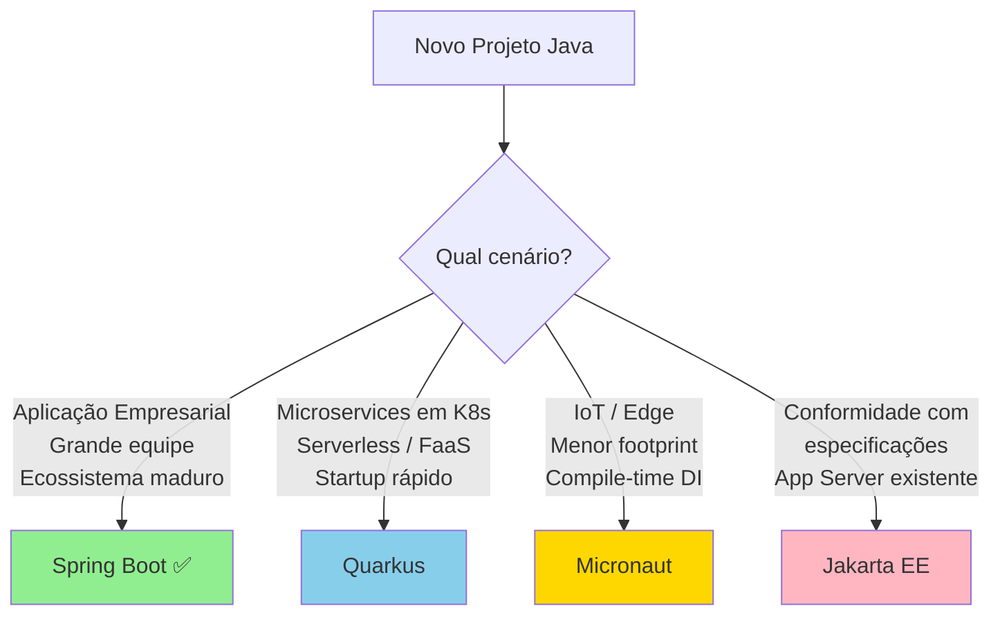

# Slide 8: Spring no Contexto do Mercado — Comparação com Outros Frameworks

**Horário:** 09:00 - 09:15 (continuação)

---

## 🔄 Por que Comparar Frameworks?

Entender as alternativas ajuda a:
- Justificar a escolha do Spring Boot ✅
- Reconhecer trade-offs de cada ferramenta
- Escolher a melhor opção para cada cenário
- Conversar com confiança em entrevistas e projetos

---

## 1️⃣ Spring Boot vs Jakarta EE (antigo Java EE)

| Aspecto | Spring Boot | Jakarta EE |
|---------|-------------|------------|
| **Filosofia** | Convention over Configuration | Especificação formal (JSRs) |
| **Container** | Embedded (Tomcat, Jetty, Undertow) | Application Server (WildFly, Payara) |
| **DI** | `@Autowired`, `@Component` | `@Inject`, `@Named` (CDI) |
| **REST** | `@RestController`, `@GetMapping` | `@Path`, `@GET` (JAX-RS) |
| **Persistência** | Spring Data JPA (sobre JPA) | JPA direto (EntityManager) |
| **Segurança** | Spring Security | Jakarta Security |
| **Ecossistema** | Spring Cloud, Batch, etc. | MicroProfile (microservices) |
| **Curva de aprendizado** | Moderada | Alta |
| **Time-to-market** | Rápido | Mais lento |

---

### Exemplo Comparativo: REST Endpoint

```java
// Jakarta EE (JAX-RS)
@Path("/products")
@Produces(MediaType.APPLICATION_JSON)
public class ProductResource {
    @Inject
    private ProductService service;

    @GET
    public List<Product> list() {
        return service.findAll();
    }
}

// Spring Boot
@RestController
@RequestMapping("/products")
public class ProductController {
    private final ProductService service;

    public ProductController(ProductService service) {
        this.service = service;
    }

    @GetMapping
    public List<Product> list() {
        return service.findAll();
    }
}
```

---

## 2️⃣ Spring Boot vs Quarkus

| Aspecto | Spring Boot | Quarkus |
|---------|-------------|----------|
| **Startup time** | ~2-5 segundos | ~0.5-1 segundo |
| **Memória (RSS)** | ~150-300 MB | ~30-80 MB |
| **Compilação nativa** | GraalVM (suporte crescente) | GraalVM (first-class citizen) |
| **Dev Experience** | DevTools (restart) | Dev Mode (hot reload real) |
| **Ecossistema** | Gigantesco, maduro | Crescente, moderno |
| **Reatividade** | WebFlux (Project Reactor) | Mutiny (nativo) |
| **Standards** | Mix Spring + Jakarta | Jakarta EE + MicroProfile |
| **Cloud Native** | Spring Cloud | Kubernetes-native |
| **Ideal para** | Empresariais, monólitos, microservices | Microservices, serverless, containers |

---

### Exemplo Comparativo: Repository

```java
// Quarkus Panache (equivalente ao Spring Data)
@ApplicationScoped
public class ProductRepository implements PanacheRepository<Product> {
    public List<Product> findByCategory(String category) {
        return find("category", category).list();
    }
}

// Spring Data JPA
@Repository
public interface ProductRepository extends JpaRepository<Product, Long> {
    List<Product> findByCategory(String category);
}
```

---

## 3️⃣ Spring Boot vs Micronaut

| Aspecto | Spring Boot | Micronaut |
|---------|-------------|----------|
| **DI** | Runtime (reflection) | Compile-time (annotation processing) |
| **Startup** | Mais lento | Ultra rápido (<1s) |
| **Memória** | Maior consumo | Baixo consumo |
| **AOP** | Runtime proxies | Compile-time |
| **Compatibilidade** | Maior ecossistema de libs | Compatível com muitas libs Spring |
| **Nativo** | GraalVM (suporte) | GraalVM (otimizado) |
| **Ideal para** | Aplicações de qualquer porte | Microservices, serverless, IoT |

---

### Exemplo Comparativo: Controller

```java
// Micronaut
@Controller("/products")
public class ProductController {
    private final ProductService service;

    public ProductController(ProductService service) { // DI por construtor
        this.service = service;
    }

    @Get
    public List<Product> list() {
        return service.findAll();
    }
}

// Spring Boot
@RestController
@RequestMapping("/products")
public class ProductController {
    private final ProductService service;

    public ProductController(ProductService service) {
        this.service = service;
    }

    @GetMapping
    public List<Product> list() {
        return service.findAll();
    }
}
```

---

## 📊 Tabela Resumo Comparativa

| Critério | Spring Boot | Jakarta EE | Quarkus | Micronaut |
|----------|-------------|------------|---------|----------|
| **Maturidade** | ⭐⭐⭐⭐⭐ | ⭐⭐⭐⭐⭐ | ⭐⭐⭐⭐ | ⭐⭐⭐⭐ |
| **Comunidade** | ⭐⭐⭐⭐⭐ | ⭐⭐⭐ | ⭐⭐⭐⭐ | ⭐⭐⭐ |
| **Performance** | ⭐⭐⭐ | ⭐⭐⭐ | ⭐⭐⭐⭐⭐ | ⭐⭐⭐⭐⭐ |
| **Produtividade** | ⭐⭐⭐⭐⭐ | ⭐⭐⭐ | ⭐⭐⭐⭐ | ⭐⭐⭐⭐ |
| **Cloud Native** | ⭐⭐⭐⭐ | ⭐⭐⭐ | ⭐⭐⭐⭐⭐ | ⭐⭐⭐⭐⭐ |
| **Mercado de trabalho** | ⭐⭐⭐⭐⭐ | ⭐⭐⭐⭐ | ⭐⭐⭐ | ⭐⭐ |
| **Curva de aprendizado** | Moderada | Alta | Moderada | Moderada |

---

## 💡 Quando Escolher Cada Um?



> **💡 Por que Spring Boot?** Para a maioria dos projetos empresariais, Spring Boot oferece o melhor equilíbrio entre produtividade, ecossistema e mercado de trabalho. Quarkus e Micronaut são excelentes para cenários cloud-native onde performance de startup e consumo de memória são críticos.

---

**Próximo:** Criando Primeiro Projeto Spring Boot →
