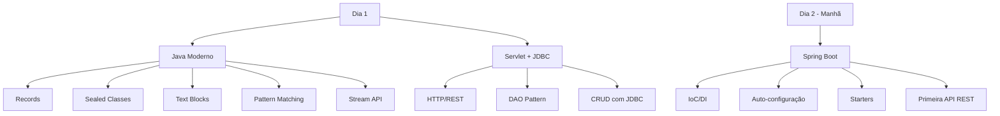
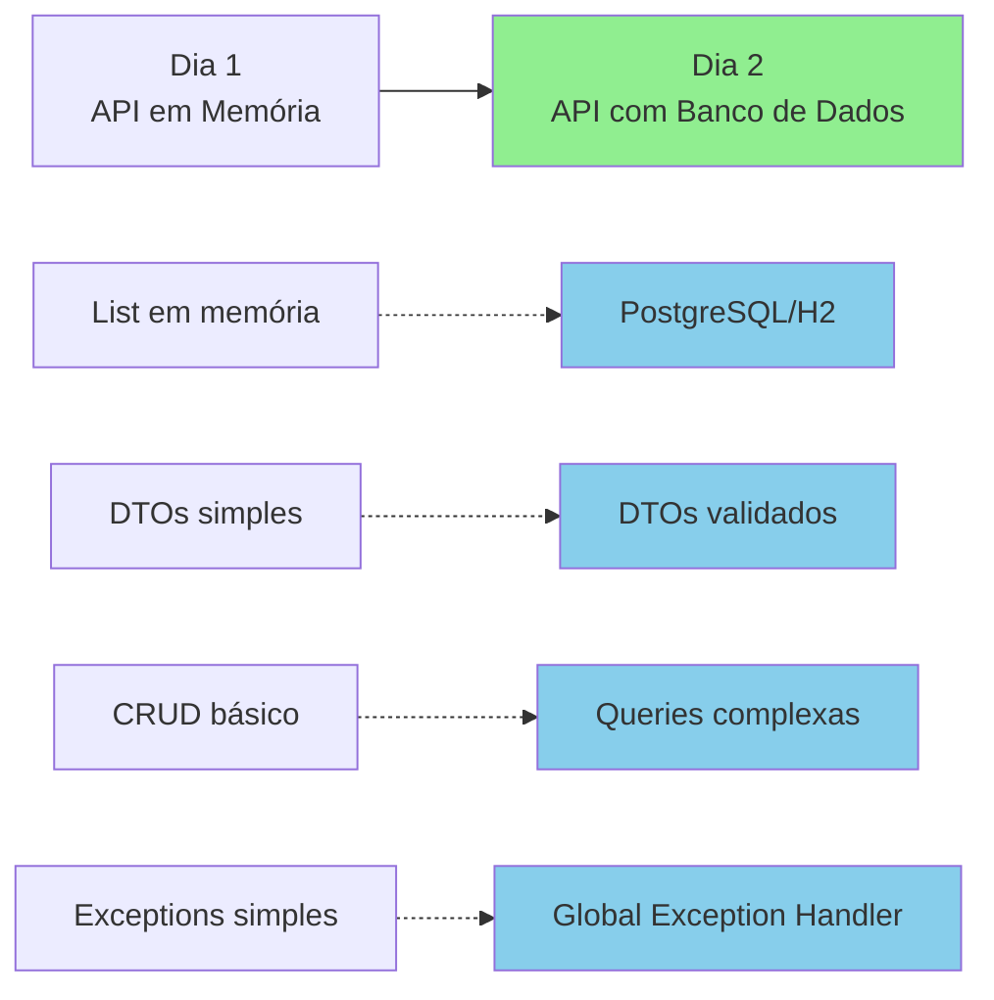

# Slide 9: Review Spring Boot & Setup Persistência

**Horário:** 11:15 - 11:30

---

## 📝 Review Rápido

### O que vimos até agora?



---

## ✅ Checklist - Todos conseguem?

```
[ ] Criar Records com validação
[ ] Usar Stream API para filtrar/transformar listas
[ ] Criar projeto Spring Boot no Initializr
[ ] Desenvolver Controller → Service → Repository
[ ] Testar API com Postman
[ ] Entender a diferença entre @Service e @Repository
```

**🤔 Dúvidas pendentes?**

---

## 🎯 Hoje vamos aprofundar

### De onde viemos → Para onde vamos



---

## 🔧 Setup do Dia

### 1. Verificar PostgreSQL

```bash
# Opção 1: PostgreSQL instalado
psql --version
psql -U postgres -c "SELECT version();"

# Opção 2: Podman
podman run --name postgres-dev \
  -e POSTGRES_PASSWORD=postgres \
  -e POSTGRES_DB=java_training \
  -p 5432:5432 \
  -d docker.io/library/postgres:15

# Testar conexão
podman exec -it postgres-dev psql -U postgres
```

---

### 2. Configurar DBeaver/pgAdmin

```
Host: localhost
Port: 5432
Database: java_training
User: postgres
Password: postgres
```

---

### 3. Dependências necessárias (pom.xml)

```xml
<!-- JPA + PostgreSQL -->
<dependency>
    <groupId>org.springframework.boot</groupId>
    <artifactId>spring-boot-starter-data-jpa</artifactId>
</dependency>
<dependency>
    <groupId>org.postgresql</groupId>
    <artifactId>postgresql</artifactId>
    <scope>runtime</scope>
</dependency>

<!-- H2 para testes -->
<dependency>
    <groupId>com.h2database</groupId>
    <artifactId>h2</artifactId>
    <scope>test</scope>
</dependency>

<!-- Validação -->
<dependency>
    <groupId>org.springframework.boot</groupId>
    <artifactId>spring-boot-starter-validation</artifactId>
</dependency>
```

---

## 💡 Dica do Instrutor

Hoje trabalharemos com **dados persistentes**. Cada alteração no código pode afetar o banco de dados. Use sempre:
- `ddl-auto: validate` em produção
- `ddl-auto: update` em desenvolvimento (com cuidado)
- `ddl-auto: create-drop` apenas para testes
