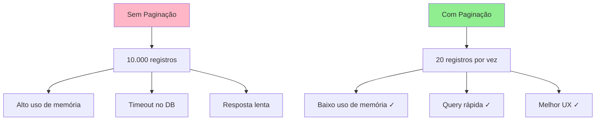
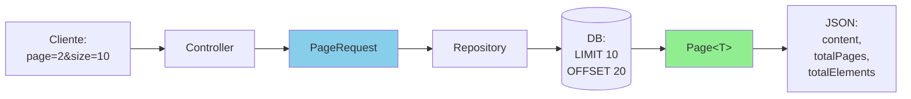

# Slide 9: Paginação e Ordenação

**Horário:** 13:40 - 14:00

---

## 📄 Por que Paginar?



**Benefícios:**
- Reduz uso de memória no servidor
- Queries mais rápidas
- Melhor experiência do usuário
- Permite scroll infinito ou páginas

---

## 🔄 Fluxo de Paginação



---

## 🎬 DEMO: Controller com Paginação

```java
@RestController
@RequestMapping("/api/products")
public class ProductController {
    
    @Autowired
    private ProductRepository repository;
    
    @GetMapping
    public ResponseEntity<Page<ProductResponse>> findAll(
            @RequestParam(defaultValue = "0") int page,
            @RequestParam(defaultValue = "20") int size,
            @RequestParam(defaultValue = "id,asc") String[] sort) {
        
        // Parsing sort: ["name,asc", "price,desc"]
        List<Sort.Order> orders = Arrays.stream(sort)
            .map(s -> {
                String[] parts = s.split(",");
                String property = parts[0];
                Sort.Direction direction = parts.length > 1 && parts[1].equalsIgnoreCase("desc")
                    ? Sort.Direction.DESC
                    : Sort.Direction.ASC;
                return new Sort.Order(direction, property);
            })
            .toList();
        
        Pageable pageable = PageRequest.of(page, size, Sort.by(orders));
        
        Page<Product> productsPage = repository.findAll(pageable);
        
        // Converter Entity para DTO
        Page<ProductResponse> response = productsPage.map(ProductResponse::from);
        
        return ResponseEntity.ok(response);
    }
    
    // Exemplo com filtros
    @GetMapping("/search")
    public ResponseEntity<Page<ProductResponse>> search(
            @RequestParam String keyword,
            @RequestParam(required = false) String category,
            @RequestParam(defaultValue = "0") int page,
            @RequestParam(defaultValue = "20") int size) {
        
        Pageable pageable = PageRequest.of(page, size, Sort.by("name").ascending());
        
        Page<Product> results = category != null
            ? repository.findByNameContainingAndCategory(keyword, category, pageable)
            : repository.findByNameContaining(keyword, pageable);
        
        return ResponseEntity.ok(results.map(ProductResponse::from));
    }
}
```

---

## 🗄️ Repository com Pageable

```java
@Repository
public interface ProductRepository extends JpaRepository<Product, Long> {
    
    // Query method com Pageable
    Page<Product> findByCategory(String category, Pageable pageable);
    
    // Múltiplos filtros
    Page<Product> findByNameContainingAndCategory(
        String keyword, 
        String category, 
        Pageable pageable
    );
    
    // Com @Query
    @Query("SELECT p FROM Product p WHERE p.price > :minPrice")
    Page<Product> findExpensive(@Param("minPrice") BigDecimal minPrice, Pageable pageable);
    
    // Slice ao invés de Page (mais leve)
    Slice<Product> findByActive(boolean active, Pageable pageable);
}
```

---

## 📊 Response Paginado

```json
{
  "content": [
    {"id": 1, "name": "Laptop Dell", "price": 3500.00},
    {"id": 2, "name": "Mouse Logitech", "price": 150.00}
  ],
  "pageable": {
    "pageNumber": 0,
    "pageSize": 20,
    "sort": {
      "sorted": true,
      "orders": [
        {"property": "name", "direction": "ASC"}
      ]
    },
    "offset": 0,
    "paged": true,
    "unpaged": false
  },
  "totalPages": 5,
  "totalElements": 100,
  "last": false,
  "first": true,
  "numberOfElements": 20,
  "size": 20,
  "number": 0,
  "empty": false
}
```

**Campos importantes:**
- `content`: Array com os dados
- `totalPages`: Total de páginas disponíveis
- `totalElements`: Total de registros no banco
- `first` / `last`: Indica se é primeira/última página
- `number`: Número da página atual (0-indexed)

---

## 🔢 Ordenação (Sort)

```java
// Sort simples
Sort sort = Sort.by("name");
Sort sort = Sort.by("name").ascending();
Sort sort = Sort.by("price").descending();

// Múltiplos campos
Sort sort = Sort.by("category").and(Sort.by("price").descending());

// Com Order
Sort.Order order1 = new Sort.Order(Sort.Direction.ASC, "name");
Sort.Order order2 = new Sort.Order(Sort.Direction.DESC, "price");
Sort sort = Sort.by(order1, order2);

// PageRequest com sort
Pageable pageable = PageRequest.of(0, 10, Sort.by("name"));

// Múltiplos sorts na URL
GET /api/products?sort=category,asc&sort=price,desc
```

---

## 🆚 Page vs Slice vs List

| Tipo | Count Query | Uso | Performance |
|------|-------------|-----|-------------|
| `Page<T>` | ✅ Sim | Quando precisa saber o total | Mais lento (2 queries) |
| `Slice<T>` | ❌ Não | Scroll infinito, "Load More" | Mais rápido (1 query) |
| `List<T>` | ❌ Não | Dados pequenos, sem paginação | N/A |

```java
// Page - sabe o total
Page<Product> page = repository.findAll(pageable);
System.out.println(page.getTotalElements()); // 1000
System.out.println(page.getTotalPages());     // 50

// Slice - não sabe o total, mas sabe se tem próxima
Slice<Product> slice = repository.findByActive(true, pageable);
System.out.println(slice.hasNext());     // true
// System.out.println(slice.getTotalPages()); ❌ Não existe!

// List - sem paginação
List<Product> list = repository.findByCategory("Tech");
```

---

## 🎯 Boas Práticas

### ✅ Faça:

```java
// 1. Defina limite máximo de registros
int size = Math.min(requestedSize, 100); // máximo 100

// 2. Use valores default
@RequestParam(defaultValue = "0") int page
@RequestParam(defaultValue = "20") int size

// 3. Valide parâmetros de ordenação (evitar injection)
Set<String> allowedSorts = Set.of("id", "name", "price", "createdAt");
if (!allowedSorts.contains(sortField)) {
    sortField = "id"; // fallback
}

// 4. Use Slice quando não precisa do total
Slice<Product> products = repository.findByCategory(cat, pageable);

// 5. Converta para DTO
Page<ProductDTO> dtos = entities.map(ProductDTO::from);
```

### ❌ Evite:

```java
// 1. Permitir size muito grande
int size = request.getSize(); // ⚠️ Pode ser 999999

// 2. Fazer count desnecessário
Page<Product> page = repository.findAll(pageable); // 2 queries
// Use Slice se não precisa do total

// 3. Retornar entidades no controller
return ResponseEntity.ok(productsPage); // ❌ Expõe entity

// 4. Ordenação por campos não indexados
// Pode ser muito lento!
```

---

## 🏋️ Exercício Prático (10 min)

Implemente paginação completa para Tasks:

```java
@RestController
@RequestMapping("/api/tasks")
public class TaskController {
    
    @GetMapping
    public ResponseEntity<Page<TaskResponse>> findAll(
        @RequestParam(required = false) String status,
        @RequestParam(required = false) Long userId,
        Pageable pageable
    ) {
        // Implementar busca paginada com filtros opcionais
    }
}

@Repository
public interface TaskRepository extends JpaRepository<Task, Long> {
    // Criar métodos necessários
}
```

**Teste com:**
```
GET /api/tasks?page=0&size=10
GET /api/tasks?page=0&size=10&sort=dueDate,asc
GET /api/tasks?status=PENDING&page=1&size=5
```

**Próximo:** DTOs e Mapeamento →
