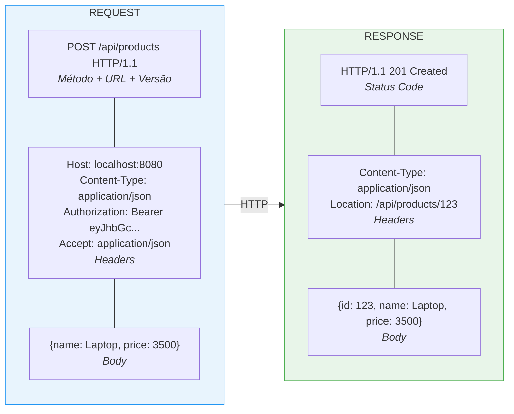
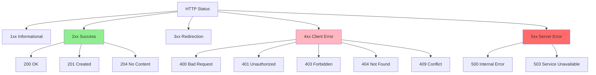

# Slide 10: Fundamentos HTTP & REST Avançado

**Horário:** 09:15 - 09:35

---

## 🌐 HTTP: A Base de Tudo

### Anatomia de uma Requisição HTTP



---

## 📊 HTTP Status Codes - Família de Respostas



---

## 🎯 Status Codes: Quando Usar Cada Um

| Code | Nome | Quando usar | Exemplo |
|------|------|-------------|---------|
| 200 | OK | Sucesso em GET/PUT | `GET /products/123` |
| 201 | Created | Recurso criado | `POST /products` |
| 204 | No Content | Sucesso sem corpo | `DELETE /products/123` |
| 400 | Bad Request | Validação falhou | JSON inválido, campo obrigatório |
| 401 | Unauthorized | Não autenticado | Token ausente/inválido |
| 403 | Forbidden | Sem permissão | User não pode deletar |
| 404 | Not Found | Recurso não existe | Produto ID 999 não existe |
| 409 | Conflict | Conflito de estado | Email já cadastrado |
| 500 | Internal Error | Erro no servidor | NullPointerException |

---

## 🔍 Métodos HTTP & Semântica REST

### CRUD Mapping

```mermaid
flowchart TD
    A[CRUD Operations] --> B[Create]
    A --> C[Read]
    A --> D[Update]
    A --> E[Delete]
    
    B --> B1[\"POST /resources<br/>201 Created\"]
    C --> C1[\"GET /resources<br/>200 OK\"]
    C --> C2[\"GET /resources/:id<br/>200 OK\"]
    D --> D1[\"PUT /resources/:id<br/>200 OK - substituição completa\"]
    D --> D2[\"PATCH /resources/:id<br/>200 OK - atualização parcial\"]
    E --> E1[\"DELETE /resources/:id<br/>204 No Content\"]
    
    style B1 fill:#90EE90
    style C1 fill:#87CEEB
    style C2 fill:#87CEEB
    style D1 fill:#FFD700
    style D2 fill:#FFD700
    style E1 fill:#FFB6C1
```

---

## 🎓 Princípios REST

### 1. **Stateless** (Sem Estado)

```java
// ❌ MAU - servidor guarda estado do cliente
@RestController
public class BadController {
    private Map<String, User> userSessions = new HashMap<>(); // ❌
    
    @PostMapping("/login")
    public void login(@RequestBody LoginRequest req) {
        userSessions.put(req.username(), user); // Estado no servidor!
    }
}

// ✅ BOM - stateless com token
@RestController
public class GoodController {
    
    @PostMapping("/login")
    public TokenResponse login(@RequestBody LoginRequest req) {
        String token = jwtService.generateToken(user);
        return new TokenResponse(token); // Cliente guarda o estado (token)
    }
    
    @GetMapping("/profile")
    public UserProfile getProfile(@RequestHeader("Authorization") String token) {
        User user = jwtService.validateToken(token); // Cada request é independente
        return UserProfile.from(user);
    }
}
```

---

### 2. **Recursos** (Resources)

```java
// ✅ BOM - URLs representam RECURSOS, não ações
GET    /api/products           // Lista de produtos (recurso)
POST   /api/products           // Criar produto
GET    /api/products/123       // Produto específico
PUT    /api/products/123       // Atualizar produto
DELETE /api/products/123       // Deletar produto

// ❌ RUIM - URLs com verbos (não é REST!)
GET    /api/getAllProducts
POST   /api/createProduct
GET    /api/getProductById?id=123
POST   /api/updateProduct
POST   /api/deleteProduct
```

---

### 3. **Representações** (JSON, XML, etc)

```java
@RestController
@RequestMapping("/api/products")
public class ProductController {
    
    // Content Negotiation - cliente escolhe formato
    @GetMapping(value = "/{id}", 
                produces = {MediaType.APPLICATION_JSON_VALUE, 
                           MediaType.APPLICATION_XML_VALUE})
    public ProductResponse findById(@PathVariable Long id) {
        // Spring serializa automaticamente para JSON ou XML
        // baseado no header "Accept" do cliente
        return productService.findById(id);
    }
    
    // Aceita JSON ou XML no body
    @PostMapping(consumes = {MediaType.APPLICATION_JSON_VALUE,
                            MediaType.APPLICATION_XML_VALUE})
    public ResponseEntity<ProductResponse> create(@RequestBody CreateProductRequest req) {
        ProductResponse created = productService.create(req);
        return ResponseEntity.status(HttpStatus.CREATED).body(created);
    }
}
```

---

## 💡 RESTful API Design - Boas Práticas

### ✅ URLs bem desenhadas

```
# Hierarquia de recursos
GET    /api/users/123/orders           # Pedidos do usuário 123
GET    /api/users/123/orders/456       # Pedido 456 do usuário 123
POST   /api/users/123/orders           # Criar pedido para usuário 123

# Filtering, Sorting, Pagination
GET    /api/products?category=electronics&sort=price,desc&page=0&size=20

# Search
GET    /api/products/search?q=laptop&minPrice=1000

# Ações especiais (verbos quando necessário)
POST   /api/orders/456/cancel          # Cancelar pedido
POST   /api/users/123/activate         # Ativar usuário
```

---

## 🎬 DEMO: ResponseEntity Completo

```java
@RestController
@RequestMapping("/api/products")
public class ProductController {
    
    private final ProductService service;
    
    public ProductController(ProductService service) {
        this.service = service;
    }
    
    // 200 OK - Sucesso simples
    @GetMapping("/{id}")
    public ResponseEntity<ProductResponse> findById(@PathVariable Long id) {
        ProductResponse product = service.findById(id);
        return ResponseEntity.ok(product);
    }
    
    // 201 Created - com Location header
    @PostMapping
    public ResponseEntity<ProductResponse> create(@RequestBody CreateProductRequest req) {
        ProductResponse created = service.create(req);
        
        URI location = ServletUriComponentsBuilder
            .fromCurrentRequest()
            .path("/{id}")
            .buildAndExpand(created.id())
            .toUri();
        
        return ResponseEntity
            .created(location)  // 201 + Location header
            .body(created);
    }
    
    // 204 No Content - sem body
    @DeleteMapping("/{id}")
    public ResponseEntity<Void> delete(@PathVariable Long id) {
        service.delete(id);
        return ResponseEntity.noContent().build();
    }
    
    // 200 OK com headers customizados
    @GetMapping("/export")
    public ResponseEntity<byte[]> export() {
        byte[] csvData = service.exportToCsv();
        
        return ResponseEntity.ok()
            .header(HttpHeaders.CONTENT_DISPOSITION, "attachment; filename=products.csv")
            .contentType(MediaType.parseMediaType("text/csv"))
            .body(csvData);
    }
}
```
