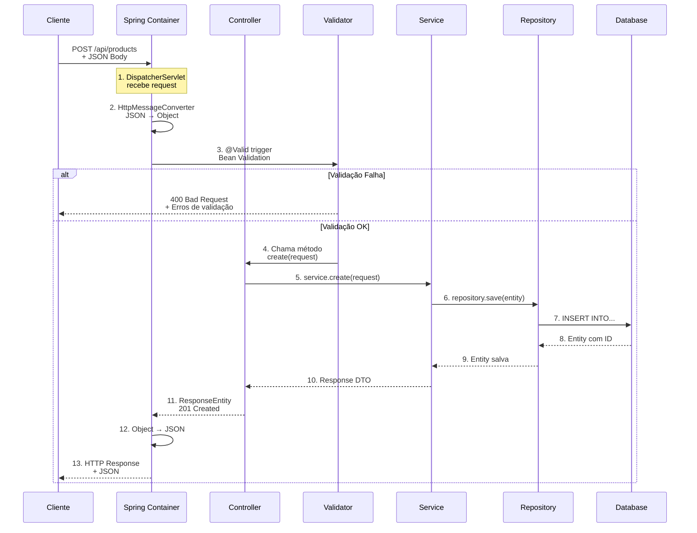

# Slide 11: Request/Response Handling Avançado

**Horário:** 09:35 - 09:55

---

## 📥 Capturando Dados da Requisição

### 1. @PathVariable - Variáveis na URL

```java
@RestController
@RequestMapping("/api")
public class ExamplesController {
    
    // Simples
    @GetMapping("/products/{id}")
    public ProductResponse findById(@PathVariable Long id) {
        // URL: /api/products/123
        // id = 123
    }
    
    // Múltiplas variáveis
    @GetMapping("/users/{userId}/orders/{orderId}")
    public OrderResponse getUserOrder(
            @PathVariable Long userId,
            @PathVariable Long orderId) {
        // URL: /api/users/456/orders/789
        // userId = 456, orderId = 789
    }
    
    // Nome diferente da variável
    @GetMapping("/products/{productId}")
    public ProductResponse find(@PathVariable("productId") Long id) {
        // productId na URL, mas variável se chama 'id'
    }
    
    // Opcional (com Optional)
    @GetMapping({"/products", "/products/{id}"})
    public ResponseEntity<?> find(@PathVariable Optional<Long> id) {
        return id.isPresent() 
            ? ResponseEntity.ok(service.findById(id.get()))
            : ResponseEntity.ok(service.findAll());
    }
}
```

---

### 2. @RequestParam - Query Parameters

```java
// Simples
@GetMapping("/products/search")
public List<ProductResponse> search(@RequestParam String name) {
    // URL: /api/products/search?name=laptop
    // name = "laptop"
}

// Múltiplos parâmetros
@GetMapping("/products")
public List<ProductResponse> filter(
        @RequestParam(required = false) String category,
        @RequestParam(required = false) BigDecimal minPrice,
        @RequestParam(required = false) BigDecimal maxPrice) {
    // URL: /api/products?category=electronics&minPrice=1000&maxPrice=5000
}

// Valor padrão
@GetMapping("/products")
public Page<ProductResponse> list(
        @RequestParam(defaultValue = "0") int page,
        @RequestParam(defaultValue = "10") int size,
        @RequestParam(defaultValue = "id,asc") String sort) {
    // URL: /api/products
    // page=0, size=10, sort="id,asc" (padrões aplicados)
}

// Lista de valores
@GetMapping("/products/filter")
public List<ProductResponse> filterByIds(@RequestParam List<Long> ids) {
    // URL: /api/products/filter?ids=1,2,3,4
    // ou: /api/products/filter?ids=1&ids=2&ids=3&ids=4
}
```

---

### 3. @RequestHeader - Headers HTTP

```java
@GetMapping("/profile")
public UserProfile getProfile(
        @RequestHeader("Authorization") String token,
        @RequestHeader(value = "Accept-Language", defaultValue = "en") String lang) {
    // Headers:
    // Authorization: Bearer eyJhbGc...
    // Accept-Language: pt-BR
}

// Capturar todos os headers
@GetMapping("/debug")
public Map<String, String> debugHeaders(@RequestHeader Map<String, String> headers) {
    return headers;
}

// Headers específicos
@GetMapping("/api-key-protected")
public String protectedEndpoint(
        @RequestHeader("X-API-Key") String apiKey) {
    if (!isValidApiKey(apiKey)) {
        throw new UnauthorizedException("Invalid API Key");
    }
    return "Secret data";
}
```

---

### 4. @RequestBody - Corpo da Requisição

```java
// JSON para Record (com validação)
@PostMapping("/products")
public ResponseEntity<ProductResponse> create(
        @Valid @RequestBody CreateProductRequest request) {
    // Body JSON:
    // {"name": "Laptop", "price": 3500, "category": "Electronics"}
    // 
    // Automaticamente convertido para CreateProductRequest
    // @Valid valida as constraints (@NotBlank, @NotNull, etc)
}

// Lista de objetos
@PostMapping("/products/batch")
public List<ProductResponse> createBatch(
        @Valid @RequestBody List<CreateProductRequest> requests) {
    return service.createAll(requests);
}
```

---

## 🎯 Fluxo Completo: Request → Response



---

## 🎬 DEMO: Request Handling Completo

```java
@RestController
@RequestMapping("/api/products")
public class ProductController {
    
    private final ProductService service;
    
    public ProductController(ProductService service) {
        this.service = service;
    }
    
    // Exemplo COMPLETO com todos os tipos de parâmetros
    @GetMapping("/search")
    public ResponseEntity<Page<ProductResponse>> advancedSearch(
            // Query parameters
            @RequestParam(required = false) String name,
            @RequestParam(required = false) String category,
            @RequestParam(required = false) BigDecimal minPrice,
            @RequestParam(required = false) BigDecimal maxPrice,
            
            // Paginação
            @RequestParam(defaultValue = "0") int page,
            @RequestParam(defaultValue = "20") int size,
            @RequestParam(defaultValue = "name,asc") String sort,
            
            // Headers
            @RequestHeader(value = "X-User-Id", required = false) Long userId,
            @RequestHeader(value = "Accept-Language", defaultValue = "en") String language) {
        
        // Construir filtros
        ProductSearchFilter filter = ProductSearchFilter.builder()
            .name(name)
            .category(category)
            .minPrice(minPrice)
            .maxPrice(maxPrice)
            .build();
        
        // Paginação
        Pageable pageable = PageRequest.of(page, size, parseSort(sort));
        
        // Buscar
        Page<ProductResponse> results = service.search(filter, pageable, language);
        
        // Response com headers customizados
        return ResponseEntity.ok()
            .header("X-Total-Count", String.valueOf(results.getTotalElements()))
            .header("X-Page-Count", String.valueOf(results.getTotalPages()))
            .body(results);
    }
    
    // POST com validação
    @PostMapping
    public ResponseEntity<ProductResponse> create(
            @Valid @RequestBody CreateProductRequest request,
            @RequestHeader("X-User-Id") Long createdBy) {
        
        ProductResponse created = service.create(request, createdBy);
        
        URI location = ServletUriComponentsBuilder
            .fromCurrentRequest()
            .path("/{id}")
            .buildAndExpand(created.id())
            .toUri();
        
        return ResponseEntity
            .created(location)
            .body(created);
    }
    
    // PATCH parcial
    @PatchMapping("/{id}")
    public ResponseEntity<ProductResponse> partialUpdate(
            @PathVariable Long id,
            @RequestBody Map<String, Object> updates) {
        
        ProductResponse updated = service.partialUpdate(id, updates);
        return ResponseEntity.ok(updated);
    }
}
```

---

## 📋 DTO com Validação Bean Validation

```java
package com.example.products.dto.request;

import jakarta.validation.constraints.*;
import java.math.BigDecimal;

public record CreateProductRequest(
    
    @NotBlank(message = "Name is required")
    @Size(min = 3, max = 100, message = "Name must be between 3 and 100 characters")
    String name,
    
    @Size(max = 500, message = "Description must be less than 500 characters")
    String description,
    
    @NotNull(message = "Price is required")
    @DecimalMin(value = "0.01", message = "Price must be greater than 0")
    @DecimalMax(value = "1000000.00", message = "Price must be less than 1 million")
    BigDecimal price,
    
    @NotBlank(message = "Category is required")
    @Pattern(regexp = "^[A-Za-z\\s]+$", message = "Category must contain only letters")
    String category,
    
    @Min(value = 0, message = "Stock cannot be negative")
    @Max(value = 10000, message = "Stock cannot exceed 10000")
    Integer stock,
    
    @Email(message = "Invalid email format")
    String supplierEmail,
    
    @NotNull(message = "Active status is required")
    Boolean active
    
) {
    // Validação customizada no compact constructor
    public CreateProductRequest {
        if (price != null && stock != null && stock == 0 && price.compareTo(BigDecimal.ZERO) > 0) {
            throw new IllegalArgumentException("Cannot have price > 0 with stock = 0");
        }
    }
}
```

---

## 🔍 Anotações de Validação Comuns

| Anotação | Descrição | Exemplo |
|----------|-----------|---------|
| `@NotNull` | Não pode ser null | `@NotNull Long id` |
| `@NotBlank` | String não vazia (trim) | `@NotBlank String name` |
| `@NotEmpty` | Collection/String não vazia | `@NotEmpty List<Item> items` |
| `@Size` | Tamanho min/max | `@Size(min=3, max=100) String name` |
| `@Min` / `@Max` | Valor numérico | `@Min(0) @Max(100) Integer age` |
| `@DecimalMin` / `@DecimalMax` | BigDecimal/Double | `@DecimalMin("0.01") BigDecimal price` |
| `@Positive` / `@PositiveOrZero` | Número positivo | `@Positive Long id` |
| `@Negative` / `@NegativeOrZero` | Número negativo | `@NegativeOrZero BigDecimal discount` |
| `@Email` | Formato email | `@Email String email` |
| `@Pattern` | Regex | `@Pattern(regexp="[0-9]+") String code` |
| `@Past` / `@Future` | Data passado/futuro | `@Past LocalDate birthDate` |
| `@AssertTrue` / `@AssertFalse` | Boolean | `@AssertTrue Boolean accepted` |

---

## 💡 Validação em Grupos

```java
// Definir interfaces de grupo
public interface OnCreate {}
public interface OnUpdate {}

// Usar em DTOs
public record ProductRequest(
    
    @Null(groups = OnCreate.class)  // ID deve ser null ao criar
    @NotNull(groups = OnUpdate.class)  // ID obrigatório ao atualizar
    Long id,
    
    @NotBlank(groups = {OnCreate.class, OnUpdate.class})
    String name
) {}

// Usar no Controller
@PostMapping
public ResponseEntity<?> create(
        @Validated(OnCreate.class) @RequestBody ProductRequest req) {
    // Valida apenas constraints do grupo OnCreate
}

@PutMapping("/{id}")
public ResponseEntity<?> update(
        @PathVariable Long id,
        @Validated(OnUpdate.class) @RequestBody ProductRequest req) {
    // Valida apenas constraints do grupo OnUpdate
}
```
