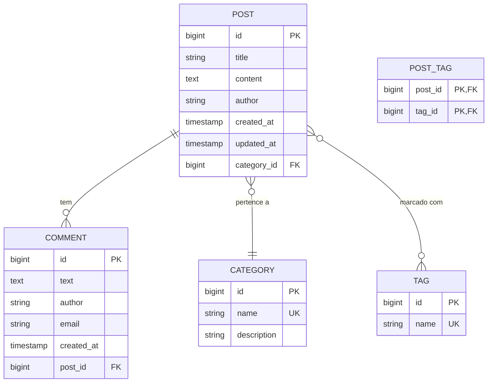

# Slide 12: Exercício Prático - Blog API (Parte 1)

**Horário:** 15:00 - 15:45

---

## 🎯 Objetivo

Criar uma API REST completa para um sistema de Blog com:
- **Posts** com título, conteúdo e autor
- **Comments** vinculados a posts
- **Categories** para organizar posts
- **Tags** para marcar posts (ManyToMany)
- Paginação, busca e filtros
- Exception handling global
- DTOs com validações

---

## 📊 Modelo de Dados



---

## 📋 Requisitos Funcionais

### Endpoints Obrigatórios

#### Posts
```
GET    /api/posts?page=0&size=10&sort=createdAt,desc
GET    /api/posts/{id}
GET    /api/posts/search?keyword=java&category=Tech
POST   /api/posts
PUT    /api/posts/{id}
DELETE /api/posts/{id}
```

#### Comments
```
GET    /api/posts/{postId}/comments
POST   /api/posts/{postId}/comments
DELETE /api/comments/{id}
```

#### Categories
```
GET    /api/categories
GET    /api/categories/{id}/posts
POST   /api/categories
```

#### Tags
```
GET    /api/tags
POST   /api/tags
GET    /api/tags/{id}/posts
```

---

## 🏗️ Estrutura do Projeto

```
src/main/java/com/example/blog/
├── controller/
│   ├── PostController.java
│   ├── CommentController.java
│   ├── CategoryController.java
│   └── TagController.java
├── dto/
│   ├── request/
│   │   ├── CreatePostRequest.java
│   │   ├── UpdatePostRequest.java
│   │   └── CreateCommentRequest.java
│   └── response/
│       ├── PostResponse.java
│       ├── PostSummaryResponse.java
│       ├── CommentResponse.java
│       └── CategoryResponse.java
├── entity/
│   ├── Post.java
│   ├── Comment.java
│   ├── Category.java
│   └── Tag.java
├── repository/
│   ├── PostRepository.java
│   ├── CommentRepository.java
│   ├── CategoryRepository.java
│   └── TagRepository.java
├── service/
│   ├── PostService.java
│   ├── CommentService.java
│   ├── CategoryService.java
│   └── TagService.java
└── exception/
    ├── GlobalExceptionHandler.java
    ├── EntityNotFoundException.java
    └── ErrorResponse.java
```

---

## 🎬 Passo 1: Entities (20 min)

### Category.java

```java
@Entity
@Table(name = "categories")
public class Category {
    
    @Id
    @GeneratedValue(strategy = GenerationType.IDENTITY)
    private Long id;
    
    @Column(nullable = false, unique = true, length = 100)
    private String name;
    
    @Column(length = 500)
    private String description;
    
    @OneToMany(mappedBy = "category", cascade = CascadeType.ALL)
    private List<Post> posts = new ArrayList<>();
    
    // Getters, Setters, Construtores
}
```

### Tag.java

```java
@Entity
@Table(name = "tags")
public class Tag {
    
    @Id
    @GeneratedValue(strategy = GenerationType.IDENTITY)
    private Long id;
    
    @Column(nullable = false, unique = true, length = 50)
    private String name;
    
    @ManyToMany(mappedBy = "tags")
    private Set<Post> posts = new HashSet<>();
    
    // Getters, Setters, Construtores
}
```

### Post.java

```java
@Entity
@Table(name = "posts")
public class Post {
    
    @Id
    @GeneratedValue(strategy = GenerationType.IDENTITY)
    private Long id;
    
    @Column(nullable = false, length = 200)
    private String title;
    
    @Column(nullable = false, columnDefinition = "TEXT")
    private String content;
    
    @Column(nullable = false, length = 100)
    private String author;
    
    @ManyToOne(fetch = FetchType.LAZY)
    @JoinColumn(name = "category_id", nullable = false)
    private Category category;
    
    @ManyToMany(fetch = FetchType.LAZY)
    @JoinTable(
        name = "post_tags",
        joinColumns = @JoinColumn(name = "post_id"),
        inverseJoinColumns = @JoinColumn(name = "tag_id")
    )
    private Set<Tag> tags = new HashSet<>();
    
    @OneToMany(mappedBy = "post", cascade = CascadeType.ALL, orphanRemoval = true)
    private List<Comment> comments = new ArrayList<>();
    
    @Column(nullable = false, updatable = false)
    private LocalDateTime createdAt;
    
    private LocalDateTime updatedAt;
    
    @PrePersist
    protected void onCreate() {
        createdAt = LocalDateTime.now();
        updatedAt = LocalDateTime.now();
    }
    
    @PreUpdate
    protected void onUpdate() {
        updatedAt = LocalDateTime.now();
    }
    
    // Getters, Setters
}
```

### Comment.java

```java
@Entity
@Table(name = "comments")
public class Comment {
    
    @Id
    @GeneratedValue(strategy = GenerationType.IDENTITY)
    private Long id;
    
    @Column(nullable = false, columnDefinition = "TEXT")
    private String text;
    
    @Column(nullable = false, length = 100)
    private String author;
    
    @Column(length = 150)
    @Email
    private String email;
    
    @ManyToOne(fetch = FetchType.LAZY)
    @JoinColumn(name = "post_id", nullable = false)
    private Post post;
    
    @Column(nullable = false, updatable = false)
    private LocalDateTime createdAt;
    
    @PrePersist
    protected void onCreate() {
        createdAt = LocalDateTime.now();
    }
    
    // Getters, Setters
}
```

---

## 🎬 Passo 2: Repositories (10 min)

### PostRepository.java

```java
@Repository
public interface PostRepository extends JpaRepository<Post, Long> {
    
    // Busca paginada por categoria
    Page<Post> findByCategory(Category category, Pageable pageable);
    
    // Busca por keyword no título ou conteúdo
    @Query("SELECT p FROM Post p WHERE " +
           "LOWER(p.title) LIKE LOWER(CONCAT('%', :keyword, '%')) OR " +
           "LOWER(p.content) LIKE LOWER(CONCAT('%', :keyword, '%'))")
    Page<Post> searchByKeyword(@Param("keyword") String keyword, Pageable pageable);
    
    // Busca por keyword e categoria
    @Query("SELECT p FROM Post p WHERE p.category = :category AND " +
           "(LOWER(p.title) LIKE LOWER(CONCAT('%', :keyword, '%')) OR " +
           "LOWER(p.content) LIKE LOWER(CONCAT('%', :keyword, '%')))")
    Page<Post> searchByCategoryAndKeyword(
        @Param("category") Category category,
        @Param("keyword") String keyword,
        Pageable pageable
    );
    
    // Buscar post com tags (evitar N+1)
    @EntityGraph(attributePaths = {"tags", "category"})
    Optional<Post> findWithTagsById(Long id);
    
    // Posts por tag
    @Query("SELECT p FROM Post p JOIN p.tags t WHERE t.id = :tagId")
    Page<Post> findByTagId(@Param("tagId") Long tagId, Pageable pageable);
}
```

### CommentRepository.java

```java
@Repository
public interface CommentRepository extends JpaRepository<Comment, Long> {
    
    // Comentários de um post
    List<Comment> findByPostId(Long postId);
    
    // Comentários de um post (paginado)
    Page<Comment> findByPostId(Long postId, Pageable pageable);
}
```

### CategoryRepository.java

```java
@Repository
public interface CategoryRepository extends JpaRepository<Category, Long> {
    
    Optional<Category> findByName(String name);
    
    boolean existsByName(String name);
}
```

### TagRepository.java

```java
@Repository
public interface TagRepository extends JpaRepository<Tag, Long> {
    
    Optional<Tag> findByName(String name);
    
    @Query("SELECT t FROM Tag t WHERE t.name IN :names")
    Set<Tag> findByNameIn(@Param("names") Set<String> names);
}
```

---

## ⏱️ Checkpoint (15:45)

### ✅ O que deve estar pronto:

- [ ] 4 entities criadas (Post, Comment, Category, Tag)
- [ ] Relacionamentos configurados corretamente
- [ ] 4 repositories com query methods

### 🧪 Teste Rápido:

Execute a aplicação e verifique se as tabelas foram criadas no PostgreSQL:

```sql
SELECT table_name 
FROM information_schema.tables 
WHERE table_schema = 'public';

-- Deve mostrar: posts, comments, categories, tags, post_tags
```

---

**Próximo:** Slide 13 - DTOs, Services e Controllers →
