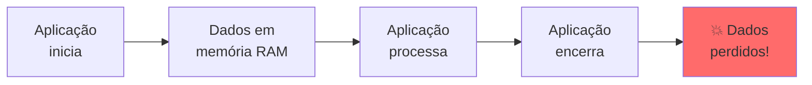
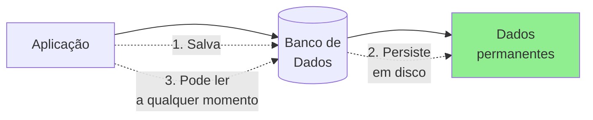
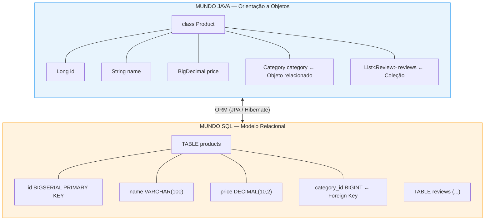
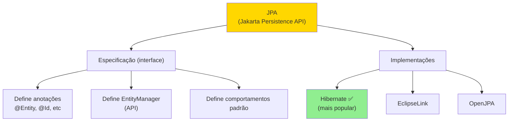
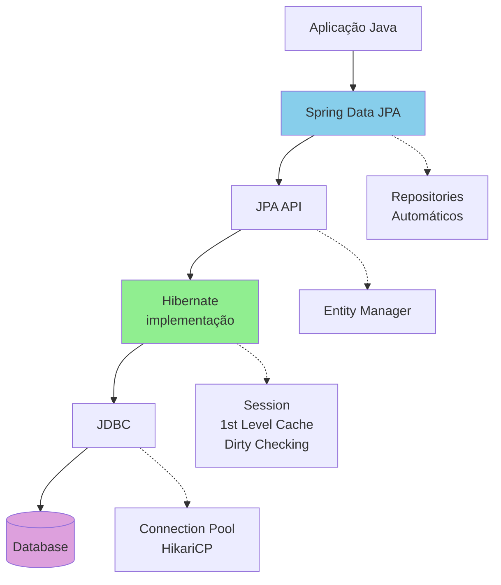

# Slide 13: Fundamentos de Persistência & JPA

**Horário:** 10:30 - 10:50

---

## 💾 O que é Persistência?

### Problema: Dados em Memória são Voláteis



### Solução: Persistir em Banco de Dados



---

## 🗃️ Modelo Relacional vs Orientação a Objetos

### Impedância Objeto-Relacional



---

## 🔧 ORM: Object-Relational Mapping

### O que é JPA?



**Spring Data JPA** = JPA + Repositories + Convenções Spring

---

## 📦 Arquitetura JPA/Hibernate



---

## ⚙️ Configuração: application.yml

```yaml
spring:
  # Datasource - conexão com banco
  datasource:
    url: jdbc:postgresql://localhost:5432/java_training
    username: postgres
    password: postgres
    driver-class-name: org.postgresql.Driver
    
    # Connection Pool (HikariCP)
    hikari:
      maximum-pool-size: 10
      minimum-idle: 5
      connection-timeout: 20000
      idle-timeout: 300000
  
  # JPA Configuration
  jpa:
    # Hibernate specific
    hibernate:
      ddl-auto: update  # create, update, validate, none
      naming:
        physical-strategy: org.hibernate.boot.model.naming.PhysicalNamingStrategyStandardImpl
    
    # Mostrar SQL no console
    show-sql: true
    properties:
      hibernate:
        format_sql: true
        use_sql_comments: true
        jdbc:
          batch_size: 20
    
    # Dialeto do banco
    database-platform: org.hibernate.dialect.PostgreSQLDialect
```

---

## 🎯 hibernate.ddl-auto: Quando Usar?

| Valor | Comportamento | Quando usar |
|-------|---------------|-------------|
| `none` | Não faz nada | Produção (sempre!) |
| `validate` | Valida schema contra entities | Produção, CI/CD |
| `update` | Adiciona colunas/tabelas faltantes | Dev (com cuidado!) |
| `create` | DROP + CREATE tudo ao iniciar | Testes automatizados |
| `create-drop` | DROP ao encerrar aplicação | Testes, demos |

**⚠️ ATENÇÃO:**
```java
// ❌ NUNCA em produção:
spring.jpa.hibernate.ddl-auto=create  // APAGA TUDO! 💥

// ✅ Em produção:
spring.jpa.hibernate.ddl-auto=none  ou validate
// E use migrations (Flyway/Liquibase)
```

---

## 🎬 DEMO: Primeira Entity

```java
// src/main/java/com/example/model/Product.java
package com.example.model;

import jakarta.persistence.*;
import java.math.BigDecimal;
import java.time.LocalDateTime;

@Entity  // ← Marca como entidade JPA
@Table(name = "products")  // ← Nome da tabela (opcional)
public class Product {
    
    @Id  // ← Primary Key
    @GeneratedValue(strategy = GenerationType.IDENTITY)  // ← Auto-increment
    private Long id;
    
    @Column(name = "name", nullable = false, length = 100)
    private String name;
    
    @Column(columnDefinition = "TEXT")
    private String description;
    
    @Column(nullable = false, precision = 10, scale = 2)
    private BigDecimal price;
    
    @Column(length = 50)
    private String category;
    
    @Column(name = "created_at", nullable = false, updatable = false)
    private LocalDateTime createdAt;
    
    @Column(name = "updated_at")
    private LocalDateTime updatedAt;
    
    // Construtores
    public Product() {}  // ← JPA precisa de construtor vazio!
    
    public Product(String name, BigDecimal price, String category) {
        this.name = name;
        this.price = price;
        this.category = category;
    }
    
    // Lifecycle Callbacks
    @PrePersist
    protected void onCreate() {
        createdAt = LocalDateTime.now();
        updatedAt = LocalDateTime.now();
    }
    
    @PreUpdate
    protected void onUpdate() {
        updatedAt = LocalDateTime.now();
    }
    
    // Getters e Setters (JPA precisa!)
    public Long getId() { return id; }
    public void setId(Long id) { this.id = id; }
    
    public String getName() { return name; }
    public void setName(String name) { this.name = name; }
    
    public BigDecimal getPrice() { return price; }
    public void setPrice(BigDecimal price) { this.price = price; }
    
    // ... demais getters/setters
}
```

---

## 🔍 Anotações JPA Essenciais

### Entity & Table

| Anotação | Descrição | Exemplo |
|----------|-----------|---------|
| `@Entity` | Marca classe como entidade | `@Entity class Product` |
| `@Table` | Customiza nome da tabela | `@Table(name="products")` |
| `@Id` | Define primary key | `@Id private Long id` |
| `@GeneratedValue` | Auto-increment | `@GeneratedValue(strategy=IDENTITY)` |

### Column Mapping

| Anotação | Descrição | Exemplo |
|----------|-----------|---------|
| `@Column` | Customiza coluna | `@Column(name="product_name")` |
| `nullable` | NOT NULL | `@Column(nullable=false)` |
| `unique` | UNIQUE constraint | `@Column(unique=true)` |
| `length` | VARCHAR tamanho | `@Column(length=100)` |
| `precision/scale` | DECIMAL | `@Column(precision=10, scale=2)` |
| `columnDefinition` | SQL customizado | `@Column(columnDefinition="TEXT")` |

---

## 🕐 Lifecycle Callbacks

```java
@Entity
public class Product {
    
    @PrePersist  // Antes de INSERT
    protected void onCreate() {
        createdAt = LocalDateTime.now();
        log.info("Creating new product: {}", name);
    }
    
    @PostPersist  // Depois de INSERT
    protected void afterCreate() {
        log.info("Product created with ID: {}", id);
    }
    
    @PreUpdate  // Antes de UPDATE
    protected void onUpdate() {
        updatedAt = LocalDateTime.now();
        log.info("Updating product: {}", id);
    }
    
    @PostUpdate  // Depois de UPDATE
    protected void afterUpdate() {
        log.info("Product updated: {}", id);
    }
    
    @PreRemove  // Antes de DELETE
    protected void onDelete() {
        log.info("Deleting product: {}", id);
    }
    
    @PostRemove  // Depois de DELETE
    protected void afterDelete() {
        log.info("Product deleted: {}", id);
    }
    
    @PostLoad  // Depois de SELECT
    protected void afterLoad() {
        log.debug("Product loaded: {}", id);
    }
}
```

---

## 🔄 GeneratedValue Strategies

```java
// 1. IDENTITY - Auto-increment do banco (PostgreSQL SERIAL, MySQL AUTO_INCREMENT)
@Id
@GeneratedValue(strategy = GenerationType.IDENTITY)
private Long id;
// SQL: id BIGSERIAL PRIMARY KEY

// 2. SEQUENCE - Sequence do banco (PostgreSQL, Oracle)
@Id
@GeneratedValue(strategy = GenerationType.SEQUENCE, generator = "product_seq")
@SequenceGenerator(name = "product_seq", sequenceName = "product_sequence", allocationSize = 1)
private Long id;
// SQL: CREATE SEQUENCE product_sequence

// 3. TABLE - Tabela separada para IDs (qualquer banco)
@Id
@GeneratedValue(strategy = GenerationType.TABLE, generator = "product_gen")
@TableGenerator(name = "product_gen", table = "id_generator")
private Long id;
// SQL: CREATE TABLE id_generator (...)

// 4. AUTO - Hibernate decide (não recomendado)
@Id
@GeneratedValue(strategy = GenerationType.AUTO)
private Long id;
```

**Recomendação:** Use `IDENTITY` para PostgreSQL/MySQL moderno.
