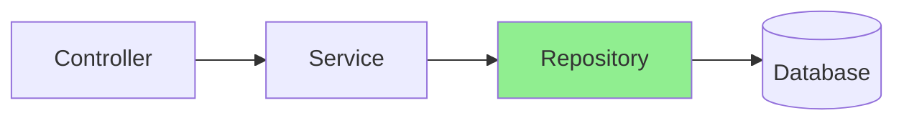

# Slide 15: Spring Data JPA Repositories

**Horário:** 13:00 - 13:20

---

## 🗄️ Repository Pattern



O Repository Pattern é uma camada de abstração entre a lógica de negócio e a camada de acesso a dados. Ele encapsula toda a lógica necessária para acessar fontes de dados.

---

## 📚 Hierarquia de Interfaces

```java
Repository<T, ID>
    ↓
CrudRepository<T, ID>
    ↓  + batch operations (saveAll, deleteAll)
PagingAndSortingRepository<T, ID>
    ↓  + pagination & sorting
JpaRepository<T, ID>  ← Use este! ✅
    ↓  + JPA specific (flush, batch delete, etc)
```

**Por que usar JpaRepository?**
- Contém TODOS os métodos das interfaces pai
- Métodos extras JPA: `flush()`, `saveAndFlush()`, `deleteInBatch()`
- É a mais completa e recomendada para projetos Spring Boot

---

## 🎬 DEMO: Repository Completo

```java
@Repository
public interface ProductRepository extends JpaRepository<Product, Long> {
    
    // 1. Métodos herdados de JpaRepository (NÃO precisa implementar!)
    // save(entity), findById(id), findAll(), deleteById(id), count(), etc.
    
    // 2. Query Methods - Spring gera implementação automaticamente
    List<Product> findByName(String name);
    List<Product> findByCategory(String category);
    List<Product> findByPriceGreaterThan(BigDecimal price);
    List<Product> findByNameContainingIgnoreCase(String keyword);
    Optional<Product> findByNameAndCategory(String name, String category);
    boolean existsByName(String name);
    long countByCategory(String category);
    void deleteByCategory(String category);
    
    // 3. Paginação
    Page<Product> findByCategory(String category, Pageable pageable);
    
    // 4. @Query JPQL
    @Query("SELECT p FROM Product p WHERE p.price BETWEEN :min AND :max")
    List<Product> findByPriceRange(@Param("min") BigDecimal min, 
                                    @Param("max") BigDecimal max);
    
    // 5. @Query SQL Nativo
    @Query(value = "SELECT * FROM products WHERE LOWER(name) LIKE LOWER(:keyword)", 
           nativeQuery = true)
    List<Product> searchByKeyword(@Param("keyword") String keyword);
    
    // 6. Projeções (retornar apenas campos específicos)
    List<ProductNameAndPrice> findAllProjectedBy();
    
    // 7. @EntityGraph (resolver N+1)
    @EntityGraph(attributePaths = {"category", "reviews"})
    Optional<Product> findWithDetailsById(Long id);
}

// Projeção (interface)
public interface ProductNameAndPrice {
    String getName();
    BigDecimal getPrice();
}
```

---

## 🔍 Query Method Keywords

| Keyword | SQL Equivalente | Exemplo |
|---------|-----------------|---------|
| `findBy` | SELECT | `findByName(String name)` |
| `existsBy` | SELECT COUNT | `existsByEmail(String email)` |
| `countBy` | SELECT COUNT | `countByCategory(String cat)` |
| `deleteBy` | DELETE | `deleteByStatus(String status)` |
| `And` | AND | `findByNameAndCategory(...)` |
| `Or` | OR | `findByNameOrCategory(...)` |
| `Between` | BETWEEN | `findByPriceBetween(min, max)` |
| `LessThan` | < | `findByPriceLessThan(price)` |
| `GreaterThan` | > | `findByAgeGreaterThan(age)` |
| `Like` | LIKE | `findByNameLike("%laptop%")` |
| `Containing` | LIKE %x% | `findByNameContaining("lap")` |
| `StartingWith` | LIKE x% | `findByNameStartingWith("Lap")` |
| `EndingWith` | LIKE %x | `findByNameEndingWith("top")` |
| `IgnoreCase` | LOWER() | `findByNameIgnoreCase("LAPTOP")` |
| `OrderBy` | ORDER BY | `findByCategoryOrderByPriceDesc(...)` |
| `In` | IN | `findByIdIn(List<Long> ids)` |
| `NotNull` | IS NOT NULL | `findByDescriptionNotNull()` |
| `IsNull` | IS NULL | `findByDescriptionIsNull()` |

---

## ⚡ Exemplos Práticos

```java
// Busca simples
Optional<Product> product = repository.findById(1L);

// Busca com filtro
List<Product> laptops = repository.findByCategory("Laptops");

// Busca com múltiplos critérios
List<Product> results = repository.findByNameContainingIgnoreCaseAndPriceGreaterThan(
    "gaming", new BigDecimal("1000")
);

// Verificar existência
boolean exists = repository.existsByName("MacBook Pro");

// Contar
long count = repository.countByCategory("Smartphones");

// Deletar por critério (cuidado! ⚠️)
repository.deleteByCategory("Obsolete");
```

---

## 🎯 Boas Práticas

✅ **Faça:**
- Use `JpaRepository` como interface base
- Nomeie métodos seguindo convenções Spring Data
- Use `Optional<T>` para resultados únicos que podem não existir
- Use `@Transactional` em métodos de modificação (delete, update)

❌ **Evite:**
- Criar queries complexas demais com query methods
- Usar `deleteBy...` sem transaction
- Retornar `null` - prefira `Optional`
- Expor entidades diretamente no controller

---

## 🏋️ Exercício Rápido (5 min)

Crie um `TaskRepository` que tenha métodos para:

1. Buscar tarefas por status
2. Buscar tarefas criadas após uma data
3. Verificar se existe tarefa com determinado título
4. Contar tarefas não concluídas
5. Buscar tarefas do usuário ordenadas por prioridade

```java
@Repository
public interface TaskRepository extends JpaRepository<Task, Long> {
    // Seu código aqui
}
```

**Próximo:** Query Methods avançados e JPQL →
