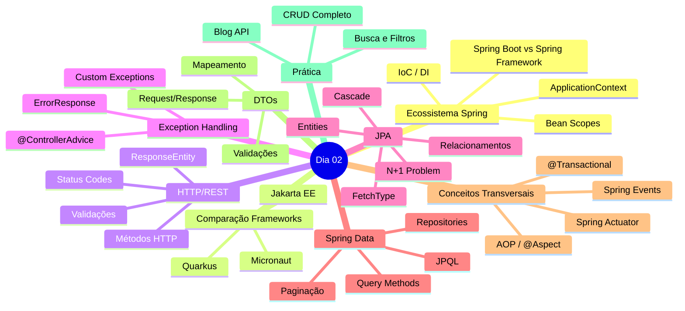

# Slide 22: Review Final & Q&A

**Horário:** 16:15 - 16:30

---

## ✅ O que aprendemos hoje - Dia 02

### 🌅 Manhã (09:00 - 12:00)

**1. Ecossistema Spring & Fundamentos (09:00 - 09:15)**
- ✓ O que é o Spring Framework (IoC, DI, AOP)
- ✓ ApplicationContext e ciclo de vida dos Beans
- ✓ Escopos de Beans (singleton, prototype, request, session)
- ✓ Tipos de injeção (construtor, setter, field)
- ✓ Spring Boot vs Spring Framework
- ✓ Módulos e Starters

**2. Spring no Contexto do Mercado**
- ✓ Spring Boot vs Jakarta EE (anotações, filosofia, container)
- ✓ Spring Boot vs Quarkus (performance, cloud-native)
- ✓ Spring Boot vs Micronaut (DI compile-time vs runtime)
- ✓ Quando escolher cada framework

**3. Criação de Projeto & Primeira API REST (09:15 - 10:30)**
- ✓ Spring Initializr e estrutura do projeto
- ✓ @SpringBootApplication, @RestController, @Service, @Repository
- ✓ CRUD completo com DTOs (Records)
- ✓ Profiles, DevTools

**4. HTTP & REST Avançado (10:30 - 12:00)**
- ✓ Anatomia HTTP (method, headers, body, status)
- ✓ Status codes (2xx, 3xx, 4xx, 5xx)
- ✓ Princípios REST (stateless, recursos, representações)
- ✓ @PathVariable, @RequestParam, @RequestHeader, @RequestBody
- ✓ Bean Validation (@NotBlank, @Email, @Size, etc)
- ✓ @Valid para validar DTOs
- ✓ Tratamento de erros de validação

---

### 🍽️ Almoço (12:00 - 13:00)

---

### 🌆 Tarde (13:00 - 16:30)

**5. Exception Handling Global (13:00 - 13:30)**
- ✓ @RestControllerAdvice
- ✓ @ExceptionHandler
- ✓ Exceções customizadas
- ✓ ErrorResponse padronizado

**6. JPA Fundamentals & Relacionamentos (13:30 - 15:00)**
- ✓ ORM e impedância objeto-relacional
- ✓ Arquitetura JPA (EntityManager, Persistence Context)
- ✓ Entity lifecycle (Transient, Managed, Detached, Removed)
- ✓ @Entity, @Id, @GeneratedValue, @Column
- ✓ @OneToOne, @OneToMany / @ManyToOne, @ManyToMany
- ✓ Cascade types (PERSIST, MERGE, REMOVE, ALL)
- ✓ FetchType (LAZY vs EAGER)
- ✓ N+1 problem e soluções (JOIN FETCH, @EntityGraph)

**7. Spring Data Repositories & Queries**
- ✓ Hierarquia: Repository → CrudRepository → JpaRepository
- ✓ Query methods (findBy, existsBy, countBy, deleteBy)
- ✓ Keywords (And, Or, Between, Like, Containing, etc)
- ✓ JPQL vs SQL (entidades vs tabelas)
- ✓ @Query com JPQL e SQL nativo
- ✓ @Modifying para UPDATE/DELETE
- ✓ JOIN vs JOIN FETCH
- ✓ Projeções (DTO e Interface)
- ✓ Paginação (Pageable, PageRequest, Page<T>)
- ✓ Ordenação (Sort, Sort.Order)

**8. DTOs e Mapeamento**
- ✓ Por que usar DTOs (segurança, performance, desacoplamento)
- ✓ Request DTOs vs Response DTOs
- ✓ Factory methods (from/to)
- ✓ Validações em DTOs

**9. Conceitos Transversais do Spring** ⭐ NOVO!
- ✓ AOP — @Aspect, @Around, @Before, @After
- ✓ Spring Events — ApplicationEventPublisher, @EventListener
- ✓ @Transactional — atomicidade, readOnly, propagation, rollback
- ✓ Spring Actuator — /health, /metrics, /info, monitoramento
- ✓ Profiles — application-dev.yml, @Profile

**10. Coffee Break ☕ (15:00 - 15:15)**

**11. Exercício Blog API (15:15 - 16:15)**
- ✓ Entities: Post, Comment, Category, Tag
- ✓ Relacionamentos @OneToMany e @ManyToMany
- ✓ Repositories com queries customizadas
- ✓ DTOs validados
- ✓ Services com lógica de negócio
- ✓ Controllers RESTful
- ✓ Paginação e busca
- ✓ Exception handling

---

## 🎯 Principais Conceitos Aprendidos



---

## 💡 Principais Lições

### 0. Entenda o ecossistema
```java
// Spring Boot é opinativo — mas entender os conceitos por baixo é essencial
// IoC, DI, AOP, ApplicationContext, Bean Lifecycle
// Isso diferencia um dev junior de um senior!

// Compare com outros frameworks para entender os trade-offs:
// Spring Boot → produtividade + ecossistema
// Quarkus → performance + cloud-native
// Micronaut → compile-time DI + baixo consumo
// Jakarta EE → especificações formais
```

### 1. Sempre use DTOs
```java
// ❌ NÃO
@GetMapping("/{id}")
public User findById(@PathVariable Long id) {
    return repository.findById(id).orElseThrow();
}

// ✅ SIM
@GetMapping("/{id}")
public ResponseEntity<UserResponse> findById(@PathVariable Long id) {
    User user = service.findById(id);
    return ResponseEntity.ok(UserResponse.from(user));
}
```

### 2. Cuidado com N+1
```java
// ❌ Causa N+1
List<Post> posts = postRepository.findAll();
posts.forEach(p -> p.getComments().size()); // SELECT para cada post!

// ✅ Resolve com JOIN FETCH
@Query("SELECT DISTINCT p FROM Post p LEFT JOIN FETCH p.comments")
List<Post> findAllWithComments();
```

### 3. Use FetchType LAZY
```java
// ✅ Padrão correto
@OneToMany(fetch = FetchType.LAZY, mappedBy = "post")
private List<Comment> comments;

// Carregue sob demanda quando precisar
@EntityGraph(attributePaths = {"comments"})
Optional<Post> findWithCommentsById(Long id);
```

### 4. Valide sempre
```java
public record CreatePostRequest(
    @NotBlank(message = "Título obrigatório")
    @Size(min = 5, max = 200)
    String title,
    
    @NotBlank @Size(min = 20)
    String content,
    
    @NotNull Long categoryId
) {}
```

### 5. Use @Transactional corretamente
```java
// ✅ readOnly para consultas
@Transactional(readOnly = true)
public List<ProductResponse> findAll() { ... }

// ✅ Transação para escrita
@Transactional
public ProductResponse create(CreateProductRequest req) { ... }

// ⚠️ Cuidado com chamadas internas — proxy não intercepta!
```

### 6. Trate exceções globalmente
```java
@RestControllerAdvice
public class GlobalExceptionHandler {
    
    @ExceptionHandler(EntityNotFoundException.class)
    public ResponseEntity<ErrorResponse> handleNotFound(EntityNotFoundException ex) {
        return ResponseEntity
            .status(HttpStatus.NOT_FOUND)
            .body(new ErrorResponse(ex.getMessage()));
    }
}
```

---

## 🏠 Tarefa de Casa

### 1. **Completar Exercício Blog API** ⭐

Adicione as funcionalidades que faltaram:
- [ ] CategoryController completo
- [ ] TagController completo
- [ ] Busca de posts por tag
- [ ] Estatísticas (posts por categoria, tags mais usadas)

### 2. **Melhorias** 🚀

- [ ] **Soft Delete**: Ao invés de deletar, marcar como `deleted = true`
- [ ] **Auditoria**: @CreatedBy, @LastModifiedBy (Spring Data JPA Auditing)
- [ ] **Slug**: Adicionar campo `slug` em Post para URLs amigáveis
- [ ] **Paginação de Comments**: Paginar comentários de um post

### 3. **Extras** 💎

- [ ] Implementar upload de imagem do post
- [ ] Adicionar campo `viewCount` para contar visualizações
- [ ] Sistema de likes/dislikes para posts
- [ ] Filtros avançados (data range, múltiplas tags)

### 4. **Estudo** 📚

Revisar para o Dia 03:
- [ ] SOLID Principles (especialmente SRP, DIP)
- [ ] Design Patterns (Strategy, Factory, Builder)
- [ ] Transactions (@Transactional)
- [ ] Database Migrations (Flyway)

---

## 🤔 Perguntas Frequentes - Dia 02

**P: Quando usar @Transactional?**  
R: Em métodos que fazem múltiplas operações no banco que devem ser atômicas (tudo ou nada). Falaremos mais no Dia 03!

**P: JOIN FETCH funciona com paginação?**  
R: Não! JOIN FETCH com coleções + Page causa problemas. Use @EntityGraph ou queries separadas.

**P: Posso usar Record para Entity?**  
R: Não! JPA precisa de setters e construtor vazio. Use classes normais para entities.

**P: Como testar repositories?**  
R: Use @DataJpaTest! Veremos testes no Dia 5.

**P: Devo sempre criar índices?**  
R: Sim, para campos usados em WHERE, JOIN e ORDER BY. Ex: `@Column(name = "email", unique = true)` cria índice automaticamente.

---

## 📊 Progresso do Curso

```
Dia 01: ✅ Java Moderno + Spring Boot Basics
Dia 02: ✅ REST APIs + Spring Data JPA
Dia 03: ⏭️ SOLID, Design Patterns, Transactions
Dia 04: ⏭️ Security & Authentication
Dia 05: ⏭️ Testing (Unit, Integration, E2E)
Dia 06: ⏭️ Mensageria & Async
Dia 07: ⏭️ Observabilidade & Performance
Dia 08: ⏭️ Cloud & Deploy
Dia 09: ⏭️ Projeto Final
```

**Progresso: 22% completo! 🎉**

---

## 💬 Feedback

Queremos sua opinião sobre o Dia 02:

1. **Ritmo:** Muito rápido / Adequado / Muito lento?
2. **Dificuldade:** Fácil / Médio / Difícil?
3. **Exercício:** Foi útil? Tempo suficiente?
4. **O que mais gostou?**
5. **O que pode melhorar?**

---

## 🎉 Parabéns!

Você completou o **Dia 02** do curso de Java Intermediário!

Hoje você aprendeu a criar APIs REST completas com Spring Data JPA, incluindo:
- Ecossistema Spring (IoC, DI, AOP, ApplicationContext)
- Comparação com outros frameworks (Jakarta EE, Quarkus, Micronaut)
- Persistência de dados com JPA
- Relacionamentos complexos
- Queries customizadas
- Paginação
- Exception handling
- DTOs e validações
- Conceitos transversais (AOP, Events, @Transactional, Actuator)

**Continue praticando! Amanhã vamos para o próximo nível! 🚀**

---

### ⏰ Até amanhã!

**Dia 03 - SOLID & Design Patterns**  
09:00 - Não se atrase! ⏰

Bons estudos! 📚
