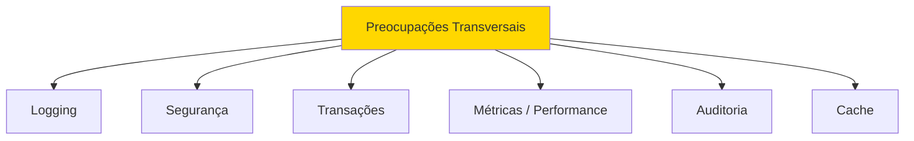
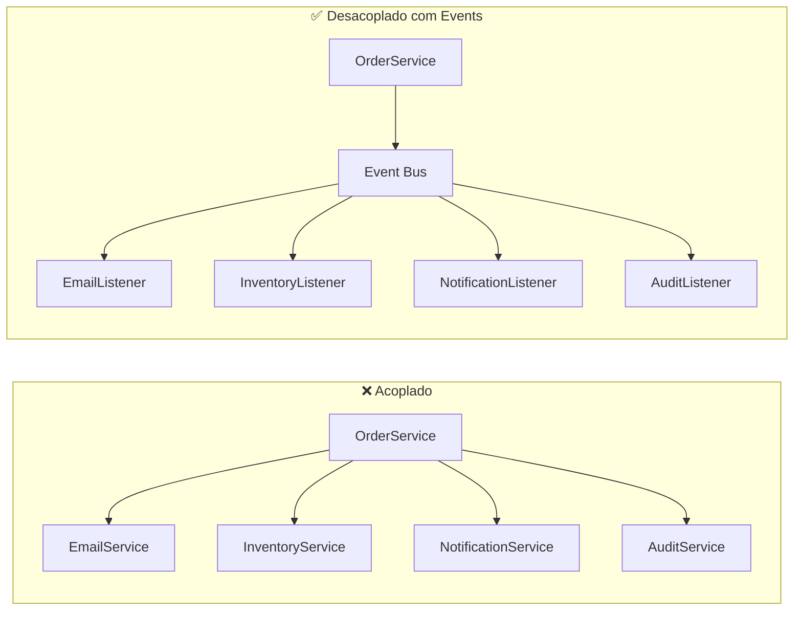

# Slide 23: Conceitos Avançados — AOP & Spring Events

**Horário:** Material complementar (Conceitos Transversais)

---

## 🎯 AOP — Programação Orientada a Aspectos

### O Problema: Cross-Cutting Concerns



**Problema sem AOP:** Código repetido em cada Service!

```java
// ❌ SEM AOP - Logging repetitivo em TODO método
@Service
public class ProductService {
    
    public ProductResponse findById(Long id) {
        long start = System.currentTimeMillis();               // ← Repetido!
        log.info("Buscando produto id={}", id);                // ← Repetido!
        
        ProductResponse result = /* lógica de negócio */;
        
        log.info("Produto encontrado em {}ms",                 // ← Repetido!
            System.currentTimeMillis() - start);
        return result;
    }
    
    public ProductResponse create(CreateProductRequest req) {
        long start = System.currentTimeMillis();               // ← Repetido!
        log.info("Criando produto: {}", req.name());           // ← Repetido!
        // ... mesma estrutura
    }
}
```

---

## ✅ Solução: AOP com @Aspect

```java
@Aspect
@Component
public class LoggingAspect {

    private static final Logger log = LoggerFactory.getLogger(LoggingAspect.class);

    // Intercepta TODOS os métodos de Services
    @Around("execution(* com.example.service.*.*(..))")
    public Object logExecutionTime(ProceedingJoinPoint joinPoint) throws Throwable {
        String methodName = joinPoint.getSignature().toShortString();
        
        log.info("▶ Executando: {}", methodName);
        long start = System.currentTimeMillis();
        
        Object result = joinPoint.proceed(); // Executa o método real
        
        long duration = System.currentTimeMillis() - start;
        log.info("✅ {} executado em {}ms", methodName, duration);
        
        return result;
    }
}
```

---

## 📚 Tipos de Advice (Intercepção)

| Advice | Quando Executa | Uso Típico |
|--------|----------------|------------|
| `@Before` | Antes do método | Validação, logging de entrada |
| `@After` | Depois (sempre) | Cleanup, logging |
| `@AfterReturning` | Após retorno com sucesso | Auditoria, cache |
| `@AfterThrowing` | Após exceção | Logging de erros |
| `@Around` | Antes e depois | Métricas, transações |

```java
@Aspect
@Component
public class AuditAspect {

    @AfterReturning(
        pointcut = "execution(* com.example.service.*.create*(..))",
        returning = "result"
    )
    public void auditCreation(JoinPoint joinPoint, Object result) {
        log.info("AUDIT: {} criou recurso: {}", 
            SecurityContextHolder.getContext().getAuthentication().getName(),
            result);
    }

    @AfterThrowing(
        pointcut = "execution(* com.example.service.*.*(..))",
        throwing = "ex"
    )
    public void logErrors(JoinPoint joinPoint, Exception ex) {
        log.error("ERRO em {}: {}", 
            joinPoint.getSignature().toShortString(), 
            ex.getMessage());
    }
}
```

---

## Dependência AOP

```xml
<dependency>
    <groupId>org.springframework.boot</groupId>
    <artifactId>spring-boot-starter-aop</artifactId>
</dependency>
```

---

## 📢 Spring Events — Comunicação Desacoplada

### O Problema: Acoplamento entre Services

```java
// ❌ Acoplamento forte
@Service
public class OrderService {
    private final OrderRepository orderRepo;
    private final EmailService emailService;        // ← Acoplado!
    private final InventoryService inventoryService; // ← Acoplado!
    private final NotificationService notifService;  // ← Acoplado!
    private final AuditService auditService;         // ← Acoplado!
    
    public Order createOrder(CreateOrderRequest req) {
        Order order = orderRepo.save(/* ... */);
        
        emailService.sendConfirmation(order);       // ← Chamada direta
        inventoryService.decreaseStock(order);       // ← Chamada direta
        notifService.sendPushNotification(order);    // ← Chamada direta
        auditService.logOrderCreation(order);        // ← Chamada direta
        
        return order;
    }
}
```

---

### ✅ Solução: Spring Events

```java
// 1. Definir o Evento (use Record!)
public record OrderCreatedEvent(Long orderId, String customerEmail, List<Long> productIds) {}
```

```java
// 2. Publicar o Evento
@Service
public class OrderService {
    private final OrderRepository orderRepo;
    private final ApplicationEventPublisher publisher; // ← Apenas o publisher!
    
    public OrderService(OrderRepository orderRepo, ApplicationEventPublisher publisher) {
        this.orderRepo = orderRepo;
        this.publisher = publisher;
    }
    
    @Transactional
    public Order createOrder(CreateOrderRequest req) {
        Order order = orderRepo.save(/* ... */);
        
        // Publica evento — quem quiser ouvir, ouça!
        publisher.publishEvent(new OrderCreatedEvent(
            order.getId(), 
            order.getCustomerEmail(), 
            order.getProductIds()
        ));
        
        return order;
    }
}
```

```java
// 3. Listeners — cada um cuida da sua responsabilidade
@Component
public class EmailListener {
    @EventListener
    public void onOrderCreated(OrderCreatedEvent event) {
        emailService.sendConfirmation(event.customerEmail(), event.orderId());
    }
}

@Component
public class InventoryListener {
    @EventListener
    public void onOrderCreated(OrderCreatedEvent event) {
        inventoryService.decreaseStock(event.productIds());
    }
}

@Component
public class AuditListener {
    @EventListener
    public void onOrderCreated(OrderCreatedEvent event) {
        auditService.log("Order created: " + event.orderId());
    }
}
```

---

## 📊 Antes vs Depois



**Vantagens:**
- ✅ OrderService não conhece os listeners
- ✅ Fácil adicionar novos listeners sem alterar OrderService
- ✅ Cada listener pode ser testado isoladamente
- ✅ Listeners podem ser `@Async` para processamento paralelo

---

## 🎯 Quando usar Events?

| Use Events ✅ | Não use Events ❌ |
|---------------|-------------------|
| Notificações | Resultado é necessário para o fluxo |
| Auditoria | Operação deve ser síncrona e transacional |
| Cache invalidation | Lógica simples com 1-2 dependências |
| Logs e métricas | Tratamento de erro complexo |
| Side effects desacoplados | Quando a ordem importa |

---

**Próximo:** @Transactional & Spring Actuator →
