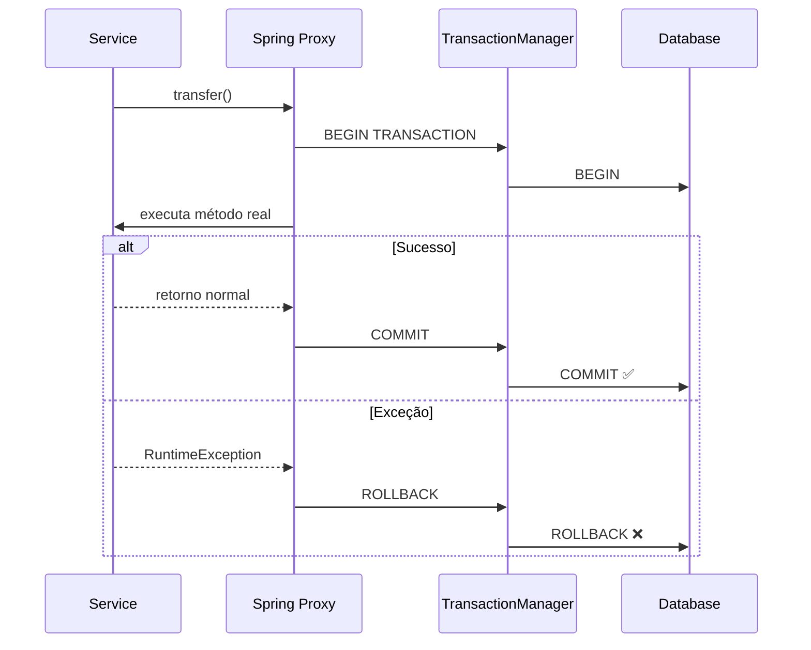
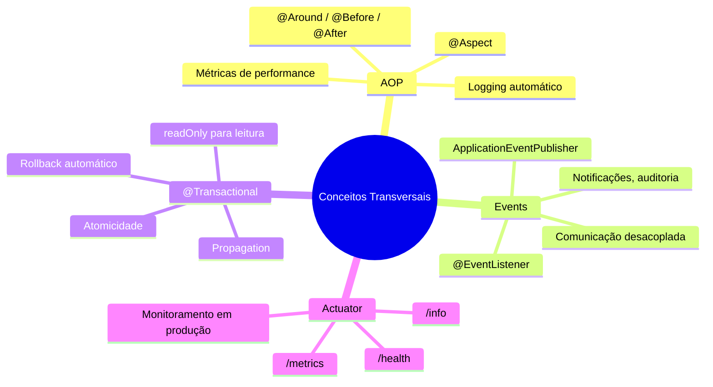

# Slide 24: @Transactional & Spring Actuator

**Horário:** Material complementar (Conceitos Transversais)

---

## 💰 @Transactional — Gerenciamento de Transações

### O Problema: Operações Parciais

```java
// ❌ Sem transação — se falhar no meio, dados ficam inconsistentes!
@Service
public class TransferService {
    
    public void transfer(Long fromId, Long toId, BigDecimal amount) {
        Account from = accountRepository.findById(fromId).orElseThrow();
        Account to = accountRepository.findById(toId).orElseThrow();
        
        from.debit(amount);
        accountRepository.save(from);  // ✅ Debita
        
        // 💥 E se der erro aqui? Dinheiro sumiu!
        
        to.credit(amount);
        accountRepository.save(to);    // ❌ Nunca executou
    }
}
```

---

### ✅ Solução: @Transactional

```java
@Service
public class TransferService {

    @Transactional // Se qualquer operação falhar, TUDO é revertido
    public void transfer(Long fromId, Long toId, BigDecimal amount) {
        Account from = accountRepository.findById(fromId).orElseThrow();
        Account to = accountRepository.findById(toId).orElseThrow();
        
        from.debit(amount);
        to.credit(amount);
        
        accountRepository.save(from);
        accountRepository.save(to);
        // Se qualquer exceção ocorrer → ROLLBACK automático
    }

    @Transactional(readOnly = true) // Otimização para leitura
    public List<Account> findAll() {
        return accountRepository.findAll();
    }
}
```

---

## 📊 Como funciona por trás?



---

## ⚙️ Atributos do @Transactional

| Atributo | Descrição | Padrão |
|----------|-----------|--------|
| `readOnly` | Otimização para leitura (não faz flush) | `false` |
| `propagation` | Como se comporta com transação existente | `REQUIRED` |
| `isolation` | Nível de isolamento | `DEFAULT` (do banco) |
| `rollbackFor` | Exceptions que causam rollback | `RuntimeException` |
| `noRollbackFor` | Exceptions que NÃO causam rollback | — |
| `timeout` | Tempo máximo da transação (segundos) | `-1` (sem limite) |

---

### Propagation — Comportamento com Transação Existente

```java
// REQUIRED (padrão) — usa existente ou cria nova
@Transactional(propagation = Propagation.REQUIRED)
public void methodA() { /* ... */ }

// REQUIRES_NEW — sempre cria nova (suspende a atual)
@Transactional(propagation = Propagation.REQUIRES_NEW)
public void auditLog() { /* Sempre salva, mesmo se pai falhar */ }

// MANDATORY — exige transação existente (lança exceção se não houver)
@Transactional(propagation = Propagation.MANDATORY)
public void mustBeInTransaction() { /* ... */ }
```

---

### ⚠️ Armadilhas Comuns

```java
// ❌ ERRO 1: Chamada interna — proxy NÃO intercepta!
@Service
public class OrderService {
    
    public void processOrder(Long id) {
        this.saveOrder(id);  // ❌ @Transactional IGNORADO!
    }
    
    @Transactional
    public void saveOrder(Long id) { /* ... */ }
}

// ✅ Solução: Injetar a própria classe ou separar em outro Service

// ❌ ERRO 2: Capturar exceção — rollback NÃO acontece!
@Transactional
public void create() {
    try {
        repository.save(entity);
        riskyOperation(); // Lança exceção
    } catch (Exception e) {
        log.error("Erro", e); // ❌ Transação NÃO faz rollback!
    }
}

// ✅ Solução: Relançar a exceção ou usar TransactionAspectSupport
```

---

### Boas Práticas com @Transactional

```java
@Service
public class ProductService {
    
    // ✅ readOnly para consultas — otimiza performance
    @Transactional(readOnly = true)
    public List<ProductResponse> findAll() {
        return repository.findAll().stream()
            .map(ProductResponse::from)
            .toList();
    }
    
    // ✅ Transação padrão para escrita
    @Transactional
    public ProductResponse create(CreateProductRequest request) {
        Product product = new Product(request.name(), request.price());
        return ProductResponse.from(repository.save(product));
    }
    
    // ✅ rollbackFor para checked exceptions
    @Transactional(rollbackFor = Exception.class)
    public void importProducts(List<CreateProductRequest> requests) throws IOException {
        // Faz rollback mesmo para IOException (checked)
    }
}
```

---

## 📊 Spring Actuator — Monitoramento e Health Checks

### O que é?

O Spring Boot Actuator fornece endpoints prontos para monitorar e gerenciar sua aplicação em produção.

---

### Dependência

```xml
<dependency>
    <groupId>org.springframework.boot</groupId>
    <artifactId>spring-boot-starter-actuator</artifactId>
</dependency>
```

---

### Configuração

```yaml
management:
  endpoints:
    web:
      exposure:
        include: health, info, metrics, env, beans, mappings
  endpoint:
    health:
      show-details: always  # Mostra detalhes de cada componente
  info:
    env:
      enabled: true
```

---

### 📡 Endpoints Disponíveis

| Endpoint | Descrição | Exemplo |
|----------|----------|---------|
| `/actuator/health` | Status da aplicação e dependências | DB UP, Disk OK |
| `/actuator/info` | Informações da aplicação | Versão, nome |
| `/actuator/metrics` | Métricas (JVM, HTTP, etc.) | Memória, threads |
| `/actuator/env` | Variáveis de ambiente | Properties, profiles |
| `/actuator/beans` | Todos os beans registrados no container | Lista completa |
| `/actuator/mappings` | Todos os endpoints HTTP mapeados | GET /api/products |
| `/actuator/loggers` | Gerenciamento de log levels em runtime | Mudar DEBUG→INFO |

---

### 🎬 DEMO: Health Check

```bash
# Verificar saúde da aplicação
curl http://localhost:8080/actuator/health
```

```json
{
  "status": "UP",
  "components": {
    "db": {
      "status": "UP",
      "details": {
        "database": "PostgreSQL",
        "validationQuery": "isValid()"
      }
    },
    "diskSpace": {
      "status": "UP",
      "details": {
        "total": 499963174912,
        "free": 350000000000,
        "threshold": 10485760
      }
    }
  }
}
```

---

### Custom Health Indicator

```java
@Component
public class ExternalApiHealthIndicator implements HealthIndicator {
    
    private final RestTemplate restTemplate;
    
    @Override
    public Health health() {
        try {
            restTemplate.getForObject("https://api.externa.com/status", String.class);
            return Health.up()
                .withDetail("api", "available")
                .build();
        } catch (Exception e) {
            return Health.down()
                .withDetail("api", "unavailable")
                .withException(e)
                .build();
        }
    }
}
```

---

### 📈 Métricas

```bash
# Ver métricas disponíveis
curl http://localhost:8080/actuator/metrics

# Uso de memória JVM
curl http://localhost:8080/actuator/metrics/jvm.memory.used

# Tempo de resposta HTTP
curl http://localhost:8080/actuator/metrics/http.server.requests

# Contador de requests por endpoint
curl "http://localhost:8080/actuator/metrics/http.server.requests?tag=uri:/api/products"
```

---

## 🎯 Resumo — Conceitos Transversais



---

**Próximo:** Exercício Prático — Blog API →
