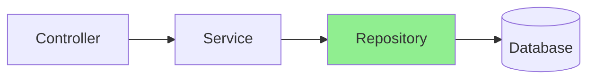
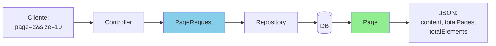
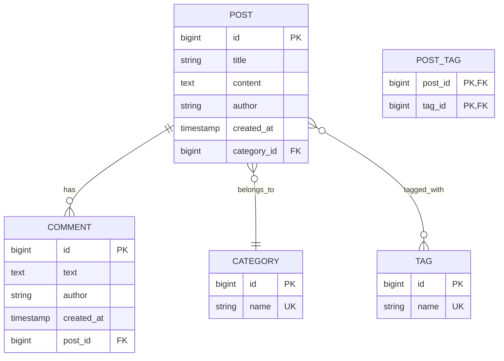

# Slides 7-16: Dia 02 Continuação

## Slide 7: Spring Data JPA Repositories (13:00-13:20)
## Slide 8: Query Methods & JPQL (13:20-13:40)
## Slide 9: Paginação e Ordenação (13:40-14:00)
## Slide 10: DTOs e Mapeamento (14:00-14:20)
## Slide 11: MapStruct vs Manual (14:20-14:40)
## Slide 12: Transações & Performance (14:40-15:00)
## Slide 13-14: Exercício Prático Completo (15:15-16:00)
## Slide 15: Testing JPA (16:00-16:15)
## Slide 16: Review & Q&A (16:15-16:30)

---

# Slide 7: Spring Data JPA Repositories

**Horário:** 13:00 - 13:20

---

## 🗄️ Repository Pattern



---

## 📚 Hierarquia de Interfaces

```java
Repository<T, ID>
    ↓
CrudRepository<T, ID>
    ↓  + batch operations
PagingAndSortingRepository<T, ID>
    ↓  + pagination & sorting
JpaRepository<T, ID>  ← Use este! ✅
    ↓  + JPA specific (flush, batch delete, etc)
```

---

## 🎬 DEMO: Repository Completo

```java
@Repository
public interface ProductRepository extends JpaRepository<Product, Long> {
    
    // 1. Métodos herdados de JpaRepository (NÃO precisa implementar!)
    // save(entity), findById(id), findAll(), deleteById(id), count(), etc.
    
    // 2. Query Methods - Spring gera implementação automaticamente
    List<Product> findByName(String name);
    List<Product> findByCategory(String category);
    List<Product> findByPriceGreaterThan(BigDecimal price);
    List<Product> findByNameContainingIgnoreCase(String keyword);
    Optional<Product> findByNameAndCategory(String name, String category);
    boolean existsByName(String name);
    long countByCategory(String category);
    void deleteByCategory(String category);
    
    // 3. Paginação
    Page<Product> findByCategory(String category, Pageable pageable);
    
    // 4. @Query JPQL
    @Query("SELECT p FROM Product p WHERE p.price BETWEEN :min AND :max")
    List<Product> findByPriceRange(@Param("min") BigDecimal min, 
                                    @Param("max") BigDecimal max);
    
    // 5. @Query SQL Nativo
    @Query(value = "SELECT * FROM products WHERE LOWER(name) LIKE LOWER(:keyword)", 
           nativeQuery = true)
    List<Product> searchByKeyword(@Param("keyword") String keyword);
    
    // 6. Projeções
    List<ProductNameAndPrice> findAllProjectedBy();
    
    // 7. @EntityGraph (resolver N+1)
    @EntityGraph(attributePaths = {"category", "reviews"})
    Optional<Product> findWithDetailsById(Long id);
}

// Projeção (interface)
interface ProductNameAndPrice {
    String getName();
    BigDecimal getPrice();
}
```

---

## 🔍 Query Method Keywords

| Keyword | SQL | Exemplo |
|---------|-----|---------|
| `findBy` | SELECT | `findByName(String name)` |
| `existsBy` | SELECT COUNT | `existsByEmail(String email)` |
| `countBy` | SELECT COUNT | `countByCategory(String cat)` |
| `deleteBy` | DELETE | `deleteByStatus(String status)` |
| `And` | AND | `findByNameAndCategory(...)` |
| `Or` | OR | `findByNameOrCategory(...)` |
| `Between` | BETWEEN | `findByPriceBetween(min, max)` |
| `LessThan` | < | `findByPriceLessThan(price)` |
| `GreaterThan` | > | `findByAgeGreaterThan(age)` |
| `Like` | LIKE | `findByNameLike("%laptop%")` |
| `Containing` | LIKE %x% | `findByNameContaining("lap")` |
| `StartingWith` | LIKE x% | `findByNameStartingWith("Lap")` |
| `EndingWith` | LIKE %x | `findByNameEndingWith("top")` |
| `IgnoreCase` | LOWER() | `findByNameIgnoreCase("LAPTOP")` |
| `OrderBy` | ORDER BY | `findByCategory...OrderByPriceDesc(...)` |
| `In` | IN | `findByIdIn(List<Long> ids)` |
| `NotNull` | IS NOT NULL | `findByDescriptionNotNull()` |
| `IsNull` | IS NULL | `findByDescriptionIsNull()` |

---

# Slide 8: Query Methods & JPQL

**Horário:** 13:20 - 13:40

---

## 📝 JPQL - Java Persistence Query Language

### Diferença entre SQL e JPQL

```sql
-- SQL (tabelas e colunas)
SELECT p.id, p.name, p.price 
FROM products p 
WHERE p.category_id = 5;

-- JPQL (entidades e atributos)
SELECT p 
FROM Product p 
WHERE p.category.id = 5
```

---

## 🎯 @Query Examples

```java
@Repository
public interface ProductRepository extends JpaRepository<Product, Long> {
    
    // 1. JPQL Simples
    @Query("SELECT p FROM Product p WHERE p.active = true")
    List<Product> findAllActive();
    
    // 2. Com parâmetros nomeados
    @Query("SELECT p FROM Product p WHERE p.price > :minPrice")
    List<Product> findExpensive(@Param("minPrice") BigDecimal minPrice);
    
    // 3. JOIN
    @Query("SELECT p FROM Product p JOIN p.category c WHERE c.name = :categoryName")
    List<Product> findByCategoryName(@Param("categoryName") String categoryName);
    
    // 4. LEFT JOIN FETCH (evitar N+1)
    @Query("SELECT DISTINCT p FROM Product p " +
           "LEFT JOIN FETCH p.reviews " +
           "WHERE p.id = :id")
    Optional<Product> findByIdWithReviews(@Param("id") Long id);
    
    // 5. Agregação
    @Query("SELECT AVG(p.price) FROM Product p WHERE p.category.id = :categoryId")
    BigDecimal getAveragePriceByCategory(@Param("categoryId") Long categoryId);
    
    // 6. UPDATE
    @Modifying
    @Query("UPDATE Product p SET p.active = false WHERE p.stock = 0")
    int deactivateOutOfStock();
    
    // 7. DELETE
    @Modifying
    @Query("DELETE FROM Product p WHERE p.createdAt < :date")
    int deleteOlderThan(@Param("date") LocalDateTime date);
    
    // 8. DTO Projection
    @Query("SELECT new com.example.dto.ProductSummary(p.id, p.name, p.price) " +
           "FROM Product p WHERE p.active = true")
    List<ProductSummary> findAllSummaries();
    
    // 9. Native SQL (quando JPQL não é suficiente)
    @Query(value = "SELECT * FROM products p " +
                   "WHERE p.price > :price " +
                   "AND p.category_id IN (SELECT id FROM categories WHERE active = true)",
           nativeQuery = true)
    List<Product> complexNativeQuery(@Param("price") BigDecimal price);
}
```

---

# Slide 9: Paginação e Ordenação

**Horário:** 13:40 - 14:00

---

## 📄 Pageable & Page



---

## 🎬 DEMO Completo

```java
// Controller
@RestController
@RequestMapping("/api/products")
public class ProductController {
    
    @GetMapping
    public ResponseEntity<Page<ProductResponse>> findAll(
            @RequestParam(defaultValue = "0") int page,
            @RequestParam(defaultValue = "20") int size,
            @RequestParam(defaultValue = "id,asc") String[] sort) {
        
        // Parsing sort: ["name,asc", "price,desc"]
        List<Sort.Order> orders = Arrays.stream(sort)
            .map(s -> {
                String[] parts = s.split(",");
                String property = parts[0];
                Sort.Direction direction = parts.length > 1 && parts[1].equalsIgnoreCase("desc")
                    ? Sort.Direction.DESC
                    : Sort.Direction.ASC;
                return new Sort.Order(direction, property);
            })
            .toList();
        
        Pageable pageable = PageRequest.of(page, size, Sort.by(orders));
        
        Page<Product> productsPage = repository.findAll(pageable);
        
        Page<ProductResponse> response = productsPage.map(ProductResponse::from);
        
        return ResponseEntity.ok(response);
    }
}

// Repository
@Repository
public interface ProductRepository extends JpaRepository<Product, Long> {
    
    Page<Product> findByCategory(String category, Pageable pageable);
    
    @Query("SELECT p FROM Product p WHERE p.price > :minPrice")
    Page<Product> findExpensive(@Param("minPrice") BigDecimal minPrice, Pageable pageable);
}
```

---

## 📊 Response Paginado

```json
{
  "content": [
    {"id": 1, "name": "Laptop", "price": 3500},
    {"id": 2, "name": "Mouse", "price": 50}
  ],
  "pageable": {
    "pageNumber": 0,
    "pageSize": 20,
    "sort": {"sorted": true, "orders": [{"property": "name", "direction": "ASC"}]}
  },
  "totalPages": 5,
  "totalElements": 100,
  "last": false,
  "first": true,
  "numberOfElements": 20,
  "size": 20,
  "number": 0,
  "empty": false
}
```

---

# Slide 10: DTOs e Mapeamento

**Horário:** 14:00 - 14:20

---

## 🎯 Por que usar DTOs?

```mermaid
flowchart TD
    A[Por que DTOs?] --> B[Separação de Concerns]
    A --> C[Controle de Exposição]
    A --> D[Versionamento]
    A --> E[Performance]
    
    B --> B1[Entity != API Contract]
    C --> C1[Ocultar campos sensíveis]
    D --> D1[/api/v1 vs /api/v2]
    E --> E1[Evitar lazy loading]
    
    style A fill:#FFD700
```

---

## 🎬 DEMO: DTO Pattern

```java
// Entity (não expor direto!)
@Entity
public class User {
    private Long id;
    private String username;
    private String password;  // ❌ NUNCA expor!
    private String email;
    private LocalDateTime lastLogin;
    
    @OneToMany
    private List<Order> orders;  // ❌ Pode causar N+1!
}

// Request DTO
public record CreateUserRequest(
    @NotBlank String username,
    @Email String email,
    @Size(min = 8) String password
) {}

// Response DTO
public record UserResponse(
    Long id,
    String username,
    String email,
    LocalDateTime createdAt
) {
    public static UserResponse from(User user) {
        return new UserResponse(
            user.getId(),
            user.getUsername(),
            user.getEmail(),
            user.getCreatedAt()
        );
    }
}

// Controller
@PostMapping
public ResponseEntity<UserResponse> create(@Valid @RequestBody CreateUserRequest req) {
    User user = service.create(req);
    return ResponseEntity.ok(UserResponse.from(user));
}
```

---

# Slide 13: Exercício Prático - Blog API

**Horário:** 15:15 - 16:15

---

## 🎯 Objetivo

Criar API completa para um Blog com:
- Posts, Comments, Categories, Tags
- Relacionamentos OneToMany e ManyToMany
- Paginação e busca
- Exception handling global
- DTOs validados

---

## 📊 Modelo de Dados



---

## 📋 Requisitos

### Endpoints

```
Posts:
  GET    /api/posts?page=0&size=10&sort=createdAt,desc
  GET    /api/posts/{id}
  GET    /api/posts/search?keyword=java&category=Tech
  POST   /api/posts
  PUT    /api/posts/{id}
  DELETE /api/posts/{id}

Comments:
  GET    /api/posts/{postId}/comments
  POST   /api/posts/{postId}/comments
  DELETE /api/comments/{id}

Categories:
  GET    /api/categories
  POST   /api/categories
  
Tags:
  GET    /api/tags
  POST   /api/tags
```

---

## ✅ Critérios de Avaliação

- [ ] Entities com relacionamentos corretos
- [ ] Repositories com query methods
- [ ] DTOs para Request e Response
- [ ] Validação com Bean Validation
- [ ] Paginação funcionando
- [ ] Exception handling global
- [ ] Busca por keyword funcionando
- [ ] Cascade e orphanRemoval corretos
- [ ] FetchType LAZY usado apropriadamente
- [ ] Teste com Postman documentado

---

# Slide 16: Review & Q&A

**Horário:** 16:15 - 16:30

---

## ✅ O que aprendemos hoje

```
✓ HTTP & REST Avançado
  ✓ Status codes, métodos HTTP
  ✓ @PathVariable, @RequestParam, @RequestHeader, @RequestBody
  ✓ ResponseEntity customizado
  
✓ Exception Handling
  ✓ @RestControllerAdvice
  ✓ Exceções customizadas
  ✓ ErrorResponse padronizado
  
✓ Spring Data JPA
  ✓ Entities e anotações
  ✓ Relacionamentos (OneToOne, OneToMany, ManyToMany)
  ✓ Cascade e FetchType
  
✓ Repositories
  ✓ Query Methods
  ✓ @Query JPQL e SQL nativo
  ✓ Paginação e ordenação
  
✓ DTOs
  ✓ Request vs Response
  ✓ Validação Bean Validation
  ✓ Mapeamento Entity ↔ DTO
```

---

## 🏠 Tarefa de Casa

1. **Completar Exercício Blog API**
2. **Adicionar:**
   - Soft delete para Posts
   - Busca por tags
   - Posts mais comentados
3. **Estudar:**
   - Transações (@Transactional)
   - N+1 problem em detalhes
   - Flyway para migrations
4. **Preparar Dia 3:**
   - Revisar SOLID principles
   - Conhecer Design Patterns básicos
