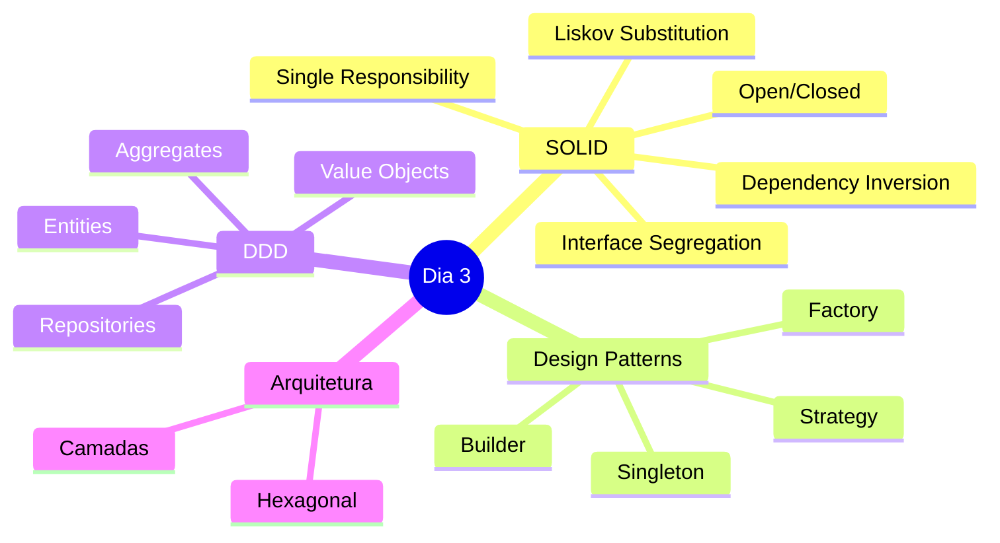

# Slide 1: Abertura - Dia 3

**Horário:** 09:00 - 09:15

---

## 🏗️ Arquitetura e Design

### Bem-vindo ao Dia 3!

```
Hoje vamos aprender:
🎯 Princípios SOLID
🎨 Design Patterns Essenciais
📐 Domain-Driven Design (DDD)
🏛️ Arquiteturas em Camadas
```

---

## 📋 Setup do Dia

```bash
# Verificar ambiente
java -version  # Esperado: openjdk 17 ou 21
mvn -version   # Esperado: Maven 3.8+

# Navegar para o projeto do dia
cd dia-03
```

---

## 🎯 Objetivos de Aprendizagem



---

## 💡 Dica do Instrutor

```
⚠️ Importante:
- Código limpo > Código complexo
- Princípios são guias, não leis absolutas
- YAGNI: You Aren't Gonna Need It
- Não force patterns onde não fazem sentido
```
