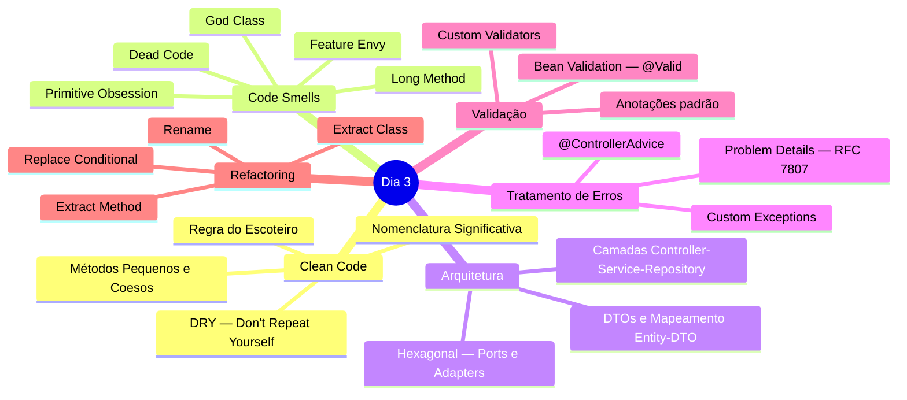

# Slide 1: Abertura e Recap do Dia 2

**Horário:** 09:00 - 09:15

---

## 📝 Recapitulando o Dia 2

No Dia 2 aprendemos os **fundamentos do Spring Boot e Spring Data JPA**:

- ✓ **Spring Boot** — Auto-configuração, Starters, @SpringBootApplication
- ✓ **Spring Web** — @RestController, @GetMapping, @PostMapping, @PutMapping, @DeleteMapping
- ✓ **Spring Data JPA** — @Entity, @Id, @GeneratedValue, @Column, JpaRepository
- ✓ **Relacionamentos** — @ManyToOne, @OneToMany, @JoinColumn, cascade, fetch
- ✓ **Paginação** — Pageable, Sort, Page&lt;T&gt;, PageRequest
- ✓ **Exception Handling** — @RestControllerAdvice básico
- ✓ **DTOs** — Records como Request/Response (introdução)

> **Hoje vamos transformar "código que funciona" em "código profissional"!**

---

## 🧭 Mapa Mental do Dia 3

---

## 🎯 Objetivos de Aprendizagem

Ao final deste dia, o aluno será capaz de:

1. **Identificar** e **nomear** code smells em código Java
2. **Aplicar** princípios de Clean Code (nomenclatura, métodos, DRY)
3. **Estruturar** uma aplicação Spring Boot em camadas (Controller → Service → Repository)
4. **Implementar** DTOs com Records e mapeamento Entity ↔ DTO
5. **Explicar** a Arquitetura Hexagonal e organizar pacotes Ports & Adapters
6. **Centralizar** tratamento de erros com `@ControllerAdvice` e Problem Details (RFC 7807)
7. **Validar** dados com Bean Validation (`@Valid`) e criar Custom Validators
8. **Refatorar** código usando técnicas como Extract Method, Rename e Extract Class

---

## 📚 Referências Bibliográficas

| Livro | Autor | Capítulos Relevantes |
|-------|-------|----------------------|
| **Clean Code** | Robert C. Martin | Cap. 1-3 (Nomes, Funções, Comentários) |
| **Refactoring** | Martin Fowler | Cap. 3, 6, 7 (Code Smells, Composing Methods) |
| **Effective Java** | Joshua Bloch | Item 1 (Records/Factories), Item 64 (Interfaces) |
| **Get Your Hands Dirty on Clean Architecture** | Tom Hombergs | Cap. 2-5 (Hexagonal) |

---

## 💡 Pergunta para a turma

> Vocês já pegaram um código de outra pessoa e não entenderam nada?
> Ou voltaram no próprio código depois de 3 meses e pensaram "quem escreveu isso?!"

Hoje vamos aprender a **nunca mais** causar essa sensação.

---

## 💡 Dica do Instrutor

Peça para compartilharem no chat: qual o pior nome de variável que já viram no código? Use as respostas como gancho para o slide 2.
