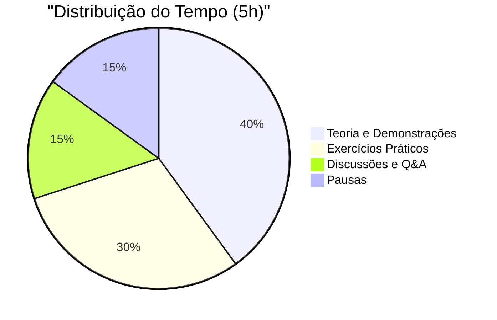

# Slide 2: Agenda do Dia

---

## 📅 Programação do Dia 3

```mermaid
gantt
    title Agenda - Dia 3: Arquitetura e Design
    dateFormat HH:mm
    axisFormat %H:%M
    
    section Manhã
    Apresentação e Setup           :09:00, 15m
    Princípios SOLID               :09:15, 90m
    Coffee Break                   :10:45, 15m
    Design Patterns                :11:00, 90m
    
    section Almoço
    Almoço                         :12:30, 60m
    
    section Tarde
    Domain-Driven Design           :13:30, 60m
    Arquitetura em Camadas         :14:30, 60m
    Coffee Break                   :15:30, 15m
    Exercícios Práticos            :15:45, 60m
    Review e Q&A                   :16:45, 15m
```

---

## 🎯 Distribuição de Tempo

| Horário | Duração | Tópico | Tipo |
|---------|---------|--------|------|
| 09:00 - 09:15 | 15min | Apresentação e Setup | Intro |
| 09:15 - 10:45 | 1h30 | Princípios SOLID | Teórico + Demo |
| 10:45 - 11:00 | 15min | ☕ Coffee Break | - |
| 11:00 - 12:30 | 1h30 | Design Patterns | Teórico + Demo |
| 12:30 - 13:30 | 1h | 🍽️ Almoço | - |
| 13:30 - 14:30 | 1h | Domain-Driven Design | Teórico + Demo |
| 14:30 - 15:30 | 1h | Arquitetura em Camadas | Teórico + Demo |
| 15:30 - 15:45 | 15min | ☕ Coffee Break | - |
| 15:45 - 16:45 | 1h | Exercícios Práticos | Hands-on |
| 16:45 - 17:00 | 15min | Review e Q&A | Discussão |

---

## 📊 Distribuição por Tipo de Atividade

