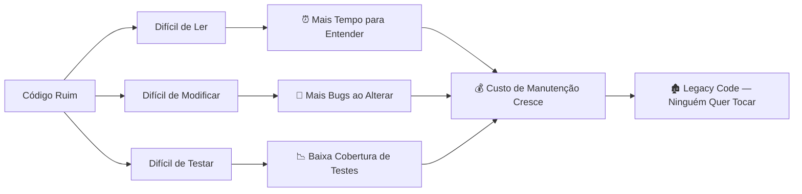
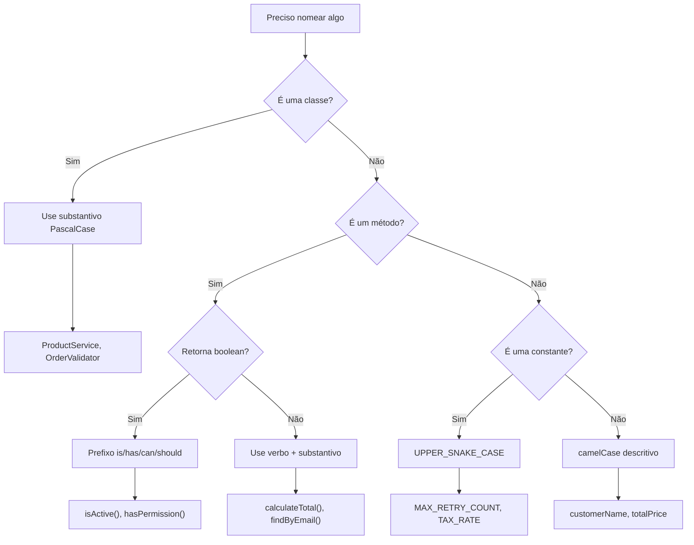
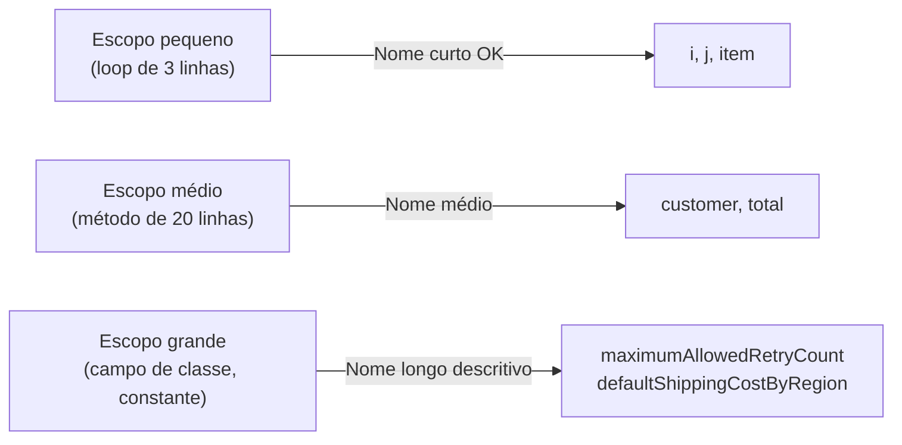

# Slide 2: Clean Code — Nomenclatura Significativa

**Horário:** 09:15 - 09:35

---

## 📖 O que é Clean Code?

> "Qualquer tolo consegue escrever código que um computador entenda. Bons programadores escrevem código que **humanos** entendem."
> — Martin Fowler

> "O código limpo é simples e direto. Lê-se como prosa bem escrita."
> — Grady Booch (co-criador da UML)

Clean Code não é sobre estética — é sobre **comunicação**. Código é lido **10x mais** do que escrito.

---

## 📊 O Custo do Código Ruim



**Dados da indústria:**
- Desenvolvedores gastam **~70%** do tempo **lendo** código, não escrevendo
- Código mal escrito pode custar **4x mais** para manter
- O custo de corrigir um bug **duplica** a cada fase do ciclo de vida

---

## Regra #1: Nomes que Revelam Intenção

O nome de uma variável, função ou classe deve responder três perguntas:
1. **Por que** ela existe?
2. **O que** ela faz?
3. **Como** é usada?

```java
// ❌ O que isso faz?
int d;
List<int[]> list1;
public boolean check(String s) { ... }

// ✅ Agora entendo!
int daysSinceLastPurchase;
List<Cell> flaggedCells;
public boolean isValidEmail(String email) { ... }
```

---

## 🧠 Fluxograma: Como Escolher um Bom Nome



---

## Convenções de Nomenclatura Java

| Tipo | Convenção | Bom Exemplo | Mau Exemplo |
|------|-----------|-------------|-------------|
| **Classe** | PascalCase, substantivo | `ProductService` | `Svc`, `PS` |
| **Interface** | PascalCase, adjetivo/substantivo | `Serializable`, `ProductRepository` | `IProduct` (prefixo C#) |
| **Método** | camelCase, verbo | `calculateTotal()`, `findByEmail()` | `calc()`, `proc()` |
| **Variável** | camelCase, substantivo | `customerName`, `totalPrice` | `cn`, `tp`, `x` |
| **Constante** | UPPER_SNAKE_CASE | `MAX_RETRY_COUNT`, `DEFAULT_RATE` | `maxRetry`, `rate` |
| **Package** | lowercase, singular | `com.example.product` | `com.example.Products` |
| **Enum** | PascalCase (tipo) + UPPER (valores) | `OrderStatus.PENDING` | `status.pending` |
| **Parâmetro genérico** | Letra maiúscula | `T`, `E`, `K`, `V` | `Type`, `Elem` |

---

## Anti-Padrões de Nomenclatura

### 1. Abreviações Obscuras
```java
// ❌ O que significa cada uma?
String nm;      // name? number? nam?
int qty;        // quantity? -- até comum, mas evite
String addr;    // address? -- até aceito, mas o completo é melhor
boolean flg;    // flag de quê? 🤔
String desc;    // description? descending?

// ✅ Nomes completos e sem ambiguidade
String customerName;
int itemQuantity;
String deliveryAddress;
boolean isOrderCancelled;
String productDescription;
```

### 2. Prefixos Húngaros (era dos anos 90)
```java
// ❌ O tipo já está na declaração — redundante!
String strName;
int intAge;
boolean bIsActive;
List<String> lstNames;
Map<String, Object> mapData;

// ✅ Sem prefixo — Java é tipada, a IDE mostra o tipo
String name;
int age;
boolean isActive;
List<String> names;
Map<String, Object> configuration;
```

### 3. Nomes Genéricos / Vagos
```java
// ❌ Genéricos — servem para *qualquer coisa* (ou seja, nada)
Object data;
String info;
List<Object> list;
void process();      // processar O QUÊ?
void handle();       // tratar O QUÊ?
Map<String, Object> result;  // resultado de quê?

// ✅ Específicos — descrevem exatamente o que são
Order pendingOrder;
String errorMessage;
List<Product> featuredProducts;
void processPayment();
void handleRefundRequest();
Map<String, BigDecimal> productPricesBySku;
```

---

## 📏 Comprimento do Nome vs. Escopo



> **Regra prática:** Quanto maior o escopo, mais descritivo deve ser o nome.

```java
// Escopo PEQUENO — ok usar "i"
for (int i = 0; i < products.size(); i++) { ... }

// Escopo GRANDE — precisa ser descritivo
private final Map<String, BigDecimal> shippingCostByRegion;
private static final int MAX_LOGIN_ATTEMPTS = 5;
```

---

## 🎯 Exercício Mental

O que cada variável deveria se chamar?

```java
int x = 30;        // → maxDaysToShip? creditTermInDays? expirationInDays?
double t = 0.1;    // → defaultDiscountRate? taxRate? interestRate?
String s = "BR";   // → countryCode? currencyCode? locale?
boolean b = true;  // → isActive? isEnabled? hasPermission?
List<String> l;    // → customerEmails? productNames? errorMessages?
```

> **Dica:** Se você precisa de um comentário para explicar uma variável, o nome está ruim.

---

## 💡 Dica do Instrutor

Mostrar um trecho do `03-bad-practices-lab` (`OrderService`) com variáveis `x`, `temp`, `d`, `res` e pedir para os alunos sugerirem nomes melhores antes de mostrar a resposta.
String s = "abc";  // → validationPattern? defaultCode?
List<String> l;    // → customerEmails? pendingOrders?
```

> **Dica:** Se você precisa de um comentário para explicar a variável, o nome está ruim.

---

## 💡 Dica do Instrutor

Mostrar exemplos reais de código com nomes ruins e pedir sugestões de melhoria.
