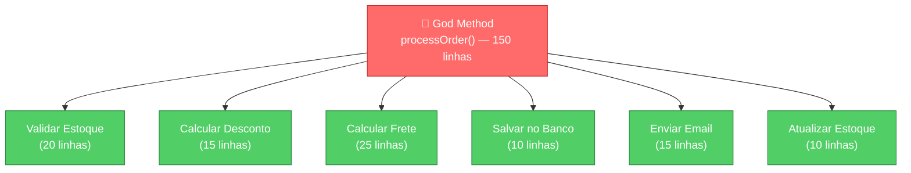
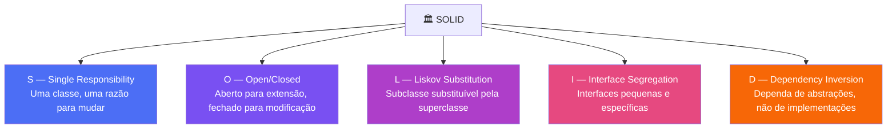
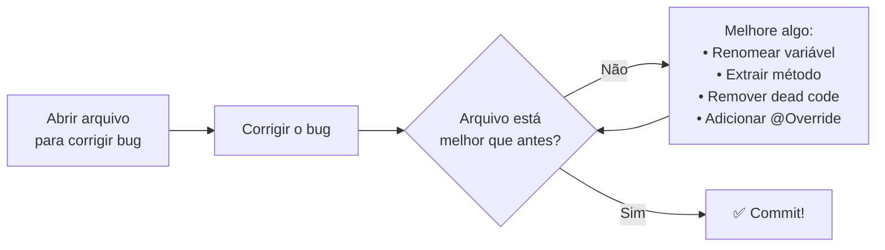
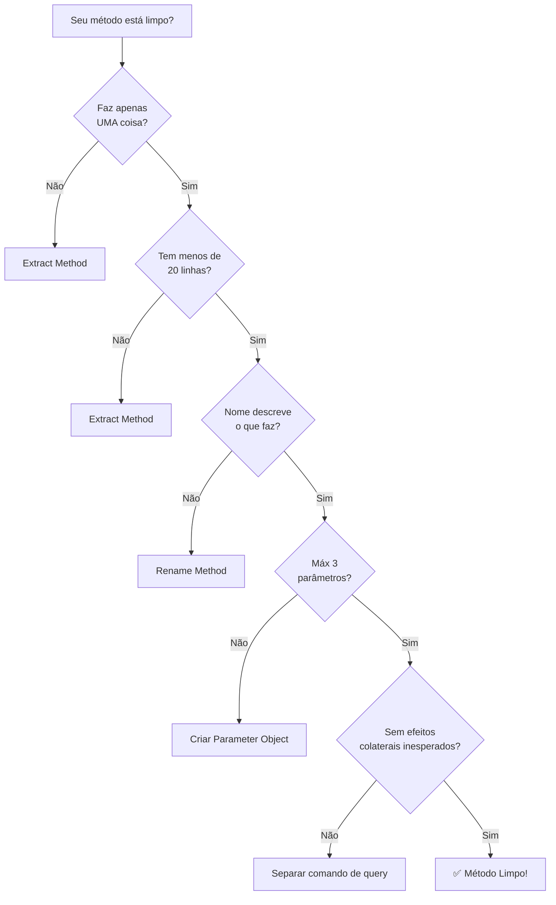

# Slide 3: Clean Code — Métodos e Princípios

**Horário:** 09:35 - 10:00

---

## Regra #2: Métodos Pequenos e Coesos

> "A primeira regra das funções é que elas devem ser **pequenas**. A segunda regra é que elas devem ser **ainda menores**."
> — Robert C. Martin (Uncle Bob)

Uma função faz **uma coisa**. Se você precisa dizer "e" para explicar o que ela faz, ela faz mais de uma coisa.

---

## 📏 Quanto é "pequeno"?

| Métrica | Ideal | Aceitável | Problema |
|---------|-------|-----------|----------|
| **Linhas** | 5-10 | 10-20 | > 30 |
| **Parâmetros** | 0-2 | 3 | > 3 (usar objeto) |
| **Nível de indentação** | 1-2 | 3 | > 3 |
| **Complexidade ciclomática** | 1-3 | 4-6 | > 7 |

> **Complexidade ciclomática** = número de caminhos independentes pelo código (cada `if`, `else`, `for`, `while`, `case` adiciona +1).

---

## God Method → Métodos Coesos



```java
// ❌ God Method — 100+ linhas, faz tudo
public Order processOrder(OrderRequest request) {
    // Valida estoque (20 linhas)
    for (var item : request.items()) {
        Product product = productRepo.findById(item.productId()).orElseThrow();
        if (product.getStock() < item.quantity()) {
            throw new InsufficientStockException(product.getName());
        }
    }
    
    // Calcula desconto (15 linhas)
    BigDecimal discount = BigDecimal.ZERO;
    if (request.couponCode() != null) {
        Coupon coupon = couponRepo.findByCode(request.couponCode());
        if (coupon != null && coupon.isValid()) {
            discount = coupon.getDiscount();
        }
    }
    
    // Calcula frete (25 linhas) ...
    // Salva no banco (10 linhas) ...
    // Envia email (15 linhas) ...
    // Atualiza estoque (10 linhas) ...
}
```

---

## Refatoração: Extract Method

```java
// ✅ Cada método faz UMA coisa — máximo ~20 linhas
public Order processOrder(OrderRequest request) {
    validateStock(request.items());
    BigDecimal discount = calculateDiscount(request.couponCode());
    BigDecimal shipping = calculateShipping(request.address());
    Order order = createOrder(request, discount, shipping);
    notifyCustomer(order);
    updateStock(request.items());
    return order;
}

private void validateStock(List<OrderItem> items) { /* ... */ }
private BigDecimal calculateDiscount(String couponCode) { /* ... */ }
private BigDecimal calculateShipping(Address address) { /* ... */ }
private Order createOrder(OrderRequest req, BigDecimal disc, BigDecimal ship) { /* ... */ }
private void notifyCustomer(Order order) { /* ... */ }
private void updateStock(List<OrderItem> items) { /* ... */ }
```

> O método principal agora **lê como uma história**: valida → calcula → cria → notifica → atualiza.

---

## 🏛️ Princípios SOLID — Visão Geral



> **Hoje focaremos no SRP** (Single Responsibility) e no **DIP** (Dependency Inversion), que são diretamente aplicados na Arquitetura Hexagonal.

---

## SRP — Single Responsibility Principle

> "Uma classe deve ter **uma, e apenas uma, razão para mudar**."
> — Robert C. Martin

```java
// ❌ Classe com múltiplas responsabilidades
public class OrderService {
    public Order createOrder(OrderRequest req) { /* cria */ }
    public BigDecimal calculateDiscount() { /* calcula */ }
    public void sendEmail(Order order) { /* envia email */ }
    public byte[] generatePdf(Order order) { /* gera PDF */ }
    public void updateStock(List<Item> items) { /* atualiza estoque */ }
}
// 5 razões para mudar → SRP violado!

// ✅ Cada classe com uma responsabilidade
public class OrderService { /* orquestração de pedidos */ }
public class DiscountCalculator { /* cálculo de desconto */ }
public class OrderNotificationService { /* notificações */ }
public class PdfReportGenerator { /* relatórios */ }
public class StockService { /* controle de estoque */ }
```

---

## A Regra do Escoteiro

> "Deixe o código melhor do que encontrou."



Sempre que tocar em um arquivo, melhore **algo**:
- Renomeie uma variável mal nomeada
- Extraia um método de um bloco grande
- Remova código morto (comentado) — o Git guarda histórico
- Adicione um `@Override` faltando
- Organize imports

---

## DRY — Don't Repeat Yourself

> "Todo conhecimento deve ter uma **representação única, inequívoca e autoritativa** dentro de um sistema."
> — Andy Hunt & Dave Thomas (The Pragmatic Programmer)

```java
// ❌ WET (Write Everything Twice / Waste Everyone's Time)
public BigDecimal calculateRegularShipping(Address address) {
    if (address.getState().equals("SP")) return new BigDecimal("15.00");
    if (address.getState().equals("RJ")) return new BigDecimal("20.00");
    return new BigDecimal("30.00");
}

public BigDecimal calculateExpressShipping(Address address) {
    if (address.getState().equals("SP")) return new BigDecimal("30.00");  // dobro
    if (address.getState().equals("RJ")) return new BigDecimal("40.00");
    return new BigDecimal("60.00");
}

// ✅ DRY — uma única fonte de verdade
public BigDecimal calculateShipping(Address address, ShippingType type) {
    BigDecimal baseRate = getBaseRate(address.getState());
    return baseRate.multiply(type.getMultiplier());
}

private BigDecimal getBaseRate(String state) {
    return switch (state) {
        case "SP" -> new BigDecimal("15.00");
        case "RJ" -> new BigDecimal("20.00");
        default   -> new BigDecimal("30.00");
    };
}
```

---

## KISS — Keep It Simple, Stupid

> "A simplicidade é a sofisticação suprema." — Leonardo da Vinci

```java
// ❌ OVER-ENGINEERING — complicação desnecessária
public boolean isEligibleForDiscount(Order order) {
    return Optional.ofNullable(order)
        .map(Order::getTotal)
        .filter(total -> total.compareTo(BigDecimal.ZERO) > 0)
        .map(total -> total.compareTo(new BigDecimal("100")) >= 0)
        .orElse(false);
}

// ✅ KISS — simples e direto
public boolean isEligibleForDiscount(Order order) {
    if (order == null || order.getTotal() == null) return false;
    return order.getTotal().compareTo(new BigDecimal("100")) >= 0;
}
```

---

## 📋 Resumo: Checklist de Métodos Limpos



---

## 🎯 Pergunta para a turma

> Qual dessas boas práticas vocês já aplicam no dia a dia?
> E qual é a mais difícil de manter?

---

## 💡 Dica do Instrutor

Mostrar o `OrderService` do `03-bad-practices-lab` como exemplo de violação de SRP e DRY. Pedir para a turma identificar quantas responsabilidades a classe tem.
