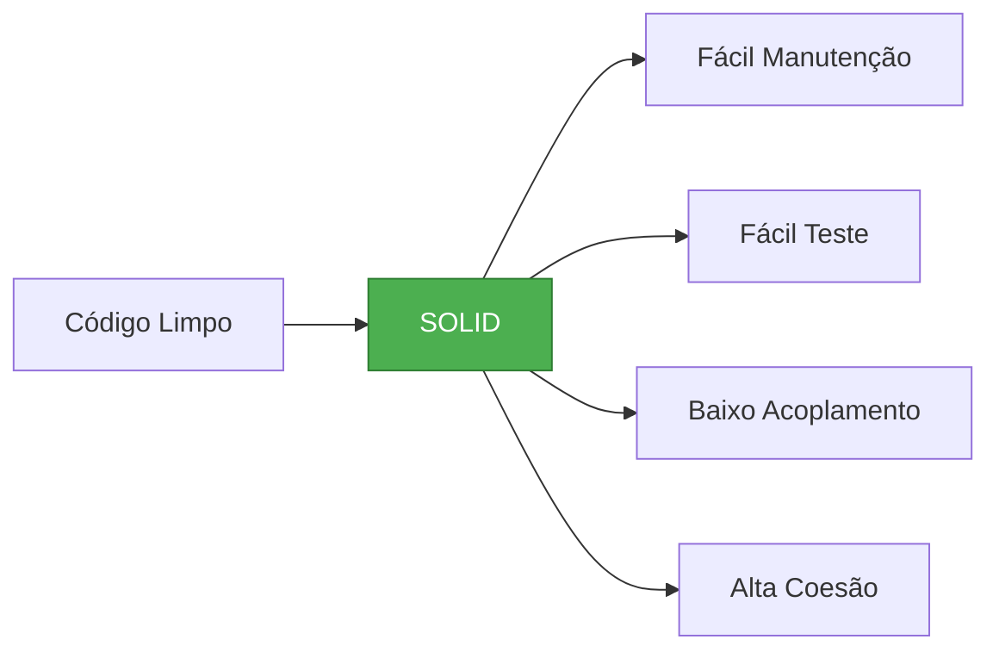
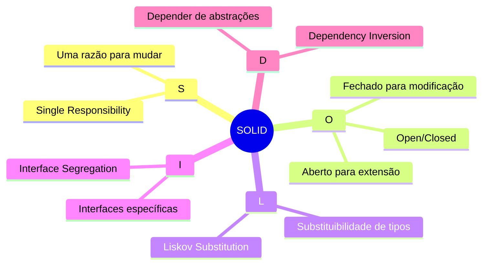
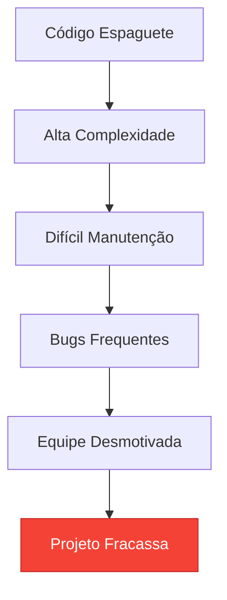
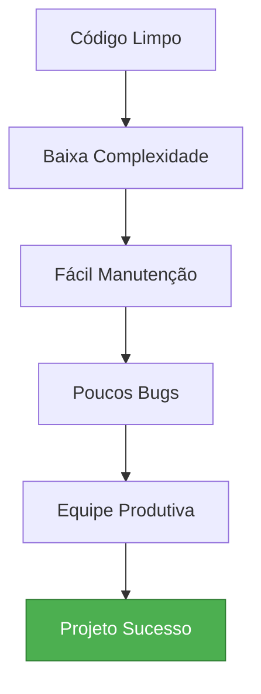

# Slide 3: Introdução aos Princípios SOLID

**Horário:** 09:15 - 10:45

---

## 🎯 O que é SOLID?

**SOLID** é um acrônimo de 5 princípios de design orientado a objetos criados por Robert C. Martin (Uncle Bob)



---

## 📚 Os 5 Princípios



---

## 🎨 Por que SOLID?

### Sem SOLID ❌


### Com SOLID ✅


---

## 📊 Impacto de SOLID

```mermaid
quadrantChart
    title Qualidade do Código vs Esforço de Manutenção
    x-axis Baixo Esforço --> Alto Esforço
    y-axis Baixa Qualidade --> Alta Qualidade
    quadrant-1 Ideal (SOLID)
    quadrant-2 Sobre-engenharia
    quadrant-3 Código Legado
    quadrant-4 Código Técnico
    
    Código com SOLID: [0.25, 0.85]
    Código sem SOLID: [0.75, 0.25]
    Código Refatorado: [0.45, 0.70]
```

---

## 💡 Dica do Instrutor

```
⚠️ Lembre-se:
- SOLID não é tudo ou nada
- Use com bom senso
- Simplicidade primeiro
- Refatore quando necessário
- Não force abstrações prematuras
```
