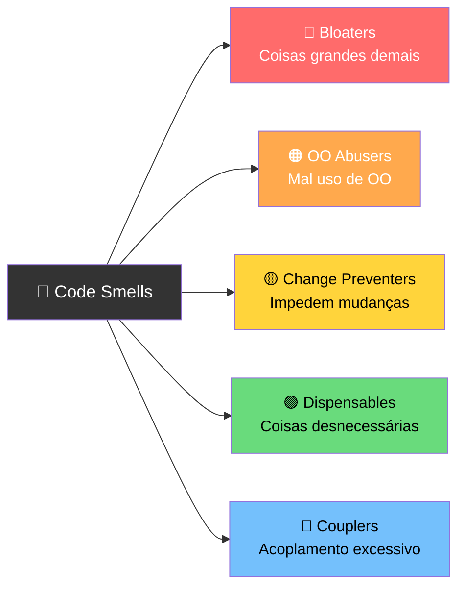
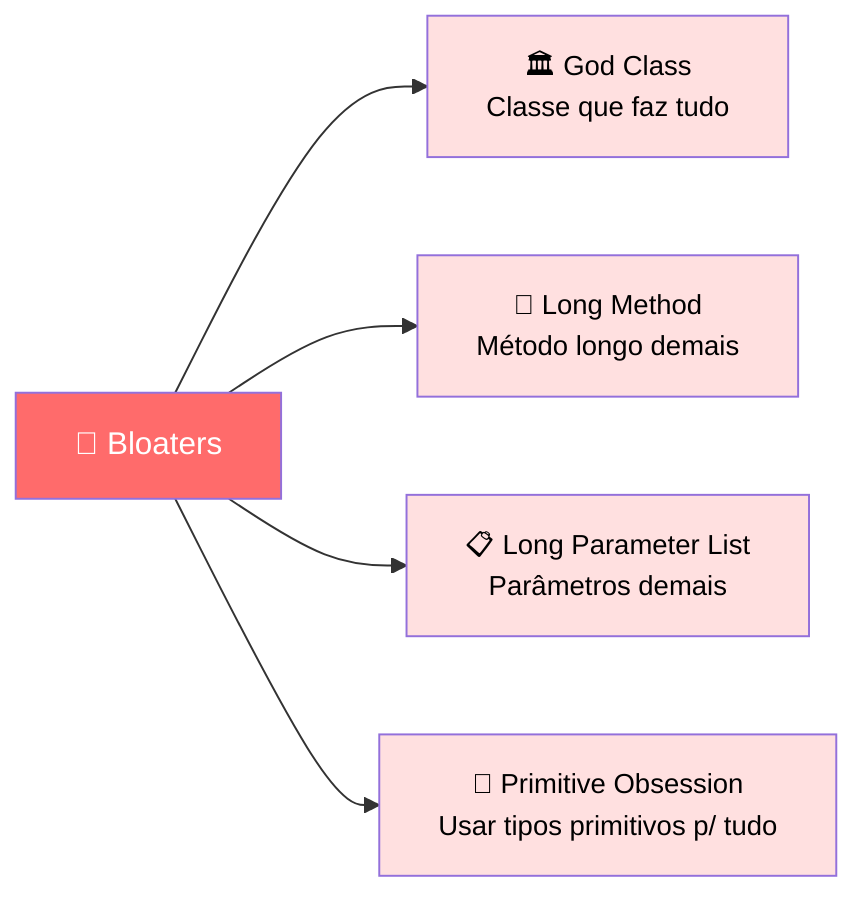
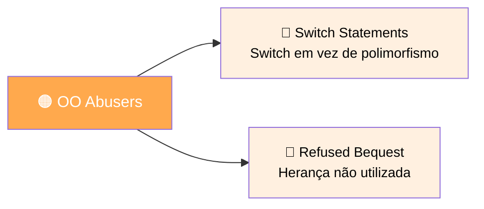
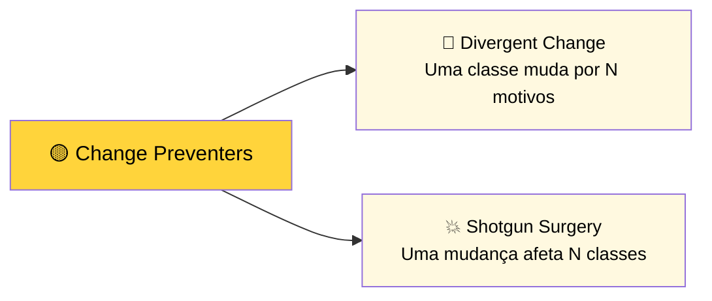
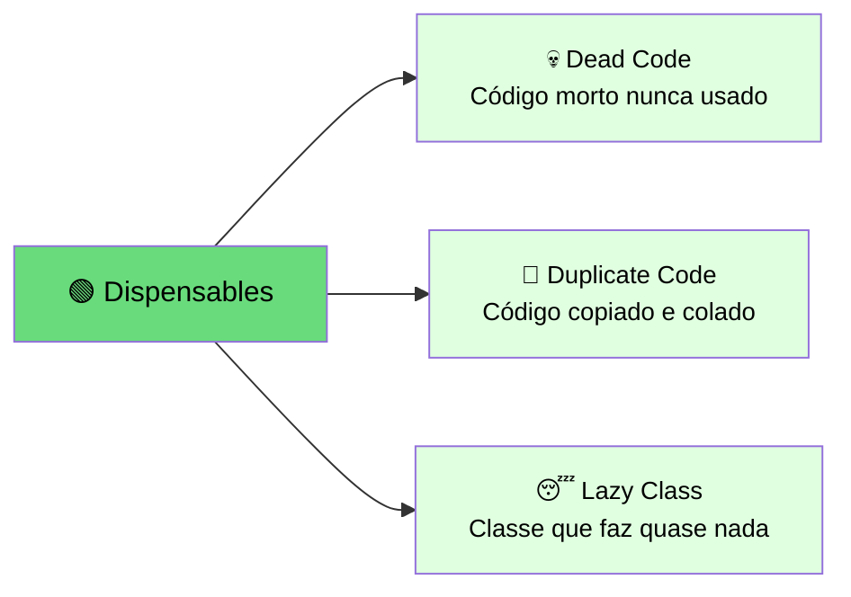
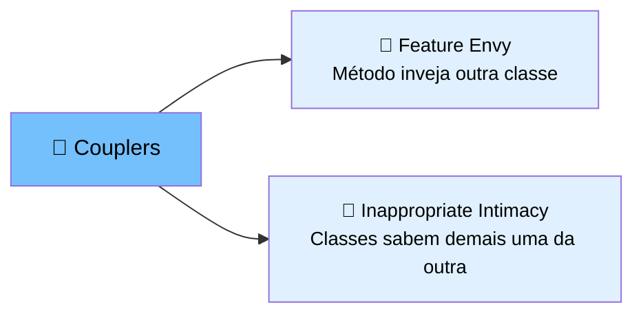
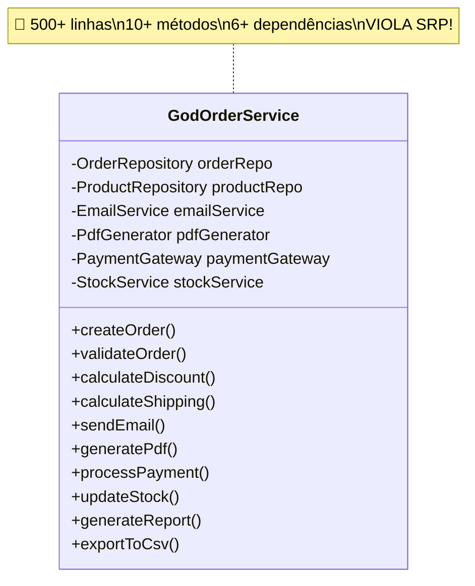
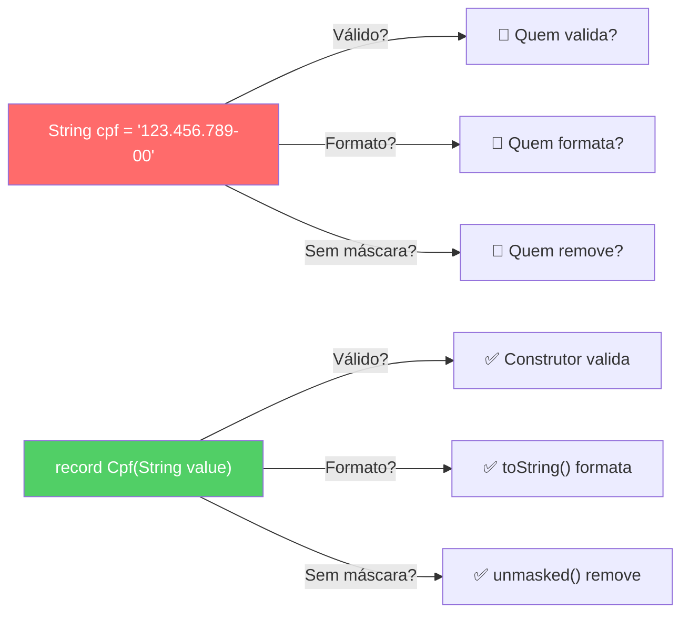

# Slide 4: Code Smells — Identificando Problemas

**Horário:** 09:35 - 10:00 (continuação)

---

## 🦨 O que são Code Smells?

> "Se fede, troque."
> — Kent Beck (co-criador do JUnit e XP)

Code Smells são **indicadores** de que algo está errado no design do código. Não são bugs — o código funciona — mas apontam para problemas de **manutenção**, **legibilidade** e **evolução**.

> O termo foi popularizado por Martin Fowler no livro **"Refactoring"** (1999).

---

## 🗂️ Classificação dos Code Smells



### 🔴 Bloaters — Coisas grandes demais



### 🟠 OO Abusers — Mal uso de Orientação a Objetos



### 🟡 Change Preventers — Impedem mudanças



### 🟢 Dispensables — Coisas desnecessárias



### 🔵 Couplers — Acoplamento excessivo



---

## Os 7 Code Smells Mais Comuns no Java

### 1. God Class (Bloater)

Uma classe que **sabe demais** e **faz demais**. Viola o SRP.



```java
// ✅ Refatoração: Separar por responsabilidade (SRP)
public class OrderService { /* criar, buscar, orquestrar */ }
public class OrderValidationService { /* validações */ }
public class DiscountCalculator { /* cálculos de desconto */ }
public class ShippingCalculator { /* cálculos de frete */ }
public class OrderNotificationService { /* email, PDF */ }
```

**Sinais de alerta:**
- Classe com mais de ~200 linhas
- Mais de 5-7 métodos públicos
- Mais de 3-4 dependências injetadas
- Nome genérico como `Manager`, `Handler`, `Processor`, `Utils`

---

### 2. Long Method (Bloater)

```java
// ❌ Método com 150+ linhas — impossível entender
public ResponseEntity<?> createOrder(OrderRequest request) {
    // linha 1 a 30: validação
    // linha 31 a 60: cálculo
    // linha 61 a 90: persistência
    // linha 91 a 120: notificação
    // linha 121 a 150: resposta
}

// ✅ Extrair em métodos com nomes descritivos
// Cada bloco vira um método de ~20 linhas
```

**Sinais de alerta:**
- Mais de 20-30 linhas
- Precisa de comentários para separar seções
- Tem mais de 2 níveis de indentação
- Scroll para cima e para baixo para entender

---

### 3. Feature Envy (Coupler)

```java
// ❌ Método que usa mais dados de OUTRA classe do que da própria
public class OrderService {
    public String formatAddress(Customer customer) {
        return customer.getStreet() + ", " +
               customer.getNumber() + " - " +
               customer.getCity() + "/" +
               customer.getState();
    }
    // Este método deveria estar na classe Customer!
}

// ✅ Mover para a classe correta — Tell, Don't Ask
public class Customer {
    public String formatAddress() {
        return street + ", " + number + " - " + city + "/" + state;
    }
}
```

> **Princípio "Tell, Don't Ask":** Diga ao objeto o que fazer em vez de pedir seus dados e fazer por ele.

---

### 4. Primitive Obsession (Bloater)



```java
// ❌ Usando String para tudo — quem garante a integridade?
public class Employee {
    private String cpf;    // "123.456.789-00" — válido? quem valida?
    private String email;  // "teste@" — válido? quem valida?
    private String phone;  // "+55119..." — formato?
}

// ✅ Value Objects (Records) com validação embutida
public record Cpf(String value) {
    public Cpf {
        if (!isValid(value)) throw new InvalidCpfException(value);
    }

    public String unmasked() {
        return value.replaceAll("\\D", "");
    }

    @Override
    public String toString() {
        String d = unmasked();
        return d.substring(0,3) + "." + d.substring(3,6) + "." +
               d.substring(6,9) + "-" + d.substring(9);
    }
}

public record Email(String value) {
    public Email {
        if (!value.matches("^[\\w.-]+@[\\w.-]+\\.[a-zA-Z]{2,}$"))
            throw new InvalidEmailException(value);
    }
}
```

---

### 5. Dead Code (Dispensable)

```java
// ❌ Código comentado, métodos nunca chamados, imports não usados
public class ProductService {
    // public void oldCalculation() { ... }
    // TODO: remover depois (TODO de 2021!)
    // private BigDecimal tempCalc(int x) { return null; }

    // Este método não é chamado por ninguém:
    public void unusedMethod() { /* ... */ }
}

// ✅ Deletar! O Git guarda o histórico.
// Se precisar no futuro, recupera do Git com: git log -p --all -S 'oldCalculation'
```

**Sinais de alerta:**
- Código comentado (não é documentação, é lixo)
- Métodos nunca chamados (IDE mostra "0 usages")
- Imports não usados
- TODOs antigos que nunca serão feitos
- Variáveis atribuídas mas nunca lidas

---

### 6. Duplicate Code (Dispensable)

```java
// ❌ Mesma lógica copiada e colada em 3 lugares
// Se precisar mudar a regra, precisa lembrar de mudar nos 3!
public BigDecimal calculateDiscountA(BigDecimal price, int qty) {
    if (qty >= 10) return price.multiply(BigDecimal.valueOf(0.85));
    if (qty >= 5)  return price.multiply(BigDecimal.valueOf(0.90));
    return price;
}

public BigDecimal calculateDiscountB(BigDecimal price, int qty) {
    if (qty >= 10) return price.multiply(BigDecimal.valueOf(0.85)); // idêntico!
    if (qty >= 5)  return price.multiply(BigDecimal.valueOf(0.90)); // idêntico!
    return price;
}

// ✅ Uma única fonte de verdade
private BigDecimal applyQuantityDiscount(BigDecimal price, int quantity) {
    BigDecimal rate = getDiscountRate(quantity);
    return price.multiply(rate);
}
```

---

### 7. Magic Numbers (Bloater)

```java
// ❌ O que significa "0.85"? E "500"? E "30"?
if (quantity >= 10) {
    subtotal = price.multiply(BigDecimal.valueOf(0.85));
}
if (total.compareTo(BigDecimal.valueOf(500)) > 0) {
    shipping = BigDecimal.ZERO;
}
Thread.sleep(30000);

// ✅ Constantes nomeadas — auto-documentado
private static final BigDecimal BULK_DISCOUNT_RATE = new BigDecimal("0.85");
private static final BigDecimal FREE_SHIPPING_THRESHOLD = new BigDecimal("500");
private static final int MINIMUM_QUANTITY_FOR_BULK = 10;
private static final long RETRY_DELAY_MS = 30_000;

if (quantity >= MINIMUM_QUANTITY_FOR_BULK) {
    subtotal = price.multiply(BULK_DISCOUNT_RATE);
}
if (total.compareTo(FREE_SHIPPING_THRESHOLD) > 0) {
    shipping = BigDecimal.ZERO;
}
Thread.sleep(RETRY_DELAY_MS);
```

---

## 🎯 Quiz Rápido

Identifique o Code Smell em cada trecho:

```java
// 1.
double calc(int t, double v, boolean f) { ... }

// 2.
public class UserManager {
    // 600 linhas com 25 métodos
}

// 3.
// double oldValue = price * 0.9;
// BigDecimal temp = BigDecimal.ZERO;

// 4.
if (qty >= 10) { disc = 0.15; }  // mesmo bloco aparece em 3 classes

// 5.
public class ReportService {
    public String formatCustomerAddress(Customer c) {
        return c.getStreet() + ", " + c.getCity();
    }
}
```

> **Respostas:** 1) Nomenclatura ruim + Parâmetros demais  2) God Class  3) Dead Code  4) Duplicate Code + Magic Numbers  5) Feature Envy

---

## 💡 Dica do Instrutor

Abrir o `03-bad-practices-lab` (`OrderService.java` + `OrderController.java`) e pedir para os alunos identificarem os 7 code smells. Fazer uma competição: quem acha mais rápido?
