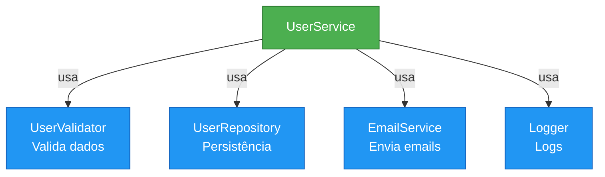
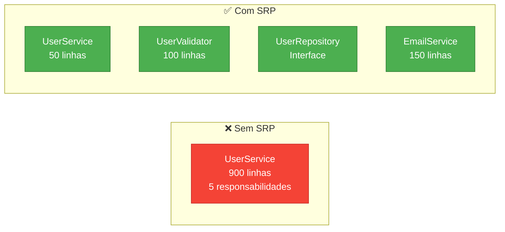
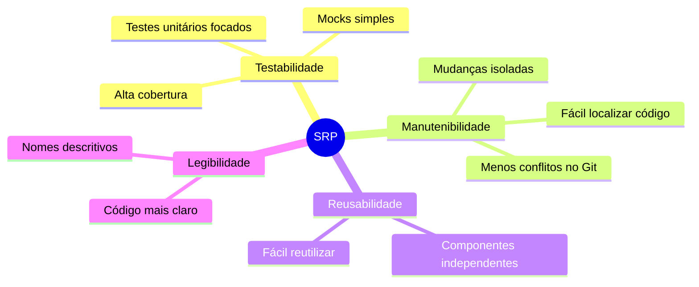

# Slide 4: Single Responsibility Principle (SRP)

---

## 📖 Definição

> **"Uma classe deve ter apenas uma razão para mudar"**
> 
> *— Robert C. Martin*

**Ou seja:** Cada classe deve ter uma única responsabilidade bem definida

---

## ❌ Violação do SRP

```java
@Service
public class UserService {
    
    // Responsabilidade 1: Lógica de negócio
    public User createUser(String name, String email) {
        User user = new User(name, email);
        
        // Responsabilidade 2: Validação
        if (!email.contains("@")) {
            throw new IllegalArgumentException("Email inválido");
        }
        
        // Responsabilidade 3: Persistência
        Connection conn = DriverManager.getConnection("...");
        PreparedStatement stmt = conn.prepareStatement("INSERT...");
        stmt.executeUpdate();
        
        // Responsabilidade 4: Envio de email
        MimeMessage message = new MimeMessage();
        Transport.send(message);
        
        // Responsabilidade 5: Logging
        System.out.println("User created: " + user.getId());
        
        return user;
    }
}
```

**Problema:** 5 razões diferentes para modificar esta classe! 😱

---

## ✅ Aplicando SRP



---

## ✅ Código Refatorado

```java
// 1️⃣ Responsabilidade única: Validação
@Component
public class UserValidator {
    public void validate(User user) {
        if (!user.getEmail().contains("@")) {
            throw new IllegalArgumentException("Email inválido");
        }
    }
}

// 2️⃣ Responsabilidade única: Persistência
@Repository
public interface UserRepository extends JpaRepository<User, Long> {}

// 3️⃣ Responsabilidade única: Envio de emails
@Service
public class EmailService {
    public void sendWelcomeEmail(User user) {
        // lógica de envio
    }
}

// 4️⃣ Responsabilidade única: Orquestração
@Service
@RequiredArgsConstructor
public class UserService {
    private final UserValidator validator;
    private final UserRepository repository;
    private final EmailService emailService;
    
    public User createUser(String name, String email) {
        User user = new User(name, email);
        validator.validate(user);
        user = repository.save(user);
        emailService.sendWelcomeEmail(user);
        return user;
    }
}
```

---

## 📊 Comparação: Antes vs Depois



---

## 🎯 Benefícios



---

## 💡 Como Identificar Violações?

1. **Classe muito grande** (>300 linhas)
2. **Muitas importações** (>20)
3. **Nome genérico** (Manager, Helper, Util)
4. **Muitas dependências** (>5 injeções)
5. **Difícil dar um nome descritivo**

---

## 🤔 Exercício Rápido

**Identifique as responsabilidades:**

```java
@Service
public class OrderService {
    public void processOrder(Order order) {
        // Valida o pedido
        // Calcula frete
        // Aplica desconto
        // Atualiza estoque
        // Processa pagamento
        // Envia email de confirmação
        // Gera nota fiscal
        // Atualiza dashboard
    }
}
```

**Quantas responsabilidades você identificou?** 🤔
