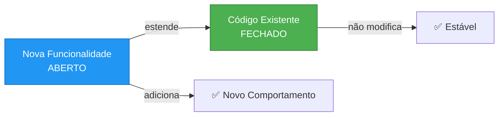
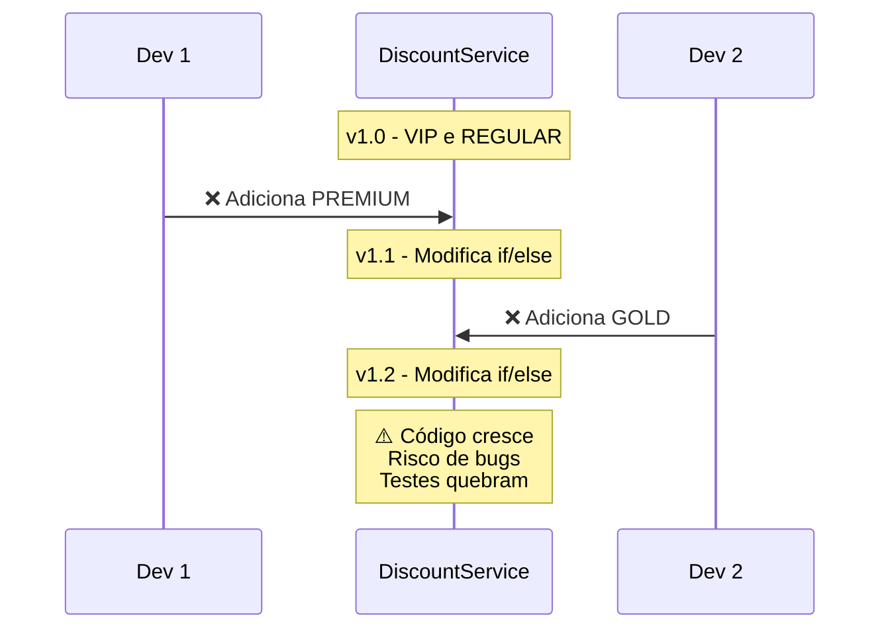
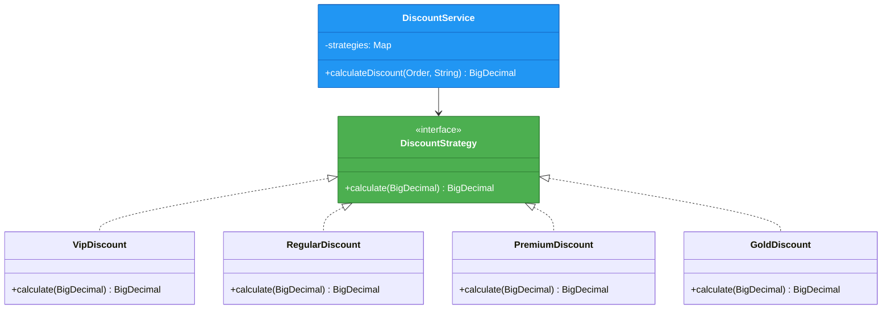
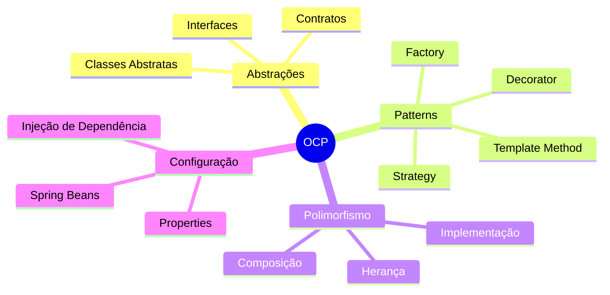
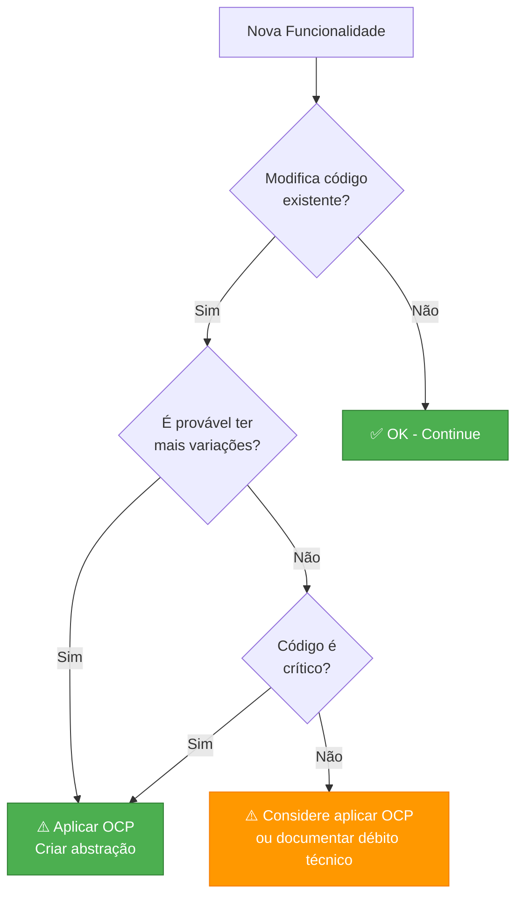

# Slide 5: Open/Closed Principle (OCP)

---

## 📖 Definição

> **"Entidades de software devem estar abertas para extensão, mas fechadas para modificação"**
> 
> *— Bertrand Meyer*



---

## ❌ Violação do OCP

```java
@Service
public class DiscountService {
    
    public BigDecimal calculateDiscount(Order order, String customerType) {
        BigDecimal discount = BigDecimal.ZERO;
        
        if ("VIP".equals(customerType)) {
            discount = order.getTotal().multiply(BigDecimal.valueOf(0.20));
        } else if ("REGULAR".equals(customerType)) {
            discount = order.getTotal().multiply(BigDecimal.valueOf(0.10));
        } else if ("PREMIUM".equals(customerType)) {
            discount = order.getTotal().multiply(BigDecimal.valueOf(0.30));
        }
        // ⚠️ Para adicionar novo tipo, preciso MODIFICAR este código!
        
        return discount;
    }
}
```

**Problema:** Cada novo tipo de cliente requer modificação da classe! 🔧

---

## 🔄 Evolução do Código



---

## ✅ Aplicando OCP com Strategy Pattern



---

## ✅ Código Refatorado

```java
// Interface - Contrato fechado
public interface DiscountStrategy {
    BigDecimal calculate(BigDecimal price);
}

// Implementações - Novas estratégias sem modificar código existente
@Component("VIP")
public class VipDiscount implements DiscountStrategy {
    public BigDecimal calculate(BigDecimal price) {
        return price.multiply(BigDecimal.valueOf(0.20));
    }
}

@Component("REGULAR")
public class RegularDiscount implements DiscountStrategy {
    public BigDecimal calculate(BigDecimal price) {
        return price.multiply(BigDecimal.valueOf(0.10));
    }
}

@Component("PREMIUM")
public class PremiumDiscount implements DiscountStrategy {
    public BigDecimal calculate(BigDecimal price) {
        return price.multiply(BigDecimal.valueOf(0.30));
    }
}

// ✅ NOVA ESTRATÉGIA - Sem modificar código existente!
@Component("GOLD")
public class GoldDiscount implements DiscountStrategy {
    public BigDecimal calculate(BigDecimal price) {
        return price.multiply(BigDecimal.valueOf(0.25));
    }
}

// Service - Fechado para modificação, usa as estratégias
@Service
@RequiredArgsConstructor
public class DiscountService {
    private final Map<String, DiscountStrategy> strategies;
    
    public BigDecimal calculateDiscount(Order order, String customerType) {
        DiscountStrategy strategy = strategies.get(customerType);
        return strategy != null ? strategy.calculate(order.getTotal()) : BigDecimal.ZERO;
    }
}
```

---

## 📊 Comparação: Antes vs Depois

| Aspecto | ❌ Sem OCP | ✅ Com OCP |
|---------|-----------|-----------|
| Adicionar novo tipo | Modifica código existente | Cria nova classe |
| Risco de bugs | Alto (código existente) | Baixo (código isolado) |
| Testes existentes | Precisam ser reexecutados | Permanecem válidos |
| Conflitos no Git | Frequentes | Raros |
| Complexidade | Cresce linear | Cresce modular |

---

## 🎯 Técnicas para OCP



---

## 🔍 Quando Aplicar?



---

## 💡 Dica do Instrutor

```
⚠️ Cuidados:
- Não crie abstrações prematuras
- OCP tem custo: mais classes, mais complexidade
- Use quando houver evidência de variação futura
- "Fool me once, shame on you; fool me twice, shame on me"
  → Na primeira vez, pode ser if/else
  → Na segunda vez, refatore para OCP
```
