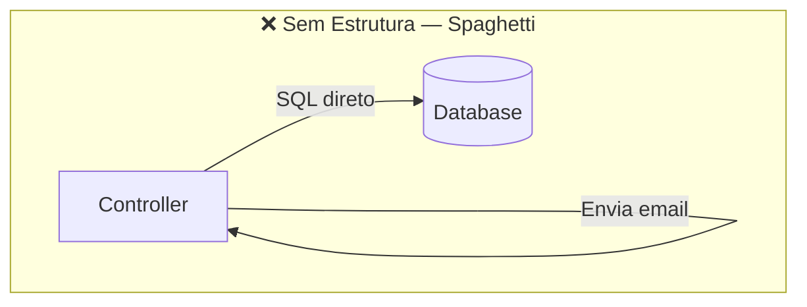
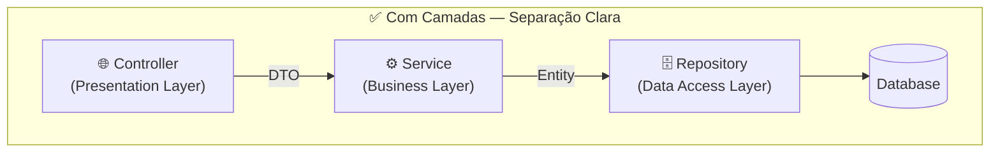
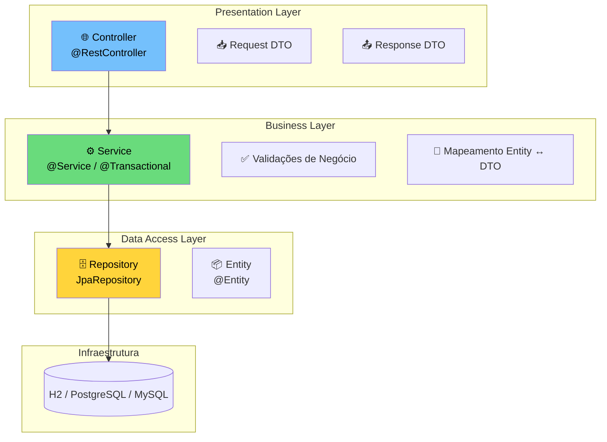
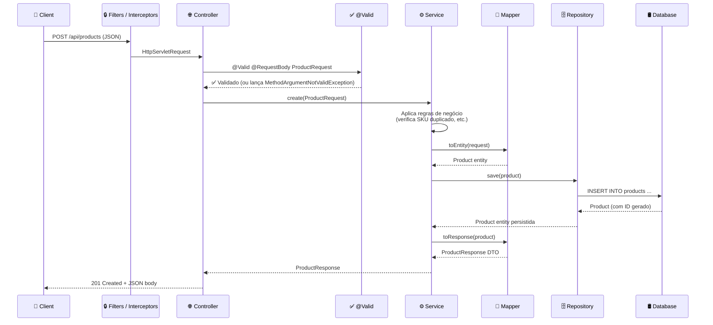
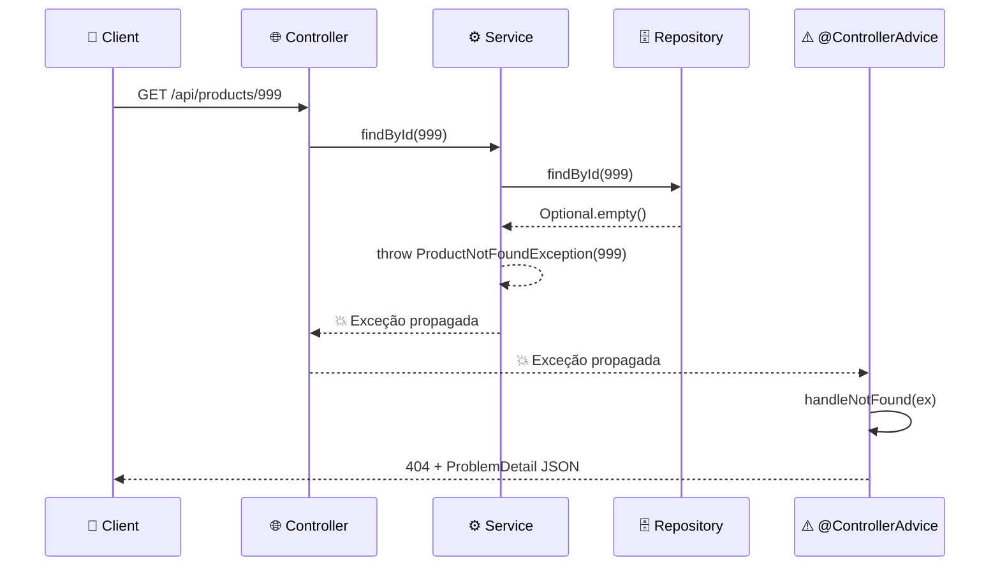
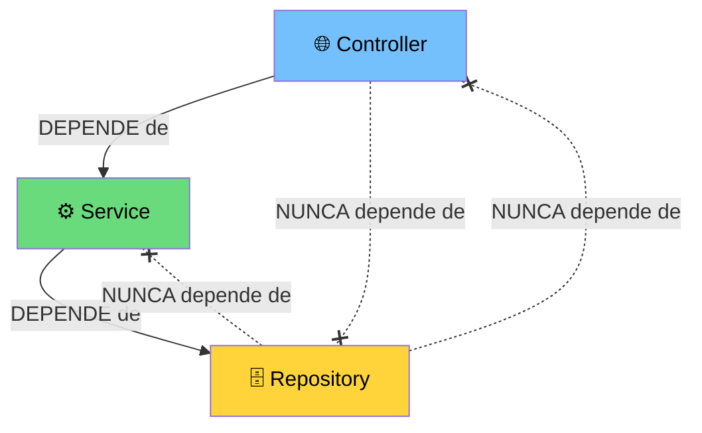
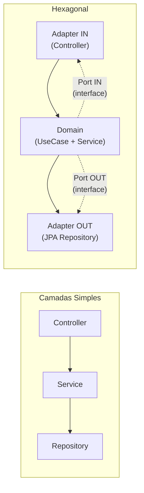

# Slide 5: Arquitetura em Camadas — O Padrão das Consultorias

**Horário:** 10:00 - 10:25

---

## 🏗️ Por que Arquitetura Importa?

Sem arquitetura definida, o código vira **spaghetti**:





> A **Arquitetura em Camadas** (Layered Architecture) é o padrão mais utilizado em projetos corporativos Java/Spring.

---

## 📐 As 3 Camadas Fundamentais



---

## Fluxo Completo: POST /api/products



---

## Fluxo Completo: GET /api/products/{id} (Not Found)



---

## Responsabilidades de Cada Camada

| Camada | Responsabilidade | O que NÃO faz | Anotações Spring |
|--------|-----------------|---------------|------------------|
| **Controller** | Receber HTTP, validar `@Valid`, delegar ao Service, retornar `ResponseEntity` + status code | Regras de negócio, SQL, mapeamento complexo | `@RestController`, `@RequestMapping`, `@GetMapping`, `@PostMapping` |
| **Service** | Regras de negócio, orquestrar operações, `@Transactional`, converter DTO ↔ Entity | Receber HTTP, acessar banco direto, retornar `ResponseEntity` | `@Service`, `@Transactional` |
| **Repository** | CRUD, queries customizadas, paginação, acesso a dados | Regras de negócio, HTTP, mapeamento DTO | `@Repository` (implícito), extends `JpaRepository` |

---

## 📏 Regra de Dependência



> **As dependências fluem em UMA direção:** Controller → Service → Repository. Nunca o contrário!

---

## ❌ O que NÃO fazer

```java
// ❌ Controller fazendo tudo — regra de negócio + acesso direto ao banco
@PostMapping
public Product create(@RequestBody Product product) {
    if (product.getPrice().compareTo(BigDecimal.ZERO) <= 0) { // regra no controller!
        throw new RuntimeException("Invalid price");
    }
    return productRepository.save(product); // acesso direto ao banco!
}

// ❌ Service retornando Entity para o Controller
public Product findById(Long id) {
    return repository.findById(id).orElseThrow(); // Entity exposta!
}

// ❌ Repository com regra de negócio
@Query("SELECT p FROM Product p WHERE p.price > :minPrice AND p.stock > 0 AND p.category = 'ACTIVE'")
List<Product> findAvailableProducts(@Param("minPrice") BigDecimal minPrice);
// O conceito de "disponível" é regra de negócio, não query!
```

---

## ✅ O que fazer

```java
// ✅ Controller delega — não conhece regras de negócio
@PostMapping
public ResponseEntity<ProductResponse> create(
        @Valid @RequestBody ProductRequest request) {
    ProductResponse response = productService.create(request);
    return ResponseEntity.status(HttpStatus.CREATED).body(response);
}

// ✅ Service aplica regras e retorna DTO
@Transactional
public ProductResponse create(ProductRequest request) {
    validateUniqueSku(request.sku());
    validateMinimumPrice(request.price());
    Product product = ProductMapper.toEntity(request);
    Product saved = repository.save(product);
    return ProductMapper.toResponse(saved);
}

// ✅ Repository apenas faz queries — sem regras
Optional<Product> findBySku(String sku);
List<Product> findByCategory(String category);
```

---

## 📂 Estrutura de Pacotes (Camadas Simples)

```
com.example.products/
│
├── controller/
│   └── ProductController.java        ← @RestController
│
├── dto/
│   ├── ProductRequest.java           ← Record (entrada)
│   └── ProductResponse.java          ← Record (saída)
│
├── mapper/
│   └── ProductMapper.java            ← toEntity(), toResponse()
│
├── service/
│   └── ProductService.java           ← @Service, regras de negócio
│
├── model/
│   └── Product.java                  ← @Entity JPA
│
├── repository/
│   └── ProductRepository.java        ← extends JpaRepository
│
├── exception/
│   ├── ProductNotFoundException.java
│   └── DuplicateSkuException.java
│
└── handler/
    └── GlobalExceptionHandler.java   ← @ControllerAdvice
```

---

## ⚖️ Arquitetura Simples vs. Hexagonal



| Cenário | Arquitetura |
|---------|------------|
| CRUD simples, API pequena | ✅ Camadas simples |
| Regras de negócio complexas | ✅ Hexagonal |
| MVP, hackathon, POC | ✅ Camadas simples |
| Projeto de longo prazo, equipe grande | ✅ Hexagonal |

---

## 💡 Dica do Instrutor

Mostrar no `03-clean-architecture-demo` como o fluxo funciona na prática. Abrir Controller → Service → Repository lado a lado no VS Code (Split Editor) e seguir o caminho de um POST.
