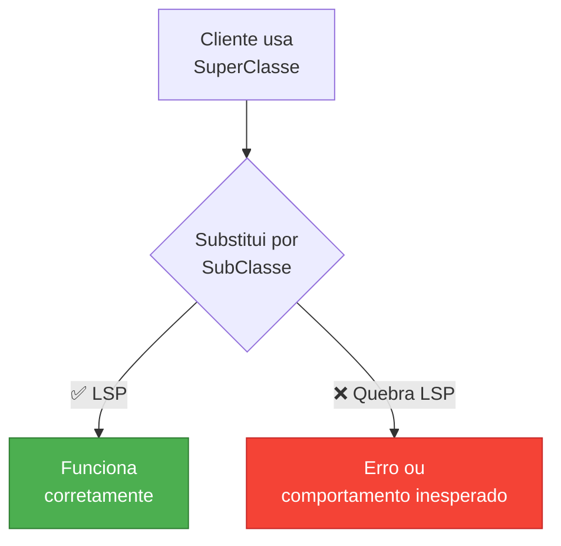
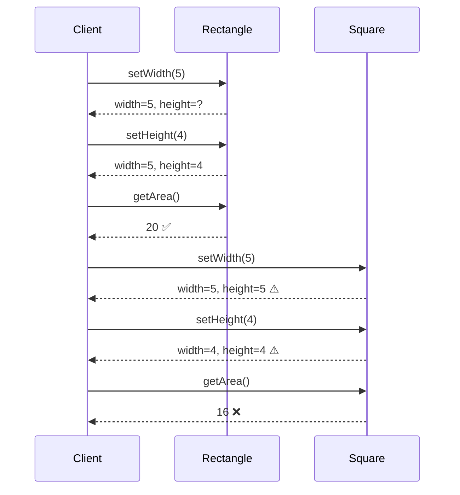
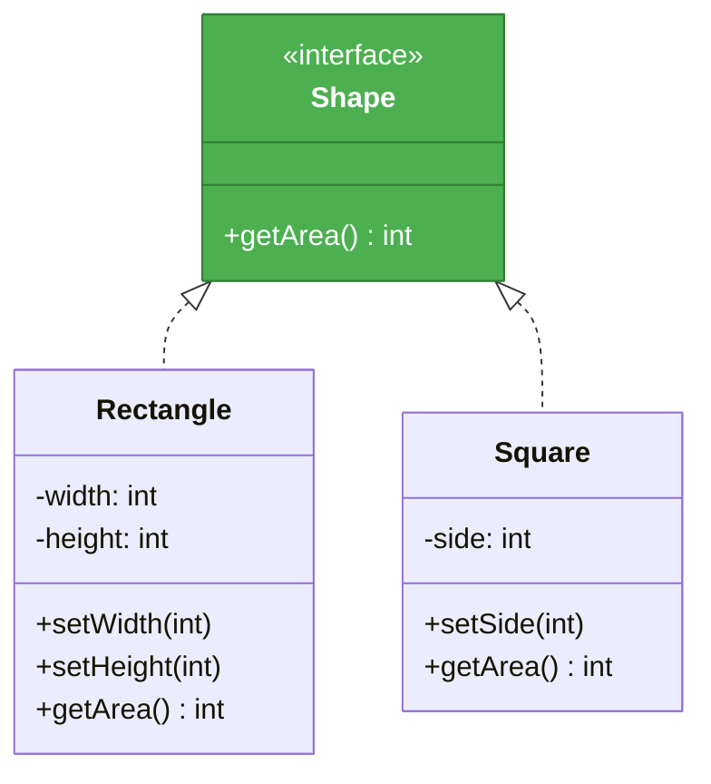
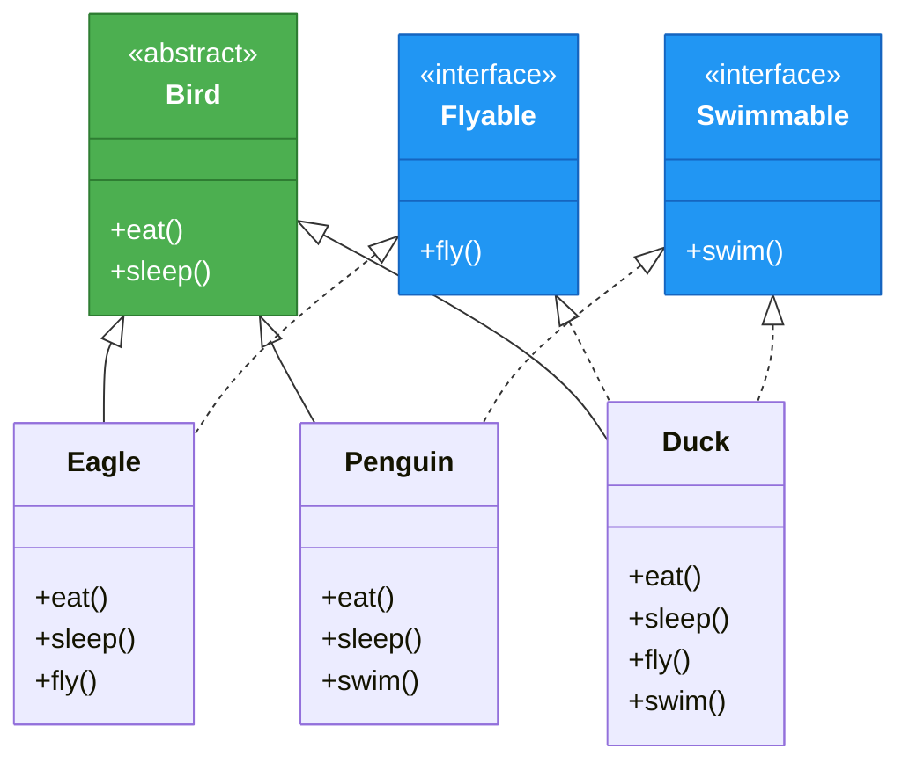
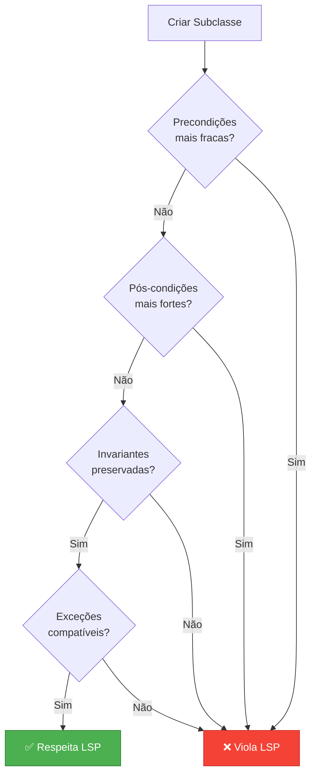
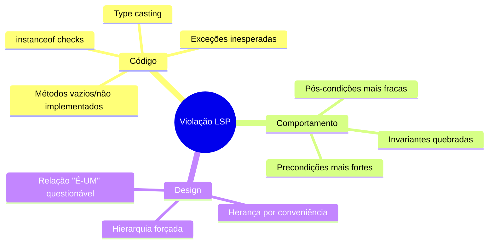

# Slide 6: Liskov Substitution Principle (LSP)

---

## 📖 Definição

> **"Objetos de uma superclasse devem poder ser substituídos por objetos de suas subclasses sem quebrar a aplicação"**
> 
> *— Barbara Liskov*



---

## ❌ Violação Clássica: Quadrado e Retângulo

```java
public class Rectangle {
    protected int width;
    protected int height;
    
    public void setWidth(int width) {
        this.width = width;
    }
    
    public void setHeight(int height) {
        this.height = height;
    }
    
    public int getArea() {
        return width * height;
    }
}

// ❌ Violação: Square é um Rectangle, mas quebra o contrato!
public class Square extends Rectangle {
    @Override
    public void setWidth(int width) {
        this.width = width;
        this.height = width;  // ⚠️ Modifica altura também!
    }
    
    @Override
    public void setHeight(int height) {
        this.width = height;   // ⚠️ Modifica largura também!
        this.height = height;
    }
}
```

---

## 💥 O Problema

```java
public class AreaCalculator {
    public void testRectangle(Rectangle rect) {
        rect.setWidth(5);
        rect.setHeight(4);
        
        // Esperado: 20
        assert rect.getArea() == 20;  // ✅ Funciona com Rectangle
                                       // ❌ FALHA com Square (área = 16)
    }
}
```



---

## ✅ Solução: Não use herança incorretamente!



```java
public interface Shape {
    int getArea();
}

public class Rectangle implements Shape {
    private int width;
    private int height;
    
    public void setWidth(int width) {
        this.width = width;
    }
    
    public void setHeight(int height) {
        this.height = height;
    }
    
    public int getArea() {
        return width * height;
    }
}

public class Square implements Shape {
    private int side;
    
    public void setSide(int side) {
        this.side = side;
    }
    
    public int getArea() {
        return side * side;
    }
}
```

---

## ❌ Violação em Spring Boot

```java
public class Bird {
    public void fly() {
        System.out.println("Flying...");
    }
}

// ❌ Pinguim não voa, mas herda fly()!
public class Penguin extends Bird {
    @Override
    public void fly() {
        throw new UnsupportedOperationException("Penguins can't fly!");
    }
}

// Cliente espera que Bird possa voar
public class BirdService {
    public void makeBirdFly(Bird bird) {
        bird.fly();  // 💥 Quebra com Penguin!
    }
}
```

---

## ✅ Solução com Interface Segregation



---

## 🎯 Regras para LSP



### Explicação:
1. **Precondições mais fracas**: Subclasse não deve exigir mais do que a superclasse
2. **Pós-condições mais fortes**: Subclasse deve garantir pelo menos o mesmo que a superclasse
3. **Invariantes**: Regras que devem ser sempre verdadeiras
4. **Exceções**: Subclasse não deve lançar exceções que a superclasse não lança

---

## 💡 Como Verificar LSP?

```java
// ✅ Teste: Substitua Base por Derived
@Test
public void testLiskovSubstitution() {
    // Usando superclasse
    PaymentProcessor processor = new CreditCardProcessor();
    processPayment(processor);  // Deve funcionar
    
    // Substituindo por subclasse
    processor = new DebitCardProcessor();
    processPayment(processor);  // Deve funcionar igualmente
}

private void processPayment(PaymentProcessor processor) {
    // Cliente não deve saber qual implementação está usando
    Payment result = processor.process(amount);
    assertNotNull(result);
    assertEquals(PaymentStatus.COMPLETED, result.getStatus());
}
```

---

## 🚨 Sinais de Violação



---

## 💡 Dica do Instrutor

```
⚠️ Lembre-se:
- Herança é sobre comportamento, não estrutura
- Prefira composição sobre herança
- "É-UM" vs "Comporta-se como UM"
- Se precisa de instanceof, provavelmente violou LSP
- Teste: substitua e veja se funciona sem mudanças no cliente
```
