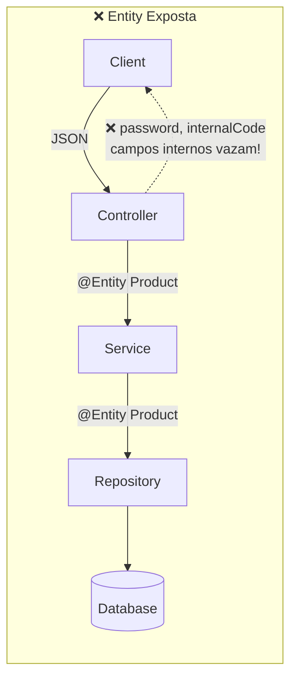
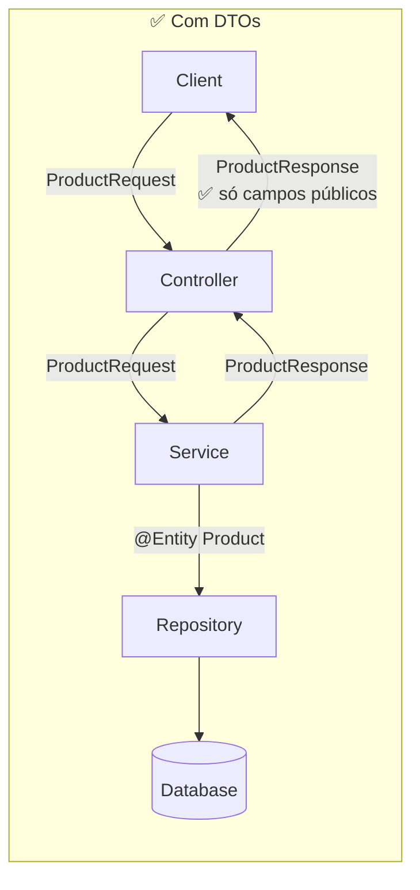
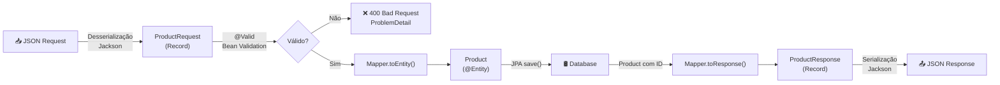

# Slide 6: DTOs e Mapeamento Entity ↔ DTO

**Horário:** 10:25 - 10:45

---

## 🛡️ Por que nunca expor a Entity JPA no Controller?

### O Diagrama do Problema





---

### Problema 1: Acoplamento API ↔ Banco

```java
// Se eu adicionar um campo no banco...
@Entity
public class Product {
    private String internalCode; // ← novo campo interno
}

// ... ele aparece AUTOMATICAMENTE na API!
// Clientes que consomem a API podem quebrar.
// A API não deveria mudar quando o banco muda.
```

### Problema 2: Segurança — Vazamento de Dados

```java
@Entity
public class User {
    private String password;     // 😱 Vazou na resposta da API!
    private String resetToken;   // 😱 Vazou na resposta da API!
    private boolean isAdmin;     // 😱 Cliente pode enviar isAdmin=true no POST!
}
```

### Problema 3: Evolução Independente

```java
// Quero mudar o nome do campo no banco, mas manter na API...
// Com Entity exposta: impossível sem quebrar clientes.
// Com DTO: mudo o mapeamento e ninguém percebe.
```

### Problema 4: Serialização Circular

```java
@Entity
public class Order {
    @OneToMany(mappedBy = "order")
    private List<OrderItem> items; // → serializa items → cada item tem order → loop infinito!
}
// Com DTO: você controla exatamente o que serializa.
```

---

## 📊 Entity vs. DTO — Responsabilidades

```mermaid
classDiagram
    class Product_Entity {
        <<@Entity>>
        -Long id
        -String name
        -String sku
        -BigDecimal price
        -String internalCode
        -LocalDateTime createdAt
        -LocalDateTime updatedAt
        -boolean isDeleted
        +getId()
        +setName()
    }

    class ProductRequest_DTO {
        <<Record>>
        +String name
        +String sku
        +BigDecimal price
        +String description
        Anotações: @NotBlank, @Valid, @Positive
    }

    class ProductResponse_DTO {
        <<Record>>
        +Long id
        +String name
        +String sku
        +BigDecimal price
        +String description
        +LocalDateTime createdAt
    }

    ProductRequest_DTO ..>|"Mapper.toEntity()"| Product_Entity : converte para
    Product_Entity ..>|"Mapper.toResponse()"| ProductResponse_DTO : converte para

    note for Product_Entity "Representa a TABELA no banco\nusada pelo JPA/Hibernate\ncontém campos internos"
    note for ProductRequest_DTO "O que o CLIENT ENVIA\ncom validações @Valid\nsem id, sem timestamps"
    note for ProductResponse_DTO "O que o CLIENT RECEBE\ncom id e timestamps\nsem campos internos"
```

---

## DTOs como Records (Java 16+)

> **Records** são perfeitos para DTOs: imutáveis, sem boilerplate, `equals()`/`hashCode()`/`toString()` gerados.

```java
// 📥 Request DTO (entrada — o que o cliente envia)
public record ProductRequest(
    @NotBlank(message = "Name is required")
    @Size(min = 3, max = 100, message = "Name must be between 3 and 100 chars")
    String name,

    @NotBlank(message = "SKU is required")
    @ValidSku                                       // Custom Validator!
    String sku,

    @NotNull(message = "Price is required")
    @Positive(message = "Price must be positive")
    BigDecimal price,

    @Size(max = 500, message = "Description max 500 chars")
    String description
) {}

// 📤 Response DTO (saída — o que o cliente recebe)
public record ProductResponse(
    Long id,
    String name,
    String sku,
    BigDecimal price,
    String description,
    LocalDateTime createdAt
) {}
// Note: sem internalCode, sem updatedAt, sem isDeleted!
```

---

## 🔄 Fluxo de Mapeamento Completo



---

## Mapeamento: 3 Abordagens

### 1. Classe Mapper Manual (recomendado para começar)

```java
public class ProductMapper {

    // Converte Request DTO → Entity
    public static Product toEntity(ProductRequest request) {
        Product product = new Product();
        product.setName(request.name());
        product.setSku(request.sku());
        product.setPrice(request.price());
        product.setDescription(request.description());
        return product;
    }

    // Converte Entity → Response DTO
    public static ProductResponse toResponse(Product entity) {
        return new ProductResponse(
            entity.getId(),
            entity.getName(),
            entity.getSku(),
            entity.getPrice(),
            entity.getDescription(),
            entity.getCreatedAt()
        );
    }

    // Converte lista completa
    public static List<ProductResponse> toResponseList(List<Product> entities) {
        return entities.stream()
            .map(ProductMapper::toResponse)
            .toList();
    }
}
```

---

### 2. Factory Method no DTO (alternativa popular)

```java
public record ProductResponse(
    Long id, String name, String sku, BigDecimal price,
    String description, LocalDateTime createdAt
) {
    // Factory method dentro do próprio DTO
    public static ProductResponse from(Product entity) {
        return new ProductResponse(
            entity.getId(), entity.getName(), entity.getSku(),
            entity.getPrice(), entity.getDescription(), entity.getCreatedAt()
        );
    }
}

// Uso: return ProductResponse.from(savedProduct);
```

---

### 3. MapStruct (compile-time, produção)

```java
// Interface que o MapStruct implementa automaticamente em compile-time
@Mapper(componentModel = "spring")
public interface ProductMapper {
    ProductResponse toResponse(Product entity);
    Product toEntity(ProductRequest request);

    // MapStruct gera a implementação AUTOMATICAMENTE!
    // Se os nomes dos campos forem iguais, não precisa de nada.
    // Se forem diferentes, use @Mapping:
    @Mapping(source = "department.name", target = "departmentName")
    EmployeeResponse toResponse(Employee entity);
}
```

---

### Comparação de Abordagens

| Abordagem | Prós | Contras | Quando usar |
|-----------|------|---------|-------------|
| **Manual/Mapper Class** | Simples, sem deps, type-safe, debug fácil | Repetitivo, verbose | Projetos pequenos/médios, aprendizado |
| **Factory Method** | Encapsulado no DTO, conciso | Mistura responsabilidades | DTOs simples |
| **MapStruct** | Compile-time, performático, zero reflexão | Config inicial, annotation processor | Projetos grandes/produção |
| **ModelMapper** | Automático, pouco código | Reflexão em runtime, difícil debug, erros silenciosos | ⚠️ Evitar — prefer MapStruct |

---

## 📏 Boas Práticas de DTO

1. **Request e Response separados** — nunca use o mesmo DTO para entrada e saída
2. **Records** — use records para DTOs (imutáveis, sem setter, sem lombok)
3. **Validação no Request** — use `@Valid` + anotações no DTO de entrada
4. **Sem lógica de negócio** — DTOs são objetos de transferência, não de comportamento
5. **Nomes descritivos** — `CreateProductRequest`, `UpdateProductRequest`, `ProductSummaryResponse`
6. **Nunca retorne Entity** — mesmo que o DTO tenha os mesmos campos

---

## 🎯 Pergunta para a turma

> Qual abordagem de mapeamento vocês preferem? Manual ou automática?
> Já usaram MapStruct ou ModelMapper em algum projeto?
> O que aconteceria se o frontend mandasse `{"isAdmin": true}` numa API que expõe a Entity?

---

## 💡 Dica do Instrutor

Mostrar no `03-employee-api` como o Controller retorna Entity diretamente (antes do refactoring) e comparar com o `03-clean-architecture-demo` que usa DTOs. Perguntar: "Quais problemas vocês identificam?"
