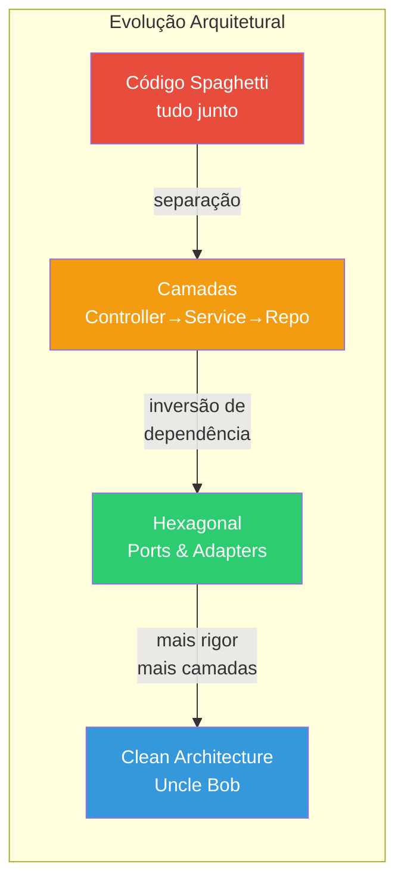
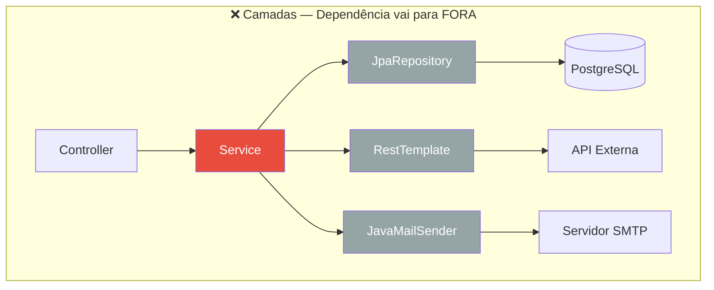
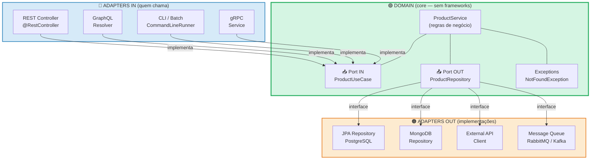
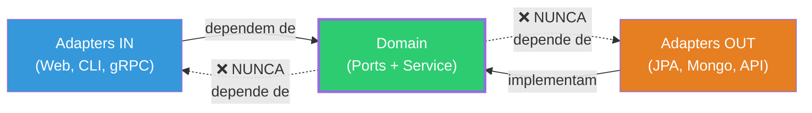
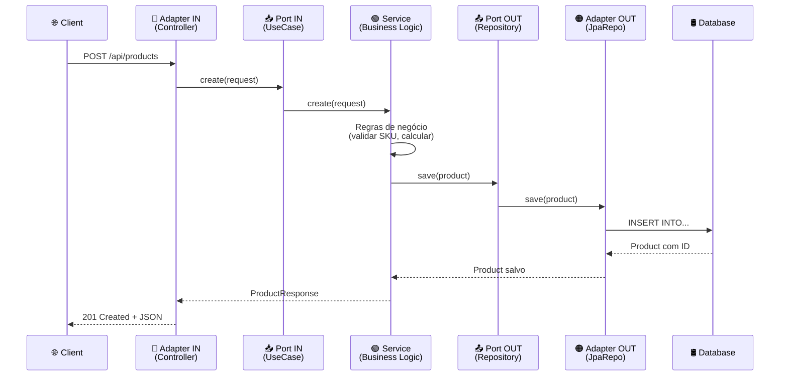
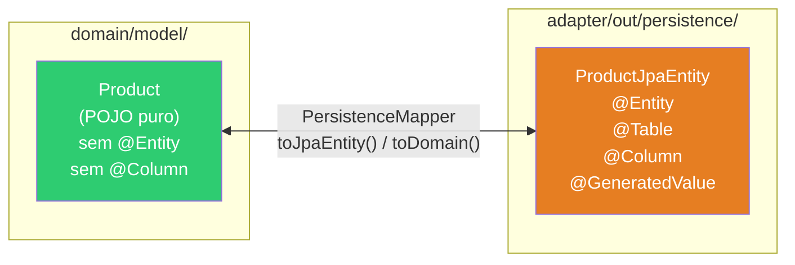
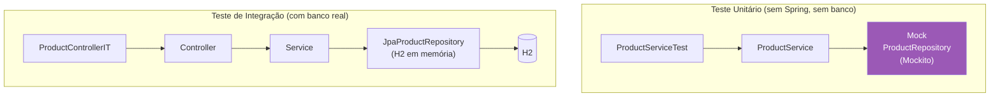
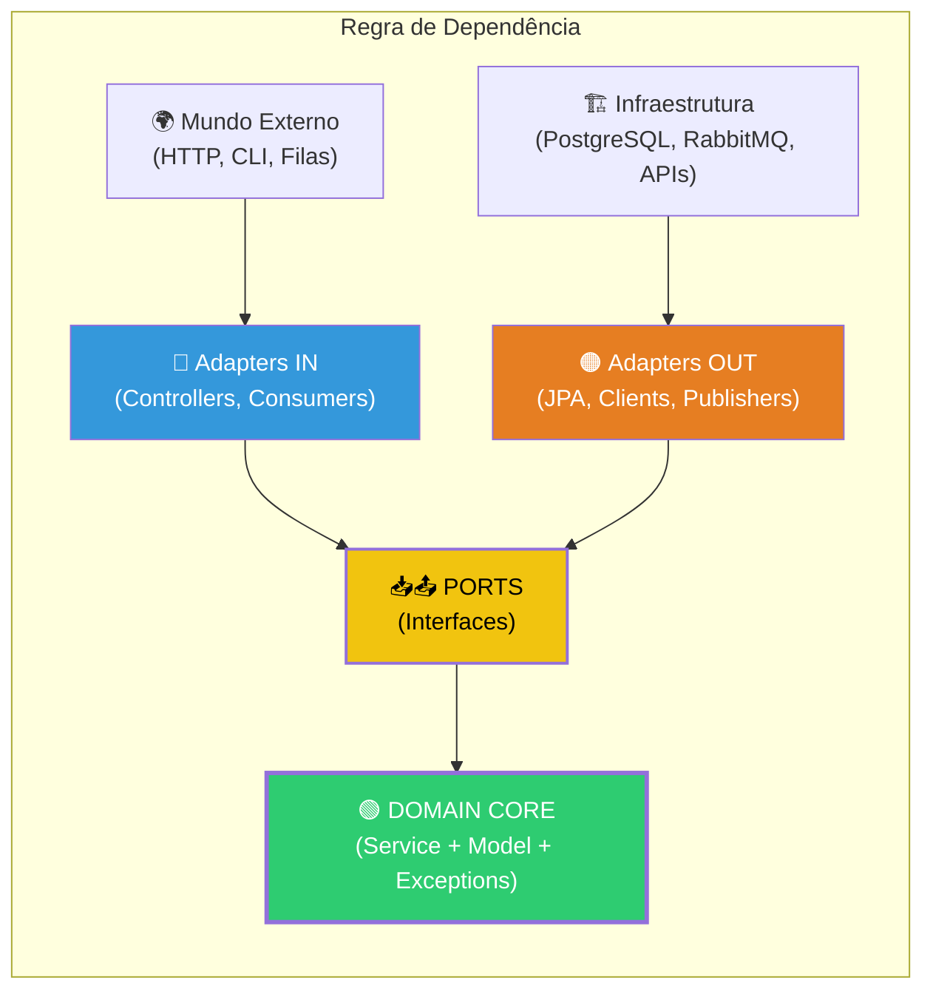

# Slide 7: Arquitetura Hexagonal — Ports & Adapters

**Horário:** 11:00 - 11:30

---

## 📖 Origem e Conceitos

> "Permita que uma aplicação seja igualmente dirigida por **usuários, programas, testes automatizados** ou scripts batch, e que seja desenvolvida e testada **em isolamento** de seus dispositivos de runtime e bancos de dados."
> — **Alistair Cockburn**, 2005

A arquitetura hexagonal (também chamada **Ports & Adapters**) foi proposta para resolver o problema de código de negócio ficar preso a detalhes de infraestrutura (banco, HTTP, filas, etc.).

Outros nomes que se referem à mesma ideia:
- **Clean Architecture** — Robert C. Martin (2012)
- **Onion Architecture** — Jeffrey Palermo (2008)



---

## 🤔 O Problema do "Service que faz tudo"

Mesmo com camadas, o Service pode ficar **acoplado à infraestrutura**:

```java
// ❌ Service acoplado — sabe sobre JPA, HTTP, SMTP
@Service
public class ProductService {
    private final JpaRepository<Product, Long> repo;     // JPA específico
    private final RestTemplate restTemplate;              // HTTP específico
    private final JavaMailSender mailSender;              // SMTP específico

    // Regras de negócio MISTURADAS com infraestrutura
    // Se trocar JPA por MongoDB → muda tudo
    // Se trocar RestTemplate por Feign → muda tudo
    // Para testar → precisa de banco + SMTP + API externa rodando!
}
```

### O Problema em Diagrama



> **Problema**: Para testar o `Service`, preciso de **PostgreSQL + API externa + SMTP** rodando. Impossível testar isoladamente.

---

## 🎯 A Ideia da Arquitetura Hexagonal

> "O domínio não sabe (e não se importa) se os dados vêm de um banco PostgreSQL, de uma API REST ou de um arquivo CSV."

### O Hexágono — Visão Completa



### A Regra de Dependência



> **Dependency Inversion Principle (DIP):** O domínio define interfaces (Ports). Adapters implementam. Dependências apontam **para dentro**, nunca para fora.

---

## Conceitos: Ports e Adapters — Detalhado

| Conceito | O que é | Direção | Exemplo | Quem implementa |
|----------|---------|---------|---------|-----------------|
| **Port IN** | Interface que o domínio **expõe** | Entrada → Domínio | `ProductUseCase` | `ProductService` |
| **Port OUT** | Interface que o domínio **precisa** | Domínio → Saída | `ProductRepository` | `JpaProductRepository` |
| **Adapter IN** | Componente que **chama** o domínio | Externo → Port IN | `ProductController` (REST) | Framework (Spring) |
| **Adapter OUT** | Componente que **é chamado** pelo domínio | Port OUT → Externo | `JpaProductRepository` (JPA) | Framework (Spring Data) |



---

## Estrutura de Pacotes

```
com.example.products/
│
├── domain/                              ← CORE (sem dependência de framework)
│   ├── model/
│   │   └── Product.java                 (entidade de domínio PURA — sem @Entity JPA!)
│   ├── port/
│   │   ├── in/
│   │   │   └── ProductUseCase.java      (interface: createProduct, findById...)
│   │   └── out/
│   │       └── ProductRepository.java   (interface: save, findById, findAll...)
│   ├── service/
│   │   └── ProductService.java          (implements ProductUseCase — SÓ regras de negócio)
│   └── exception/
│       ├── ProductNotFoundException.java (exceção de domínio)
│       └── DuplicateSkuException.java   (exceção de domínio)
│
├── adapter/
│   ├── in/
│   │   └── web/                         ← ADAPTER IN (REST API)
│   │       ├── ProductController.java   (@RestController — chama UseCase)
│   │       ├── dto/
│   │       │   ├── ProductRequest.java  (DTO entrada — @Valid aqui)
│   │       │   └── ProductResponse.java (DTO saída — sem campos internos)
│   │       ├── mapper/
│   │       │   └── ProductWebMapper.java (Request ↔ Domain, Domain ↔ Response)
│   │       └── handler/
│   │           └── GlobalExceptionHandler.java (@ControllerAdvice)
│   └── out/
│       └── persistence/                 ← ADAPTER OUT (JPA)
│           ├── JpaProductRepository.java (implements ProductRepository do domain)
│           ├── ProductJpaEntity.java    (@Entity JPA — diferente do domain/model!)
│           └── ProductPersistenceMapper.java (Domain ↔ JPA Entity)
│
└── config/
    └── BeanConfig.java                  ← Wiring: @Bean para conectar Port ↔ Adapter
```

### Por que 2 models (Domain vs JPA)?



> Em projetos simples/médios, é aceitável usar a mesma classe `@Entity` no domain. Em projetos grandes, separe para total independência do JPA.

---

## Na Prática: Interfaces (Ports)

```java
// Port IN — o que o domínio OFERECE (contrato para quem chama)
public interface ProductUseCase {
    ProductResponse create(ProductRequest request);
    ProductResponse findById(Long id);
    List<ProductResponse> findAll();
    void delete(Long id);
}

// Port OUT — o que o domínio PRECISA (contrato para infraestrutura)
public interface ProductRepository {
    Product save(Product product);
    Optional<Product> findById(Long id);
    List<Product> findAll();
    void deleteById(Long id);
    boolean existsBySku(String sku);
}
```

### Wiring: Conectando Tudo

```java
// config/BeanConfig.java — quem conecta as peças
@Configuration
public class BeanConfig {

    @Bean
    public ProductUseCase productUseCase(ProductRepository repository) {
        return new ProductService(repository);
        // Spring injeta JpaProductRepository (que implementa ProductRepository)
        // ProductService não sabe que está usando JPA!
    }
}
```

---

## 🧪 Testabilidade — O Grande Benefício



> **Sem hexagonal:** preciso do Spring + Banco para testar regras de negócio.  
> **Com hexagonal:** testo regras de negócio com **Mockito puro** — rápido, isolado, confiável.

---

## Quando usar Hexagonal vs. Camadas?

| Cenário | Camadas Simples | Hexagonal | Justificativa |
|---------|:-:|:-:|---------------|
| CRUD simples, poucos endpoints | ✅ | | Over-engineering desnecessário |
| Domínio complexo, muitas regras | | ✅ | Isola regra de negócio |
| Múltiplas fontes de dados (SQL + NoSQL + API) | | ✅ | Troca de adapter sem afetar domínio |
| Equipe grande, projeto de longo prazo | | ✅ | Boundaries claras, menos conflitos |
| MVP, prova de conceito, hackathon | ✅ | | Velocidade > perfeição |
| Microserviço com lógica significativa | | ✅ | Testes unitários rápidos |
| API com 3-4 endpoints e pouca lógica | ✅ | | Simplicidade vence |

> **Dica:** Comece com camadas simples. Quando sentir **dor de acoplamento** (difícil testar, difícil trocar banco, Service gigante), migre para hexagonal. A migração é incremental.

---

## 📊 Resumo Visual



---

## 🎯 Pergunta para a turma

> Se eu precisar trocar de PostgreSQL para MongoDB, quantos arquivos eu mudo?  
> Resposta: **apenas 2!** `JpaProductRepository` → `MongoProductRepository` e `ProductJpaEntity` → sem entity.  
> O `ProductService` (que tem toda a lógica) **não muda nenhuma linha.**

---

## 💡 Dica do Instrutor

Mostrar o diagrama de pacotes no `03-clean-architecture-demo` e como as dependências apontam para dentro (domain). Desenhar no quadro: "Se eu trocar JPA por MongoDB, o que muda? O que NÃO muda?"
