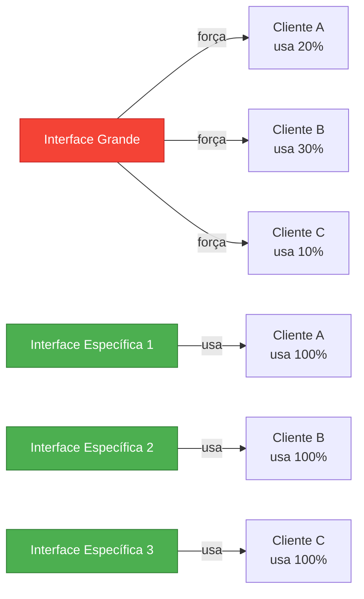
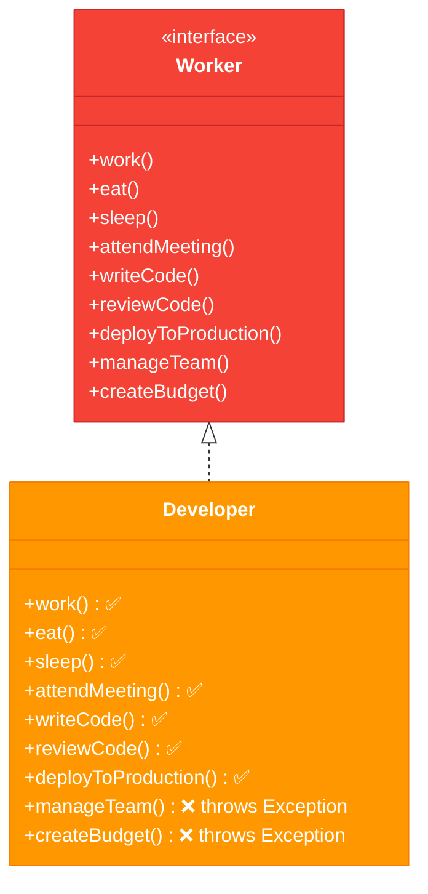
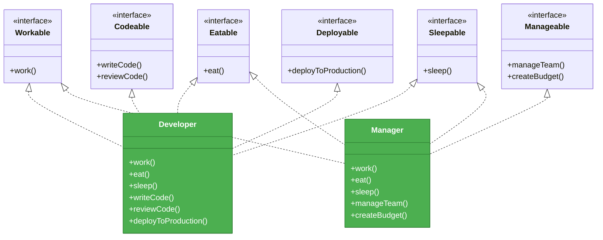
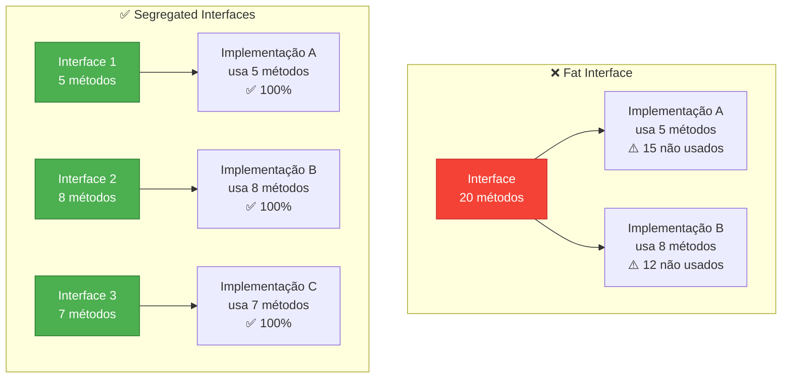
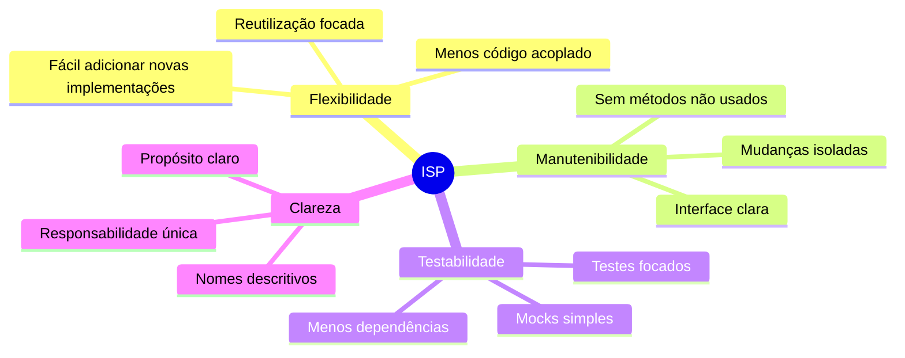
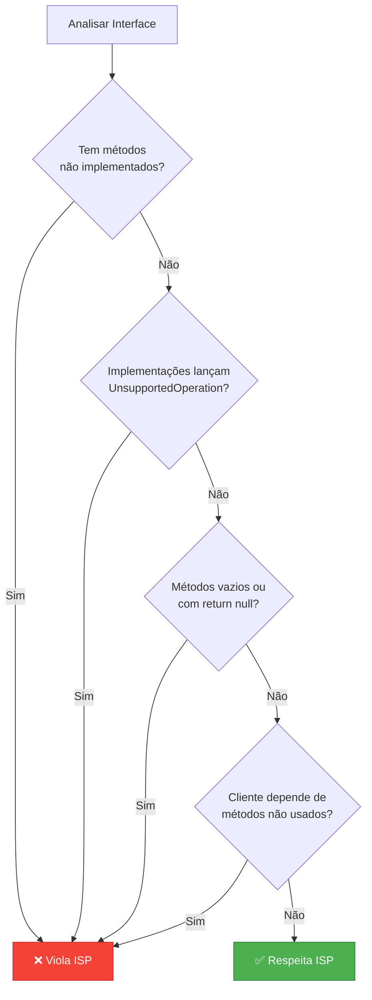
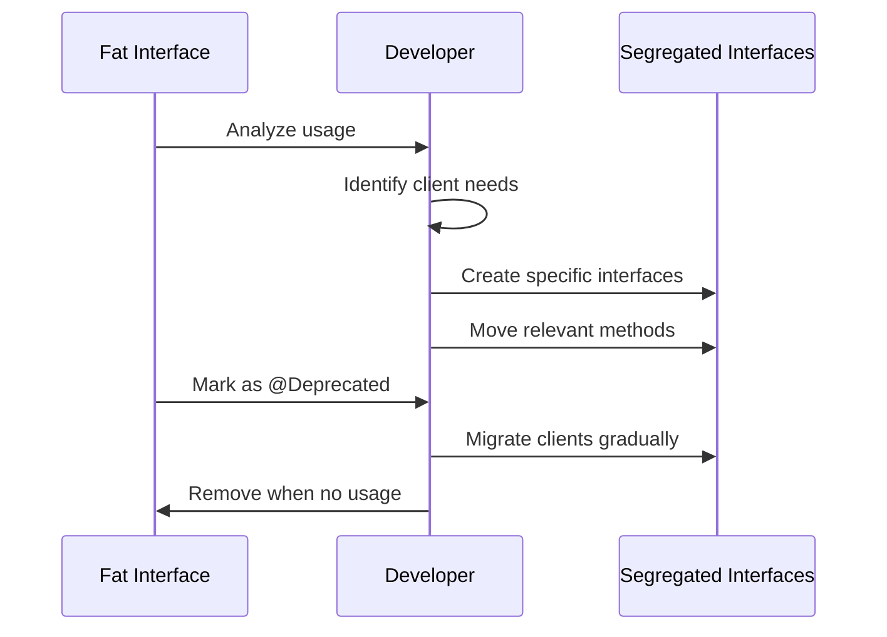

# Slide 7: Interface Segregation Principle (ISP)

---

## 📖 Definição

> **"Nenhum cliente deve ser forçado a depender de métodos que não utiliza"**
> 
> *— Robert C. Martin*



---

## ❌ Fat Interface (Interface Gorda)

```java
// ❌ Interface muito grande - força implementações desnecessárias
public interface Worker {
    void work();
    void eat();
    void sleep();
    void attendMeeting();
    void writeCode();
    void reviewCode();
    void deployToProduction();
    void manageTeam();
    void createBudget();
}

// Implementação forçada a ter métodos que não fazem sentido
public class Developer implements Worker {
    public void work() { /* implementa */ }
    public void eat() { /* implementa */ }
    public void sleep() { /* implementa */ }
    public void attendMeeting() { /* implementa */ }
    public void writeCode() { /* implementa */ }
    public void reviewCode() { /* implementa */ }
    public void deployToProduction() { /* implementa */ }
    
    // ⚠️ Developer não gerencia equipe!
    public void manageTeam() {
        throw new UnsupportedOperationException();
    }
    
    // ⚠️ Developer não cria orçamento!
    public void createBudget() {
        throw new UnsupportedOperationException();
    }
}
```

---

## 📊 Problema Visualizado



---

## ✅ Aplicando ISP - Interfaces Segregadas



---

## ✅ Código Refatorado

```java
// Interfaces pequenas e específicas
public interface Codeable {
    void writeCode();
    void reviewCode();
}

public interface Deployable {
    void deployToProduction();
}

public interface Manageable {
    void manageTeam();
    void createBudget();
}

// Developer implementa apenas o que faz sentido
public class Developer implements Codeable, Deployable {
    @Override
    public void writeCode() {
        // implementação
    }
    
    @Override
    public void reviewCode() {
        // implementação
    }
    
    @Override
    public void deployToProduction() {
        // implementação
    }
}

// Manager implementa apenas o que faz sentido
public class Manager implements Manageable {
    @Override
    public void manageTeam() {
        // implementação
    }
    
    @Override
    public void createBudget() {
        // implementação
    }
}
```

---

## 🔍 Exemplo em Spring Boot: Repository

### ❌ Problema

```java
// Fat interface - força implementação de métodos não usados
public interface ProductRepository extends JpaRepository<Product, Long> {
    // Herda 20+ métodos, mas usa apenas 3!
}
```

### ✅ Solução

```java
// Interface customizada com apenas o necessário
public interface ProductRepository extends Repository<Product, Long> {
    Product findById(Long id);
    List<Product> findAll();
    Product save(Product product);
}

// Ou use interfaces menores do Spring Data
public interface ReadOnlyProductRepository 
    extends Repository<Product, Long> {
    
    Product findById(Long id);
    List<Product> findAll();
}
```

---

## 📊 Comparação: Fat vs Segregated



---

## 🎯 Benefícios do ISP



---

## 🚨 Sinais de Violação



---

## 🛠️ Como Refatorar



---

## 💡 Dica do Instrutor

```
⚠️ Princípios de ISP:
1. Interfaces coesas: métodos relacionados juntos
2. Interfaces pequenas: 1-5 métodos idealmente
3. Múltiplas interfaces: cliente implementa as que precisa
4. Não force implementações vazias
5. Se tem @Deprecated ou throws UnsupportedOperation, refatore!

🎯 Regra prática:
- Se a implementação tem método vazio → Viola ISP
- Se o cliente não usa todos métodos → Viola ISP
```
