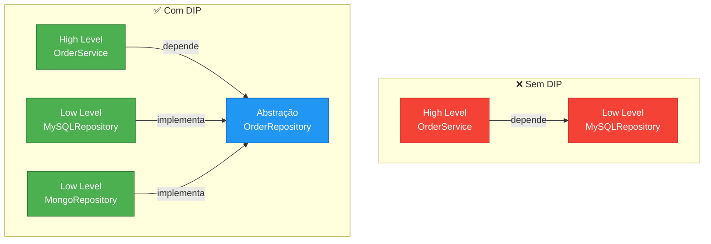
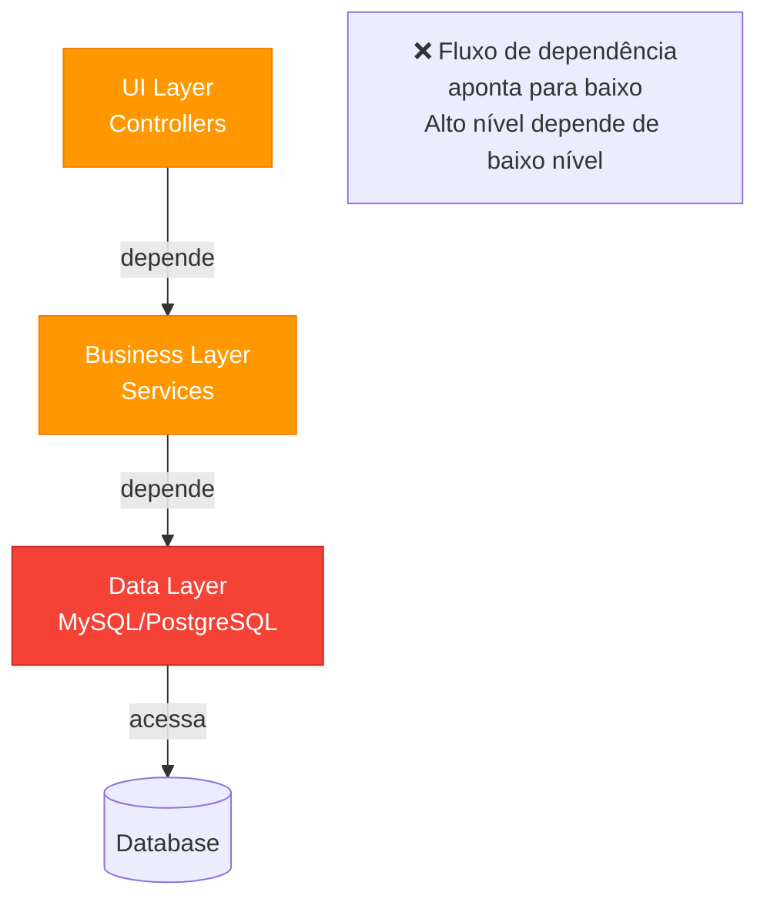
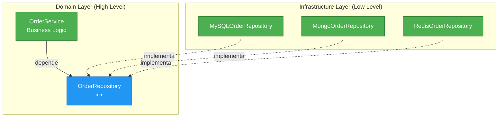
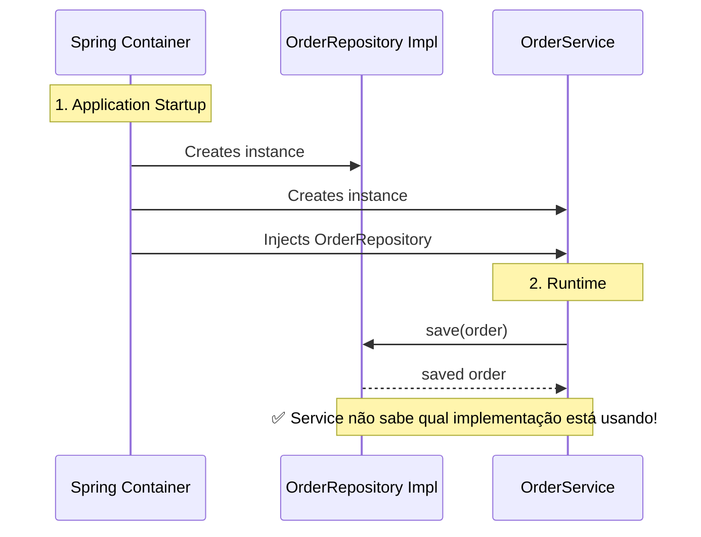
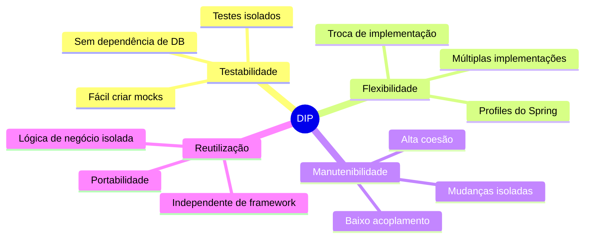
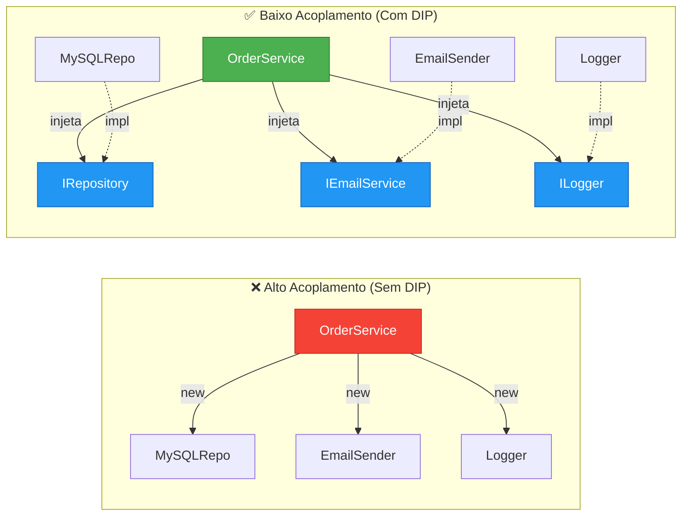
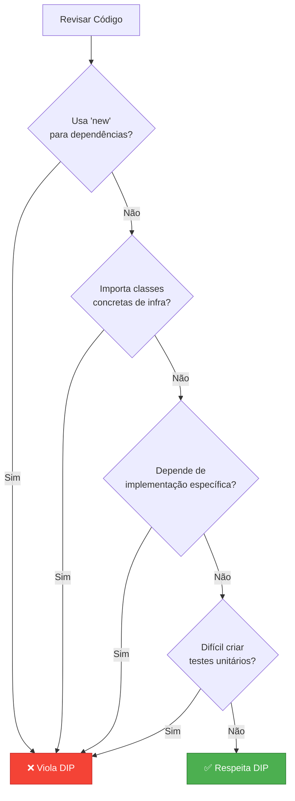

# Slide 8: Dependency Inversion Principle (DIP)

---

## 📖 Definição

> **"Módulos de alto nível não devem depender de módulos de baixo nível. Ambos devem depender de abstrações."**
> 
> **"Abstrações não devem depender de detalhes. Detalhes devem depender de abstrações."**
> 
> *— Robert C. Martin*



---

## ❌ Violação do DIP

```java
// ❌ Classe de alto nível depende de implementação concreta
@Service
public class OrderService {
    
    // Acoplamento direto com MySQL
    private MySQLOrderRepository repository;
    
    public OrderService() {
        // Instancia diretamente a implementação
        this.repository = new MySQLOrderRepository();
    }
    
    public Order createOrder(Order order) {
        // Lógica de negócio depende de detalhe de infraestrutura
        return repository.saveToMySQL(order);
    }
}

// Implementação concreta
public class MySQLOrderRepository {
    public Order saveToMySQL(Order order) {
        // Código específico do MySQL
        return order;
    }
}
```

**Problema:** Impossível trocar MySQL por outro banco sem modificar OrderService! 🔒

---

## 📊 Arquitetura Tradicional (Violação)



---

## ✅ Aplicando DIP



---

## ✅ Código Refatorado

```java
// 1️⃣ Abstração (interface) no domínio
public interface OrderRepository {
    Order save(Order order);
    Order findById(Long id);
    List<Order> findAll();
}

// 2️⃣ Service depende da abstração (Injeção de Dependência)
@Service
@RequiredArgsConstructor  // Lombok - constructor injection
public class OrderService {
    
    // Depende de abstração, não implementação
    private final OrderRepository repository;
    
    public Order createOrder(Order order) {
        // Lógica de negócio isolada dos detalhes
        return repository.save(order);
    }
}

// 3️⃣ Implementação concreta 1 - MySQL
@Repository
public class MySQLOrderRepository implements OrderRepository {
    @PersistenceContext
    private EntityManager em;
    
    @Override
    public Order save(Order order) {
        em.persist(order);
        return order;
    }
    
    // outros métodos...
}

// 4️⃣ Implementação concreta 2 - MongoDB (alternativa)
@Repository
@Profile("mongodb")  // Ativa apenas com profile mongodb
public class MongoOrderRepository implements OrderRepository {
    private final MongoTemplate mongoTemplate;
    
    @Override
    public Order save(Order order) {
        return mongoTemplate.save(order);
    }
    
    // outros métodos...
}
```

---

## 🔄 Inversão de Controle (IoC)



---

## 🎯 Benefícios do DIP



---

## 🧪 Testabilidade Comparada

### ❌ Sem DIP - Difícil testar

```java
@Test
public void testCreateOrder() {
    OrderService service = new OrderService();
    // 💥 Precisa de MySQL rodando!
    // 💥 Precisa configurar conexão!
    // 💥 Teste lento!
    Order order = service.createOrder(new Order());
}
```

### ✅ Com DIP - Fácil testar

```java
@Test
public void testCreateOrder() {
    // ✅ Mock da interface
    OrderRepository mockRepo = mock(OrderRepository.class);
    when(mockRepo.save(any())).thenReturn(new Order());
    
    // ✅ Teste rápido, isolado, sem DB
    OrderService service = new OrderService(mockRepo);
    Order order = service.createOrder(new Order());
    
    verify(mockRepo).save(any());
}
```

---

## 🏗️ DIP em Arquitetura Limpa

```mermaid
graph TB
    subgraph "🎯 Domain Layer (Core)"
        UC[Use Cases<br/>Business Rules]
        ENT[Entities<br/>Domain Models]
        PORT[Ports<br/><<interfaces>>]
    end
    
    subgraph "🔌 Infrastructure Layer"
        WEB[Web<br/>Controllers]
        DB[Database<br/>Repositories]
        EXT[External APIs<br/>Services]
    end
    
    UC -->|usa| ENT
    UC -->|define| PORT
    WEB -.depende.-> UC
    DB -.implementa.-> PORT
    EXT -.implementa.-> PORT
    
    style UC fill:#4CAF50,stroke:#2E7D32,color:#fff
    style ENT fill:#4CAF50,stroke:#2E7D32,color:#fff
    style PORT fill:#2196F3,stroke:#1565C0,color:#fff
    
    Note1[✅ Dependências apontam<br/>para dentro (domain)<br/>Domain não conhece infra]
```

---

## 🔧 DIP com Spring Boot

### Constructor Injection (Recomendado)

```java
@Service
@RequiredArgsConstructor  // Lombok
public class OrderService {
    private final OrderRepository repository;      // ✅ final + constructor
    private final PaymentService paymentService;   // ✅ Imutável
    private final EmailService emailService;       // ✅ Testável
}
```

### Field Injection (❌ Evite)

```java
@Service
public class OrderService {
    @Autowired  // ❌ Dificulta testes
    private OrderRepository repository;
}
```

---

## 📊 Comparação: Acoplamento



---

## 🚨 Sinais de Violação



---

## 💡 Dica do Instrutor

```
⚠️ Regras práticas:
1. Nunca use 'new' para dependências (use @Autowired)
2. Sempre programe para interfaces, não implementações
3. Use constructor injection (não field injection)
4. Domínio não deve conhecer infraestrutura
5. Se difícil testar, provavelmente viola DIP

🎯 Lembre-se:
- DIP != Dependency Injection (DI)
- DIP é o princípio (design)
- DI é a técnica (implementação)
- Spring IoC implementa ambos
```
