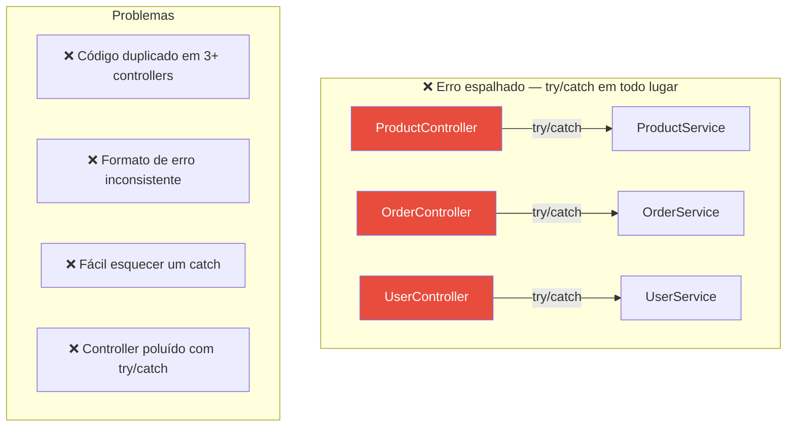
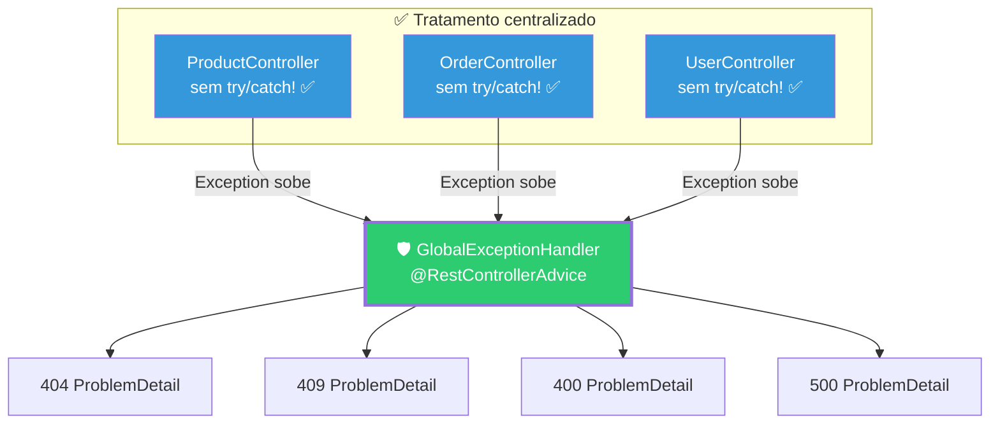
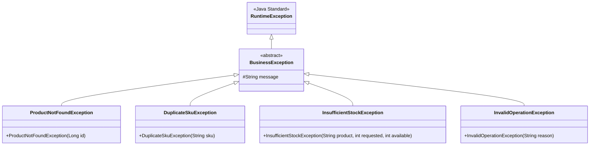
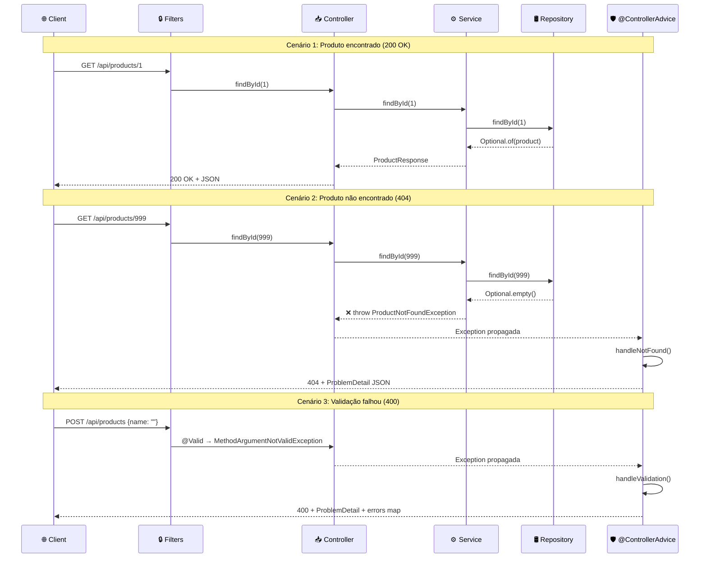

# Slide 8: Tratamento de Erros Global

**Horário:** 11:30 - 11:45

---

## 🚨 O Problema: Erros Espalhados

> "O tratamento de erros é importante, mas se ele obscurece a lógica, está errado."
> — **Robert C. Martin**, Clean Code (Cap. 7)

### Antes: cada Controller repete lógica de erro

```java
// ❌ Cada controller trata seus próprios erros — DUPLICAÇÃO!
@GetMapping("/{id}")
public ResponseEntity<?> findById(@PathVariable Long id) {
    try {
        Product product = productService.findById(id);
        return ResponseEntity.ok(product);
    } catch (ProductNotFoundException e) {
        return ResponseEntity.status(404).body(Map.of("error", e.getMessage()));
    } catch (Exception e) {
        return ResponseEntity.status(500).body(Map.of("error", "Internal error"));
    }
}
// 😰 Repetir isso em TODOS os métodos de TODOS os controllers?
// 😰 E se esquecer um catch? Retorna 500 genérico ao cliente!
// 😰 Formato do erro muda? Alterar em TODOS os controllers!
```

### Visualizando o problema



---

## ✅ A Solução: @ControllerAdvice

> **@ControllerAdvice** é um **interceptor global** do Spring que captura exceções lançadas por QUALQUER controller e trata em UM ÚNICO LUGAR.

### Arquitetura do tratamento de erros global



---

### Implementação Completa

```java
@RestControllerAdvice
public class GlobalExceptionHandler {

    // ── NOT FOUND (404) ──────────────────────────────────────
    @ExceptionHandler(ProductNotFoundException.class)
    public ResponseEntity<ProblemDetail> handleNotFound(
            ProductNotFoundException ex, HttpServletRequest request) {
        ProblemDetail problem = ProblemDetail.forStatusAndDetail(
            HttpStatus.NOT_FOUND, ex.getMessage()
        );
        problem.setTitle("Resource Not Found");
        problem.setType(URI.create("https://api.example.com/errors/not-found"));
        problem.setInstance(URI.create(request.getRequestURI()));
        return ResponseEntity.status(HttpStatus.NOT_FOUND).body(problem);
    }

    // ── CONFLICT (409) ──────────────────────────────────────
    @ExceptionHandler(DuplicateSkuException.class)
    public ResponseEntity<ProblemDetail> handleDuplicate(
            DuplicateSkuException ex) {
        ProblemDetail problem = ProblemDetail.forStatusAndDetail(
            HttpStatus.CONFLICT, ex.getMessage()
        );
        problem.setTitle("Duplicate Resource");
        return ResponseEntity.status(HttpStatus.CONFLICT).body(problem);
    }

    // ── VALIDATION ERROR (400) ──────────────────────────────
    @ExceptionHandler(MethodArgumentNotValidException.class)
    public ResponseEntity<ProblemDetail> handleValidation(
            MethodArgumentNotValidException ex) {
        ProblemDetail problem = ProblemDetail.forStatusAndDetail(
            HttpStatus.BAD_REQUEST, "One or more fields are invalid"
        );
        problem.setTitle("Validation Error");

        Map<String, String> errors = new HashMap<>();
        ex.getBindingResult().getFieldErrors().forEach(error ->
            errors.put(error.getField(), error.getDefaultMessage())
        );
        problem.setProperty("errors", errors);

        return ResponseEntity.badRequest().body(problem);
    }

    // ── CATCH-ALL (500) ─────────────────────────────────────
    @ExceptionHandler(Exception.class)
    public ResponseEntity<ProblemDetail> handleUnexpected(Exception ex) {
        // Log para debugging (nunca expor stacktrace ao cliente!)
        log.error("Unexpected error", ex);

        ProblemDetail problem = ProblemDetail.forStatusAndDetail(
            HttpStatus.INTERNAL_SERVER_ERROR,
            "An unexpected error occurred. Please try again later."
        );
        problem.setTitle("Internal Server Error");
        return ResponseEntity.status(HttpStatus.INTERNAL_SERVER_ERROR).body(problem);
    }
}
```

---

## O Controller fica LIMPO

```java
// ✅ Sem try/catch! A exceção "sobe" e o @ControllerAdvice trata.
@GetMapping("/{id}")
public ResponseEntity<ProductResponse> findById(@PathVariable Long id) {
    return ResponseEntity.ok(productService.findById(id));
    // Se ProductNotFoundException → @ControllerAdvice retorna 404
}

@PostMapping
public ResponseEntity<ProductResponse> create(
        @Valid @RequestBody ProductRequest request) {
    ProductResponse response = productService.create(request);
    return ResponseEntity.status(HttpStatus.CREATED).body(response);
    // Se DuplicateSkuException → @ControllerAdvice retorna 409
    // Se @Valid falhar → @ControllerAdvice retorna 400
}

@DeleteMapping("/{id}")
public ResponseEntity<Void> delete(@PathVariable Long id) {
    productService.delete(id);
    return ResponseEntity.noContent().build();
    // Se ProductNotFoundException → 404 automático
}
```

> **Observe:** nenhum `try/catch` no Controller. Ele se preocupa **apenas** com o caminho feliz (happy path).

---

## Custom Exceptions — Hierarquia



### Implementação das Exceptions

```java
// Base — todas as exceções de negócio herdam desta
public abstract class BusinessException extends RuntimeException {
    protected BusinessException(String message) {
        super(message);
    }
}

// Exceção de negócio — NOT FOUND (404)
public class ProductNotFoundException extends BusinessException {
    public ProductNotFoundException(Long id) {
        super("Product with id " + id + " not found");
    }
}

// Exceção de negócio — CONFLICT (409)
public class DuplicateSkuException extends BusinessException {
    public DuplicateSkuException(String sku) {
        super("Product with SKU '" + sku + "' already exists");
    }
}

// Exceção de negócio — BUSINESS RULE (422)
public class InsufficientStockException extends BusinessException {
    public InsufficientStockException(String productName, int requested, int available) {
        super("Insufficient stock for '%s': requested %d, available %d"
            .formatted(productName, requested, available));
    }
}
```

> **Por que `RuntimeException`?** Exceções checked (extends `Exception`) obrigam `throws` em cada método. Exceções de negócio são unchecked para manter o código limpo.

---

## Fluxo Completo — Sequence Diagram



---

## 📏 Checklist: Exception Handling

| Prática | ✅ Correto | ❌ Evitar |
|---------|-----------|----------|
| Onde tratar | `@ControllerAdvice` centralizado | try/catch em cada method |
| Tipo de exceção | Custom (ex: `ProductNotFoundException`) | `throw new Exception("msg")` |
| Herança | `extends RuntimeException` | `extends Exception` (checked) |
| Resposta | `ProblemDetail` (RFC 7807) | `Map.of("error", msg)` ou String |
| Stacktrace | Log no servidor, **nunca** enviar ao cliente | `ex.printStackTrace()` na response |
| Catch-all | `@ExceptionHandler(Exception.class)` com log | Deixar 500 genérico do Spring (Whitelabel) |

---

## 🎯 Pergunta para a turma

> O que acontece se eu NÃO tiver um `@ControllerAdvice` e uma exceção for lançada?
> Resposta: o Spring retorna a **Whitelabel Error Page** (HTML) ou um JSON genérico sem detalhes — péssimo para APIs.

---

## 💡 Dica do Instrutor

Demonstrar ao vivo: chamar um endpoint com ID inexistente e mostrar o ProblemDetail retornado. Depois, comentar o `@ControllerAdvice` e mostrar a diferença (Whitelabel Page ou JSON genérico).
