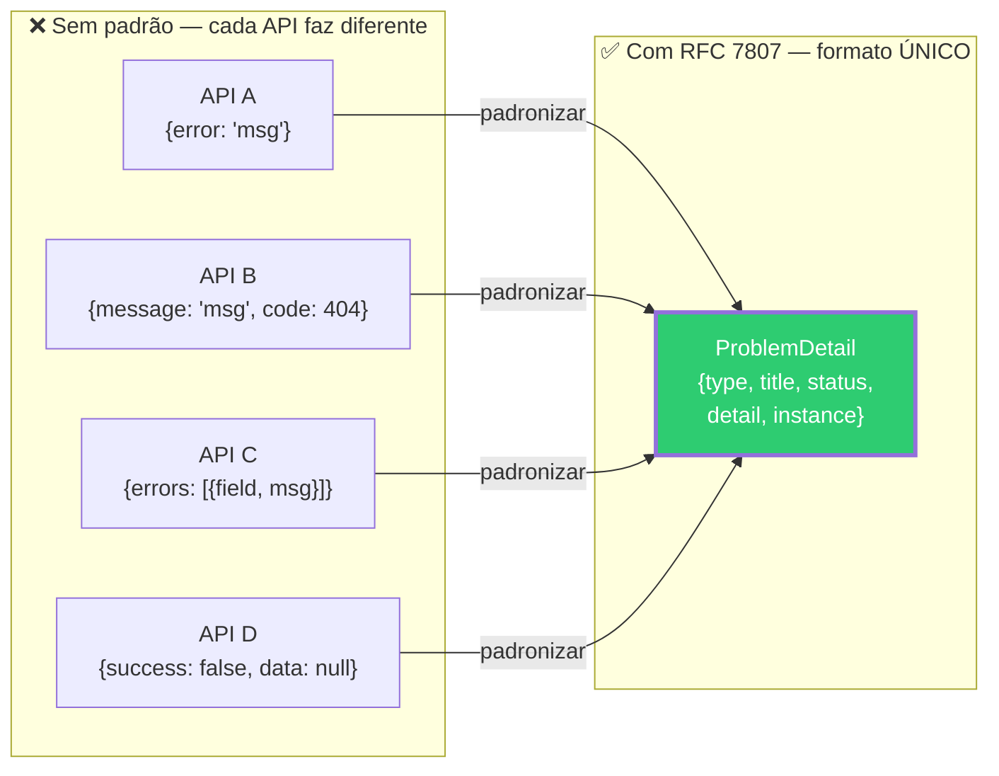
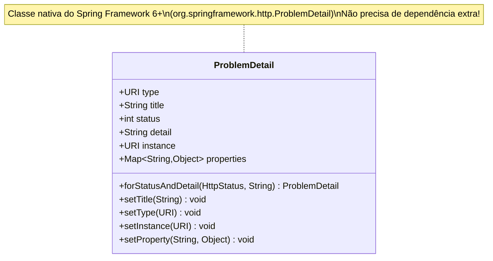
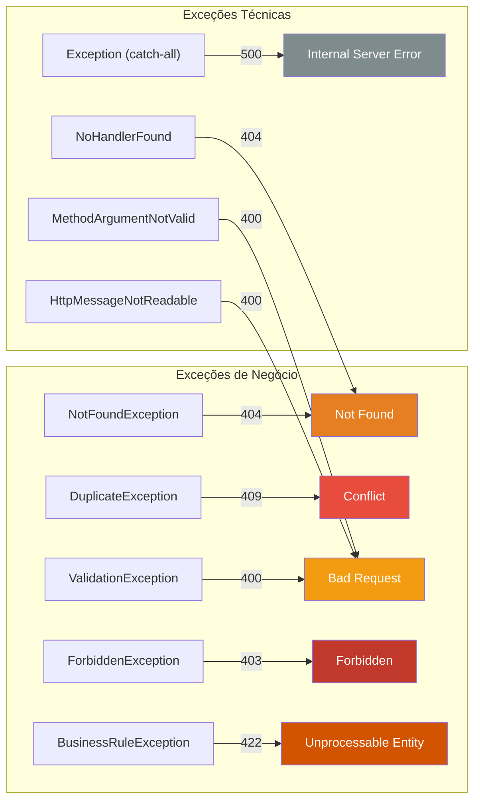

# Slide 9: Problem Details — RFC 7807 / RFC 9457

**Horário:** 11:45 - 11:50

---

## 📋 O que é Problem Details?

> **RFC 7807** (2016) → atualizada como **RFC 9457** (2023)  
> Uma especificação **padrão** da IETF para respostas de erro em APIs HTTP.

### O Problema: Cada API inventa seu formato de erro



### Formato Padrão do Problem Details

```json
{
  "type": "https://api.example.com/errors/not-found",
  "title": "Resource Not Found",
  "status": 404,
  "detail": "Product with id 42 not found",
  "instance": "/api/products/42"
}
```

> **Content-Type:** `application/problem+json` (tipo MIME oficial da RFC)

---

## Campos do Problem Details — Detalhado



| Campo | Obrigatório | Tipo | Descrição | Exemplo |
|-------|:-----------:|------|-----------|---------|
| `type` | Não* | URI | Identifica o **tipo** de erro (documentação) | `https://api.example.com/errors/not-found` |
| `title` | Não* | String | Título **legível** do problema | `"Resource Not Found"` |
| `status` | Não* | int | HTTP status code | `404` |
| `detail` | Não* | String | Descrição **específica** desta instância | `"Product with id 42 not found"` |
| `instance` | Não | URI | URI da **requisição** que gerou o erro | `"/api/products/42"` |
| _extras_ | Não | Qualquer | Campos adicionais **customizados** | `"errors"`, `"timestamp"` |

> *Na prática, `type`, `title`, `status` e `detail` devem sempre ser preenchidos.

---

## Antes vs. Depois — Comparação Real

### ❌ Antes (sem padrão)

```java
// Cada desenvolvedor faz de um jeito...
return ResponseEntity.status(404).body(
    Map.of("error", "Product not found", "code", "NOT_FOUND")
);
// ou...
return ResponseEntity.status(404).body(
    new ErrorResponse("Product not found", 404, LocalDateTime.now())
);
// ou...
return ResponseEntity.status(404).body("Product not found");
```

### ✅ Depois (com ProblemDetail)

```java
// TODOS os erros seguem o mesmo formato!
ProblemDetail problem = ProblemDetail.forStatusAndDetail(
    HttpStatus.NOT_FOUND, "Product with id 42 not found"
);
problem.setTitle("Resource Not Found");
return ResponseEntity.status(HttpStatus.NOT_FOUND).body(problem);
```

Resposta padronizada:
```json
{
  "type": "about:blank",
  "title": "Resource Not Found",
  "status": 404,
  "detail": "Product with id 42 not found"
}
```

---

## Spring Boot 3.x — Suporte Nativo

> `ProblemDetail` é classe nativa do **Spring Framework 6+**. Não precisa de dependência extra.

```java
// ProblemDetail com TODOS os campos + extras
@ExceptionHandler(ProductNotFoundException.class)
public ResponseEntity<ProblemDetail> handleNotFound(
        ProductNotFoundException ex, HttpServletRequest request) {

    ProblemDetail problem = ProblemDetail.forStatusAndDetail(
        HttpStatus.NOT_FOUND, ex.getMessage()
    );
    problem.setTitle("Resource Not Found");
    problem.setType(URI.create("https://api.example.com/errors/not-found"));
    problem.setInstance(URI.create(request.getRequestURI()));

    // Campos extras (aparecem no JSON como propriedades adicionais)
    problem.setProperty("timestamp", Instant.now());
    problem.setProperty("errorCode", "PRODUCT_NOT_FOUND");

    return ResponseEntity.status(HttpStatus.NOT_FOUND).body(problem);
}
```

Resposta completa:
```json
{
  "type": "https://api.example.com/errors/not-found",
  "title": "Resource Not Found",
  "status": 404,
  "detail": "Product with id 42 not found",
  "instance": "/api/products/42",
  "timestamp": "2024-01-15T10:30:00Z",
  "errorCode": "PRODUCT_NOT_FOUND"
}
```

---

## Tratar Erros de Validação (@Valid)

```java
@ExceptionHandler(MethodArgumentNotValidException.class)
public ResponseEntity<ProblemDetail> handleValidation(
        MethodArgumentNotValidException ex) {

    ProblemDetail problem = ProblemDetail.forStatusAndDetail(
        HttpStatus.BAD_REQUEST, "One or more fields are invalid"
    );
    problem.setTitle("Validation Error");

    // Adicionar campo customizado com lista de erros por campo
    Map<String, String> errors = new HashMap<>();
    ex.getBindingResult().getFieldErrors().forEach(error ->
        errors.put(error.getField(), error.getDefaultMessage())
    );
    problem.setProperty("errors", errors);

    return ResponseEntity.badRequest().body(problem);
}
```

**Resposta com erros detalhados por campo:**
```json
{
  "type": "about:blank",
  "title": "Validation Error",
  "status": 400,
  "detail": "One or more fields are invalid",
  "errors": {
    "name": "Name is required",
    "price": "Price must be positive",
    "email": "Invalid email format"
  }
}
```

---

## Mapeamento Exception → HTTP Status



---

## Habilitar ProblemDetails Globalmente

```yaml
# application.yml
spring:
  mvc:
    problemdetails:
      enabled: true  # Erros internos do Spring também retornam ProblemDetail
```

> Com essa configuração, mesmo erros 404 do Spring (rota inexistente), 405 (Method Not Allowed) e 415 (Unsupported Media Type) retornam ProblemDetail automaticamente — sem precisar de `@ExceptionHandler`.

---

## 📏 Resumo: Quando usar cada campo

| Situação | type | title | status | detail | instance | extras |
|----------|:----:|:-----:|:------:|:------:|:--------:|:------:|
| Erro simples | `about:blank` | ✅ | ✅ | ✅ | | |
| Erro documentado | URI da doc | ✅ | ✅ | ✅ | ✅ | |
| Erro de validação | `about:blank` | ✅ | ✅ | ✅ | | `errors` map |
| Erro com rastreio | URI da doc | ✅ | ✅ | ✅ | ✅ | `timestamp`, `traceId` |

---

## 🎯 Pergunta para a turma

> Vocês já consumiram uma API que retornava erros em formatos inconsistentes? Como foi a experiência?  
> O que vocês incluiriam como campo extra no ProblemDetail para facilitar debugging em produção?
