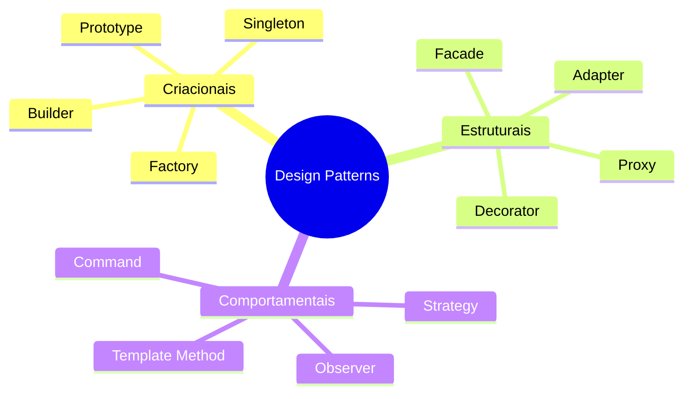
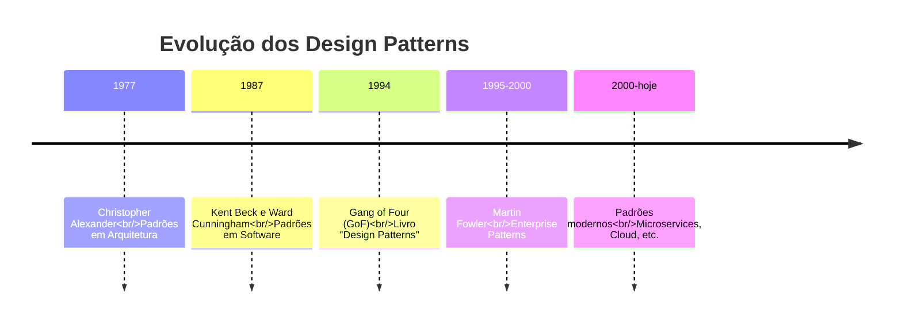
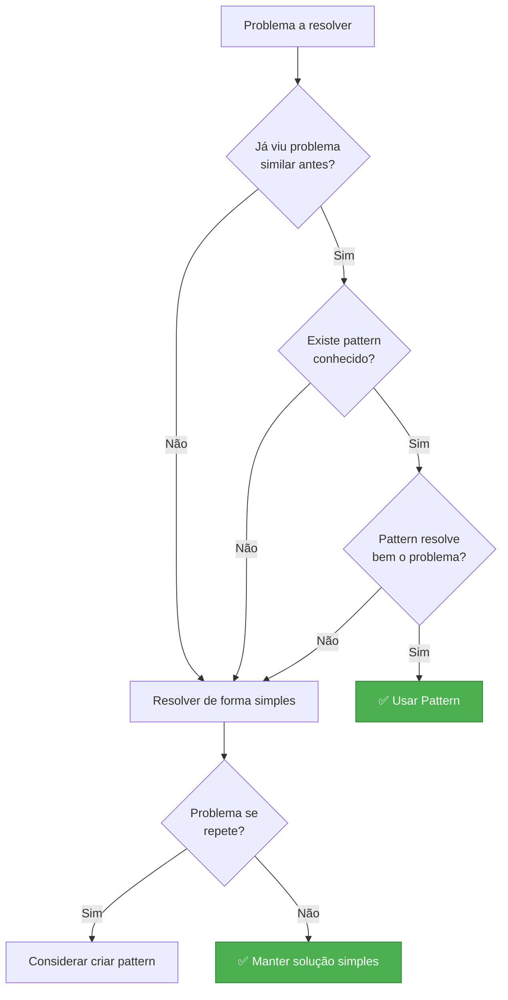
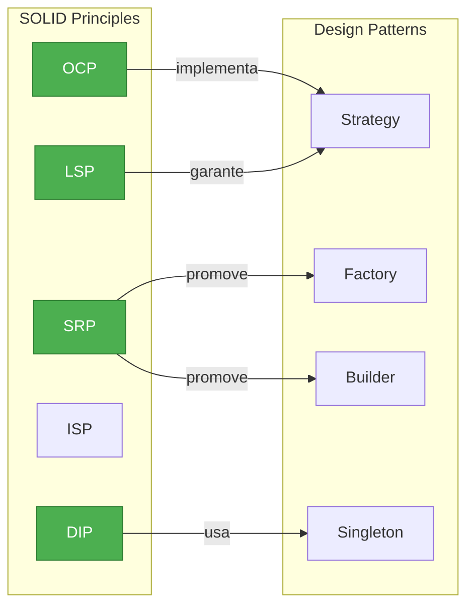

# Slide 9: Design Patterns - Introdução

**Horário:** 11:00 - 12:30

---

## 🎨 O que são Design Patterns?

> **"Soluções reutilizáveis para problemas comuns no desenvolvimento de software"**
> 
> *— Gang of Four (GoF)*



---

## 📚 História



---

## 🎯 Foco do Dia

Vamos estudar 4 patterns essenciais para Spring Boot:

```mermaid
graph TD
    A[Design Patterns<br/>Essenciais] --> B[Strategy Pattern<br/>Comportamental]
    A --> C[Factory Pattern<br/>Criacional]
    A --> D[Builder Pattern<br/>Criacional]
    A --> E[Singleton Pattern<br/>Criacional]
    
    B -->|OCP| F[Múltiplas estratégias]
    C -->|SRP| G[Criação centralizada]
    D -->|Objetos complexos| H[Construção fluente]
    E -->|Já no Spring| I[@Component, @Service]
    
    style A fill:#4CAF50,stroke:#2E7D32,color:#fff
    style B fill:#2196F3,stroke:#1565C0,color:#fff
    style C fill:#2196F3,stroke:#1565C0,color:#fff
    style D fill:#2196F3,stroke:#1565C0,color:#fff
    style E fill:#2196F3,stroke:#1565C0,color:#fff
```

---

## ⚠️ Quando Usar Patterns?



---

## 💡 Princípios

```
✅ FAÇA:
- Use patterns para problemas conhecidos
- Entenda o problema antes de escolher o pattern
- Mantenha simplicidade
- Combine patterns quando necessário

❌ NÃO FAÇA:
- Force patterns onde não fazem sentido
- Use pattern só por usar (over-engineering)
- Ignore YAGNI (You Aren't Gonna Need It)
- Copie código sem entender
```

---

## 📊 Relação com SOLID


