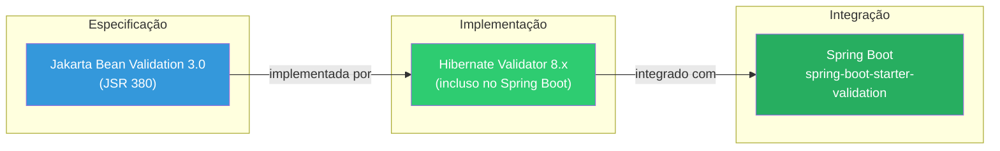
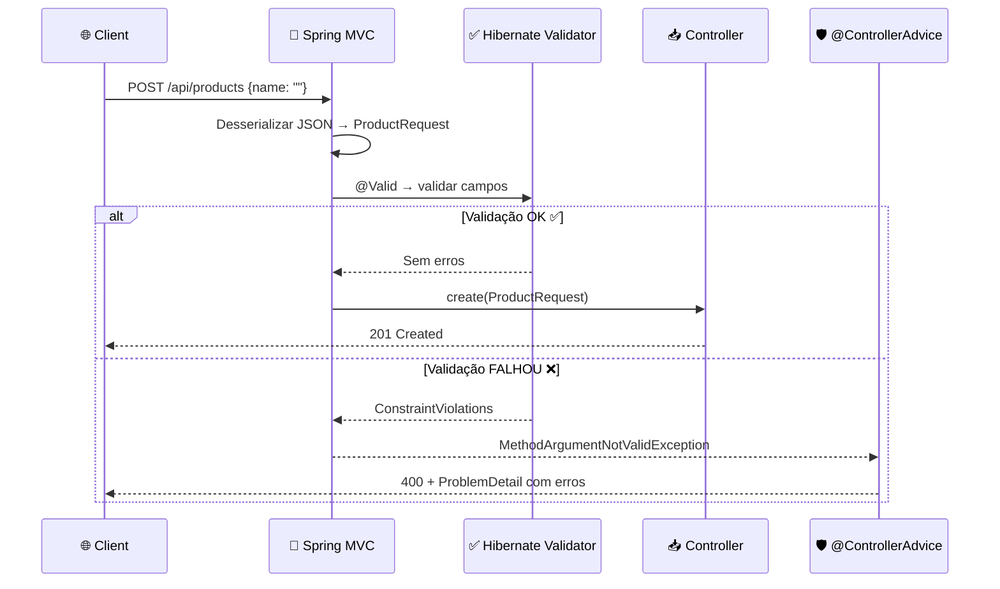
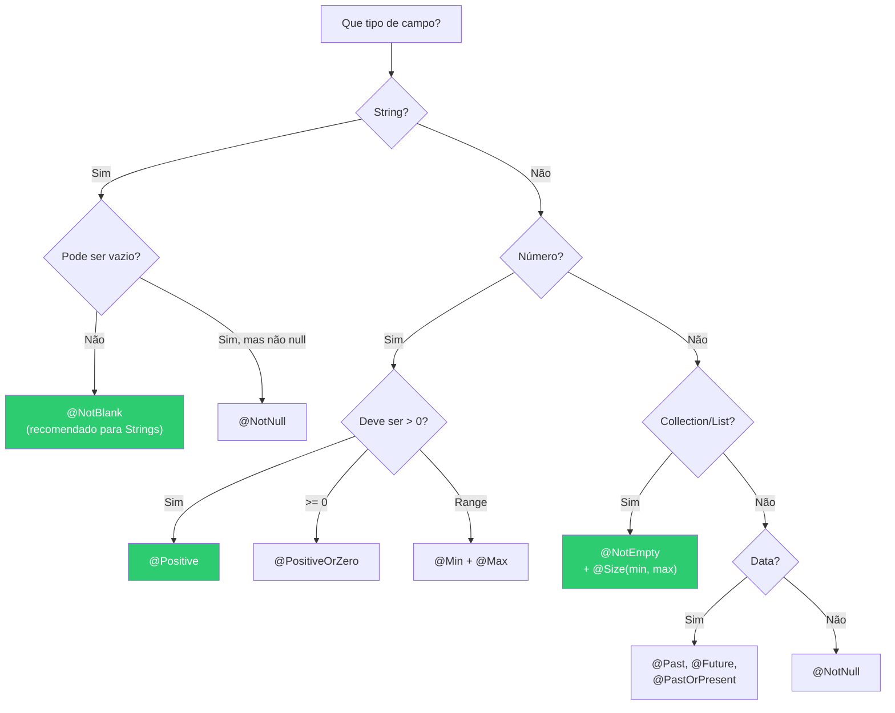
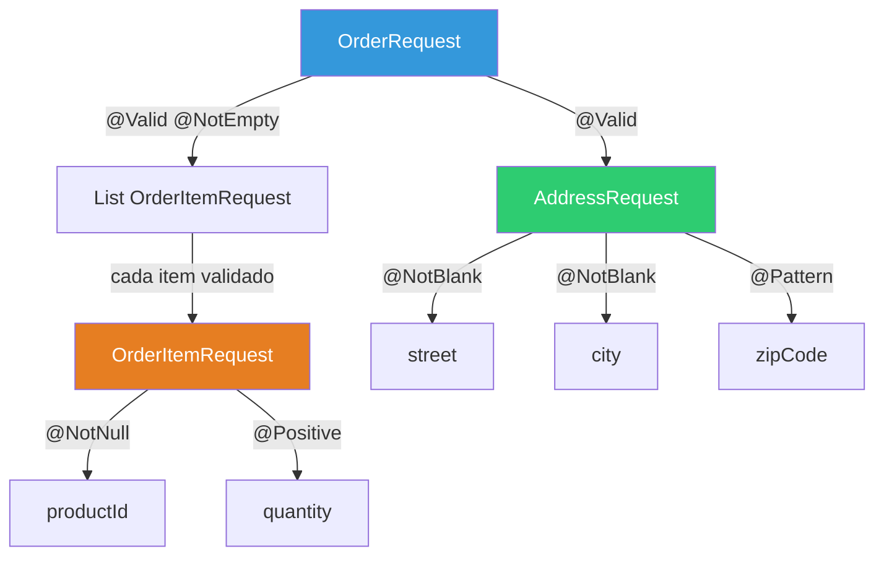
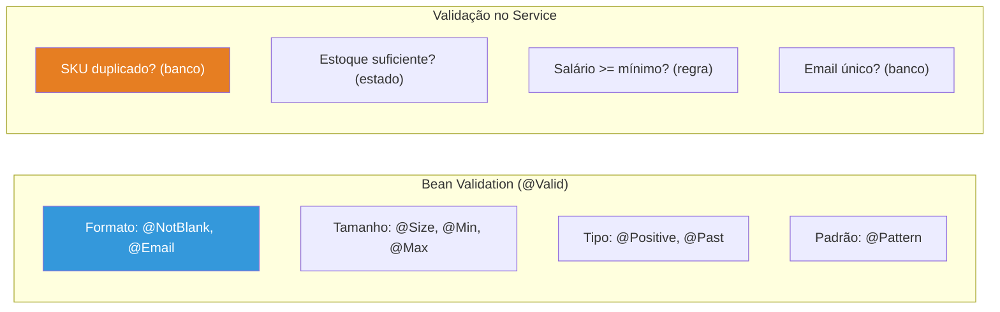

# Slide 10: Validação de Dados — Bean Validation

**Horário:** 11:50 - 12:00

---

## 📖 O que é Bean Validation?

> **Jakarta Bean Validation** (anteriormente javax.validation) é uma especificação Java para validação declarativa de dados usando **anotações**.  
> Implementação padrão: **Hibernate Validator** (não confundir com Hibernate ORM!)



### Dependência (já vem com `spring-boot-starter-web` no Spring Boot 3.x)

```xml
<!-- Se necessário adicionar explicitamente -->
<dependency>
    <groupId>org.springframework.boot</groupId>
    <artifactId>spring-boot-starter-validation</artifactId>
</dependency>
```

---

## Fluxo de Validação no Spring



> A validação ocorre **ANTES** do código do Controller executar. Se falhar, o método do Controller **nem é chamado**.

---

## Anotações Mais Usadas

### Tabela Completa

| Anotação | Descrição | Tipo aceito | Exemplo |
|----------|-----------|-------------|---------|
| `@NotNull` | Não pode ser `null` | Qualquer objeto | `@NotNull Long id` |
| `@NotBlank` | Não null, não vazio, não só espaços | `String` | `@NotBlank String name` |
| `@NotEmpty` | Não null e não vazio | `String`, `Collection`, `Map`, `Array` | `@NotEmpty List<Item> items` |
| `@Size` | Tamanho entre min e max | `String`, `Collection`, `Map`, `Array` | `@Size(min=3, max=100) String name` |
| `@Email` | Formato de email válido | `String` | `@Email String email` |
| `@Positive` | Número > 0 | `BigDecimal`, `int`, `long`, etc. | `@Positive BigDecimal price` |
| `@PositiveOrZero` | Número >= 0 | Números | `@PositiveOrZero int stock` |
| `@Negative` | Número < 0 | Números | `@Negative BigDecimal adjustment` |
| `@Min` / `@Max` | Valor mínimo / máximo | `int`, `long`, `BigDecimal` | `@Min(1) @Max(100) int quantity` |
| `@DecimalMin` / `@DecimalMax` | Decimal min / max (String) | `BigDecimal`, `String` | `@DecimalMin("0.01") BigDecimal price` |
| `@Past` / `@Future` | Data no passado / futuro | `LocalDate`, `LocalDateTime`, etc. | `@Past LocalDate birthDate` |
| `@PastOrPresent` | Data no passado ou hoje | Datas | `@PastOrPresent LocalDate startDate` |
| `@Pattern` | Regex personalizado | `String` | `@Pattern(regexp="\\d{5}-\\d{3}") String cep` |
| `@Digits` | Dígitos inteiros e fracionários | `BigDecimal`, `String` | `@Digits(integer=10, fraction=2) BigDecimal price` |
| `@AssertTrue/False` | Deve ser true/false | `boolean` | `@AssertTrue boolean termsAccepted` |

### Árvore de Decisão: Qual anotação usar?



---

## Usando no DTO — Exemplo Completo

```java
public record ProductRequest(
    @NotBlank(message = "Name is required")
    @Size(min = 3, max = 100, message = "Name must be between 3 and 100 characters")
    String name,

    @NotBlank(message = "SKU is required")
    @Pattern(regexp = "^[A-Z]{3}-\\d{4}$", message = "SKU must follow pattern XXX-0000")
    String sku,

    @NotNull(message = "Price is required")
    @Positive(message = "Price must be greater than zero")
    @Digits(integer = 10, fraction = 2, message = "Price max 10 digits, 2 decimals")
    BigDecimal price,

    @Size(max = 500, message = "Description must not exceed 500 characters")
    String description,

    @NotNull(message = "Category is required")
    Long categoryId
) {}
```

> **Dica:** Sempre inclua a propriedade `message` com uma mensagem clara. Sem ela, o Hibernate Validator usa mensagens genéricas em inglês.

---

## Ativando no Controller

```java
@PostMapping
public ResponseEntity<ProductResponse> create(
        @Valid @RequestBody ProductRequest request) {  // ← @Valid aqui!
    // Se validação falhar → MethodArgumentNotValidException
    // @ControllerAdvice trata e retorna 400 com detalhes por campo
    return ResponseEntity.status(HttpStatus.CREATED)
        .body(productService.create(request));
}

@PutMapping("/{id}")
public ResponseEntity<ProductResponse> update(
        @PathVariable Long id,
        @Valid @RequestBody ProductRequest request) {  // ← @Valid aqui também!
    return ResponseEntity.ok(productService.update(id, request));
}
```

> **@Valid vs @Validated:** `@Valid` é do Jakarta (padrão). `@Validated` é do Spring — suporta **grupos de validação** (ex: criar vs. atualizar com regras diferentes).

---

## Validação em Cascata (@Valid em objetos aninhados)



```java
// DTO com objeto aninhado
public record OrderRequest(
    @NotBlank String customerName,

    @Valid               // ← valida o objeto aninhado!
    @NotNull(message = "Address is required")
    AddressRequest address,

    @Valid               // ← valida CADA item da lista!
    @NotEmpty(message = "At least one item is required")
    @Size(max = 50, message = "Maximum 50 items per order")
    List<OrderItemRequest> items
) {}

public record AddressRequest(
    @NotBlank(message = "Street is required") String street,
    @NotBlank(message = "City is required") String city,
    @Pattern(regexp = "\\d{5}-\\d{3}", message = "ZIP must be XXXXX-XXX") String zipCode
) {}

public record OrderItemRequest(
    @NotNull(message = "Product ID is required") Long productId,
    @Positive(message = "Quantity must be positive") int quantity
) {}
```

> **Sem `@Valid` no campo `address`**, o Spring NÃO valida os campos internos do `AddressRequest`!

---

## Validação no Service (complementar)

```java
// A Bean Validation cuida de formato/tipo. O Service cuida de REGRAS DE NEGÓCIO.
@Service
public class ProductService {
    public ProductResponse create(ProductRequest request) {
        // @Valid já garantiu: name não vazio, price > 0, SKU no formato certo

        // Mas regras de NEGÓCIO são validadas aqui:
        if (repository.existsBySku(request.sku())) {
            throw new DuplicateSkuException(request.sku()); // 409
        }

        // Validação que depende do banco/estado da aplicação
        // @Valid NÃO consegue fazer isso!
    }
}
```



---

## 🎯 Pergunta para a turma

> Vocês costumam validar dados no Controller, no Service ou em ambos?  
> Resposta: **ambos!** O Controller valida **formato** (via @Valid). O Service valida **regras de negócio** (ex: SKU único, estoque suficiente).

> Qual é a diferença entre `@NotNull`, `@NotEmpty` e `@NotBlank`?  
> - `@NotNull`: campo != null (aceita `""` e `"   "`)  
> - `@NotEmpty`: campo != null && tamanho > 0 (aceita `"   "`)  
> - `@NotBlank`: campo != null && tamanho > 0 && não só espaços ✅ (mais restritivo para Strings)
